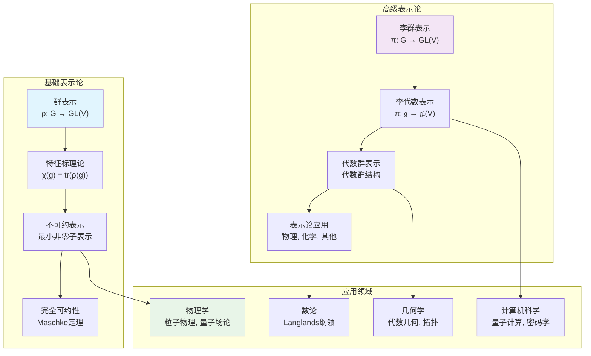

# 00-表示论总览：代数结构的线性化

## 📋 本地目录导航

- [01-表示论基础：群表示](./01-表示论基础：群表示.md) ✅
- [02-特征标理论](./02-特征标理论.md) ✅
- [03-不可约表示](./03-不可约表示.md) ✅
- [04-诱导表示](./04-诱导表示.md) ✅
- [05-李群表示论](./05-李群表示论.md) ✅
- [06-李代数表示论](./06-李代数表示论.md) ✅
- [07-代数群表示](./07-代数群表示.md) ✅
- [08-表示论应用](./08-表示论应用.md) ✅
- [09-特征标理论深化](./09-特征标理论深化.md) ✅
- [10-诱导表示理论深化](./10-诱导表示理论深化.md) ✅

## 🧠 本地知识图谱

- **代数总览**: [代数结构与理论总览](../00-代数结构与理论总览.md)
- **群论基础**: [群论总览](../02-群论/00-群论总览.md)
- **线性代数**: [线性代数总览](../07-线性代数/00-线性代数总览.md)
- **李群**: [李群表示论](./05-李群表示论.md)
- **李代数**: [李代数表示论](./06-李代数表示论.md)
- **代数群**: [代数群表示](./07-代数群表示.md)
- **应用**: [表示论应用](./08-表示论应用.md)

---

## 目录

- [00-表示论总览：代数结构的线性化](#00-表示论总览代数结构的线性化)
  - [📋 本地目录导航](#-本地目录导航)
  - [🧠 本地知识图谱](#-本地知识图谱)
  - [目录](#目录)
  - [1. 表示论总览](#1-表示论总览)
  - [1.1. 引言：什么是表示论？](#11-引言什么是表示论)
  - [1.2. 知识地图 (Mermaid)](#12-知识地图-mermaid)
  - [1.3. 学习路径](#13-学习路径)
    - [第一阶段：基础表示论](#第一阶段基础表示论)
    - [第二阶段：高级表示论](#第二阶段高级表示论)
  - [1.4. 核心定理一览](#14-核心定理一览)
  - [1.5. 历史发展](#15-历史发展)
    - [经典时期 (19世纪末-20世纪初)](#经典时期-19世纪末-20世纪初)
    - [现代时期 (20世纪中期)](#现代时期-20世纪中期)
    - [当代发展 (20世纪末至今)](#当代发展-20世纪末至今)
  - [1.6. 现代应用](#16-现代应用)
    - [物理学](#物理学)
    - [数论](#数论)
    - [几何学](#几何学)
    - [计算机科学](#计算机科学)

## 1. 表示论总览

**版本**: 1.0
**日期**: 2025-07-04

---

## 1.1. 引言：什么是表示论？

**表示论 (Representation Theory)** 是数学中一个极其重要的分支，它将抽象的代数结构（如群、李代数、量子群等）"线性化"，即用线性变换（矩阵）来表示这些结构。这种表示不仅使得抽象的代数对象变得具体可计算，更重要的是揭示了代数结构的深层性质。

表示论的核心思想是：

- **抽象 → 具体**：将抽象的代数结构转化为具体的线性变换
- **结构 → 性质**：通过表示来研究代数结构的性质
- **局部 → 整体**：从局部表示信息推断整体结构

## 1.2. 知识地图 (Mermaid)

## 1.3. 学习路径

### 第一阶段：基础表示论

1. **[01-表示论基础：群表示](./01-表示论基础：群表示.md)**
   - 群表示的定义和基本性质
   - 等价表示和相似变换
   - 表示的直和与张量积

2. **[02-特征标理论](./02-特征标理论.md)**
   - 特征标的定义和性质
   - 特征标的正交关系
   - 特征标表及其应用

3. **[03-不可约表示](./03-不可约表示.md)** ✅
   - 不可约表示的定义和性质
   - 舒尔引理和完全可约性
   - 不可约表示的构造和分类

4. **[04-诱导表示](./04-诱导表示.md)** ❌
   - 诱导表示的定义和构造
   - 弗罗贝尼乌斯互反性
   - 诱导表示的计算和应用

### 第二阶段：高级表示论

1. **[05-李群表示论](./05-李群表示论.md)** ✅
   - 李群表示的基础理论
   - 紧李群的表示
   - 李群表示的应用

2. **[06-李代数表示论](./06-李代数表示论.md)** ✅
   - 李代数表示的定义和性质
   - 李代数表示的分类
   - 李代数表示的计算

3. **[07-代数群表示](./07-代数群表示.md)** ✅
   - 代数群的基本概念
   - 代数群的表示理论
   - 代数群表示的应用

4. **[08-表示论应用](./08-表示论应用.md)** ✅
   - 表示论在物理中的应用
   - 表示论在化学中的应用
   - 表示论在其他领域的应用

### 第三阶段：表示论深化

1. **[09-特征标理论深化](./09-特征标理论深化.md)** ✅
   - 不可约特征标的性质
   - 特征标表的构造
   - 特征标的正交关系

2. **[10-诱导表示理论深化](./10-诱导表示理论深化.md)** ✅
   - Mackey 理论
   - Clifford 理论
   - Brauer 定理

## 1.4. 核心定理一览

| 定理名称 | 核心思想 | 重要性 |
|:---|:---|:---|
| **Maschke定理** | 有限群在特征零域上的表示完全可约 | 基础定理 |
| **舒尔引理** | 不可约表示之间的同态要么为零要么为同构 | 分类基础 |
| **Frobenius互反性** | 诱导表示与限制表示的对偶关系 | 构造工具 |
| **Weyl特征公式** | 李代数不可约表示的特征标公式 | 计算核心 |
| **Kazhdan-Lusztig理论** | 几何表示论中的多项式理论 | 现代发展 |
| **Langlands纲领** | 数论与表示论的深刻联系 | 前沿方向 |

## 1.5. 历史发展

### 经典时期 (19世纪末-20世纪初)

- **Frobenius**: 引入特征标理论
- **Schur**: 舒尔引理和表示论基础
- **Burnside**: 有限群表示论的发展

### 现代时期 (20世纪中期)

- **Weyl**: 李群和李代数表示论
- **Harish-Chandra**: 半单李群表示论
- **Serre**: 代数表示论

### 当代发展 (20世纪末至今)

- **Kazhdan-Lusztig**: 几何表示论
- **Drinfeld-Jimbo**: 量子群理论
- **Langlands**: 朗兰兹纲领

## 1.6. 现代应用

### 物理学

- **粒子物理**: 标准模型中的规范群表示
- **量子场论**: 对称性破缺和Goldstone定理
- **弦论**: 共形场论和顶点算子代数

### 数论

- **Langlands纲领**: 自守形式和Galois表示
- **p-进表示**: 椭圆曲线和模形式
- **几何朗兰兹**: 几何Langlands纲领

### 几何学

- **代数几何**: 向量丛和层论
- **拓扑学**: 同伦论和K-理论
- **微分几何**: 规范理论和几何分析

### 计算机科学

- **量子计算**: 量子算法和量子纠错
- **密码学**: 后量子密码学
- **机器学习**: 对称性在深度学习中的应用

---

[返回上一级: 03-代数结构与理论](../00-代数结构与理论总览.md) | [返回项目总览](../../09-项目总览/00-项目总览.md)
