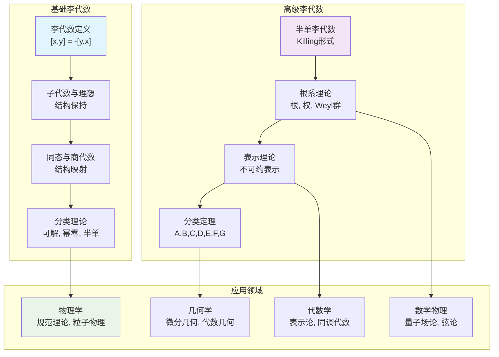

# 00-李代数总览：连续对称性的代数基础

## 📋 本地目录导航

- [01-李代数的定义与性质](./01-李代数的定义与性质.md) ✅
- [02-半单李代数](./02-半单李代数.md) ✅
- [03-根系与权系](./03-根系与权系.md) ✅
- [04-李代数的表示](./04-李代数的表示.md) ✅
- [05-李群与李代数](./05-李群与李代数.md) ✅
- [06-例外李代数](./06-例外李代数.md) ✅
- [07-李代数应用](./07-李代数应用.md) ❌

## 🧠 本地知识图谱

- **代数总览**: [代数结构与理论总览](../00-代数结构与理论总览.md)
- **群论基础**: [群论总览](../02-群论/00-群论总览.md)
- **表示论**: [表示论总览](../10-表示论/00-表示论总览.md)
- **李群**: [李群表示论](../10-表示论/05-李群表示论.md)
- **李代数表示**: [李代数表示论](../10-表示论/06-李代数表示论.md)
- **应用**: [李代数应用](./07-李代数应用.md)

---

## 目录

- [00-李代数总览：连续对称性的代数基础](#00-李代数总览连续对称性的代数基础)
  - [📋 本地目录导航](#-本地目录导航)
  - [🧠 本地知识图谱](#-本地知识图谱)
  - [目录](#目录)
  - [1. 李代数总览](#1-李代数总览)
  - [1.1. 引言：什么是李代数？](#11-引言什么是李代数)
  - [1.2. 知识地图 (Mermaid)](#12-知识地图-mermaid)
  - [1.3. 学习路径](#13-学习路径)
    - [第一阶段：基础李代数](#第一阶段基础李代数)
    - [第二阶段：高级李代数](#第二阶段高级李代数)
  - [1.4. 核心定理一览](#14-核心定理一览)
  - [1.5. 历史发展](#15-历史发展)
    - [经典时期 (19世纪末-20世纪初)](#经典时期-19世纪末-20世纪初)
    - [现代时期 (20世纪中期)](#现代时期-20世纪中期)
    - [当代发展 (20世纪末至今)](#当代发展-20世纪末至今)
  - [1.6. 现代应用](#16-现代应用)
    - [物理学](#物理学)
    - [几何学](#几何学)
    - [代数学](#代数学)
    - [数学物理](#数学物理)
  - [2. 李代数理论体系](#2-李代数理论体系)
    - [2.1. 基础理论](#21-基础理论)
    - [2.2. 高级理论](#22-高级理论)
    - [2.3. 应用理论](#23-应用理论)
  - [3. 学习建议](#3-学习建议)
    - [3.1. 预备知识](#31-预备知识)
    - [3.2. 学习策略](#32-学习策略)
    - [3.3. 重点难点](#33-重点难点)
  - [4. 发展前景](#4-发展前景)
    - [4.1. 理论发展](#41-理论发展)
    - [4.2. 应用发展](#42-应用发展)
    - [4.3. 教育发展](#43-教育发展)
  - [历史版本变迁说明与归档索引](#历史版本变迁说明与归档索引)
  - [国际化对齐补全：李代数基础（对齐 Wikipedia/EoM）](#国际化对齐补全李代数基础对齐-wikipediaeom)
    - [一、李代数定义](#一李代数定义)
    - [二、李群与李代数对应](#二李群与李代数对应)
    - [三、根系理论](#三根系理论)
    - [四、重要定理](#四重要定理)
    - [五、参考](#五参考)

## 1. 李代数总览

**版本**: 1.0
**日期**: 2025-02-03

---

## 1.1. 引言：什么是李代数？

**李代数 (Lie Algebra)** 是数学中一个极其重要的概念，它是李群的无穷小版本，为理解连续对称性提供了代数基础。李代数理论将几何的对称性转化为代数的结构，使得我们可以用代数的方法来研究几何和物理中的对称性。

李代数的核心思想是：

- **几何 → 代数**：将几何的对称性转化为代数的李括号
- **局部 → 整体**：从局部李代数信息推断整体李群结构
- **对称性 → 结构**：通过李代数研究对称性的代数结构

## 1.2. 知识地图 (Mermaid)

## 1.3. 学习路径

### 第一阶段：基础李代数

1. **[01-李代数的定义与性质](./01-李代数的定义与性质.md)**
   - 李代数的基本定义和性质
   - 子代数、理想和同态
   - 商代数和直和

2. **[02-半单李代数](./02-半单李代数.md)**
   - 半单李代数的定义和性质
   - Killing形式和Cartan准则
   - 半单李代数的结构

3. **[03-根系与权系](./03-根系与权系.md)**
   - 根系的基本概念
   - 权系和最高权理论
   - Weyl群和Dynkin图

4. **[04-李代数的表示](./04-李代数的表示.md)**
   - 李代数表示的定义
   - 不可约表示和完全可约性
   - 表示的分类和构造

### 第二阶段：高级李代数

1. **[05-李群与李代数](./05-李群与李代数.md)**
   - 李群与李代数的关系
   - 指数映射和伴随表示
   - 李群与李代数的对应

2. **[06-例外李代数](./06-例外李代数.md)**
   - 例外李代数的定义
   - 例外李代数的分类
   - 例外李代数的性质

3. **[07-李代数应用](./07-李代数应用.md)**
   - 李代数在物理中的应用
   - 李代数在几何中的应用
   - 李代数在其他领域的应用

## 1.4. 核心定理一览

| 定理名称 | 核心思想 | 重要性 |
|:---|:---|:---|
| **Cartan准则** | 半单李代数的判别准则 | 分类基础 |
| **Weyl定理** | 半单李代数表示完全可约 | 表示论核心 |
| **最高权定理** | 不可约表示的分类 | 构造工具 |
| **Killing形式** | 半单李代数的内积结构 | 结构基础 |
| **根系分类** | 半单李代数的完全分类 | 分类定理 |
| **Weyl特征公式** | 不可约表示的特征标 | 计算核心 |

## 1.5. 历史发展

### 经典时期 (19世纪末-20世纪初)

- **Lie**: 引入李群和李代数的概念
- **Killing**: 开始李代数的分类工作
- **Cartan**: 完成半单李代数的分类

### 现代时期 (20世纪中期)

- **Weyl**: 李群和李代数表示论
- **Chevalley**: 代数群理论
- **Serre**: 李代数的现代理论

### 当代发展 (20世纪末至今)

- **Kac-Moody**: 无限维李代数
- **量子群**: 李代数的量子化
- **几何表示论**: 李代数与几何的联系

## 1.6. 现代应用

### 物理学

- **规范理论**: 标准模型中的规范群李代数
- **粒子物理**: 夸克模型和色动力学
- **量子场论**: 对称性破缺和Goldstone定理
- **弦论**: 共形场论和顶点算子代数

### 几何学

- **微分几何**: 李群和李代数在流形上的作用
- **代数几何**: 代数群和向量丛
- **拓扑学**: 同伦论和K理论
- **几何分析**: 几何流和Ricci流

### 代数学

- **表示论**: 李代数表示的分类和构造
- **同调代数**: 李代数同调
- **代数群**: 代数群的结构和表示
- **量子代数**: 量子群和Hopf代数

### 数学物理

- **量子力学**: 角动量算符和自旋
- **统计物理**: 相变和临界现象
- **可积系统**: 孤子理论和Lax对
- **几何量子化**: 几何量子化理论

## 2. 李代数理论体系

### 2.1. 基础理论

- **定义与性质**: 李代数的基本概念和性质
- **结构理论**: 子代数、理想、同态
- **分类理论**: 可解、幂零、半单李代数
- **表示理论**: 李代数表示的分类

### 2.2. 高级理论

- **半单理论**: 半单李代数的完整理论
- **根系理论**: 根系、权系、Weyl群
- **分类定理**: 经典和例外李代数的分类
- **表示论**: 不可约表示和特征标理论

### 2.3. 应用理论

- **物理应用**: 在物理学中的广泛应用
- **几何应用**: 在几何学中的重要作用
- **代数应用**: 在代数学中的核心地位
- **跨学科应用**: 在多个学科中的交叉应用

## 3. 学习建议

### 3.1. 预备知识

- **线性代数**: 向量空间、线性变换、特征值
- **群论**: 群的基本概念和性质
- **表示论**: 群表示论的基础知识
- **抽象代数**: 环、域、模的基本概念

### 3.2. 学习策略

1. **循序渐进**: 从基础定义开始，逐步深入
2. **重视例子**: 通过具体例子理解抽象概念
3. **联系应用**: 将理论与物理、几何应用结合
4. **练习计算**: 通过计算练习掌握技巧

### 3.3. 重点难点

- **抽象性**: 李代数理论较为抽象，需要耐心理解
- **分类复杂性**: 李代数的分类理论较为复杂
- **表示论**: 李代数表示论需要扎实的基础
- **应用广泛**: 应用领域广泛，需要跨学科知识

## 4. 发展前景

### 4.1. 理论发展

- **无限维李代数**: Kac-Moody代数和顶点算子代数
- **量子李代数**: 量子群和Hopf代数理论
- **几何表示论**: 李代数与几何的深刻联系
- **代数几何**: 李代数在代数几何中的应用

### 4.2. 应用发展

- **数学物理**: 在理论物理中的新应用
- **几何分析**: 在几何分析中的重要作用
- **代数几何**: 在代数几何中的新发展
- **计算机科学**: 在算法和密码学中的应用

### 4.3. 教育发展

- **教材建设**: 李代数教材的现代化
- **教学方法**: 李代数教学方法的改进
- **在线资源**: 李代数在线学习资源
- **国际交流**: 李代数研究的国际合作

李代数理论是现代数学的重要支柱，为理解连续对称性提供了强大的代数工具。通过系统学习李代数理论，我们可以深入理解数学和物理中的对称性结构，为相关领域的研究和应用奠定坚实基础。

[返回代数结构与理论总览](../00-代数结构与理论总览.md)

---

## 历史版本变迁说明与归档索引

本区块用于记录本主线文件的历史版本变迁、归档文件索引及相关跳转，确保内容唯一性、可追溯性与学术一致性。

- **主线变迁说明**：
  - 2025-07-02：完成主线内容唯一化、结构优化、哲学批判与认知结构补全。
  - 历史草稿、专题扩展、论证与证明等已全部归档至“00-备份”及各子模块归档目录。
  - 本主线内容保持唯一、规范，所有历史版本均可在归档索引中追溯。

- **归档文件索引**：
  - [../00-备份/归档内容索引.md](../00-备份/归档内容索引.md)

- **跳转导航**：
  - [返回代数结构与理论总览](../00-代数结构与理论总览.md)
  - [返回本分支目录导航](#目录)

> 注：如需查阅历史内容、归档详情，请参见上述归档内容索引文件。

## 国际化对齐补全：李代数基础（对齐 Wikipedia/EoM）

### 一、李代数定义

- 定义：(g,[·,·])为李代数⇔[·,·]满足反对称性、雅可比恒等式
- 子代数：h⊆g为子代数⇔[h,h]⊆h
- 理想：I⊆g为理想⇔[g,I]⊆I
- 商代数：g/I为商李代数

### 二、李群与李代数对应

- 李群：光滑流形且群运算光滑
- 李代数：李群在单位元的切空间
- 指数映射：exp:g→G的局部微分同胚
- 伴随表示：Ad:G→GL(g)，Ad(g)X=gXg⁻¹

### 三、根系理论

- 根系：Φ⊂V为根系⇔满足反射性质
- 简单根系：Δ⊂Φ为简单根系⇔线性无关且生成Φ
- 外尔群：W=⟨s_α | α∈Φ⟩，s_α为反射
- 外尔公式：|W|=∏(e^(α,ρ)+1)/(e^(α,ρ)-1)

### 四、重要定理

- 嘉当-基林形式：κ(X,Y)=tr(ad(X)ad(Y))
- 嘉当分解：g=k⊕p，k为紧子代数
- 外尔特征公式：不可约表示的特征标公式

### 五、参考

- Humphreys, Introduction to Lie Algebras and Representation Theory
- [Wikipedia: Lie algebra](https://en.wikipedia.org/wiki/Lie_algebra)
- [EoM: Lie algebra](https://encyclopediaofmath.org/wiki/Lie_algebra)

> 本节遵循《国际化数学内容标准》与《条目结构模板》。
