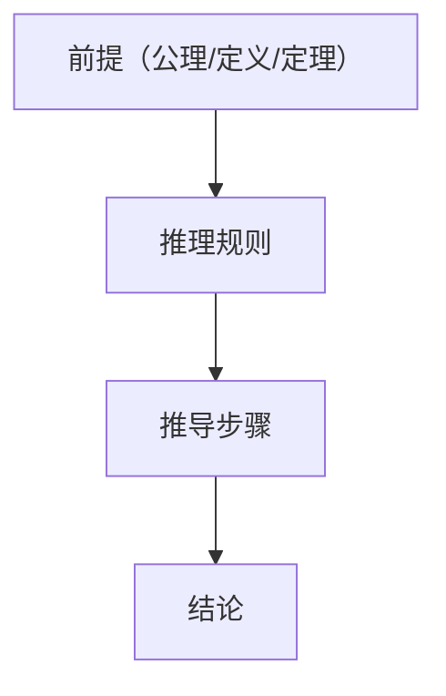

# 2.3 形式化证明（Formal Proof）

## 2.3.1 概念定义

- **形式化证明**：在特定公理体系和逻辑规则下，将每一步推理用精确的符号语言表达，确保推理链条的严密性和可检验性。
- **目标**：消除歧义、保证严谨、便于验证和推广。

## 2.3.2 证明结构与方法

- **基本结构**：
  - 前提（公理、定义、已知定理）
  - 推理规则（如三段论、Modus Ponens、归纳法等）
  - 推导步骤（每一步都明确依据）
  - 结论（待证命题）
- **常见方法**：
  - 直接证明（从前提出发，逻辑推导结论）
  - 反证法（假设结论不成立，推导矛盾）
  - 构造法（构造满足条件的对象）
  - 数学归纳法（递归结构、自然数相关命题）
  - 分类讨论法（分情况证明）

## 2.3.3 形式化的意义与局限

- **意义**：
  - 严谨性：每一步推理都有明确依据，排除直觉模糊性。
  - 可检验性：证明过程可被独立验证，甚至可由计算机辅助检查。
  - 促进理解：细致推理有助于发现隐含假设和逻辑结构。
- **局限**：
  - 复杂性：完全形式化的证明往往冗长、难以阅读。
  - 直觉缺失：过度形式化可能掩盖几何直观。
  - 公理依赖：证明的有效性依赖于所选公理体系的无矛盾性。
  - 可读性：教学和传播中，半形式化与直观解释更易接受。

## 2.3.4 多表征

### 2.3.4.1 结构图

### 2.3.4.2 表格

| 方法         | 说明与举例                                 |
|--------------|-------------------------------------------|
| 直接证明     | 从前提出发，逐步推导结论                   |
| 反证法       | 假设结论不成立，推导矛盾                   |
| 构造法       | 构造满足条件的对象                         |
| 归纳法       | 递归结构、自然数相关命题                   |
| 分类讨论法   | 分情况证明                                 |

### 2.3.4.3 证明示例

- **三角形内角和定理（欧氏几何）**
  - 命题：任意三角形三个内角之和等于180°。
  - 证明思路：
    1. 过三角形某顶点作一条平行于对边的直线。
    2. 利用平行线内错角相等，推导三个内角之和为180°。
  - 形式化表达：
    - 设△ABC，过A作DE∥BC，利用平行公理和角度定义，逐步推导。

## 2.3.5 相关引用

- 欧几里得《几何原本》
- 希尔伯特《几何基础》
- 现代数理逻辑、形式化数学教材
- 计算机辅助证明（Coq, Lean, Isabelle等）相关文献

---

> 本节内容严格编号，便于后续扩展与交叉引用。下节将进入“3. 概念分类与关联”。
