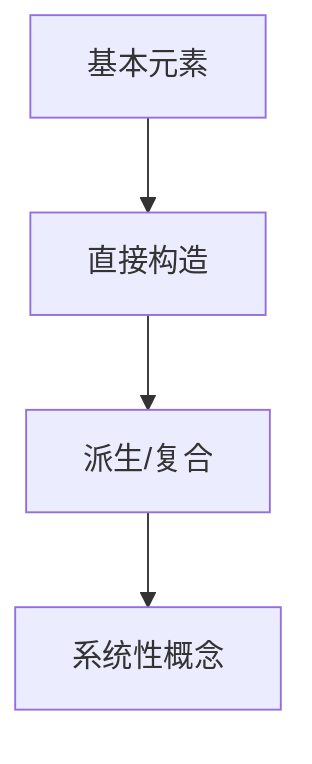

# 3.3 构造层次（Constructional Hierarchy）

## 3.3.1 概念定义

- **构造层次**：几何概念和对象按照从简单到复杂、从基本到系统的逻辑递进关系组织。
- **层次结构**：基本元素 → 直接构造 → 派生/复合 → 系统性概念。

## 3.3.2 构造层次举例

| 层次         | 典型对象/内容           | 说明与举例                         |
|--------------|------------------------|------------------------------------|
| 基本元素     | 点、线、面             | 未定义项，几何的基础               |
| 直接构造     | 线段、角、三角形、圆   | 由基本元素直接定义或作图           |
| 派生/复合    | 多边形、多面体、圆锥   | 由直接构造对象组合、变换或推广     |
| 系统性概念   | 空间、度量结构、流形   | 由大量复合对象和关系构成的系统     |

## 3.3.3 多表征

### 3.3.3.1 结构图

### 3.3.3.2 举例

- **基本元素**：点、线、面
- **直接构造**：线段（两点间）、角（两射线）、三角形（线段围成）、圆（定点定半径）
- **派生/复合**：多边形（多线段首尾相连）、多面体（多面围成）、圆锥（圆与顶点）
- **系统性概念**：欧氏空间、流形、度量结构

## 3.3.4 哲学与认知分析

- **层级性本质**：
  - 数学知识的积累和扩展体现为从简单到复杂的层级建构。
  - 层次结构有助于理解复杂对象的生成和归纳。
- **认知发展**：
  - 学习者通过操作和组合基本元素，逐步形成对复杂结构的理解。
- **哲学反思**：
  - 层级建构反映了人类认知和科学理论的组织方式。

## 3.3.5 相关引用

- 欧几里得《几何原本》
- 现代几何学、数学教育学教材

---

> 本节内容严格编号，便于后续扩展与交叉引用。下节将处理"3.4 跨域关联"。
