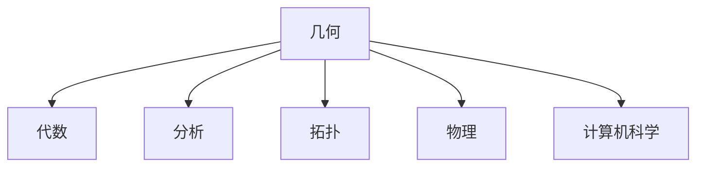

# 3.4 跨域关联（Interdisciplinary Connections）

## 3.4.1 概念定义

- **跨域关联**：几何与其他数学分支及科学领域之间的相互联系与融合。
- **意义**：促进理论创新、方法迁移和实际应用。

## 3.4.2 主要跨域类型

| 领域         | 关联内容/方法                   | 典型举例                       |
|--------------|--------------------------------|-------------------------------|
| 代数         | 坐标几何、向量、矩阵、群论     | 解析几何、线性变换、对称群     |
| 分析         | 微分几何、积分几何、复分析     | 曲线曲面微分、面积体积积分     |
| 拓扑         | 连通性、同胚、同伦、同调       | 欧拉特征数、莫比乌斯带         |
| 物理         | 空间结构、对称性、场论         | 广义相对论中的流形、晶体结构   |
| 计算机科学   | 图形学、建模、算法、AI         | 3D建模、图像识别、几何优化     |

## 3.4.3 多表征

### 3.4.3.1 结构图

### 3.4.3.2 举例

- **几何与代数**：
  - 坐标几何将几何问题转化为代数方程求解。
  - 群论描述几何对称性。
- **几何与分析**：
  - 微分几何研究曲线曲面的微分性质。
  - 积分几何计算面积、体积。
- **几何与拓扑**：
  - 拓扑不变量区分不同空间结构。
- **几何与物理**：
  - 广义相对论中的时空流形。
  - 晶体结构的空间群。
- **几何与计算机科学**：
  - 3D建模、图像处理、AI中的空间推理。

## 3.4.4 哲学与认知分析

- **学科融合**：
  - 数学分支和科学领域的交叉推动了理论和技术的进步。
- **认知发展**：
  - 跨域联系有助于知识迁移和创新思维。
- **哲学反思**：
  - 数学的统一性与多样性在跨域关联中得到体现。

## 3.4.5 相关引用

- 现代几何学、代数、分析、拓扑、物理、计算机科学教材
- 数学史与科学哲学文献

---

> 本节内容严格编号，便于后续扩展与交叉引用。下节将进入"4. 证明与论证"。
