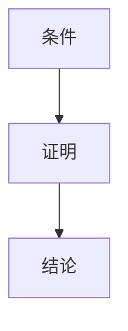

# 4.1 定理结构（Structure of Theorems）

## 4.1.1 概念定义

- **定理（Theorem）**：在公理体系下，经严格证明成立的数学命题。
- **结构**：通常由条件（前提）和结论两部分组成。
- **证明（Proof）**：展示从条件到结论的逻辑必然性。

## 4.1.2 定理的基本结构

| 组成部分 | 说明与举例                                 |
|----------|-------------------------------------------|
| 条件     | 前提、假设，如"设△ABC为三角形"           |
| 结论     | 需证明的命题，如"三内角和等于180°"       |
| 证明     | 逻辑推理过程，逐步从条件导出结论           |

## 4.1.3 定理类型

| 类型   | 说明与举例                                 |
|--------|-------------------------------------------|
| 定理   | 重要的数学命题，如勾股定理                 |
| 引理   | 辅助性命题，为证明定理服务                 |
| 推论   | 可直接从定理或定义推导出的命题             |
| 命题   | 一般性数学陈述，重要性介于定理和引理之间   |

## 4.1.4 多表征

### 4.1.4.1 结构图

### 4.1.4.2 举例

- **三角形内角和定理**：
  - 条件：设△ABC为平面三角形
  - 结论：∠A + ∠B + ∠C = 180°
  - 证明：过A作平行于BC的直线，利用平行线性质推导
- **勾股定理**：
  - 条件：设△ABC为直角三角形，∠C=90°
  - 结论：AB² + BC² = AC²
  - 证明：面积法、相似三角形法等

## 4.1.5 哲学与认知分析

- **定理的本质**：
  - 定理是数学知识体系的核心，揭示对象间的深层联系。
- **认知发展**：
  - 理解定理结构有助于培养逻辑思维和证明能力。
- **哲学反思**：
  - 定理的有效性依赖于公理体系和逻辑规则。

## 4.1.6 相关引用

- 欧几里得《几何原本》
- 现代数学基础、数学教育学教材

---

> 本节内容严格编号，便于后续扩展与交叉引用。下节将处理"4.2 证明方法"。
