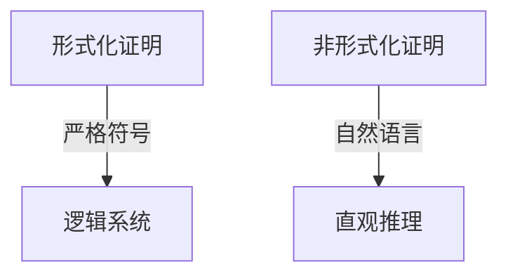

# 4.3 形式化与非形式化（Formal vs. Informal Proofs）

## 4.3.1 概念定义

- **形式化证明**：在严格的公理体系和逻辑规则下，用符号语言表达每一步推理，确保无歧义和可验证性。
- **非形式化证明**：用自然语言和常用符号，结合直观和经验，表达推理过程，适合教学和交流。

## 4.3.2 形式化与非形式化证明的对比

| 方面       | 形式化证明                         | 非形式化证明                       |
|------------|------------------------------------|------------------------------------|
| 表达方式   | 严格符号、逻辑推理                 | 自然语言、直观、常用符号           |
| 严谨性     | 极高，便于机械验证                 | 依赖读者背景，可能有省略           |
| 可读性     | 低，冗长，难以直观理解             | 高，便于教学和传播                 |
| 适用场景   | 计算机验证、基础理论、复杂证明     | 教学、论文、日常交流               |
| 典型工具   | Coq、Lean、Isabelle等              | 纸笔、口头、板书                   |

## 4.3.3 多表征

### 4.3.3.1 结构图

### 4.3.3.2 举例

- **形式化证明**：
  - 用一阶逻辑和集合论符号逐步推导三角形内角和定理。
- **非形式化证明**：
  - 用图示和自然语言解释三角形内角和定理的推理过程。

## 4.3.4 哲学与认知分析

- **形式化的意义**：
  - 保证推理绝对严密，适合理论基础和计算机辅助。
- **非形式化的作用**：
  - 便于理解、交流和启发直觉。
- **认知发展**：
  - 学习者通常先接受非形式化证明，逐步过渡到形式化。
- **哲学反思**：
  - 数学发现往往依赖直觉，形式化是后续整理和确认。

## 4.3.5 相关引用

- 希尔伯特《几何基础》
- 现代数理逻辑、数学教育学教材
- 计算机辅助证明相关文献

---

> 本节内容严格编号，便于后续扩展与交叉引用。下节将处理"4.4 计算机辅助证明"。
