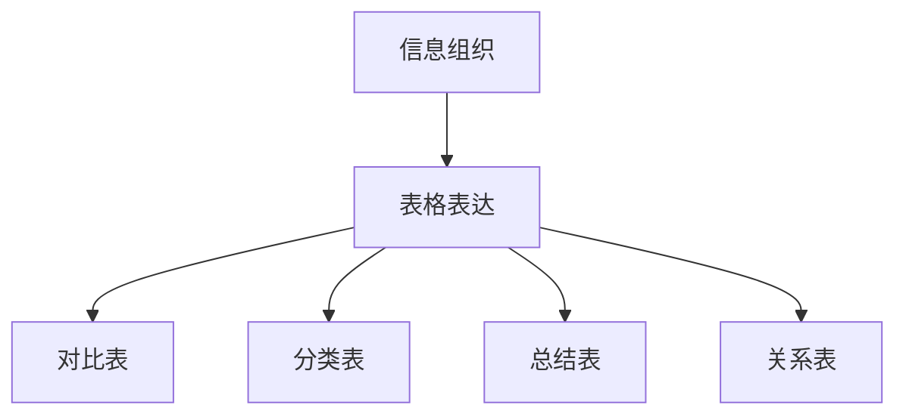

# 6.2 表格（Tables）

## 6.2.1 概念定义

- **表格**：用行列结构组织信息，便于比较、分类和查找。
- **作用**：系统化信息、突出对比、简化表达、促进理解。

## 6.2.2 表格类型与作用

| 类型       | 说明与举例                                 |
|------------|-------------------------------------------|
| 对比表     | 比较不同几何体系、公理、方法               |
| 分类表     | 按维度、性质、构造层次分类几何对象         |
| 总结表     | 归纳定理、公式、性质                       |
| 关系表     | 展示概念间的包含、派生、关联关系           |

## 6.2.3 多表征

### 6.2.3.1 结构图

### 6.2.3.2 举例

- 欧氏、非欧几何公理对比表
- 几何对象按维度分类表
- 证明方法总结表
- 概念关联关系表

## 6.2.4 哲学与认知分析

- **系统性**：表格促进知识的系统化组织。
- **比较性**：便于发现异同和规律。
- **认知发展**：表格是重要的学习工具。

## 6.2.5 相关引用

- 现代数学教育学、信息组织教材
- 表格设计、数据可视化文献

---

> 本节内容严格编号，便于后续扩展与交叉引用。下节将处理"6.3 公式与符号"。 