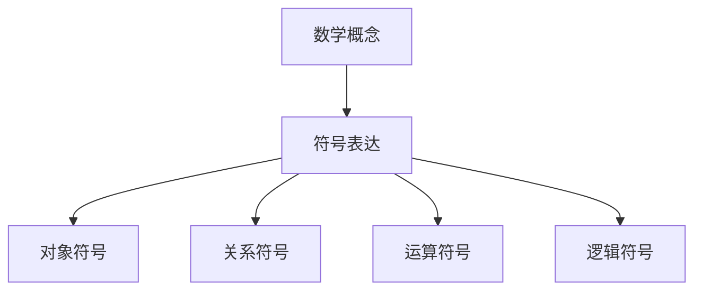

# 6.3 公式与符号（Formulas and Symbols）

## 6.3.1 概念定义

- **公式**：用数学符号表达的数学关系或定理。
- **符号**：表示数学对象、运算、关系的专用记号。

## 6.3.2 符号类型与作用

| 类型       | 说明与举例                                 |
|------------|-------------------------------------------|
| 对象符号   | 点A、线l、面π、角∠ABC                      |
| 关系符号   | 平行∥、垂直⊥、属于∈、包含⊂                |
| 运算符号   | 加+、乘×、幂²、根√                        |
| 逻辑符号   | 存在∃、任意∀、蕴含→、等价↔                |

## 6.3.3 多表征

### 6.3.3.1 结构图

### 6.3.3.2 举例

- 勾股定理：a² + b² = c²
- 三角形内角和：∠A + ∠B + ∠C = 180°
- 平行关系：l₁ ∥ l₂
- 点线关系：P ∈ l

## 6.3.4 哲学与认知分析

- **精确性**：符号消除歧义，保证表达精确。
- **简洁性**：符号简化表达，提高效率。
- **国际化**：符号促进数学交流的国际化。

## 6.3.5 相关引用

- 现代数学符号学、数学教育学教材
- 数学史、符号发展文献

---

> 本节内容严格编号，便于后续扩展与交叉引用。下节将处理"7. 参考文献与延伸阅读"。
