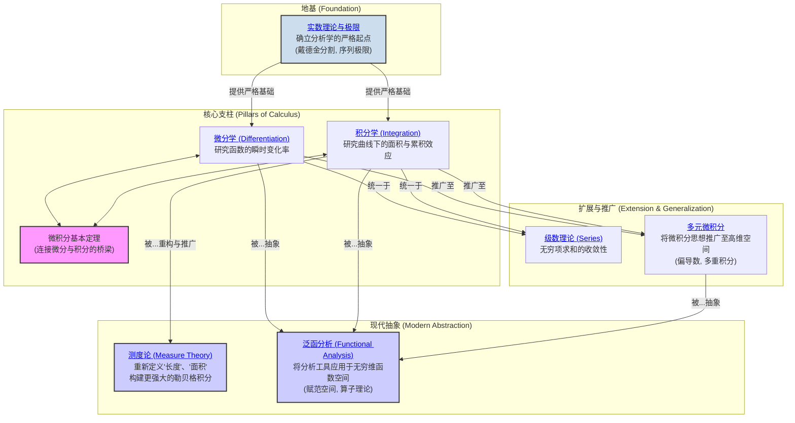

# 1. 分析学总览

**版本**: 1.0
**日期**: 2025-07-02

---

## 1.1. 引言：极限与无穷的科学

**分析学 (Analysis)** 是数学的一个宏大分支，其核心是严格地研究 **极限 (Limit)** 和 **无穷 (Infinity)** 的概念。它发源于牛顿和莱布尼兹创立的微积分，并在19世纪被柯西、魏尔斯特拉斯等人赋予了严格的逻辑基础。

如果说代数主要研究离散的、有限的结构，那么分析学则主要关注 **连续的、变化的过程**。从函数的瞬时变化率（微分）到曲线下的面积（积分），再到无穷多项的求和（级数），分析学为我们描述和理解动态世界提供了最强大的数学语言。

本模块将带领我们从分析学的基石——实数与极限理论——出发，逐步构建起微积分的宏伟大厦，并最终迈向更现代、更抽象的测度论与泛函分析。

## 1.2. 知识地图 (Mermaid)

## 1.3. 探索路径

1. **[01-实数与极限](./01-实数与极限/00-实数与极限总览.md)**: 分析学的起点。我们将在这里为微积分找到坚实的逻辑基础，严格定义什么是实数，以及数学分析的核心工具——极限。

2. **[02-一元微分学](./02-一元微分学/00-一元微分学总览.md)**: 探讨导数的概念，它是描述函数在某一点变化快慢的工具。我们将学习各种求导法则，并利用导数研究函数的性质（如单调性和极值）。

3. **[03-一元积分学](./03-一元积分学/00-一元积分学总览.md)**: 探讨积分的概念，它最初用于计算曲线下的面积。我们将学习黎曼积分的定义、各种积分技巧，并通过 **微积分基本定理** 揭示积分与微分之间深刻的逆运算关系。

4. **[04-级数理论](./04-级数理论/00-级数理论总览.md)**: 研究无穷个数相加的可能性。我们将探讨级数的收敛与发散，并学习重要的函数展开工具，如泰勒级数和傅里叶级数。

5. **[05-多元微积分](./05-多元微积分/00-多元微积分总览.md)**: 将微积分从一维直线和二维平面，推广到更高维的欧几里得空间。我们将学习偏导数、方向导数、梯度、多重积分等概念。

6. **[06-测度论与勒贝格积分](./06-测度论与勒贝格积分/00-测度论与勒贝格积分总览.md)**: 这是对积分理论的一次深刻革命。通过更一般地定义"长度"和"面积"（即"测度"），我们构建了比黎曼积分更强大、性质更好的勒贝格积分，它成为现代分析和概率论的基础。

7. **[07-泛函分析](./07-泛函分析/00-泛函分析总览.md)**: 这是分析学的终极抽象。它将代数和拓扑的思想应用于无穷维的函数空间，把函数、算子当作"点"来研究，是解决偏微分方程和量子力学等问题的关键工具。

---
[返回项目总览](../09-项目总览/00-项目总览.md)
