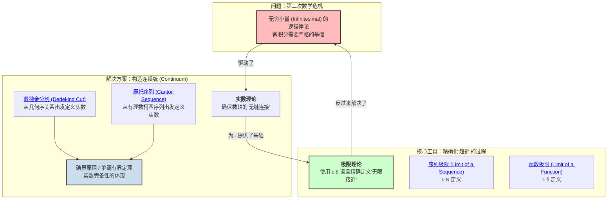

# 1. 实数与极限总览

**版本**: 1.0
**日期**: 2025-07-02

---

## 1.1. 引言：为微积分寻找坚实地基

微积分诞生之初，其巨大的成功伴随着逻辑上的巨大隐患。牛顿和莱布尼兹使用的"无穷小量"概念，因其定义模糊而备受攻击（例如著名的"贝克莱悖论"）。这引发了数学史上的第二次危机，迫使数学家们必须回到最基本的问题：我们所依赖的"数轴"究竟是什么？它真的像我们直观感觉的那样"连续"吗？

本模块的目的，就是为整个分析学大厦奠定坚如磐石的逻辑地基。我们将看到，为了让"极限"这个核心概念变得清晰无误，数学家们是如何一步步严格地构造出 **实数系统 (Real Numbers)**，并最终发明了著名的 **ε-δ (epsilon-delta) 语言**。

## 1.2. 知识地图 (Mermaid)

## 1.3. 探索路径

1. **[01-实数的构造.md](./01-实数的构造.md)**: 我们首先要解决分析学的立足之本——**实数**。我们将探索两种经典的构造方法：
    * **戴德金分割**: 一种非常直观的方法，通过将有理数集合"切"成两部分来定义一个实数。
    * **康托的柯西序列**: 一种更具代数性的方法，将实数定义为有理数柯西序列的等价类。
    我们将理解，无论哪种方法，其核心目标都是为了证明实数系的 **完备性 (Completeness)**，即数轴上没有"缝隙"。完备性是分析学中几乎所有重要定理的基石。

2. **[02-序列极限与函数极限.md](./02-序列极限与函数极限.md)**: 在拥有了完备的实数系后，我们便可以打磨分析学最强大的工具——**极限**。
    * **序列极限**: 我们将学习如何用 **ε-N 定义** 来精确刻画一个无穷序列 `a_n` 何时收敛于一个数 `L`。
    * **函数极限**: 随后，我们将学习更通用的 **ε-δ 定义**，用它来精确刻画当自变量 `x` 趋近于某一点 `c` 时，函数值 `f(x)` 如何趋近于 `L`。
    掌握 ε-δ 语言是理解整个分析学的关键一步。

---
[返回上一级: ../00-分析学总览.md](./00-分析学总览.md)
