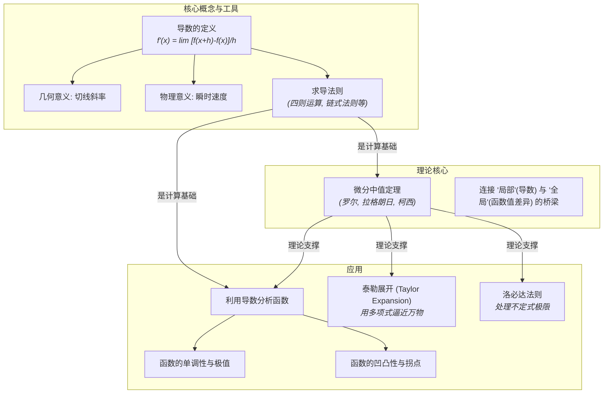

# 02-一元微分学总览

**版本**: 1.0
**日期**: 2025-07-02

---

## 1.1. 引言：捕捉"瞬时变化"

如果说极限理论为分析学提供了精确的语言，那么微分学就是用这种语言写出的第一篇华彩乐章。它的核心目标是描述和计算**变化的速率**，特别是**瞬时变化率**。

从几何上看，它是曲线在某一点的切线斜率；从物理上看，它是物体运动的瞬时速度；从经济学上看，它是生产的边际成本。微分学通过**导数 (Derivative)** 这个核心概念，将这些不同领域的问题统一起来，提供了一个强大到不可思议的分析工具。

本模块将从导数的定义出发，建立一套系统的求导法则，并深入探讨其背后深刻的理论——中值定理。最终，我们将展示如何利用导数来理解函数的形态，并学习微积分中最强大的近似工具之一——泰勒展开。

## 1.2. 知识地图 (Mermaid)

## 1.3. 探索路径

1. **[01-导数的定义与几何意义](./01-导数的定义与几何意义.md)**: 回归第一性原理，从"割线逼近切线"的几何直观和"平均速度逼近瞬时速度"的物理直观出发，建立导数的极限定义。探讨可导性与连续性的关系。
2. **[02-求导法则](./02-求导法则.md)**: 建立一整套高效的求导计算工具箱，包括基本初等函数的导数、四则运算法则、复合函数的链式法则以及反函数的求导法则。
3. **[03-微分中值定理](./03-微分中值定理.md)**: 深入微分学的理论核心。理解罗尔定理、拉格朗日中值定理和柯西中值定理的内涵与证明。这些定理是利用导数信息推断函数全局性质的逻辑基石。
4. **[04-利用导数分析函数](./04-利用导数分析函数.md)**: 应用中值定理的推论，系统地探讨如何利用一阶导数的符号判断函数的单调性和寻找极值，以及如何利用二阶导数的符号判断函数的凹凸性和寻找拐点。
5. **[05-泰勒展开与近似计算](./05-泰勒展开与近似计算.md)**: 学习微积分中最深刻和最有用的思想之一。理解如何用一个多项式在某点附近无限逼近一个光滑函数，并探讨其在近似计算、理论证明和现代物理（如相对论、量子力学）中的巨大威力。

---
[返回上一级: 04-分析学总览](../00-分析学总览.md) | [返回项目总览](../../09-项目总览/00-项目总览.md)
