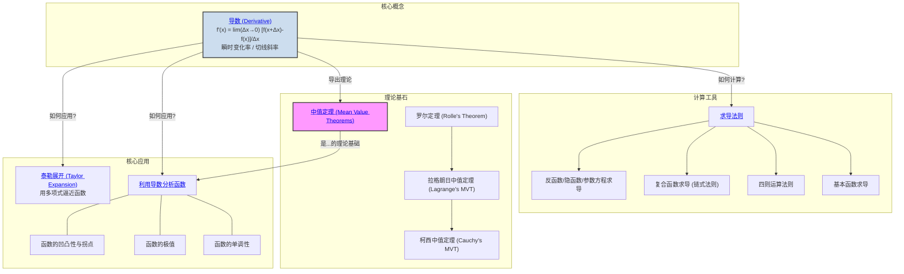

# 1. 一元微分学总览

**版本**: 1.0
**日期**: 2025-07-02

---

## 1.1. 引言：洞察瞬时变化

**微分学 (Differential Calculus)** 是微积分的两大核心支柱之一，它为我们提供了一套强大的工具来研究函数在某一点的 **瞬时变化率**。如果说初等数学主要处理匀速运动，那么微分学则让我们能够精确地描述和分析变速运动——无论是物理世界中下落的苹果，还是经济世界里波动的市场。

微分学的核心思想是 **以直代曲**，即用一条直线（切线）来近似函数在某一点的局部行为。这个"切线斜率"就是微分学的核心概念——**导数 (Derivative)**。

本模块将从导数的定义出发，学习如何计算导数，并最终利用导数这个强大的工具来深入分析函数的性质。

## 1.2. 知识地图 (Mermaid)

## 1.3. 探索路径

1.  **[01-导数的定义与几何意义.md](./01-导数的定义与几何意义.md)**: 我们将回到一切的起点，从"割线斜率的极限"来理解导数的精确定义，并明确其与"切线斜率"和"瞬时速度"的几何与物理意义。

2.  **[02-求导法则.md](./02-求导法则.md)**: 仅有定义不足以进行高效计算。本节将系统学习各种强大的求导法则，特别是 **链式法则**，它是计算复合函数导数的关键。

3.  **[03-中值定理.md](./03-中值定理.md)**: 这是连接函数本身与其导数的理论桥梁。特别是 **拉格朗日中值定理**，它直观地保证了"在一段平滑曲线上，必有一点的切线斜率等于两端点连线的斜率"。这些定理是后续应用和理论证明的基石。

4.  **[04-利用导数分析函数.md](./04-利用导数分析函数.md)**: 这是微分学最直接、最强大的应用。我们将学习如何利用导数的符号(正或负)来判断函数的增减(**单调性**)，如何利用导数为零的点来寻找函数的**极值**(最大值或最小值)，以及如何利用二阶导数来判断曲线的弯曲方向(**凹凸性**)。

5.  **[05-泰勒展开与近似计算.md](./05-泰勒展开与近似计算.md)**: 这是微分学思想的巅峰应用之一。**泰勒公式** 告诉我们，只要一个函数足够平滑(可导)，就可以在某一点附近用一个多项式函数来无限逼近它。这不仅是近似计算的利器，也是连接实分析与复分析等领域的桥梁。

---
[返回上一级: ../00-分析学总览.md](./00-分析学总览.md) 