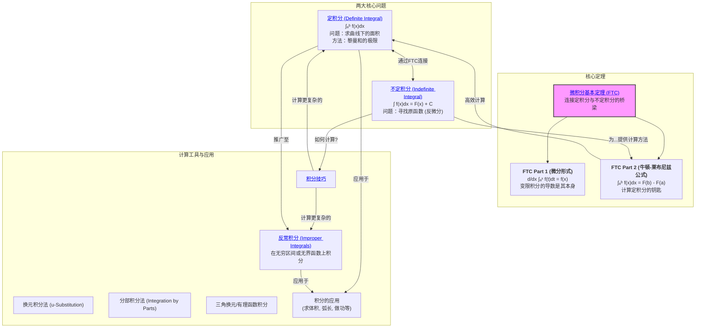

# 1. 一元积分学总览

**版本**: 1.0
**日期**: 2025-07-02

---

## 1.1. 引言：从求和到无穷

**积分学 (Integral Calculus)** 是微积分的另一大核心支柱。它源于一个古老而实际的问题：如何计算不规则图形的面积？古希腊的穷竭法思想，在17世纪被牛顿和莱布尼兹发展成一套系统的理论，其核心思想是 **"分割、近似、求和、取极限"**。

积分学主要研究两大看似独立的问题：

1. **定积分 (Definite Integral)**: 计算曲线下方的精确面积。
2. **不定积分 (Indefinite Integral)**: 寻找一个函数，使其导数是给定的函数，即"反微分"。

本模块最大的亮点，将是揭示 **微积分基本定理**。这个定理以一种惊人的、深刻的方式，将"求面积"和"反微分"这两个问题紧密地联系在一起，成为了整个微积分乃至整个数学分析的基石。

## 1.2. 知识地图 (Mermaid)

## 1.3. 探索路径

1. **[01-定积分的定义与性质.md](./01-定积分的定义与性质.md)**: 我们将从"计算曲边梯形面积"的直观问题出发，学习 **黎曼和 (Riemann Sum)** 的思想，并通过取极限来严格定义定积分 \(\int_a^b f(x)dx\)。

2. **[02-不定积分与原函数.md](./02-不定积分与原函数.md)**: 我们将转向另一个问题：给定一个函数 \(f(x)\)，什么样的函数 \(F(x)\) 的导数是它？我们把所有这样的 \(F(x)\)（它们只相差一个常数）称为 \(f(x)\) 的 **不定积分**。

3. **[03-微积分基本定理.md](./03-微积分基本定理.md)**: 这是本模块的高潮。我们将学习这个定理的两个部分：
    * 第一部分告诉我们，定积分作为一个上限变化的函数，其导数就是被积函数本身。
    * 第二部分（**牛顿-莱布尼兹公式**）提供了一个计算定积分的强大武器：只需找到一个原函数，代入上下限相减即可，从而彻底摆脱了复杂的黎曼和极限。

4. **[04-积分技巧.md](./04-积分技巧.md)**: 拥有了基本定理后，计算积分的关键就变成了"如何找到原函数"。本节将学习两大核心技巧：**换元积分法**（链式法则的逆运算）和 **分部积分法**（乘法法则的逆运算）。

5. **[05-反常积分.md](./05-反常积分.md)**: 我们将把定积分的概念推广到更广阔的领域，包括在无穷大的区间上积分，或者对在某些点趋于无穷的函数进行积分。

---
[返回上一级: ../00-分析学总览.md](./00-分析学总览.md)
