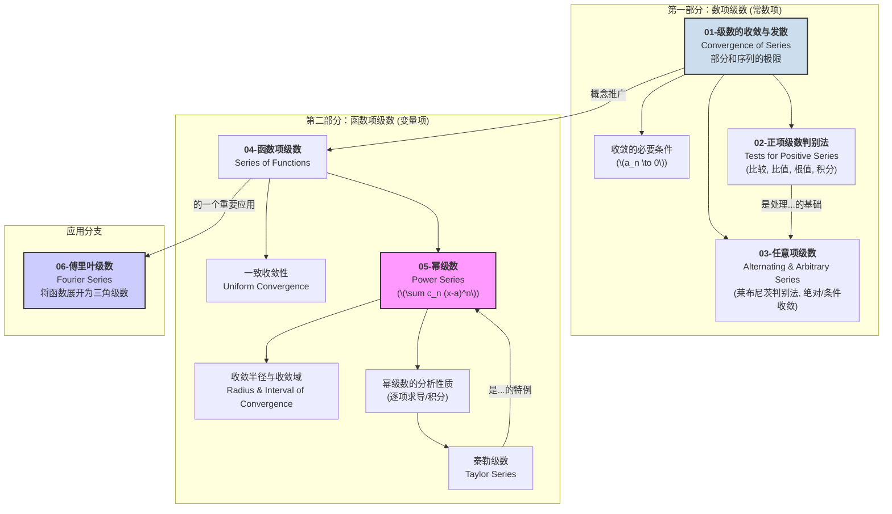

# 00-模块总览：级数理论

## 1. 模块导言：无穷求和的艺术与科学

我们已经知道如何将两个或有限多个数相加。但是，如果要把**无穷多个**数加起来，会发生什么？这就是**级数理论 (Theory of Series)** 所要研究的核心问题。

\(1 + \frac{1}{2} + \frac{1}{4} + \frac{1}{8} + \dots = ?\)

这个看似简单的问题，引出了深刻的数学概念。级数理论的本质，是利用我们已经建立的**极限**思想，来赋予“无穷和”一个严格的数学意义。我们通过考察“部分和序列”的极限，来判断一个无穷级数是**收敛**到一个有限的数值，还是**发散**到无穷。

级数不仅是优美的数学概念，更是强大的数学工具：

- **泰勒级数** 允许我们用简单的多项式来逼近和表示复杂的函数。
- **傅里叶级数** 让我们能将任何周期性的信号（如声波、电信号）分解为简单的正弦波和余弦波的叠加。

本模块将系统介绍判断级数收敛性的各种方法，并深入探讨两种最重要的函数项级数：幂级数和傅里叶级数。

## 2. 知识地图 (Knowledge Map)

## 3. 学习路径 (Learning Path)

1. **`01-级数的收敛与发散.md`**: 我们将从基础开始，严格定义什么是无穷级数、部分和序列，以及级数收敛与发散的确切含义。并掌握级数收敛的一个最基本的必要条件。
2. **`02-正项级数判别法.md`**: 对于各项都为正的级数，我们有一整套强大的判别其收敛性的工具，包括最基本的**比较判别法**、更精细的**极限比较判别法**，以及非常实用的**比值判别法**和**根值判别法**，还有一个连接积分与级数的**积分判别法**。
3. **`03-任意项级数.md`**: 我们将讨论含有负项的级数。对于正负交错的**交错级数**，我们有简单的**莱布尼茨判别法**。对于更一般的任意项级数，我们将引入**绝对收敛**和**条件收敛**这两个核心概念。
4. **`04-函数项级数.md`**: 我们将把级数的概念从“常数项”推广到“函数项”。这里，核心概念是**一致收敛性**，它保证了我们能对级数进行求导、积分等分析操作。
5. **`05-幂级数.md`**: 这是最重要的一类函数项级数。我们将学习如何确定幂级数的**收敛半径**和**收敛域**，并探讨其优良的分析性质（可在收敛域内逐项求导和积分）。我们之前学习的泰勒展开，其最终形态就是幂级数。
6. **`06-傅里叶级数.md`**: 我们将学习另一种强大的函数展开工具，它能将一个周期函数展开成一系列正弦和余弦函数的和。傅里叶级数在信号处理、物理学和工程学中有着不可估量的重要性。
