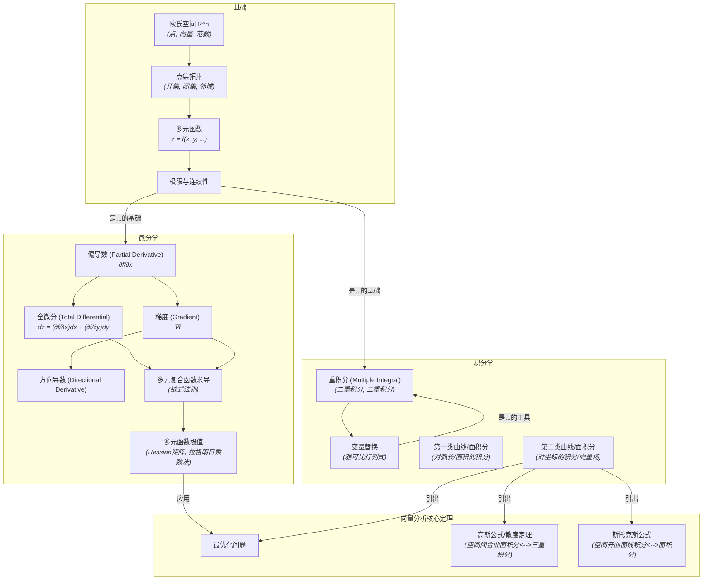

# 05-多元微积分总览

**版本**: 1.0
**日期**: 2025-07-02

---

## 1.1. 引言：从线到面，从面到体

微积分从一元到多元的推广，是数学视野的一次重大飞跃。我们不再局限于研究在一条线上变化的函数 \(y=f(x)\)，而是开始探索定义在平面、三维空间乃至更高维空间中的函数，例如温度场 \(T(x,y,z)\) 或引力势 \(U(x,y,z)\)。

**多元微积分 (Multivariable Calculus)** 的核心，是将在单变量世界中建立的极限、导数、积分等强大工具，推广到高维空间。这个过程并非简单的变量复制，而是引入了全新的、深刻的概念：
- **导数**演变为**偏导数 (Partial Derivative)** 和**梯度 (Gradient)**，描述了函数在特定方向上的变化率以及增长最快的方向。
- **积分**扩展为**重积分 (Multiple Integral)**、**曲线积分 (Line Integral)** 和**曲面积分 (Surface Integral)**，使我们能计算高维对象的“体积”、沿路径所作的功以及穿过曲面的流量。
- 最终，**格林公式 (Green's Theorem)**、**斯托克斯公式 (Stokes' Theorem)** 和**高斯公式 (Divergence Theorem)** 将高维空间中的“微分”与“积分”以一种惊人的方式联系起来，构成了现代**向量分析 (Vector Calculus)** 的基石。

本模块将带领我们踏上这场从低维到高维的探索之旅，理解多元函数的变化规律，并掌握分析高维空间问题的核心数学工具。

## 1.2. 知识地图 (Mermaid)

## 1.3. 探索路径

1.  **[01-欧氏空间与多元函数](./01-欧氏空间与多元函数.md)**: 介绍n维欧氏空间的基本概念，包括向量、范数和距离。学习多元函数、极限和连续性的定义，以及开集、闭集等基本的拓扑概念。
2.  **[02-多元函数微分学](./02-多元函数微分学.md)**: 引入偏导数和全微分的概念，理解它们如何描述函数在各个维度上的变化。掌握梯度、方向导数以及多元复合函数求导的链式法则。
3.  **[03-多元函数的极值](./03-多元函数的极值.md)**: 学习如何寻找多元函数的无约束极值（利用Hessian矩阵）和条件极值（拉格朗日乘数法），这是最优化理论的基础。
4.  **[04-重积分](./04-重积分.md)**: 将定积分推广到高维，学习二重积分和三重积分的计算方法，包括直角坐标和极坐标/柱坐标/球坐标下的计算，以及重积分的变量替换（雅可比行列式）。
5.  **[05-曲线积分与曲面积分](./05-曲线积分与曲面积分.md)**: 进一步推广积分概念，学习如何在曲线和曲面上进行积分。区分并掌握对弧长/面积的积分（第一类）和对坐标的积分（第二类/向量场积分）。
6.  **[06-向量分析三大定理](./06-向量分析三大定理.md)**: 学习格林公式、高斯散度定理和斯托克斯定理。理解这些定理如何将不同类型的积分（线、面、体）联系起来，深刻揭示了高维空间中微分与积分的内在统一。

---
[返回上一级: 04-分析学总览](../00-分析学总览.md) | [返回项目总览](../../09-项目总览/00-项目总览.md) 
