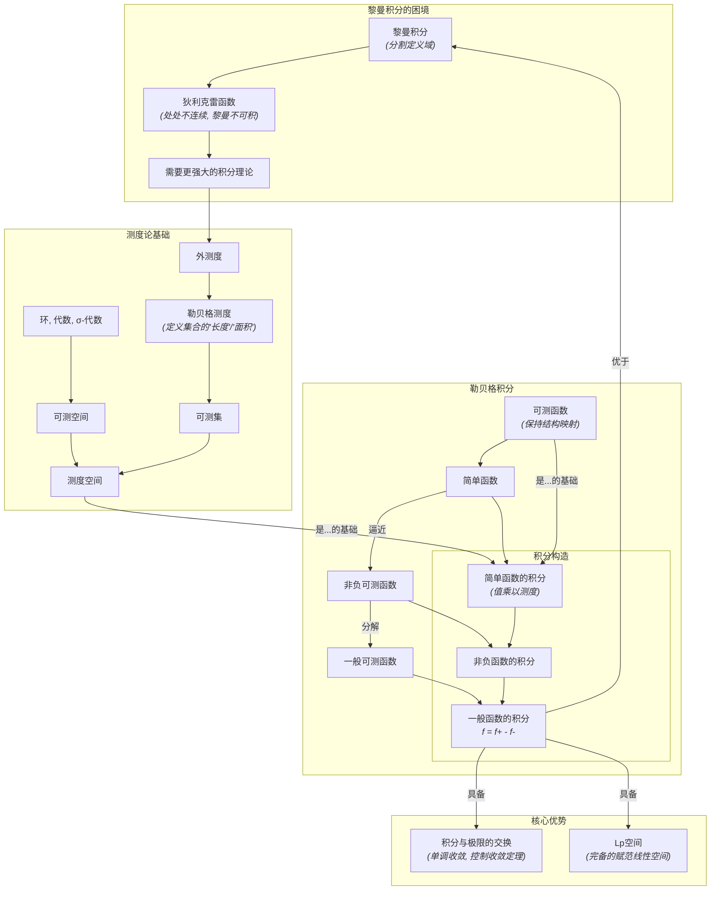

# 06-测度论与勒贝格积分总览

**版本**: 1.0
**日期**: 2025-07-02

---

## 1.1. 引言：重塑积分的基石

黎曼积分，作为我们熟悉的定积分，本质上是通过在**定义域**上做分割（垂直的细矩形）来逼近面积。这个方法对大多数连续函数或只有少数间断点的函数有效。然而，当面对具有复杂间断点的函数（如处处不连续的狄利克雷函数）时，黎曼积分便无能为力。

**测度论 (Measure Theory)** 和 **勒贝格积分 (Lebesgue Integral)** 从一个根本不同的角度解决了这个问题。
- **测度论**首先致力于回答一个看似简单却异常深刻的问题：“如何严谨且普适地定义一个集合的'长度'、'面积'或'体积'？” 它建立了一套理论，可以将"大小"（测度）赋予非常复杂的点集。
- **勒贝格积分**则基于测度的概念，采用了全新的积分策略：它不再分割定义域，而是分割**值域**。想象一下求一座山丘下的土方量，黎曼积分是按经纬度切成小方块垂直累加，而勒贝格积分是按海拔高度切成水平薄片，然后将每片"打碎"重组成矩形后累加。

这种方法的转变带来了巨大的威力：
1.  **更强的收敛定理**: 勒贝格积分与极限可以更好地交换顺序，这在泛函分析和概率论中至关重要。
2.  **更广的积分范围**: 许多黎曼不可积的函数（如狄利克雷函数）在勒贝格意义下是可积的。
3.  **完备的函数空间**: 所有勒贝格可积的函数构成的 \(L^p\) 空间是完备的，这是现代分析的根基。

本模块将带领我们完成从黎曼积分到勒贝格积分的认知升级，这不仅是一次技术的提升，更是理解现代数学的一次观念飞跃。

## 1.2. 知识地图 (Mermaid)

## 1.3. 探索路径

1.  **[01-测度的概念](./01-测度的概念.md)**: 从黎曼积分的局限性出发，理解为何需要新的积分理论。引入 \(\sigma\)-代数、可测空间等基本概念，并重点学习勒贝格外测度如何为尽可能多的集合赋予"长度"或"大小"。
2.  **[02-可测函数](./02-可测函数.md)**: 定义勒贝格积分的"合法"对象——可测函数。理解其本质是"保持集合可测性结构"的函数，并学会用更易于处理的**简单函数**来逼近它们。
3.  **[03-勒贝格积分的构造](./03-勒贝格积分的构造.md)**: 遵循"从简单到复杂"的构造思想，学习如何一步步定义勒贝格积分：首先定义简单函数的积分（面积 = 值 × 测度），然后推广到非负可测函数，最后推广到一般可测函数。
4.  **[04-积分收敛定理](./04-积分收敛定理.md)**: 学习勒贝格积分理论的皇冠明珠——**单调收敛定理 (MCT)** 和**控制收敛定理 (DCT)**。理解它们为何能保证在非常宽松的条件下，积分与极限可以自由交换，从而展现出比黎曼积分更优越的分析性质。
5.  **[05-与黎曼积分的关系](./05-与黎曼积分的关系.md)**: 明确勒贝格积分与黎曼积分的联系。理解在什么条件下，一个黎曼可积的函数也是勒贝格可积的，并且它们的积分值相等。这确保了新理论是旧理论的合理推广。

---
[返回上一级: 04-分析学总览](../00-分析学总览.md) | [返回项目总览](../../09-项目总览/00-项目总览.md) 