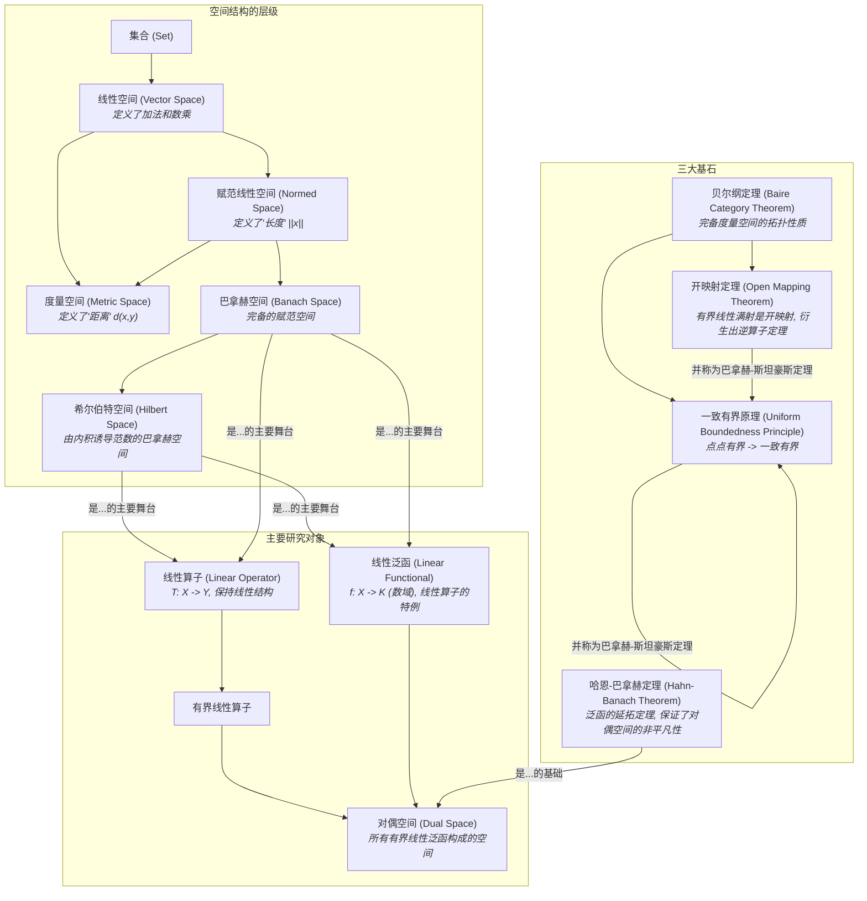

# 07-泛函分析总览

**版本**: 1.0
**日期**: 2025-07-02

---

## 1.1. 引言：分析学的终极抽象

如果说微积分研究的是函数，线性代数研究的是向量，那么**泛函分析 (Functional Analysis)** 研究的就是**以函数为元素的向量空间**。它将微积分的极限思想与线性代数的结构思想完美融合，并将它们从有限维推广到了无穷维。

想象一下，我们不再将一个函数 \(f(x)\) 视为一个输入-输出的规则，而是将其看作一个无穷维空间中的一个"点"或"向量"。在这个空间中，我们可以定义"距离"（度量空间）、"长度"（范数）、"角度"（内积），并讨论"收敛"与"极限"。

泛函分析的核心舞台是几类特殊的无穷维空间：

- **赋范线性空间 (Normed Vector Space)**: 定义了"长度"的空间。
- **巴拿赫空间 (Banach Space)**: "完备的"赋范线性空间，意味着柯西序列总有极限，分析学可以在其中顺畅进行。
- **希尔伯特空间 (Hilbert Space)**: "带有角度"的巴拿赫空间，即由内积<x,y>诱导出范数，是欧氏空间最自然的无穷维推广。

在这个舞台上，我们研究的主角是作用于这些空间之间的"函数"——**线性算子 (Linear Operator)**，以及将空间中向量映射到数域的"函数"——**线性泛函 (Linear Functional)**。

最终，整个宏伟的理论大厦由三大基本定理支撑，它们构成了现代泛函分析乃至大量应用数学领域的基石。本模块将带领我们领略这门学科的抽象之美与强大威力。

## 1.2. 知识地图 (Mermaid)

## 1.3. 探索路径

1. **[01-度量空间](./01-度量空间.md)**: 从最广泛的抽象开始，学习仅有"距离"概念的度量空间。掌握开集、闭集、收敛、柯西序列和完备性等基本拓扑概念，这是后续所有空间的基础。
2. **[02-赋范线性空间](./02-赋范线性空间.md)**: 在线性空间的基础上引入"长度"或"范数"的概念。学习范数如何自然地诱导出距离（度量），并将线性代数与拓扑分析结合起来。
3. **[03-巴拿赫空间与希尔伯特空间](./03-巴拿赫空间与希尔伯特空间.md)**: 介绍泛函分析最重要的两类舞台。理解巴拿赫空间（完备的赋范空间）对于分析的重要性，并学习希尔伯特空间（带有内积的巴拿赫空间）如何将几何直观（如正交、投影）带入无穷维。
4. **[04-线性算子与泛函](./04-线性算子与泛函.md)**: 研究这些空间上的映射。区分有界与无界算子，理解有界性与连续性的等价关系。介绍对偶空间的概念，即所有有界线性泛函构成的空间。
5. **[05-泛函分析三大基本定理](./05-泛函分析三大基本定理.md)**: 深入学习支撑泛函分析的三大支柱：哈恩-巴拿赫定理（保证了对偶理论的丰富性）、一致有界原理（从点点有界到一致有界的飞跃）和开映射定理（及其推论逆算子定理，保证了"好"算子有"好"的逆）。

---
[返回上一级: 04-分析学总览](../00-分析学总览.md) | [返回项目总览](../../09-项目总览/00-项目总览.md)
