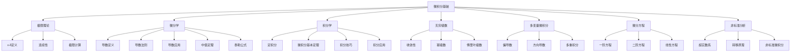

# 微积分基础

## 目录

- [微积分基础](#微积分基础)
  - [目录](#目录)
  - [1. 引言与核心概念](#1-引言与核心概念)
    - [1.1 微积分的本质与基本问题](#11-微积分的本质与基本问题)
    - [1.2 连续统：微积分的舞台](#12-连续统微积分的舞台)
    - [1.3 变化与累积：微积分的双重纲领](#13-变化与累积微积分的双重纲领)
  - [2. 极限理论](#2-极限理论)
    - [2.1 极限的定义与性质](#21-极限的定义与性质)
      - [2.1.1 $\\epsilon-\\delta$ 定义](#211-epsilon-delta-定义)
      - [2.1.2 极限的性质](#212-极限的性质)
      - [2.1.3 单侧极限与无穷极限](#213-单侧极限与无穷极限)
    - [2.2 连续性](#22-连续性)
      - [2.2.1 连续性的定义](#221-连续性的定义)
      - [2.2.2 连续函数的性质](#222-连续函数的性质)
    - [2.3 极限的计算技巧](#23-极限的计算技巧)
  - [3. 微分学](#3-微分学)
    - [3.1 导数的定义与几何意义](#31-导数的定义与几何意义)
      - [3.1.1 导数的定义](#311-导数的定义)
      - [3.1.2 几何意义](#312-几何意义)
      - [3.1.3 物理意义](#313-物理意义)
    - [3.2 导数法则](#32-导数法则)
      - [3.2.1 基本求导法则](#321-基本求导法则)
      - [3.2.2 特殊函数导数](#322-特殊函数导数)
    - [3.3 导数的应用](#33-导数的应用)
      - [3.3.1 函数的单调性](#331-函数的单调性)
      - [3.3.2 极值问题](#332-极值问题)
      - [3.3.3 凹凸性](#333-凹凸性)
    - [3.4 中值定理](#34-中值定理)
      - [3.4.1 罗尔定理](#341-罗尔定理)
      - [3.4.2 拉格朗日中值定理](#342-拉格朗日中值定理)
      - [3.4.3 柯西中值定理](#343-柯西中值定理)
    - [3.5 泰勒公式与逼近](#35-泰勒公式与逼近)
      - [3.5.1 泰勒公式](#351-泰勒公式)
      - [3.5.2 麦克劳林级数](#352-麦克劳林级数)
  - [4. 积分学](#4-积分学)
    - [4.1 定积分的定义](#41-定积分的定义)
      - [4.1.1 黎曼和](#411-黎曼和)
      - [4.1.2 几何意义](#412-几何意义)
    - [4.2 微积分基本定理](#42-微积分基本定理)
      - [4.2.1 第一基本定理](#421-第一基本定理)
      - [4.2.2 第二基本定理](#422-第二基本定理)
    - [4.3 不定积分与原函数](#43-不定积分与原函数)
      - [4.3.1 原函数](#431-原函数)
      - [4.3.2 不定积分](#432-不定积分)
    - [4.4 积分技巧](#44-积分技巧)
      - [4.4.1 换元积分法](#441-换元积分法)
      - [4.4.2 分部积分法](#442-分部积分法)
      - [4.4.3 三角换元](#443-三角换元)
      - [4.4.4 部分分式积分](#444-部分分式积分)
    - [4.5 积分的应用](#45-积分的应用)
      - [4.5.1 面积计算](#451-面积计算)
      - [4.5.2 体积计算](#452-体积计算)
      - [4.5.3 弧长计算](#453-弧长计算)
  - [5. 无穷级数](#5-无穷级数)
    - [5.1 序列与级数的收敛性](#51-序列与级数的收敛性)
      - [5.1.1 序列收敛](#511-序列收敛)
      - [5.1.2 级数收敛](#512-级数收敛)
      - [5.1.3 收敛判别法](#513-收敛判别法)
    - [5.2 幂级数与泰勒级数](#52-幂级数与泰勒级数)
      - [5.2.1 幂级数](#521-幂级数)
      - [5.2.2 收敛半径](#522-收敛半径)
      - [5.2.3 常见函数的泰勒级数](#523-常见函数的泰勒级数)
    - [5.3 傅里叶级数](#53-傅里叶级数)
      - [5.3.1 傅里叶级数定义](#531-傅里叶级数定义)
  - [6. 多变量微积分初步](#6-多变量微积分初步)
    - [6.1 向量值函数](#61-向量值函数)
      - [6.1.1 向量函数](#611-向量函数)
      - [6.1.2 导数](#612-导数)
    - [6.2 偏导数](#62-偏导数)
      - [6.2.1 偏导数定义](#621-偏导数定义)
      - [6.2.2 高阶偏导数](#622-高阶偏导数)
    - [6.3 方向导数与梯度](#63-方向导数与梯度)
      - [6.3.1 方向导数](#631-方向导数)
      - [6.3.2 梯度](#632-梯度)
    - [6.4 多重积分](#64-多重积分)
      - [6.4.1 二重积分](#641-二重积分)
      - [6.4.2 极坐标下的二重积分](#642-极坐标下的二重积分)
  - [7. 微分方程初步](#7-微分方程初步)
    - [7.1 微分方程的基本概念](#71-微分方程的基本概念)
      - [7.1.1 微分方程定义](#711-微分方程定义)
      - [7.1.2 分类](#712-分类)
    - [7.2 一阶微分方程](#72-一阶微分方程)
      - [7.2.1 可分离变量方程](#721-可分离变量方程)
      - [7.2.2 线性方程](#722-线性方程)
      - [7.2.3 齐次方程](#723-齐次方程)
    - [7.3 二阶线性微分方程](#73-二阶线性微分方程)
      - [7.3.1 齐次方程](#731-齐次方程)
      - [7.3.2 非齐次方程](#732-非齐次方程)
  - [8. 非标准分析](#8-非标准分析)
    - [8.1 超实数系](#81-超实数系)
      - [8.1.1 超实数定义](#811-超实数定义)
      - [8.1.2 标准部分函数](#812-标准部分函数)
    - [8.2 转移原理](#82-转移原理)
      - [8.2.1 转移原理](#821-转移原理)
      - [8.2.2 应用](#822-应用)
    - [8.3 非标准微积分](#83-非标准微积分)
      - [8.3.1 非标准极限](#831-非标准极限)
      - [8.3.2 非标准导数](#832-非标准导数)
      - [8.3.3 非标准积分](#833-非标准积分)
  - [9. 批判性分析](#9-批判性分析)
    - [9.1 微积分的哲学基础](#91-微积分的哲学基础)
      - [9.1.1 连续性与离散性](#911-连续性与离散性)
      - [9.1.2 无穷小概念](#912-无穷小概念)
    - [9.2 无穷小概念的争议](#92-无穷小概念的争议)
      - [9.2.1 贝克莱的批评](#921-贝克莱的批评)
      - [9.2.2 现代解决方案](#922-现代解决方案)
    - [9.3 连续性与离散性](#93-连续性与离散性)
      - [9.3.1 数学连续性](#931-数学连续性)
      - [9.3.2 计算中的离散化](#932-计算中的离散化)
    - [9.4 微积分的应用局限](#94-微积分的应用局限)
      - [9.4.1 适用范围](#941-适用范围)
      - [9.4.2 计算复杂性](#942-计算复杂性)
  - [10. 应用与展望](#10-应用与展望)
    - [10.1 物理学应用](#101-物理学应用)
      - [10.1.1 经典力学](#1011-经典力学)
      - [10.1.2 电磁学](#1012-电磁学)
    - [10.2 工程学应用](#102-工程学应用)
      - [10.2.1 结构分析](#1021-结构分析)
      - [10.2.2 控制系统](#1022-控制系统)
    - [10.3 经济学应用](#103-经济学应用)
      - [10.3.1 边际分析](#1031-边际分析)
      - [10.3.2 动态优化](#1032-动态优化)
    - [10.4 计算机科学应用](#104-计算机科学应用)
      - [10.4.1 数值分析](#1041-数值分析)
      - [10.4.2 机器学习](#1042-机器学习)
    - [10.5 未来发展方向](#105-未来发展方向)
      - [10.5.1 分数阶微积分](#1051-分数阶微积分)
      - [10.5.2 随机微积分](#1052-随机微积分)
      - [10.5.3 离散微积分](#1053-离散微积分)
  - [代码示例](#代码示例)
    - [Rust 实现：数值积分](#rust-实现数值积分)
    - [Haskell 实现：符号微分](#haskell-实现符号微分)
  - [思维导图](#思维导图)

---

## 1. 引言与核心概念

### 1.1 微积分的本质与基本问题

微积分是现代数学的基石之一，它研究变化率和积累，主要包括微分学和积分学两个核心部分。微积分试图回答两类基本问题：

1. **瞬时变化率问题**：给定一个量如何随另一个量变化，如何确定它在任何特定时刻的变化快慢？
2. **总量积累问题**：如果知道一个量如何随另一个量变化，如何确定在某个区间内这个量的总积累是多少？

这两个问题通过**微积分基本定理**紧密联系在一起，表明微分和积分在某种意义上是互逆的运算。

### 1.2 连续统：微积分的舞台

微积分的基础是实数系 $\mathbb{R}$ 的完备性：

- **完备性**：任何有上界的非空实数子集必有上确界
- **稠密性**：任意两个不相等的实数之间存在无穷多个其他实数
- **有序性**：实数可以比较大小，满足传递性、反对称性等

这些性质为微积分提供了严格的逻辑基础。

### 1.3 变化与累积：微积分的双重纲领

微积分以"连续量"为基石，以"变化"的分析（微分学）与"累积"的计算（积分学）作为两条核心纲领：

- **变化**：通过导数量化瞬时变化率
- **累积**：通过积分计算区间上的总效应

## 2. 极限理论

### 2.1 极限的定义与性质

#### 2.1.1 $\epsilon-\delta$ 定义

函数 $f(x)$ 当 $x$ 趋近于 $c$ 时极限为 $L$，记作：
$$\lim_{x \to c} f(x) = L$$

严格定义为：对于任意 $\epsilon > 0$，存在 $\delta > 0$，使得当 $0 < |x-c| < \delta$ 时，有 $|f(x)-L| < \epsilon$。

#### 2.1.2 极限的性质

- **唯一性**：如果极限存在，则唯一
- **四则运算**：极限运算满足代数性质
- **夹逼定理**：如果 $g(x) \leq f(x) \leq h(x)$ 且 $\lim_{x \to c} g(x) = \lim_{x \to c} h(x) = L$，则 $\lim_{x \to c} f(x) = L$

#### 2.1.3 单侧极限与无穷极限

- **左极限**：$\lim_{x \to c^-} f(x)$
- **右极限**：$\lim_{x \to c^+} f(x)$
- **无穷极限**：$\lim_{x \to c} f(x) = \infty$ 或 $-\infty$

### 2.2 连续性

#### 2.2.1 连续性的定义

函数 $f(x)$ 在点 $x = c$ 处连续，如果满足：

1. $f(c)$ 有定义
2. $\lim_{x \to c} f(x)$ 存在
3. $\lim_{x \to c} f(x) = f(c)$

#### 2.2.2 连续函数的性质

- **介值定理**：如果 $f(x)$ 在 $[a, b]$ 上连续，且 $N$ 介于 $f(a)$ 和 $f(b)$ 之间，则在 $(a, b)$ 内存在 $c$ 使得 $f(c) = N$
- **最值定理**：连续函数在闭区间上一定能取得最大值和最小值
- **运算性质**：连续函数的和、差、积、商（分母不为零）仍然是连续函数

### 2.3 极限的计算技巧

- **直接代入法**：对于连续函数
- **因式分解法**：消除零因子
- **有理化法**：处理根式
- **洛必达法则**：处理不定式

## 3. 微分学

### 3.1 导数的定义与几何意义

#### 3.1.1 导数的定义

函数 $f(x)$ 在点 $x_0$ 处的导数定义为：
$$f'(x_0) = \lim_{\Delta x \to 0} \frac{f(x_0 + \Delta x) - f(x_0)}{\Delta x}$$

#### 3.1.2 几何意义

导数 $f'(x_0)$ 是曲线 $y = f(x)$ 在点 $(x_0, f(x_0))$ 处切线的斜率。

#### 3.1.3 物理意义

- 位移对时间的导数是瞬时速度
- 速度对时间的导数是瞬时加速度
- 成本对产量的导数是边际成本

### 3.2 导数法则

#### 3.2.1 基本求导法则

- **常数法则**：$\frac{d}{dx}(c) = 0$
- **幂函数法则**：$\frac{d}{dx}(x^n) = nx^{n-1}$
- **常数倍法则**：$\frac{d}{dx}[c \cdot f(x)] = c \cdot f'(x)$
- **和差法则**：$\frac{d}{dx}[f(x) \pm g(x)] = f'(x) \pm g'(x)$
- **乘法法则**：$\frac{d}{dx}[f(x)g(x)] = f'(x)g(x) + f(x)g'(x)$
- **除法法则**：$\frac{d}{dx}\left[\frac{f(x)}{g(x)}\right] = \frac{f'(x)g(x) - f(x)g'(x)}{[g(x)]^2}$
- **链式法则**：$\frac{d}{dx}[f(g(x))] = f'(g(x)) \cdot g'(x)$

#### 3.2.2 特殊函数导数

- **指数函数**：$\frac{d}{dx}(e^x) = e^x$
- **对数函数**：$\frac{d}{dx}(\ln x) = \frac{1}{x}$
- **三角函数**：
  - $\frac{d}{dx}(\sin x) = \cos x$
  - $\frac{d}{dx}(\cos x) = -\sin x$
  - $\frac{d}{dx}(\tan x) = \sec^2 x$

### 3.3 导数的应用

#### 3.3.1 函数的单调性

- 如果 $f'(x) > 0$ 在区间上成立，则 $f(x)$ 在该区间上单调递增
- 如果 $f'(x) < 0$ 在区间上成立，则 $f(x)$ 在该区间上单调递减

#### 3.3.2 极值问题

- **费马定理**：如果 $f(x)$ 在 $x_0$ 处取得极值且可导，则 $f'(x_0) = 0$
- **二阶导数判别法**：如果 $f'(x_0) = 0$ 且 $f''(x_0) > 0$，则 $f(x)$ 在 $x_0$ 处取得极小值

#### 3.3.3 凹凸性

- 如果 $f''(x) > 0$，则 $f(x)$ 在该区间上凹向上
- 如果 $f''(x) < 0$，则 $f(x)$ 在该区间上凹向下

### 3.4 中值定理

#### 3.4.1 罗尔定理

如果 $f(x)$ 在 $[a, b]$ 上连续，在 $(a, b)$ 内可导，且 $f(a) = f(b)$，则存在 $c \in (a, b)$ 使得 $f'(c) = 0$。

#### 3.4.2 拉格朗日中值定理

如果 $f(x)$ 在 $[a, b]$ 上连续，在 $(a, b)$ 内可导，则存在 $c \in (a, b)$ 使得：
$$f'(c) = \frac{f(b) - f(a)}{b - a}$$

#### 3.4.3 柯西中值定理

如果 $f(x)$ 和 $g(x)$ 在 $[a, b]$ 上连续，在 $(a, b)$ 内可导，且 $g'(x) \neq 0$，则存在 $c \in (a, b)$ 使得：
$$\frac{f'(c)}{g'(c)} = \frac{f(b) - f(a)}{g(b) - g(a)}$$

### 3.5 泰勒公式与逼近

#### 3.5.1 泰勒公式

如果 $f(x)$ 在 $x_0$ 的邻域内具有 $n+1$ 阶导数，则：
$$f(x) = f(x_0) + f'(x_0)(x-x_0) + \frac{f''(x_0)}{2!}(x-x_0)^2 + \cdots + \frac{f^{(n)}(x_0)}{n!}(x-x_0)^n + R_n(x)$$

其中余项 $R_n(x) = \frac{f^{(n+1)}(\xi)}{(n+1)!}(x-x_0)^{n+1}$，$\xi$ 在 $x_0$ 与 $x$ 之间。

#### 3.5.2 麦克劳林级数

当 $x_0 = 0$ 时，泰勒级数称为麦克劳林级数：
$$f(x) = f(0) + f'(0)x + \frac{f''(0)}{2!}x^2 + \cdots + \frac{f^{(n)}(0)}{n!}x^n + \cdots$$

## 4. 积分学

### 4.1 定积分的定义

#### 4.1.1 黎曼和

对于函数 $f(x)$ 在区间 $[a, b]$ 上的定积分：
$$\int_a^b f(x) dx = \lim_{n \to \infty} \sum_{i=1}^n f(x_i^*) \Delta x_i$$

其中 $x_i^*$ 是第 $i$ 个子区间 $[x_{i-1}, x_i]$ 中的任意点。

#### 4.1.2 几何意义

定积分 $\int_a^b f(x) dx$ 表示曲线 $y = f(x)$ 在区间 $[a, b]$ 上与 $x$ 轴围成的面积。

### 4.2 微积分基本定理

#### 4.2.1 第一基本定理

如果 $f(x)$ 在 $[a, b]$ 上连续，则函数 $F(x) = \int_a^x f(t) dt$ 在 $[a, b]$ 上可导，且 $F'(x) = f(x)$。

#### 4.2.2 第二基本定理

如果 $f(x)$ 在 $[a, b]$ 上连续，$F(x)$ 是 $f(x)$ 的一个原函数，则：
$$\int_a^b f(x) dx = F(b) - F(a)$$

### 4.3 不定积分与原函数

#### 4.3.1 原函数

如果 $F'(x) = f(x)$，则称 $F(x)$ 是 $f(x)$ 的一个原函数。

#### 4.3.2 不定积分

函数 $f(x)$ 的所有原函数称为 $f(x)$ 的不定积分，记作：
$$\int f(x) dx = F(x) + C$$

其中 $C$ 是任意常数。

### 4.4 积分技巧

#### 4.4.1 换元积分法

设 $u = g(x)$，则：
$$\int f(g(x))g'(x) dx = \int f(u) du$$

#### 4.4.2 分部积分法

$$\int u dv = uv - \int v du$$

#### 4.4.3 三角换元

- 对于 $\sqrt{a^2 - x^2}$，令 $x = a \sin \theta$
- 对于 $\sqrt{a^2 + x^2}$，令 $x = a \tan \theta$
- 对于 $\sqrt{x^2 - a^2}$，令 $x = a \sec \theta$

#### 4.4.4 部分分式积分

将有理函数分解为部分分式后积分。

### 4.5 积分的应用

#### 4.5.1 面积计算

- 两条曲线之间的面积：$\int_a^b [f(x) - g(x)] dx$
- 极坐标下的面积：$\frac{1}{2} \int_a^b r^2 d\theta$

#### 4.5.2 体积计算

- 旋转体体积：$V = \pi \int_a^b [f(x)]^2 dx$
- 截面面积已知的体积：$V = \int_a^b A(x) dx$

#### 4.5.3 弧长计算

$$L = \int_a^b \sqrt{1 + [f'(x)]^2} dx$$

## 5. 无穷级数

### 5.1 序列与级数的收敛性

#### 5.1.1 序列收敛

序列 $\{a_n\}$ 收敛到 $L$，如果对于任意 $\epsilon > 0$，存在 $N$ 使得当 $n > N$ 时，$|a_n - L| < \epsilon$。

#### 5.1.2 级数收敛

级数 $\sum_{n=1}^{\infty} a_n$ 收敛，如果其部分和序列 $\{S_n\}$ 收敛，其中 $S_n = \sum_{k=1}^n a_k$。

#### 5.1.3 收敛判别法

- **比较判别法**：如果 $0 \leq a_n \leq b_n$ 且 $\sum b_n$ 收敛，则 $\sum a_n$ 收敛
- **比值判别法**：如果 $\lim_{n \to \infty} \left|\frac{a_{n+1}}{a_n}\right| = L < 1$，则级数收敛
- **根值判别法**：如果 $\lim_{n \to \infty} \sqrt[n]{|a_n|} = L < 1$，则级数收敛

### 5.2 幂级数与泰勒级数

#### 5.2.1 幂级数

形如 $\sum_{n=0}^{\infty} a_n x^n$ 的级数称为幂级数。

#### 5.2.2 收敛半径

幂级数 $\sum_{n=0}^{\infty} a_n x^n$ 的收敛半径为：
$$R = \frac{1}{\limsup_{n \to \infty} \sqrt[n]{|a_n|}}$$

#### 5.2.3 常见函数的泰勒级数

- $e^x = \sum_{n=0}^{\infty} \frac{x^n}{n!}$
- $\sin x = \sum_{n=0}^{\infty} \frac{(-1)^n x^{2n+1}}{(2n+1)!}$
- $\cos x = \sum_{n=0}^{\infty} \frac{(-1)^n x^{2n}}{(2n)!}$
- $\ln(1+x) = \sum_{n=1}^{\infty} \frac{(-1)^{n-1} x^n}{n}$

### 5.3 傅里叶级数

#### 5.3.1 傅里叶级数定义

周期为 $2\pi$ 的函数 $f(x)$ 的傅里叶级数为：
$$f(x) = \frac{a_0}{2} + \sum_{n=1}^{\infty} (a_n \cos nx + b_n \sin nx)$$

其中：
$$a_n = \frac{1}{\pi} \int_{-\pi}^{\pi} f(x) \cos nx dx$$
$$b_n = \frac{1}{\pi} \int_{-\pi}^{\pi} f(x) \sin nx dx$$

## 6. 多变量微积分初步

### 6.1 向量值函数

#### 6.1.1 向量函数

向量值函数 $\mathbf{r}(t) = \langle x(t), y(t), z(t) \rangle$ 描述空间中的曲线。

#### 6.1.2 导数

$$\mathbf{r}'(t) = \langle x'(t), y'(t), z'(t) \rangle$$

### 6.2 偏导数

#### 6.2.1 偏导数定义

函数 $f(x, y)$ 对 $x$ 的偏导数：
$$f_x(x, y) = \lim_{h \to 0} \frac{f(x+h, y) - f(x, y)}{h}$$

#### 6.2.2 高阶偏导数

- 二阶偏导数：$f_{xx}, f_{xy}, f_{yx}, f_{yy}$
- 混合偏导数相等：如果 $f_{xy}$ 和 $f_{yx}$ 连续，则 $f_{xy} = f_{yx}$

### 6.3 方向导数与梯度

#### 6.3.1 方向导数

函数 $f(x, y)$ 在点 $(x_0, y_0)$ 沿单位向量 $\mathbf{u} = \langle a, b \rangle$ 的方向导数：
$$D_{\mathbf{u}} f(x_0, y_0) = f_x(x_0, y_0) a + f_y(x_0, y_0) b$$

#### 6.3.2 梯度

$$\nabla f = \langle f_x, f_y \rangle$$

方向导数可以表示为：$D_{\mathbf{u}} f = \nabla f \cdot \mathbf{u}$

### 6.4 多重积分

#### 6.4.1 二重积分

$$\iint_D f(x, y) dA = \int_a^b \int_{g_1(x)}^{g_2(x)} f(x, y) dy dx$$

#### 6.4.2 极坐标下的二重积分

$$\iint_D f(x, y) dA = \int_\alpha^\beta \int_{r_1(\theta)}^{r_2(\theta)} f(r \cos \theta, r \sin \theta) r dr d\theta$$

## 7. 微分方程初步

### 7.1 微分方程的基本概念

#### 7.1.1 微分方程定义

包含未知函数及其导数的方程称为微分方程。

#### 7.1.2 分类

- **阶数**：方程中最高阶导数的阶数
- **线性性**：线性微分方程中未知函数及其导数都是一次的
- **齐次性**：齐次方程中不含常数项

### 7.2 一阶微分方程

#### 7.2.1 可分离变量方程

形如 $\frac{dy}{dx} = f(x)g(y)$ 的方程，可以通过分离变量求解。

#### 7.2.2 线性方程

形如 $\frac{dy}{dx} + P(x)y = Q(x)$ 的方程，可以通过积分因子法求解。

#### 7.2.3 齐次方程

形如 $\frac{dy}{dx} = f\left(\frac{y}{x}\right)$ 的方程，可以通过变量替换求解。

### 7.3 二阶线性微分方程

#### 7.3.1 齐次方程

形如 $y'' + ay' + by = 0$ 的方程，其特征方程为 $r^2 + ar + b = 0$。

#### 7.3.2 非齐次方程

形如 $y'' + ay' + by = f(x)$ 的方程，其通解为齐次方程的通解加上特解。

## 8. 非标准分析

### 8.1 超实数系

#### 8.1.1 超实数定义

超实数系 $^*\mathbb{R}$ 是实数系 $\mathbb{R}$ 的扩展，包含：

- 无穷小量：非零但其绝对值小于任何正实数
- 无穷大量：其绝对值大于任何实数

#### 8.1.2 标准部分函数

对于有限超实数 $x$，存在唯一的实数 $st(x)$ 使得 $x - st(x)$ 是无穷小。

### 8.2 转移原理

#### 8.2.1 转移原理

任何可以用一阶逻辑语言表述的关于实数的命题，在超实数系中也为真。

#### 8.2.2 应用

转移原理使得我们可以将实数上的推理"转移"到超实数上。

### 8.3 非标准微积分

#### 8.3.1 非标准极限

$\lim_{x \to a} f(x) = L$ 当且仅当对所有 $x \approx a$ 且 $x \neq a$，有 $f(x) \approx L$。

#### 8.3.2 非标准导数

$f'(x)$ 是唯一的标准实数，满足 $f'(x) \approx \frac{f(x+dx) - f(x)}{dx}$，其中 $dx$ 是非零无穷小。

#### 8.3.3 非标准积分

$\int_a^b f(x) dx = st\left(\sum_{i=1}^N f(x_i) dx\right)$，其中 $dx = \frac{b-a}{N}$ 是无穷小。

## 9. 批判性分析

### 9.1 微积分的哲学基础

#### 9.1.1 连续性与离散性

微积分基于连续性的假设，但现实世界是否真正连续仍存在争议。

#### 9.1.2 无穷小概念

无穷小概念在历史上经历了从直观到严格定义的演变，非标准分析为其提供了新的视角。

### 9.2 无穷小概念的争议

#### 9.2.1 贝克莱的批评

贝克莱主教批评无穷小是"已死量的幽灵"，指出其逻辑上的不严密性。

#### 9.2.2 现代解决方案

$\epsilon-\delta$ 语言和非标准分析为无穷小概念提供了严格的数学基础。

### 9.3 连续性与离散性

#### 9.3.1 数学连续性

数学中的连续性是基于实数系的完备性，但物理世界可能存在最小单位。

#### 9.3.2 计算中的离散化

实际计算中，连续问题往往需要离散化处理。

### 9.4 微积分的应用局限

#### 9.4.1 适用范围

微积分主要适用于连续变化的现象，对于离散或随机现象需要其他工具。

#### 9.4.2 计算复杂性

某些积分和微分方程可能难以求解，需要数值方法。

## 10. 应用与展望

### 10.1 物理学应用

#### 10.1.1 经典力学

- 运动学：位置、速度、加速度的关系
- 动力学：牛顿定律的微分形式

#### 10.1.2 电磁学

- 麦克斯韦方程组的微分形式
- 电磁场的梯度、散度、旋度

### 10.2 工程学应用

#### 10.2.1 结构分析

- 梁的弯曲分析
- 应力应变关系

#### 10.2.2 控制系统

- 微分方程建模
- 拉普拉斯变换

### 10.3 经济学应用

#### 10.3.1 边际分析

- 边际成本、边际收益
- 效用最大化

#### 10.3.2 动态优化

- 最优控制理论
- 动态规划

### 10.4 计算机科学应用

#### 10.4.1 数值分析

- 数值积分方法
- 微分方程数值解

#### 10.4.2 机器学习

- 梯度下降算法
- 神经网络训练

### 10.5 未来发展方向

#### 10.5.1 分数阶微积分

研究非整数阶的导数和积分，在复杂系统建模中有重要应用。

#### 10.5.2 随机微积分

结合概率论，研究随机过程的微分和积分。

#### 10.5.3 离散微积分

研究离散域上的微分和积分运算。

---

## 代码示例

### Rust 实现：数值积分

```rust
use std::f64::consts::PI;

/// 梯形法则数值积分
pub fn trapezoidal_rule<F>(f: F, a: f64, b: f64, n: usize) -> f64 
where 
    F: Fn(f64) -> f64 
{
    let h = (b - a) / n as f64;
    let mut sum = (f(a) + f(b)) / 2.0;
    
    for i in 1..n {
        let x = a + i as f64 * h;
        sum += f(x);
    }
    
    h * sum
}

/// 辛普森法则数值积分
pub fn simpson_rule<F>(f: F, a: f64, b: f64, n: usize) -> f64 
where 
    F: Fn(f64) -> f64 
{
    let h = (b - a) / n as f64;
    let mut sum = f(a) + f(b);
    
    for i in 1..n {
        let x = a + i as f64 * h;
        if i % 2 == 0 {
            sum += 2.0 * f(x);
        } else {
            sum += 4.0 * f(x);
        }
    }
    
    h * sum / 3.0
}

/// 测试函数
fn test_integration() {
    // 计算 sin(x) 在 [0, π] 上的积分
    let f = |x: f64| x.sin();
    let a = 0.0;
    let b = PI;
    let exact = 2.0; // 精确值
    
    let n = 1000;
    let trapezoidal_result = trapezoidal_rule(f, a, b, n);
    let simpson_result = simpson_rule(f, a, b, n);
    
    println!("精确值: {}", exact);
    println!("梯形法则: {}, 误差: {}", trapezoidal_result, (trapezoidal_result - exact).abs());
    println!("辛普森法则: {}, 误差: {}", simpson_result, (simpson_result - exact).abs());
}
```

### Haskell 实现：符号微分

```haskell
-- 代数数据类型表示表达式
data Expr = Const Double
          | Var String
          | Add Expr Expr
          | Mul Expr Expr
          | Pow Expr Int
          | Sin Expr
          | Cos Expr
          | Exp Expr
          | Ln Expr
          deriving (Show, Eq)

-- 符号微分
differentiate :: Expr -> String -> Expr
differentiate (Const _) _ = Const 0
differentiate (Var x) y 
    | x == y = Const 1
    | otherwise = Const 0
differentiate (Add e1 e2) x = Add (differentiate e1 x) (differentiate e2 x)
differentiate (Mul e1 e2) x = Add (Mul (differentiate e1 x) e2) 
                                   (Mul e1 (differentiate e2 x))
differentiate (Pow e n) x = Mul (Const (fromIntegral n)) 
                                (Mul (Pow e (n-1)) (differentiate e x))
differentiate (Sin e) x = Mul (Cos e) (differentiate e x)
differentiate (Cos e) x = Mul (Const (-1)) (Mul (Sin e) (differentiate e x))
differentiate (Exp e) x = Mul (Exp e) (differentiate e x)
differentiate (Ln e) x = Mul (Pow e (-1)) (differentiate e x)

-- 简化表达式
simplify :: Expr -> Expr
simplify (Add (Const 0) e) = simplify e
simplify (Add e (Const 0)) = simplify e
simplify (Add (Const a) (Const b)) = Const (a + b)
simplify (Mul (Const 0) _) = Const 0
simplify (Mul _ (Const 0)) = Const 0
simplify (Mul (Const 1) e) = simplify e
simplify (Mul e (Const 1)) = simplify e
simplify (Mul (Const a) (Const b)) = Const (a * b)
simplify (Pow e 0) = Const 1
simplify (Pow e 1) = simplify e
simplify (Pow (Const a) n) = Const (a ^ n)
simplify e = e

-- 示例：计算 x^2 + 2x + 1 的导数
example :: Expr
example = Add (Add (Pow (Var "x") 2) (Mul (Const 2) (Var "x"))) (Const 1)

-- 结果应该是 2x + 2
derivative = simplify $ differentiate example "x"
```

## 思维导图


