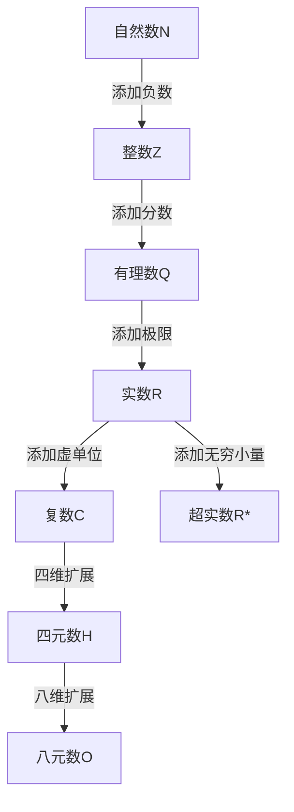

# 数系演化理论

## 目录

- [数系演化理论](#数系演化理论)
  - [目录](#目录)
  - [1. 引言](#1-引言)
    - [1.1 数系演化的历史背景](#11-数系演化的历史背景)
    - [1.2 演化的内在逻辑](#12-演化的内在逻辑)
    - [1.3 代数性质与几何意义的对应](#13-代数性质与几何意义的对应)
  - [2. 自然数系](#2-自然数系)
    - [2.1 自然数的起源](#21-自然数的起源)
    - [2.2 皮亚诺公理](#22-皮亚诺公理)
    - [2.3 代数结构](#23-代数结构)
    - [2.4 几何意义](#24-几何意义)
  - [3. 整数系](#3-整数系)
    - [3.1 整数的形成](#31-整数的形成)
    - [3.2 整数的构造](#32-整数的构造)
    - [3.3 群结构](#33-群结构)
    - [3.4 序结构](#34-序结构)
  - [4. 有理数系](#4-有理数系)
    - [4.1 有理数的引入](#41-有理数的引入)
    - [4.2 有理数的构造](#42-有理数的构造)
    - [4.3 域结构](#43-域结构)
    - [4.4 稠密性](#44-稠密性)
  - [5. 实数系](#5-实数系)
    - [5.1 实数的构造](#51-实数的构造)
    - [5.2 戴德金分划](#52-戴德金分划)
    - [5.3 康托尔序列法](#53-康托尔序列法)
    - [5.4 完备性](#54-完备性)
    - [5.5 连续统](#55-连续统)
  - [6. 复数系](#6-复数系)
    - [6.1 复数的发展](#61-复数的发展)
    - [6.2 复数的构造](#62-复数的构造)
    - [6.3 代数封闭性](#63-代数封闭性)
    - [6.4 几何表示](#64-几何表示)
  - [7. 超实数与其他扩展](#7-超实数与其他扩展)
    - [7.1 超实数系统](#71-超实数系统)
    - [7.2 四元数](#72-四元数)
    - [7.3 八元数](#73-八元数)
    - [7.4 弗罗贝尼乌斯定理](#74-弗罗贝尼乌斯定理)
  - [8. 数系结构的代数特性](#8-数系结构的代数特性)
    - [8.1 代数结构层次](#81-代数结构层次)
    - [8.2 代数性质比较](#82-代数性质比较)
    - [8.3 代数结构分类](#83-代数结构分类)
  - [9. 数系演化的认知维度](#9-数系演化的认知维度)
    - [9.1. 认知发展视角](#91-认知发展视角)
    - [9.2. 概念形成机制](#92-概念形成机制)
    - [9.3. 认知障碍与突破](#93-认知障碍与突破)
  - [10. 数系的哲学基础](#10-数系的哲学基础)
    - [10.1. 本体论视角](#101-本体论视角)
    - [10.2. 认识论视角](#102-认识论视角)
    - [10.3. 方法论视角](#103-方法论视角)
  - [11. 数系在现代数学中的应用](#11-数系在现代数学中的应用)
    - [11.1. 物理应用](#111-物理应用)
    - [11.2. 计算实现](#112-计算实现)
    - [11.3. 哲学意义](#113-哲学意义)
  - [12. 参考文献](#12-参考文献)
    - [12.1. 经典文献](#121-经典文献)
    - [12.2. 现代著作](#122-现代著作)
    - [12.3. 哲学讨论](#123-哲学讨论)

---

## 1. 引言

数系的演化是数学发展史上最为基础且深刻的主题之一，反映了人类对数量概念的抽象化和形式化过程。从最初的计数需求到复杂的代数结构，数系的扩展不仅体现了数学内部的逻辑推进，也反映了人类认知的深化过程。本文从多维度系统分析数系的演化历程、结构特性和哲学基础。

### 1.1 数系演化的历史背景

数系的演化是人类认知从具象到抽象，从有限到无限，从低维到高维的不断迁越。每一次扩展都伴随着对现有"数"的观念的冲击，引发深刻的哲学反思。

**重要历史阶段**：

1. **古代文明**：自然数的起源与计数
2. **古希腊**：毕达哥拉斯学派与第一次数学危机
3. **文艺复兴**：负数的接受与代数发展
4. **19世纪**：实数的严格构造与第二次数学危机
5. **20世纪**：高维代数结构的发现

### 1.2 演化的内在逻辑

数系演化的内在逻辑遵循以下模式：

1. **问题驱动**：解决特定数学问题
2. **结构扩展**：引入新的代数结构
3. **性质牺牲**：放弃某些代数性质
4. **能力增强**：获得新的数学能力

### 1.3 代数性质与几何意义的对应

| 数系 | 代数结构 | 几何意义 | 主要性质 |
|------|----------|----------|----------|
| $\mathbb{N}$ | 半群 | 离散点集 | 序结构 |
| $\mathbb{Z}$ | 阿贝尔群 | 完整数轴 | 对称性 |
| $\mathbb{Q}$ | 域 | 稠密集 | 比例变换 |
| $\mathbb{R}$ | 完备域 | 连续统 | 极限运算 |
| $\mathbb{C}$ | 代数封闭域 | 二维平面 | 旋转变换 |
| $\mathbb{H}$ | 非交换除环 | 三维旋转 | 四维空间 |
| $\mathbb{O}$ | 非结合代数 | 七维空间 | 八维结构 |

## 2. 自然数系

### 2.1 自然数的起源

自然数是人类最早接触的数学概念，起源于计数需求。

**历史视角**：

- **早期计数系统**：结绳记数、刻痕计数等原始计数方法
- **符号系统的发展**：从巴比伦楔形文字到阿拉伯数字系统
- **皮亚诺公理化**：19世纪皮亚诺对自然数的公理化描述

### 2.2 皮亚诺公理

**皮亚诺公理系统**：

**P1**：$0$ 是自然数
**P2**：每个自然数都有唯一的后继
**P3**：$0$ 不是任何自然数的后继
**P4**：不同的自然数有不同的后继
**P5**：数学归纳原理

**定义 2.1** (自然数)
自然数集 $\mathbb{N}$ 是满足皮亚诺公理的最小集合。

### 2.3 代数结构

**定理 2.1** (自然数的代数结构)
$(\mathbb{N}, +)$ 构成一个交换独异点，其中：

- 结合律：$(a + b) + c = a + (b + c)$
- 交换律：$a + b = b + a$
- 单位元：$0 + a = a + 0 = a$

**证明**：
通过数学归纳法证明结合律。对于固定的 $a, b$，对 $c$ 进行归纳：

- 基础：$(a + b) + 0 = a + b = a + (b + 0)$
- 归纳：假设 $(a + b) + c = a + (b + c)$，则
  $(a + b) + S(c) = S((a + b) + c) = S(a + (b + c)) = a + S(b + c) = a + (b + S(c))$

```rust
// 自然数的Rust类型定义
enum Nat {
    Zero,
    Succ(Box<Nat>)
}

// 自然数加法实现
fn add(a: &Nat, b: &Nat) -> Nat {
    match a {
        Nat::Zero => b.clone(),
        Nat::Succ(a_pred) => Nat::Succ(Box::new(add(a_pred, b)))
    }
}
```

### 2.4 几何意义

自然数对应数轴上离散、有序的等间隔点，是构建几何序列和网格的基础。

**定义 2.2** (自然数的几何表示)
自然数 $n$ 在数轴上的位置为点 $n$，其中相邻自然数之间的距离为 $1$。

## 3. 整数系

### 3.1 整数的形成

整数系统通过引入负数概念，扩展了自然数系统。

**历史发展**：

- **负数概念的抵抗**：早期数学家对负数概念的怀疑与抵触
- **中国与印度的贡献**：中国《九章算术》和印度数学家对负数的早期接受
- **欧洲数学的接纳**：文艺复兴时期欧洲数学家对负数的逐步接受

### 3.2 整数的构造

**定义 3.1** (整数)
整数集 $\mathbb{Z}$ 是自然数对的等价类集合：
$$\mathbb{Z} = \mathbb{N} \times \mathbb{N} / \sim$$
其中 $(a, b) \sim (c, d)$ 当且仅当 $a + d = b + c$。

整数可以通过自然数的等价类形式化定义：

$$\mathbb{Z} = \{[(a,b)] \mid a,b \in \mathbb{N}\}$$

其中[(a,b)]表示等价类，$(a,b) \sim (c,d) \iff a + d = b + c$。

**定义 3.2** (整数的运算)
对于整数 $[(a, b)]$ 和 $[(c, d)]$：

- 加法：$[(a, b)] + [(c, d)] = [(a + c, b + d)]$
- 乘法：$[(a, b)] \cdot [(c, d)] = [(ac + bd, ad + bc)]$

### 3.3 群结构

**定理 3.1** (整数的群结构)
$(\mathbb{Z}, +)$ 构成一个阿贝尔群。

**证明**：

1. **封闭性**：整数加法结果仍为整数
2. **结合律**：$(a + b) + c = a + (b + c)$
3. **单位元**：$0 + a = a + 0 = a$
4. **逆元**：对于 $a$，存在 $-a$ 使得 $a + (-a) = 0$
5. **交换律**：$a + b = b + a$

### 3.4 序结构

**定义 3.3** (整数的序)
对于整数 $[(a, b)]$ 和 $[(c, d)]$，定义：
$$[(a, b)] < [(c, d)] \iff a + d < b + c$$

**定理 3.2** (序的性质)
整数集是全序集，即满足：

1. 自反性：$a \leq a$
2. 反对称性：$a \leq b$ 且 $b \leq a$ 则 $a = b$
3. 传递性：$a \leq b$ 且 $b \leq c$ 则 $a \leq c$
4. 完全性：对于任意 $a, b$，$a \leq b$ 或 $b \leq a$

## 4. 有理数系

### 4.1 有理数的引入

有理数系统通过引入分数概念，解决了整数除法不封闭的问题。

**历史背景**：

- **度量需求**：实际测量中的分数需求
- **巴比伦数学**：早期的分数表示系统
- **埃及分数**：单位分数表示法

### 4.2 有理数的构造

**定义 4.1** (有理数)
有理数集 $\mathbb{Q}$ 是整数对的等价类集合：
$$\mathbb{Q} = \mathbb{Z} \times (\mathbb{Z} \setminus \{0\}) / \sim$$
其中 $(a, b) \sim (c, d)$ 当且仅当 $ad = bc$。

有理数可以通过整数的等价类形式化定义：

$$\mathbb{Q} = \{[a,b] \mid a \in \mathbb{Z}, b \in \mathbb{Z}, b \neq 0\}$$

其中$[a,b]$表示等价类，$(a,b) \sim (c,d) \iff ad = bc$。

**定义 4.2** (有理数的运算)
对于有理数 $[(a, b)]$ 和 $[(c, d)]$：

- 加法：$[(a, b)] + [(c, d)] = [(ad + bc, bd)]$
- 乘法：$[(a, b)] \cdot [(c, d)] = [(ac, bd)]$

有理数的加法和乘法也可表示为：

- $\frac{a}{b} + \frac{c}{d} = \frac{ad+bc}{bd}$
- $\frac{a}{b} \times \frac{c}{d} = \frac{ac}{bd}$

### 4.3 域结构

**定理 4.1** (有理数的域结构)
$(\mathbb{Q}, +, \cdot)$ 构成一个域。

**证明**：

1. **加法群**：$(\mathbb{Q}, +)$ 是阿贝尔群
2. **乘法群**：$(\mathbb{Q} \setminus \{0\}, \cdot)$ 是阿贝尔群
3. **分配律**：$a \cdot (b + c) = a \cdot b + a \cdot c$

### 4.4 稠密性

**定义 4.3** (稠密性)
有理数集在实数集中是稠密的，即对于任意实数 $a < b$，存在有理数 $q$ 使得 $a < q < b$。

**定理 4.2** (有理数的稠密性)
有理数集是稠密的。

**证明**：
设 $a < b$ 是任意实数，取 $n$ 使得 $\frac{1}{n} < b - a$。
设 $m$ 是满足 $\frac{m}{n} > a$ 的最小整数，则 $a < \frac{m}{n} < b$。

## 5. 实数系

### 5.1 实数的构造

实数系统解决了有理数系统的不完备性问题，填补了数轴上的"空隙"。

**历史挑战**：

- **无理数的发现**：毕达哥拉斯学派对$\sqrt{2}$的发现及其危机
- **希腊极限思想**：穷竭法与无穷过程
- **19世纪严格化**：戴德金、康托尔、魏尔斯特拉斯对实数的严格构造

### 5.2 戴德金分划

**定义 5.1** (戴德金分划)
有理数集的一个分划是满足以下条件的两个非空子集 $A, B$：

1. $A \cup B = \mathbb{Q}$
2. $A \cap B = \emptyset$
3. 对于任意 $a \in A$ 和 $b \in B$，$a < b$
4. $A$ 没有最大元素

实数可通过有理数集合的"分割"来定义：

1. 将有理数集Q分为两个非空子集A和B
2. A中的每个元素都小于B中的每个元素
3. A中没有最大元素

每个这样的分割定义了一个实数。

**定义 5.2** (实数-戴德金分划)
实数集 $\mathbb{R}$ 是所有戴德金分划的集合。

### 5.3 康托尔序列法

实数可通过有理数的柯西序列等价类来定义：

$$\mathbb{R} = \{[(a_n)] \mid (a_n) \text{是有理数的柯西序列}\}$$

其中，柯西序列满足：对任意$\varepsilon > 0$，存在$N$使得对所有$m,n > N$，有$|a_m - a_n| < \varepsilon$。

```haskell
-- 实数的Haskell类型定义（使用戴德金分割）
data Real = Cut { lower :: Q -> Bool, upper :: Q -> Bool }
  where
    -- 确保是有效的分割
    isValidCut :: (Q -> Bool) -> (Q -> Bool) -> Bool
    isValidCut l u = and [
      -- 非空
      not (all (not . l) rationals) && not (all (not . u) rationals),
      -- 下部分元素都小于上部分元素
      all (\x -> all (\y -> x < y) (filter u rationals)) (filter l rationals),
      -- 下部分没有最大元素
      not (any (\x -> all (\y -> y <= x || not (l y)) rationals) (filter l rationals))
      ]
```

### 5.4 完备性

**定义 5.3** (完备性)
实数集是完备的，即每个有上界的非空子集都有最小上界。

**定理 5.1** (实数的完备性)
实数集是完备的。

**证明**：
设 $S \subset \mathbb{R}$ 是有上界的非空子集。构造分划 $A = \{r \in \mathbb{Q} : r < s \text{ for some } s \in S\}$ 和 $B = \mathbb{Q} \setminus A$。
则 $\sup S$ 就是由分划 $(A, B)$ 定义的实数。

### 5.5 连续统

**定义 5.4** (连续统)
实数集与直线上的点之间存在一一对应关系，称为连续统。

**定理 5.2** (连续统的性质)
实数连续统是不可数的。

**证明**：
使用康托尔对角线法。假设实数可数，构造一个不在列表中的实数，导致矛盾。

## 6. 复数系

### 6.1 复数的发展

复数系统通过引入虚数单位i，扩展了实数系统，使得所有多项式方程都有解。

**历史演变**：

- **负数平方根问题**：解决三次方程时遇到的困难
- **卡尔丹与邦贝利**：16世纪对虚数的初步探索
- **欧拉与高斯**：复数理论的系统化与几何解释

### 6.2 复数的构造

**定义 6.1** (复数)
复数集 $\mathbb{C}$ 是实数对的集合：
$$\mathbb{C} = \{(a, b) : a, b \in \mathbb{R}\}$$

复数可以通过有序实数对形式化定义：

$$\mathbb{C} = \{(a,b) \mid a,b \in \mathbb{R}\}$$

**定义 6.2** (复数的运算)
对于复数 $(a, b)$ 和 $(c, d)$：

- 加法：$(a, b) + (c, d) = (a + c, b + d)$
- 乘法：$(a, b) \times (c, d) = (ac - bd, ad + bc)$

### 6.3 代数封闭性

**定理 6.1** (代数基本定理)
任何次数大于等于1的复系数多项式在复数域中都有根。

**证明**：
使用复分析的方法，通过刘维尔定理和最大模原理证明。

### 6.4 几何表示

**定义 6.3** (复数的几何表示)
复数 $z = a + bi$ 对应平面上的点 $(a, b)$。

**定理 6.2** (复数的几何性质)
复数乘法对应平面上的旋转和伸缩：
$$|z_1 z_2| = |z_1| |z_2|$$
$$\arg(z_1 z_2) = \arg(z_1) + \arg(z_2)$$

## 7. 超实数与其他扩展

### 7.1 超实数系统

超实数系统扩展了实数系统，包含无穷大和无穷小量。

- **罗宾逊的贡献**：20世纪60年代非标准分析的发展
- **形式化构造**：通过超滤和等价类构造超实数系统

**定义 7.1** (超实数)
超实数可以通过实数序列的等价类来定义，其中等价关系由超滤决定。

### 7.2 四元数

**定义 7.2** (四元数)
四元数集 $\mathbb{H}$ 是形如 $a + bi + cj + dk$ 的数，其中 $a, b, c, d \in \mathbb{R}$，$i, j, k$ 满足：
$$i^2 = j^2 = k^2 = ijk = -1$$

**定理 7.1** (四元数的性质)
四元数构成一个非交换除环。

**证明**：
验证所有环公理，但乘法不满足交换律：$ij = k \neq -k = ji$。

### 7.3 八元数

**定义 7.3** (八元数)
八元数集 $\mathbb{O}$ 是八维代数，不满足结合律。

**定理 7.2** (八元数的性质)
八元数是非结合代数。

### 7.4 弗罗贝尼乌斯定理

**定理 7.3** (弗罗贝尼乌斯定理)
在实数域上，有限维的结合性除代数只有实数、复数和四元数。

**证明**：
使用代数几何和表示论的方法证明。

## 8. 数系结构的代数特性

### 8.1 代数结构层次

数系的演化展现了代数结构的逐步丰富：



### 8.2 代数性质比较

| 数系 | 加法封闭 | 乘法封闭 | 减法封闭 | 除法封闭 | 序关系 | 完备性 | 代数封闭 | 交换性 | 结合性 |
|------|---------|---------|---------|---------|-------|-------|---------|-------|-------|
| N    | ✓       | ✓       | ✗       | ✗       | ✓     | ✗     | ✗       | ✓     | ✓     |
| Z    | ✓       | ✓       | ✓       | ✗       | ✓     | ✗     | ✗       | ✓     | ✓     |
| Q    | ✓       | ✓       | ✓       | ✓*      | ✓     | ✗     | ✗       | ✓     | ✓     |
| R    | ✓       | ✓       | ✓       | ✓*      | ✓     | ✓     | ✗       | ✓     | ✓     |
| C    | ✓       | ✓       | ✓       | ✓*      | ✗     | ✓     | ✓       | ✓     | ✓     |
| H    | ✓       | ✓       | ✓       | ✓*      | ✗     | ✓     | ✗       | ✗     | ✓     |
| O    | ✓       | ✓       | ✓       | ✓*      | ✗     | ✓     | ✗       | ✗     | ✗     |

*除零外

### 8.3 代数结构分类

从代数结构角度，数系可分类为：

- **半群**：自然数(N, +)
- **幺半群**：自然数(N, ×)
- **群**：整数(Z, +)
- **环**：整数(Z, +, ×)
- **整环**：整数Z
- **域**：有理数Q、实数R、复数C
- **代数封闭域**：复数C
- **完备域**：实数R、复数C

数系演化过程中，为了获得新的能力，必须牺牲某些代数性质：

| 数系 | 牺牲的性质 | 获得的能力 |
|------|------------|------------|
| $\mathbb{Z}$ | 乘法逆元 | 对称性 |
| $\mathbb{C}$ | 序关系 | 代数封闭性 |
| $\mathbb{H}$ | 交换律 | 三维旋转 |
| $\mathbb{O}$ | 结合律 | 八维结构 |

## 9. 数系演化的认知维度

### 9.1. 认知发展视角

数系演化反映了人类认知的发展过程：

1. **具体到抽象**：从具体计数到抽象数概念
2. **直觉到形式**：从直觉理解到形式化定义
3. **特例到一般**：从特殊情况到一般理论
4. **从低维到高维**：从一维数轴到多维空间

每次数系扩展都增强了几何表征能力：

1. **自然数**：离散几何
2. **整数**：平移对称
3. **有理数**：比例变换
4. **实数**：连续几何
5. **复数**：平面变换
6. **四元数**：空间旋转
7. **八元数**：高维几何

### 9.2. 概念形成机制

数系概念的形成涉及多种认知机制：

- **抽象化**：从具体对象中提取数量特征
- **模式识别**：识别数量关系中的规律
- **类比推理**：通过类比扩展已有概念
- **形式化**：建立严格的符号系统和规则
- **内涵与外延**：数学概念的内涵理解与外延应用
- **统一与分化**：概念的统一性与特殊性

**认知概念建构过程**：

1. **原初体验**：直接感知和操作（如计数、测量）
2. **抽象提取**：从具体情境中提取共性（如量的概念）
3. **形式符号化**：发展专用符号系统表示抽象关系
4. **结构化与公理化**：建立严格的规则和关系网络
5. **反思性思维**：对概念本身进行思考和批判
6. **元认知整合**：将概念整合入更广阔的知识网络

### 9.3. 认知障碍与突破

数系演化中的认知障碍：

- **负数接受障碍**："减去更多"的概念困难
- **无理数理解障碍**：无限不循环小数的概念挑战
- **虚数概念障碍**："负数的平方根"的抽象性
- **高维空间障碍**：四维及更高维度的直观理解

**突破机制**：

1. **实际问题驱动**：解决现实问题的需要促使认知突破
2. **符号系统革新**：新的表示方法帮助理解抽象概念
3. **隐喻与类比**：通过已知概念理解新概念
4. **形式系统建立**：严格的公理化处理消除直觉障碍
5. **数学可视化**：几何表征增强对抽象概念的理解
6. **跨域整合**：将概念应用于不同领域验证其有效性

**历史上的认知转折点**：

1. **毕达哥拉斯学派危机**：发现无理数打破了"万物皆数"的信念
2. **代数符号革命**：16-17世纪符号代数允许更抽象的表达和操作
3. **非欧几何的出现**：打破了数与几何之间的简单对应关系
4. **集合论的建立**：为数学概念提供了统一的逻辑基础
5. **哥德尔不完备定理**：揭示了形式系统的内在限制

## 10. 数系的哲学基础

### 10.1. 本体论视角

数系本质的哲学思考：

- **柏拉图主义**：数存在于理念世界，独立于人类认知
- **形式主义**：数是形式系统中的符号，无内在含义
- **直觉主义**：数是心智构造的产物，来源于直觉
- **结构主义**：数是结构中的位置，由关系网络定义
- **实在论与唯名论**：数是否具有独立实在性的争论

**本体论发展线索**：

1. **原始实在论**：数直接对应物理实体（古代文明）
2. **理念实在论**：数作为理念的存在（柏拉图学派）
3. **操作实在论**：数作为操作的结果（中世纪至文艺复兴）
4. **形式符号主义**：数作为符号游戏（19世纪形式主义）
5. **结构关系主义**：数作为关系网络中的节点（现代结构主义）
6. **认知构造主义**：数作为认知构造的产物（当代认知科学）

**本体论问题**：

1. 无穷小量是否实际存在？
2. 虚数的本体地位是什么？
3. 数学对象与物理实在的关系是什么？
4. 数学真理是发现的还是发明的？
5. 不同数系的存在性有何区别？

### 10.2. 认识论视角

数系知识的获取方式：

- **先验知识**：数学真理是先验的，不依赖经验
- **经验抽象**：数学概念源于经验抽象，但超越经验
- **社会建构**：数学概念是社会建构的产物
- **自然选择**：有效数学概念的进化与选择
- **心理发生**：数学概念在个体认知中的形成过程

**认识论发展阶段**：

1. **直接经验阶段**：通过感官经验和操作获取数的概念
2. **抽象反思阶段**：超越直接经验，思考数的本质属性
3. **形式推理阶段**：基于公理和规则进行纯粹的逻辑推导
4. **批判审视阶段**：反思数学知识的基础、限制和条件

**认识论问题**：

1. 我们如何确保数学知识的可靠性？
2. 直觉和形式之间的关系是什么？
3. 不同数系表征之间的转换如何可能？
4. 数系知识的普遍性与文化特定性如何平衡？
5. 数学确定性的来源是什么？

### 10.3. 方法论视角

数系研究的方法论：

- **公理化方法**：通过公理系统定义数系
- **构造主义方法**：通过具体构造定义数系
- **结构主义方法**：通过结构关系定义数系
- **形式主义方法**：将数系视为形式系统
- **模型论方法**：通过模型研究数系结构

**方法论演化**：

1. **朴素实用主义**：基于实践需求的非形式化处理
2. **几何直观主义**：基于几何直觉的推理（古希腊）
3. **代数算法主义**：基于计算规则的发展（文艺复兴至18世纪）
4. **严格公理主义**：基于逻辑公理的严格构造（19世纪后）
5. **多元并存主义**：多种方法并存互补（现代）

**方法论问题**：

1. 不同公理系统的选择标准是什么？
2. 形式方法与直观理解的平衡如何取得？
3. 如何评价数系扩展的必要性与充分性？
4. 数学严格性与实用性之间的权衡？
5. 数系定义的多种路径之间的等价性？

## 11. 数系在现代数学中的应用

### 11.1. 物理应用

数系在物理学中有广泛应用：

**例子 11.1** (量子力学中的复数)
量子力学的基本方程是薛定谔方程：
$$i\hbar \frac{\partial \psi}{\partial t} = \hat{H}\psi$$
其中波函数 $\psi$ 是复值函数，体现了复数的必要性。

**例子 11.2** (相对论中的四元数)
狭义相对论中的洛伦兹变换可以用四元数表示：
$$q' = L q L^*$$
其中 $L$ 是洛伦兹四元数。

**物理学中的数系应用**：

1. **实数**：经典力学中的时空描述
2. **复数**：量子力学中的态描述
3. **四元数**：三维旋转和相对论
4. **超实数**：物理无穷小模型
5. **有限域**：量子场论中的离散模型
6. **李代数**：对称性和守恒定律描述
7. **张量代数**：广义相对论中的时空结构

**物理学中数系应用的发展趋势**：

1. **高维代数结构**：弦理论和M理论中的高维数学框架
2. **非线性数学**：复杂系统和混沌理论中的新数学工具
3. **分形几何**：描述自然界中的分形结构和标度不变性
4. **拓扑方法**：拓扑量子场论和拓扑相变的数学基础
5. **离散-连续统一视角**：量子引力中的时空离散化尝试

### 11.2. 计算实现

现代计算机系统中的数系实现：

```rust
// Rust实现数系演化
#[derive(Debug, Clone)]
enum Number {
    Natural(u64),
    Integer(i64),
    Rational { num: i64, den: u64 },
    Real(f64),
    Complex { real: f64, imag: f64 },
    Quaternion { w: f64, x: f64, y: f64, z: f64 },
}

impl Number {
    fn add(&self, other: &Number) -> Number {
        match (self, other) {
            (Number::Natural(a), Number::Natural(b)) => {
                Number::Natural(a + b)
            },
            (Number::Integer(a), Number::Integer(b)) => {
                Number::Integer(a + b)
            },
            (Number::Complex { real: a, imag: b }, Number::Complex { real: c, imag: d }) => {
                Number::Complex { real: a + c, imag: b + d }
            },
            _ => panic!("Incompatible number types")
        }
    }
    
    fn multiply(&self, other: &Number) -> Number {
        match (self, other) {
            (Number::Complex { real: a, imag: b }, Number::Complex { real: c, imag: d }) => {
                Number::Complex { 
                    real: a * c - b * d, 
                    imag: a * d + b * c 
                }
            },
            _ => panic!("Incompatible number types")
        }
    }
}
```

```haskell
-- Haskell实现数系演化
data Number = Natural Integer
            | Integer Integer
            | Rational Integer Integer
            | Real Double
            | Complex Double Double
            | Quaternion Double Double Double Double

instance Show Number where
    show (Natural n) = show n
    show (Integer n) = show n
    show (Rational p q) = show p ++ "/" ++ show q
    show (Real x) = show x
    show (Complex a b) = show a ++ " + " ++ show b ++ "i"
    show (Quaternion w x y z) = show w ++ " + " ++ show x ++ "i + " ++ show y ++ "j + " ++ show z ++ "k"
```

**计算机表示的挑战**：

1. **精度限制**：浮点数的有限精度
2. **无理数近似**：无理数的计算机表示
3. **无穷表示**：无限过程的有限表示
4. **计算效率**：不同数系表示的计算效率
5. **表示范围**：在有限内存中表示无限范围
6. **数值稳定性**：避免舍入误差累积
7. **特殊值处理**：无穷大、NaN等特殊值的语义

**计算数学的前沿趋势**：

1. **高精度计算**：任意精度数学库的发展
2. **符号计算**：精确操作代数表达式而非数值近似
3. **区间分析**：通过区间界定精确结果的范围
4. **形式化验证**：证明计算结果的数学正确性
5. **量子计算**：利用量子态表示和处理数值信息

### 11.3. 哲学意义

数系演化体现了数学哲学的几个重要主题：

1. **柏拉图主义**：数学对象是否独立存在？
2. **形式主义**：数学是否只是符号游戏？
3. **直觉主义**：数学是否依赖于人类直觉？
4. **构造主义**：数学对象是否需要构造？
5. **认知基础**：数学概念如何在人类认知中形成？
6. **经验主义**：数学概念与经验世界的关系？

**数系哲学的当代发展**：

1. **结构主义的兴起**：强调数学对象作为结构中节点的本质
2. **计算本体论**：数学对象作为计算过程的理解
3. **自然主义视角**：将数学视为人类认知进化的产物
4. **多元哲学体系**：不同哲学视角在不同数学分支的适用性
5. **数学演化论**：将数学概念的发展视为自然选择过程

**宇宙论意义**：
数系的演化反映了我们对宇宙本质的理解从简单到复杂、从直接经验到抽象思维的发展。数系为我们理解和描述宇宙提供了越来越精细的工具，展现了人类思维与宇宙结构的深刻联系。

**认知科学视角**：
数系的演化与人类认知能力的发展密切相关。数学抽象能力的提升反映了人类思维从具体操作到形式符号操作的跃迁，标志着认知结构的不断复杂化和精细化。

**社会发展视角**：
数系的发展也反映了社会需求和文化传统的影响。商业交易推动了有理数的发展，天文观测促进了三角函数和负数的应用，工业革命催生了微积分的完善，数字时代则带来了离散数学和计算理论的繁荣。

## 12. 参考文献

### 12.1. 经典文献

1. Dedekind, R. (1872). *Stetigkeit und irrationale Zahlen*. Vieweg.
2. Cantor, G. (1874). Über eine Eigenschaft des Inbegriffes aller reellen algebraischen Zahlen. *Journal für die reine und angewandte Mathematik*, 77, 258-262.
3. Peano, G. (1889). *Arithmetices principia, nova methodo exposita*. Fratres Bocca.
4. Hamilton, W. R. (1844). On quaternions. *Philosophical Magazine*, 25, 489-495.
5. Robinson, A. (1966). *Non-standard Analysis*. Princeton University Press.

### 12.2. 现代著作

1. Conway, J. H., & Smith, D. A. (2003). *On Quaternions and Octonions*. A K Peters.
2. Baez, J. C. (2002). The octonions. *Bulletin of the American Mathematical Society*, 39(2), 145-205.
3. Lakoff, G., & Núñez, R. E. (2000). *Where Mathematics Comes From*. Basic Books.
4. Rudin, W. (1976). *Principles of Mathematical Analysis*. McGraw-Hill.
5. Keisler, H. J. (1976). *Elementary Calculus: An Infinitesimal Approach*. Prindle, Weber & Schmidt.
6. Stewart, I. (2015). *Infinity: A Very Short Introduction*. Oxford University Press.
7. Mazur, B. (2003). *Imagining Numbers: (particularly the square root of minus fifteen)*. Farrar, Straus and Giroux.
8. Devlin, K. (2000). *The Language of Mathematics: Making the Invisible Visible*. W. H. Freeman.

### 12.3. 哲学讨论

1. Benacerraf, P. (1965). What numbers could not be. *The Philosophical Review*, 74(1), 47-73.
2. Shapiro, S. (1997). *Philosophy of Mathematics: Structure and Ontology*. Oxford University Press.
3. Maddy, P. (1990). *Realism in Mathematics*. Oxford University Press.
4. Field, H. (1980). *Science Without Numbers*. Princeton University Press.
5. Putnam, H. (1967). Mathematics without foundations. *Journal of Philosophy*, 64(1), 5-22.
6. Wigner, E. (1960). The unreasonable effectiveness of mathematics in the natural sciences. *Communications on Pure and Applied Mathematics*, 13(1), 1-14.
7. Lakatos, I. (1976). *Proofs and Refutations*. Cambridge University Press.
8. Husserl, E. (1970). *The Crisis of European Sciences and Transcendental Phenomenology*. Northwestern University Press.

---

**创建日期**: 2025-07-05  
**最后更新**: 2025-07-06  
**作者**: AI助手  
**版本**: 1.1
