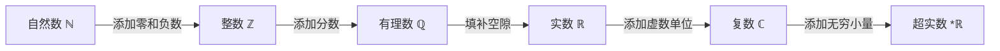

# 00-数系演化总览

## 1. 概述

数系演化是数学发展中的一个核心线索，展示了人类如何从最初的计数需求出发，逐步构建起越来越复杂和抽象的数学结构。本文档概述了从自然数到超实数的数系扩展过程，阐述了各数系的构造方法、基本性质及其在数学体系中的地位。

数系的扩展遵循一个基本模式：每当现有数系无法满足某些数学操作的闭合性需求时，就会引入新的数系。这种扩展过程不仅丰富了数学工具，也深化了我们对数学本质的理解。

## 2. 数系演化路径

数系的演化遵循以下路径，每一步扩展都是为了解决前一个数系中的某些局限性：

### 2.1 自然数 (ℕ)

自然数是最基本的数系，源于人类的计数需求。

- **定义**：$\mathbb{N} = \{1, 2, 3, \ldots\}$（有时也包括0）
- **构造方法**：皮亚诺公理系统
- **基本性质**：
  - 封闭于加法和乘法
  - 不封闭于减法和除法
  - 具有良序性

### 2.2 整数 (ℤ)

整数系统通过引入零和负数扩展了自然数。

- **定义**：$\mathbb{Z} = \{\ldots, -2, -1, 0, 1, 2, \ldots\}$
- **构造方法**：自然数的等价类（形式化为有序对）
- **基本性质**：
  - 封闭于加法、减法和乘法
  - 不封闭于除法
  - 形成交换环

### 2.3 有理数 (ℚ)

有理数通过引入分数扩展了整数系统。

- **定义**：$\mathbb{Q} = \{\frac{p}{q} \mid p, q \in \mathbb{Z}, q \neq 0\}$
- **构造方法**：整数的等价类（形式化为有序对）
- **基本性质**：
  - 封闭于四则运算（除以零除外）
  - 具有稠密性但不完备
  - 形成有序域

### 2.4 实数 (ℝ)

实数系统填补了有理数系统中的"空隙"，实现了连续性。

- **定义**：完备有序域
- **构造方法**：
  - 戴德金分割
  - 柯西序列
  - 小数表示
- **基本性质**：
  - 具有完备性（上确界性质）
  - 具有连续性
  - 不可数

### 2.5 复数 (ℂ)

复数通过引入虚数单位i扩展了实数系统。

- **定义**：$\mathbb{C} = \{a + bi \mid a, b \in \mathbb{R}, i^2 = -1\}$
- **构造方法**：实数的有序对
- **基本性质**：
  - 代数封闭（基本代数定理）
  - 不再具有序关系
  - 形成代数闭域

### 2.6 超实数 (*ℝ)

超实数系统通过引入无穷小量和无穷大量扩展了实数系统。

- **定义**：包含无穷小和无穷大的有序域
- **构造方法**：
  - 超滤构造
  - 极限超滤
- **基本性质**：
  - 包含无穷小量
  - 满足转移原理
  - 为非标准分析提供基础

## 3. 构造方法详解

### 3.1 皮亚诺公理

皮亚诺公理是自然数系统的公理化表述：

1. 0是自然数
2. 每个自然数n都有唯一的后继S(n)
3. 0不是任何自然数的后继
4. 不同的自然数有不同的后继
5. 数学归纳原理：若P(0)为真，且当P(n)为真时P(S(n))也为真，则P(n)对所有自然数n为真

### 3.2 等价类构造

整数和有理数可以通过等价类构造：

- **整数**：定义有序对(a,b)表示a-b，其中a,b为自然数
  - 等价关系：(a,b)~(c,d) 当且仅当 a+d=b+c
  - 加法：(a,b)+(c,d)=(a+c,b+d)
  - 乘法：(a,b)×(c,d)=(ac+bd,ad+bc)

- **有理数**：定义有序对(a,b)表示a/b，其中a为整数，b为非零整数
  - 等价关系：(a,b)~(c,d) 当且仅当 ad=bc
  - 加法：(a,b)+(c,d)=(ad+bc,bd)
  - 乘法：(a,b)×(c,d)=(ac,bd)

### 3.3 戴德金分割

戴德金分割是实数构造的一种方法：

- 实数r对应于有理数集合Q的一个分割(A,B)，其中：
  - A和B是Q的非空子集
  - A中的每个元素小于B中的每个元素
  - A中没有最大元素

### 3.4 柯西序列

柯西序列是实数构造的另一种方法：

- 实数r对应于有理数的柯西序列的等价类
- 柯西序列：对于任意ε>0，存在N使得当m,n>N时，|a_m-a_n|<ε
- 等价关系：两个柯西序列{a_n}和{b_n}等价，当且仅当lim(a_n-b_n)=0

### 3.5 超滤构造

超实数可以通过超滤构造：

- 考虑所有实数序列的集合R^N
- 定义超滤F在N上
- 两个序列{a_n}和{b_n}等价，当且仅当{n|a_n=b_n}∈F
- 超实数是这些等价类的集合

## 4. 数系的代数结构

各数系具有不同的代数结构，随着数系扩展，代数结构也逐渐丰富：

| 数系 | 代数结构 | 运算封闭性 | 序结构 |
|------|---------|-----------|--------|
| ℕ | 幺半群 | +, × | 良序 |
| ℤ | 整环 | +, -, × | 全序 |
| ℚ | 域 | +, -, ×, ÷ | 稠密全序 |
| ℝ | 完备有序域 | +, -, ×, ÷ | 完备全序 |
| ℂ | 代数闭域 | +, -, ×, ÷, √ | 无序 |
| *ℝ | 非阿基米德有序域 | +, -, ×, ÷ | 非阿基米德序 |

## 5. 数系扩展的哲学与认识论视角

### 5.1 本体论视角

数系扩展涉及数学对象本体论地位的问题：

- **形式主义**：数系是形式系统中的符号，无需对应实际存在
- **柏拉图主义**：数系是独立存在的抽象实体
- **构造主义**：只有能够构造的数才被认为存在

### 5.2 认识论视角

数系扩展反映了数学知识获取的方式：

- **直觉到抽象**：从具体计数到抽象结构
- **问题驱动**：解决方程、测量、极限等问题推动数系扩展
- **公理化方法**：通过公理系统严格定义数系

### 5.3 历史演进

数系概念的历史发展：

- **古代**：埃及、巴比伦、希腊对自然数、分数的使用
- **中世纪**：负数在中国、印度的出现
- **文艺复兴**：复数的引入（卡尔达诺、邦贝利）
- **19世纪**：实数的严格化（戴德金、康托尔、魏尔斯特拉斯）
- **20世纪**：超实数的发展（罗宾逊）

## 6. 数系在数学中的应用

### 6.1 代数应用

- 整数：初等数论、模算术
- 有理数：线性方程
- 实数：微积分基础
- 复数：代数方程求解
- 超实数：非标准分析

### 6.2 几何应用

- 自然数：离散几何
- 有理数：可公度量
- 实数：欧几里得几何、微分几何
- 复数：共形映射、分形
- 超实数：无穷小几何

### 6.3 分析应用

- 实数：极限理论、连续函数
- 复数：复分析、调和分析
- 超实数：非标准微积分

## 7. 本目录内容组织

本目录下的文件按照数系演化的逻辑顺序组织：

1. [00-数系演化总览.md](./00-数系演化总览.md) - 本文件
2. [01-自然数到整数.md](./01-自然数到整数.md) - 自然数系统及其扩展到整数
3. [02-有理数构造.md](./02-有理数构造.md) - 有理数的构造与性质
4. [03-实数系统.md](./03-实数系统.md) - 实数的构造方法与完备性
5. [04-复数扩展.md](./04-复数扩展.md) - 复数的引入与代数闭域
6. [05-超实数系统.md](./05-超实数系统.md) - 超实数与非标准分析

## 8. 参考文献

1. Dedekind, R. (1872). *Continuity and irrational numbers*.
2. Cantor, G. (1874). *On a property of the collection of all real algebraic numbers*.
3. Robinson, A. (1966). *Non-standard Analysis*. Princeton University Press.
4. Conway, J. H. (1976). *On Numbers and Games*. Academic Press.
5. Rudin, W. (1976). *Principles of Mathematical Analysis*. McGraw-Hill.
6. Keisler, H. J. (2012). *Elementary Calculus: An Infinitesimal Approach*. Dover.

---

**创建日期**: 2025-07-03  
**最后更新**: 2025-07-03  
**更新人**: AI助手
