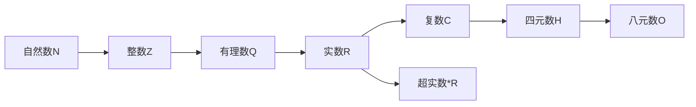

# 数系演化理论总览

## 1. 概述

数系演化理论研究数学中各种数系的发展历程、内在结构和本体论基础。从最初的计数需求到抽象的代数结构，数系的演化反映了人类数学思维的深化过程和对自然界认知的不断拓展。

### 1.1 研究意义

- **认识论价值**：揭示人类对数量概念的认知发展
- **数学基础**：为分析学、代数学等提供基本对象
- **哲学意义**：探讨数学对象的本体论地位
- **应用价值**：不同数系满足不同的应用需求

### 1.2 核心问题

1. 各数系的形式化定义与构造方法
2. 数系间的扩张关系与同构嵌入
3. 不同数系的代数结构与序结构
4. 数系的完备性与连续性
5. 超实数系统的逻辑基础与应用

## 2. 数系演化路径

### 2.1 基本演化链



### 2.2 扩张动机

- **自然数→整数**：解决减法封闭性问题
- **整数→有理数**：解决除法封闭性问题
- **有理数→实数**：解决连续性/完备性问题
- **实数→复数**：解决代数封闭性问题
- **实数→超实数**：形式化无穷小量概念
- **复数→四元数→八元数**：拓展到高维代数结构

## 3. 主要数系分析

### 3.1 自然数系 (N)

- **定义**：从1（或0）开始的计数数集
- **构造**：皮亚诺公理系统
- **结构**：
  - 代数：半环结构
  - 序：良序集
- **特性**：
  - 离散性
  - 归纳原理
  - 算术基本定理

### 3.2 整数系 (Z)

- **定义**：包含正数、负数和零的数集
- **构造**：自然数的等价类构造
- **结构**：
  - 代数：整环结构
  - 序：全序集
- **特性**：
  - 加法逆元
  - 欧几里得算法
  - 唯一因式分解

### 3.3 有理数系 (Q)

- **定义**：可表示为两整数之比的数集
- **构造**：整数的分数等价类
- **结构**：
  - 代数：域结构
  - 序：稠密全序集
- **特性**：
  - 乘法逆元
  - 稠密性
  - 可数性

### 3.4 实数系 (R)

- **定义**：连续统上的点集
- **构造**：
  - 戴德金分割法
  - 柯西序列法
  - 小数表示法
- **结构**：
  - 代数：完备有序域
  - 序：连续全序集
  - 拓扑：连通完备度量空间
- **特性**：
  - 完备性
  - 阿基米德性
  - 不可数性

### 3.5 复数系 (C)

- **定义**：形如a+bi的数（i²=-1）
- **构造**：实数对的代数结构
- **结构**：
  - 代数：代数闭域
  - 拓扑：连通完备度量空间
- **特性**：
  - 代数封闭性
  - 无序性
  - 共形映射

### 3.6 超实数系 (*R)

- **定义**：包含无穷大和无穷小量的扩展实数系
- **构造**：实数序列的超滤子构造
- **结构**：
  - 代数：非阿基米德有序域
  - 序：包含无穷元素的全序集
- **特性**：
  - 包含无穷小量
  - 传递原理
  - 标准部分映射

## 4. 数系的多维表征

### 4.1 代数表征

数系可通过其代数结构进行分类：

| 数系 | 代数结构 | 运算封闭性 |
|------|---------|-----------|
| N    | 半环    | +, × |
| Z    | 整环    | +, −, × |
| Q    | 域     | +, −, ×, ÷ |
| R    | 完备有序域 | +, −, ×, ÷, sup |
| C    | 代数闭域 | +, −, ×, ÷, √, 方程求根 |
| *R   | 非阿基米德有序域 | +, −, ×, ÷, sup, inf |

### 4.2 序结构表征

数系的序结构特性：

| 数系 | 序结构 | 特性 |
|------|-------|------|
| N    | 良序  | 每个非空子集有最小元 |
| Z    | 全序  | 任意两元素可比较 |
| Q    | 稠密全序 | 任意两不同元素间有元素 |
| R    | 连续全序 | 完备性，无空隙 |
| C    | 无序  | 不存在与复数运算相容的序 |
| *R   | 非阿基米德全序 | 存在无穷小元素 |

### 4.3 拓扑表征

数系的拓扑性质：

| 数系 | 拓扑特性 | 完备性 |
|------|---------|-------|
| N    | 离散空间 | 完备 |
| Z    | 离散空间 | 完备 |
| Q    | 稠密不完备 | 不完备 |
| R    | 连通完备 | 完备 |
| C    | 连通完备 | 完备 |
| *R   | 超拓扑结构 | 超完备 |

## 5. 数系构造的形式化方法

### 5.1 集合论构造

- **整数**：自然数对的等价类 $(a,b) \sim (c,d) \iff a+d=b+c$
- **有理数**：整数对的等价类 $(a,b) \sim (c,d) \iff ad=bc, b,d \neq 0$
- **实数**：有理数柯西序列的等价类或戴德金分割

### 5.2 代数构造

- **复数**：实数多项式环模$x^2+1$的商环
- **四元数**：复数的非交换扩张
- **八元数**：四元数的非结合扩张

### 5.3 逻辑构造

- **超实数**：实数序列模超滤子的等价类
- **超有理数**：有理数序列模超滤子的等价类

## 6. 本目录内容组织

```text
01-数系演化理论/
├── 00-数系演化理论总览.md          # 本文件
├── 01-从自然数到实数.md            # 自然数、整数、有理数、实数的演化
├── 02-复数系统.md                 # 复数的构造、性质与应用
└── 03-超实数系统.md               # 超实数的构造、性质与非标准分析
```

## 7. 与其他数学分支的联系

### 7.1 与代数的联系

- 数系作为代数结构的典型实例
- 群、环、域理论对数系的抽象
- 伽罗瓦理论与数系扩张

### 7.2 与分析的联系

- 实数完备性是分析学的基础
- 超实数与非标准分析
- 复分析的理论基础

### 7.3 与逻辑的联系

- 数系的公理化描述
- 构造主义与经典数学的差异
- 模型论与超实数系统

## 8. 哲学与认识论视角

### 8.1 本体论问题

- 数学对象的存在性质
- 柏拉图主义与形式主义
- 数的实在性与构造性

### 8.2 认识论问题

- 数概念的认知基础
- 直觉与形式化的关系
- 无穷概念的认知困难

### 8.3 方法论问题

- 公理化方法与数系构造
- 形式化与非形式化理解
- 数学严格性与直观性的平衡

---

**参考文献**：

1. Dedekind, R. (1872). *Continuity and Irrational Numbers*.
2. Cantor, G. (1895). *Contributions to the Founding of the Theory of Transfinite Numbers*.
3. Robinson, A. (1966). *Non-standard Analysis*. Princeton University Press.
4. Conway, J. H. (1976). *On Numbers and Games*. Academic Press.
5. Goldblatt, R. (1998). *Lectures on the Hyperreals: An Introduction to Nonstandard Analysis*. Springer.
