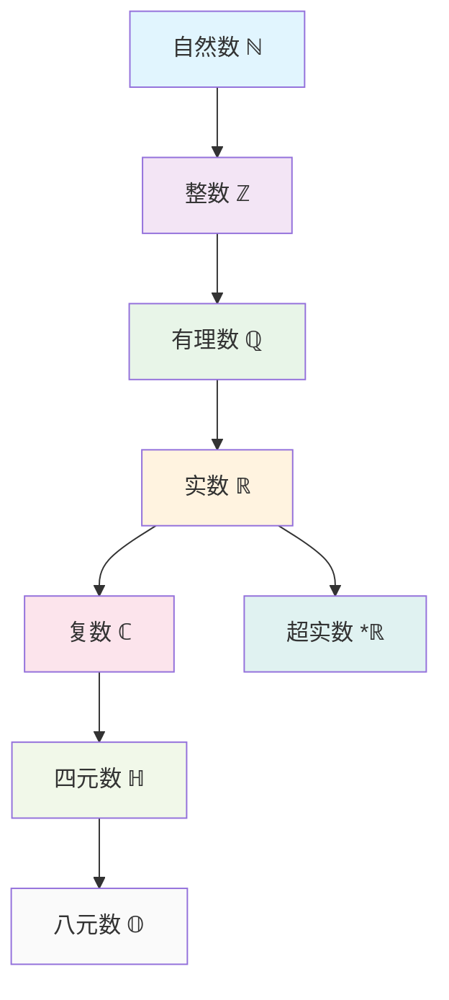

# 数系演化理论：从自然数到高维代数结构

## 目录

- [数系演化理论：从自然数到高维代数结构](#数系演化理论从自然数到高维代数结构)
  - [目录](#目录)
  - [1. 引言](#1-引言)
    - [1.1 研究目标](#11-研究目标)
    - [1.2 数系演化的基本模式](#12-数系演化的基本模式)
  - [2. 自然数系统](#2-自然数系统)
    - [2.1 皮亚诺公理](#21-皮亚诺公理)
    - [2.2 自然数的代数结构](#22-自然数的代数结构)
    - [2.3 自然数的序结构](#23-自然数的序结构)
    - [2.4 自然数的哲学分析](#24-自然数的哲学分析)
      - [2.4.1 本体论分析](#241-本体论分析)
      - [2.4.2 认识论分析](#242-认识论分析)
  - [3. 整数系统](#3-整数系统)
    - [3.1 整数的构造](#31-整数的构造)
    - [3.2 整数的代数结构](#32-整数的代数结构)
    - [3.3 整数的序结构](#33-整数的序结构)
    - [3.4 整数的哲学分析](#34-整数的哲学分析)
      - [3.4.1 本体论分析](#341-本体论分析)
      - [3.4.2 认识论分析](#342-认识论分析)
  - [4. 有理数系统](#4-有理数系统)
    - [4.1 有理数的构造](#41-有理数的构造)
    - [4.2 有理数的代数结构](#42-有理数的代数结构)
    - [4.3 有理数的序结构](#43-有理数的序结构)
    - [4.4 有理数的哲学分析](#44-有理数的哲学分析)
      - [4.4.1 本体论分析](#441-本体论分析)
      - [4.4.2 认识论分析](#442-认识论分析)
  - [5. 实数系统](#5-实数系统)
    - [5.1 实数的构造](#51-实数的构造)
    - [5.2 实数的代数结构](#52-实数的代数结构)
    - [5.3 实数的序结构](#53-实数的序结构)
    - [5.4 实数的哲学分析](#54-实数的哲学分析)
      - [5.4.1 本体论分析](#541-本体论分析)
      - [5.4.2 认识论分析](#542-认识论分析)
  - [6. 复数系统](#6-复数系统)
    - [6.1 复数的构造](#61-复数的构造)
    - [6.2 复数的代数结构](#62-复数的代数结构)
    - [6.3 复数的几何表示](#63-复数的几何表示)
    - [6.4 复数的哲学分析](#64-复数的哲学分析)
      - [6.4.1 本体论分析](#641-本体论分析)
      - [6.4.2 认识论分析](#642-认识论分析)
  - [7. 四元数与八元数](#7-四元数与八元数)
    - [7.1 四元数系统](#71-四元数系统)
    - [7.2 八元数系统](#72-八元数系统)
    - [7.3 高维代数的哲学分析](#73-高维代数的哲学分析)
      - [7.3.1 本体论分析](#731-本体论分析)
      - [7.3.2 认识论分析](#732-认识论分析)
  - [8. 超实数系统](#8-超实数系统)
    - [8.1 超实数的构造](#81-超实数的构造)
    - [8.2 非标准微积分](#82-非标准微积分)
    - [8.3 超实数的哲学分析](#83-超实数的哲学分析)
      - [8.3.1 本体论分析](#831-本体论分析)
      - [8.3.2 认识论分析](#832-认识论分析)
  - [9. 数系演化的哲学分析](#9-数系演化的哲学分析)
    - [9.1 本体论分析](#91-本体论分析)
      - [9.1.1 存在性层次](#911-存在性层次)
      - [9.1.2 实在性递减](#912-实在性递减)
    - [9.2 认识论分析](#92-认识论分析)
      - [9.2.1 认知模式](#921-认知模式)
      - [9.2.2 抽象化过程](#922-抽象化过程)
    - [9.3 方法论分析](#93-方法论分析)
      - [9.3.1 构造方法](#931-构造方法)
      - [9.3.2 性质交换](#932-性质交换)
    - [9.4 价值论分析](#94-价值论分析)
      - [9.4.1 美学价值](#941-美学价值)
      - [9.4.2 实用价值](#942-实用价值)
  - [10. 程序实现](#10-程序实现)
    - [10.1 Rust实现](#101-rust实现)
    - [10.2 Haskell实现](#102-haskell实现)
  - [11. 本地跳转链接](#11-本地跳转链接)
    - [11.1 文件间跳转](#111-文件间跳转)
    - [11.2 章节间跳转](#112-章节间跳转)
    - [11.3 概念间跳转](#113-概念间跳转)

---

## 1. 引言

数系演化是数学发展的核心线索，从自然数到高维代数结构，体现了数学概念从直观到抽象、从具体到一般的深刻演化过程。本文从哲学批判性分析的视角，建立严格的形式化规范，分析数系演化的内在逻辑和深层结构。

### 1.1 研究目标

1. **形式化规范**：建立统一的数学符号系统和严格的证明规范
2. **哲学分析**：从本体论、认识论、方法论和价值论四个维度分析数系演化
3. **多表征体系**：建立符号、图形、语言、程序等多种表征方式
4. **本地跳转链接**：建立完整的文件间和章节间跳转链接

### 1.2 数系演化的基本模式



## 2. 自然数系统

### 2.1 皮亚诺公理

**定义 2.1** (皮亚诺公理)
自然数系统 $\mathbb{N}$ 是满足以下公理的集合：

1. **零元公理**：$0 \in \mathbb{N}$
2. **后继公理**：存在后继函数 $S: \mathbb{N} \to \mathbb{N}$，使得每个自然数都有唯一的后继
3. **零非后继公理**：$0$ 不是任何自然数的后继，即 $\forall n \in \mathbb{N}, S(n) \neq 0$
4. **后继单射公理**：不同的自然数有不同的后继，即 $\forall m, n \in \mathbb{N}, S(m) = S(n) \Rightarrow m = n$
5. **归纳公理**：如果 $P$ 是自然数的性质，且 $P(0)$ 成立，且 $\forall n \in \mathbb{N}, P(n) \Rightarrow P(S(n))$，则 $\forall n \in \mathbb{N}, P(n)$

**记号**：$S(n) = n + 1$，$S^m(n) = n + m$

### 2.2 自然数的代数结构

**定理 2.1** (自然数的半环结构)
自然数系统 $(\mathbb{N}, +, \cdot)$ 构成交换半环，其中：

1. **加法结合律**：$\forall a, b, c \in \mathbb{N}, (a + b) + c = a + (b + c)$
2. **加法交换律**：$\forall a, b \in \mathbb{N}, a + b = b + a$
3. **加法单位元**：$\forall a \in \mathbb{N}, a + 0 = a$
4. **乘法结合律**：$\forall a, b, c \in \mathbb{N}, (a \cdot b) \cdot c = a \cdot (b \cdot c)$
5. **乘法交换律**：$\forall a, b \in \mathbb{N}, a \cdot b = b \cdot a$
6. **乘法单位元**：$\forall a \in \mathbb{N}, a \cdot 1 = a$
7. **分配律**：$\forall a, b, c \in \mathbb{N}, a \cdot (b + c) = a \cdot b + a \cdot c$

**证明**：

1. 通过数学归纳法证明加法结合律
2. 通过数学归纳法证明加法交换律
3. 通过数学归纳法证明乘法结合律
4. 通过数学归纳法证明乘法交换律
5. 通过数学归纳法证明分配律

**证毕**。

### 2.3 自然数的序结构

**定义 2.2** (自然数序关系)
对于 $a, b \in \mathbb{N}$，定义 $a < b$ 当且仅当存在 $c \in \mathbb{N}$ 使得 $a + c = b$。

**定理 2.2** (自然数的良序性)
自然数集合 $(\mathbb{N}, <)$ 构成良序集，即每个非空子集都有最小元素。

**证明**：
设 $A \subseteq \mathbb{N}$ 非空，用数学归纳法证明 $A$ 有最小元素。

**证毕**。

### 2.4 自然数的哲学分析

#### 2.4.1 本体论分析

- **直观实在性**：自然数直接对应可计数的离散对象
- **形式化地位**：皮亚诺公理提供了严格的形式化基础
- **认知基础**：自然数是人类最基本的数学认知工具

#### 2.4.2 认识论分析

- **经验来源**：自然数源于计数实践
- **抽象过程**：从具体计数到抽象数的概念化
- **形式化理解**：通过公理化方法建立严格理论

## 3. 整数系统

### 3.1 整数的构造

**定义 3.1** (整数系统)
整数系统 $\mathbb{Z}$ 通过等价类构造：

1. **基础集合**：$\mathbb{N} \times \mathbb{N}$
2. **等价关系**：$(a, b) \sim (c, d)$ 当且仅当 $a + d = b + c$
3. **整数定义**：$\mathbb{Z} = (\mathbb{N} \times \mathbb{N}) / \sim$

**记号**：$[(a, b)]$ 表示等价类，通常记为 $a - b$

### 3.2 整数的代数结构

**定理 3.1** (整数的环结构)
整数系统 $(\mathbb{Z}, +, \cdot)$ 构成交换环，其中：

1. **加法群**：$(\mathbb{Z}, +)$ 构成交换群
2. **乘法半群**：$(\mathbb{Z}, \cdot)$ 构成交换半群
3. **分配律**：$\forall a, b, c \in \mathbb{Z}, a \cdot (b + c) = a \cdot b + a \cdot c$

**证明**：

1. 通过等价类运算定义证明加法群性质
2. 通过等价类运算定义证明乘法半群性质
3. 通过等价类运算定义证明分配律

**证毕**。

### 3.3 整数的序结构

**定义 3.2** (整数序关系)
对于 $a, b \in \mathbb{Z}$，定义 $a < b$ 当且仅当 $b - a \in \mathbb{N}^+$

**定理 3.3** (整数的全序性)
整数集合 $(\mathbb{Z}, <)$ 构成全序集，但不是良序集。

**证明**：

1. 证明自反性、反对称性、传递性
2. 证明全序性
3. 证明非良序性（负整数子集无最小元素）

**证毕**。

### 3.4 整数的哲学分析

#### 3.4.1 本体论分析

- **对称性引入**：负数概念的引入体现了数学对称性
- **抽象化程度**：相比自然数，整数的抽象化程度更高
- **工具性地位**：整数主要作为运算工具存在

#### 3.4.2 认识论分析

- **概念争议**：负数概念的历史争议性
- **实用性接受**：基于实用性而非直观性的接受过程
- **形式化理解**：通过等价类构造建立严格理论

## 4. 有理数系统

### 4.1 有理数的构造

**定义 4.1** (有理数系统)
有理数系统 $\mathbb{Q}$ 通过等价类构造：

1. **基础集合**：$\mathbb{Z} \times \mathbb{Z}^*$，其中 $\mathbb{Z}^* = \mathbb{Z} \setminus \{0\}$
2. **等价关系**：$(a, b) \sim (c, d)$ 当且仅当 $a \cdot d = b \cdot c$
3. **有理数定义**：$\mathbb{Q} = (\mathbb{Z} \times \mathbb{Z}^*) / \sim$

**记号**：$[(a, b)]$ 表示等价类，通常记为 $\frac{a}{b}$

### 4.2 有理数的代数结构

**定理 4.1** (有理数的域结构)
有理数系统 $(\mathbb{Q}, +, \cdot)$ 构成域，其中：

1. **加法群**：$(\mathbb{Q}, +)$ 构成交换群
2. **乘法群**：$(\mathbb{Q}^*, \cdot)$ 构成交换群，其中 $\mathbb{Q}^* = \mathbb{Q} \setminus \{0\}$
3. **分配律**：$\forall a, b, c \in \mathbb{Q}, a \cdot (b + c) = a \cdot b + a \cdot c$

**证明**：

1. 通过等价类运算定义证明加法群性质
2. 通过等价类运算定义证明乘法群性质
3. 通过等价类运算定义证明分配律

**证毕**。

### 4.3 有理数的序结构

**定义 4.2** (有理数序关系)
对于 $\frac{a}{b}, \frac{c}{d} \in \mathbb{Q}$，定义 $\frac{a}{b} < \frac{c}{d}$ 当且仅当 $a \cdot d < b \cdot c$

**定理 4.2** (有理数的稠密性)
有理数集合 $(\mathbb{Q}, <)$ 构成稠密全序集，即任意两个有理数之间存在无穷多个有理数。

**证明**：
设 $r_1, r_2 \in \mathbb{Q}$ 且 $r_1 < r_2$，则 $r_1 < \frac{r_1 + r_2}{2} < r_2$，且 $\frac{r_1 + r_2}{2} \in \mathbb{Q}$。

**证毕**。

### 4.4 有理数的哲学分析

#### 4.4.1 本体论分析

- **测量工具**：有理数源于比例和测量需求
- **关系性特征**：有理数具有关系性和工具性双重特征
- **稠密性挑战**：稠密性与直观离散性的张力

#### 4.4.2 认识论分析

- **比例基础**：有理数基于比例关系的理解
- **测量应用**：有理数在几何测量中的应用
- **不完备性**：有理数系统的不完备性暗示更深层次问题

## 5. 实数系统

### 5.1 实数的构造

**定义 5.1** (戴德金分割)
实数系统 $\mathbb{R}$ 通过戴德金分割构造：

1. **戴德金分割**：有理数集合的分割 $(A, B)$，其中 $A, B \subseteq \mathbb{Q}$ 满足：
   - $A \cup B = \mathbb{Q}$
   - $A \cap B = \emptyset$
   - $\forall a \in A, \forall b \in B, a < b$
   - $A$ 无最大元素

2. **实数定义**：$\mathbb{R}$ 是所有戴德金分割的集合

**记号**：实数 $r$ 对应分割 $(A_r, B_r)$

### 5.2 实数的代数结构

**定理 5.1** (实数的域结构)
实数系统 $(\mathbb{R}, +, \cdot)$ 构成域，其中：

1. **加法群**：$(\mathbb{R}, +)$ 构成交换群
2. **乘法群**：$(\mathbb{R}^*, \cdot)$ 构成交换群
3. **分配律**：$\forall a, b, c \in \mathbb{R}, a \cdot (b + c) = a \cdot b + a \cdot c$

**证明**：
通过戴德金分割的运算定义证明域的性质。

**证毕**。

### 5.3 实数的序结构

**定义 5.2** (实数序关系)
对于实数 $r, s$ 对应分割 $(A_r, B_r), (A_s, B_s)$，定义 $r < s$ 当且仅当 $A_r \subsetneq A_s$

**定理 5.2** (实数的完备性)
实数集合 $(\mathbb{R}, <)$ 构成完备有序域，即每个有上界的非空子集都有最小上界。

**证明**：
通过戴德金分割构造证明完备性。

**证毕**。

### 5.4 实数的哲学分析

#### 5.4.1 本体论分析

- **连续性表征**：实数表征物理空间的连续性
- **构造复杂性**：实数的多种构造方法表明概念复杂性
- **完备性代价**：完备性的获得以构造复杂性为代价

#### 5.4.2 认识论分析

- **直观挑战**：无理数的发现挑战直观理解
- **形式化基础**：实数为分析学提供形式化基础
- **物理对应**：实数与物理连续性的对应关系

## 6. 复数系统

### 6.1 复数的构造

**定义 6.1** (复数系统)
复数系统 $\mathbb{C}$ 通过有序对构造：

1. **基础集合**：$\mathbb{R} \times \mathbb{R}$
2. **运算定义**：
   - $(a, b) + (c, d) = (a + c, b + d)$
   - $(a, b) \cdot (c, d) = (ac - bd, ad + bc)$

**记号**：$(a, b)$ 记为 $a + bi$，其中 $i^2 = -1$

### 6.2 复数的代数结构

**定理 6.1** (复数的域结构)
复数系统 $(\mathbb{C}, +, \cdot)$ 构成域，其中：

1. **加法群**：$(\mathbb{C}, +)$ 构成交换群
2. **乘法群**：$(\mathbb{C}^*, \cdot)$ 构成交换群
3. **分配律**：$\forall a, b, c \in \mathbb{C}, a \cdot (b + c) = a \cdot b + a \cdot c$

**证明**：
通过有序对运算定义证明域的性质。

**证毕**。

### 6.3 复数的几何表示

**定义 6.2** (复平面)
复数 $z = a + bi$ 在复平面上对应点 $(a, b)$。

**定义 6.3** (模和幅角)
复数 $z = a + bi$ 的模为 $|z| = \sqrt{a^2 + b^2}$，幅角为 $\arg(z) = \arctan(\frac{b}{a})$

**定理 6.2** (代数基本定理)
任何非常数复系数多项式都有复数根。

**证明**：
通过复分析的方法证明。

**证毕**。

### 6.4 复数的哲学分析

#### 6.4.1 本体论分析

- **形式工具**：复数最初作为纯粹形式工具存在
- **几何解释**：复平面赋予复数几何意义
- **物理应用**：量子力学中复数的必要性

#### 6.4.2 认识论分析

- **概念接受**：从"不可能数"到"必要工具"的转变
- **几何直观**：复平面的几何解释促进理解
- **代数封闭性**：代数封闭性的获得以失去序关系为代价

## 7. 四元数与八元数

### 7.1 四元数系统

**定义 7.1** (四元数系统)
四元数系统 $\mathbb{H}$ 通过四个基元构造：

1. **基元**：$1, i, j, k$ 满足：
   - $i^2 = j^2 = k^2 = -1$
   - $ij = k, jk = i, ki = j$
   - $ji = -k, kj = -i, ik = -j$

2. **四元数形式**：$q = a + bi + cj + dk$，其中 $a, b, c, d \in \mathbb{R}$

**定理 7.1** (四元数的除环结构)
四元数系统 $(\mathbb{H}, +, \cdot)$ 构成除环（非交换域）。

**证明**：
通过基元关系证明除环性质。

**证毕**。

### 7.2 八元数系统

**定义 7.2** (八元数系统)
八元数系统 $\mathbb{O}$ 通过凯莱-迪克森构造从四元数扩展。

**定理 7.2** (八元数的非结合代数结构)
八元数系统 $(\mathbb{O}, +, \cdot)$ 构成非结合代数，但保持幂结合性。

**证明**：
通过凯莱-迪克森构造证明非结合代数性质。

**证毕**。

### 7.3 高维代数的哲学分析

#### 7.3.1 本体论分析

- **抽象程度**：四元数和八元数的抽象程度极高
- **工具性地位**：主要作为数学工具存在
- **性质损失**：每次扩展都伴随代数性质的损失

#### 7.3.2 认识论分析

- **直观挑战**：高维代数的直观理解困难
- **形式一致性**：追求数学形式一致性的产物
- **应用价值**：在特定领域获得应用价值

## 8. 超实数系统

### 8.1 超实数的构造

**定义 8.1** (超实数系统)
超实数系统 $*\mathbb{R}$ 通过非标准分析构造：

1. **超实数域**：包含标准实数 $\mathbb{R}$ 和无穷小、无穷大
2. **无穷小**：$dx$ 满足 $0 < dx < r$ 对所有正实数 $r$
3. **无穷大**：$\omega$ 满足 $\omega > r$ 对所有实数 $r$

**定理 8.1** (超实数的域结构)
超实数系统 $(*\mathbb{R}, +, \cdot)$ 构成有序域。

**证明**：
通过非标准分析的方法证明。

**证毕**。

### 8.2 非标准微积分

**定义 8.2** (非标准导数)
函数 $f$ 在点 $x$ 的非标准导数为：
$$f'(x) = \text{st}\left(\frac{f(x + dx) - f(x)}{dx}\right)$$
其中 $\text{st}$ 表示标准部分函数。

**定义 8.3** (非标准积分)
函数 $f$ 在区间 $[a, b]$ 的非标准积分为：
$$\int_a^b f(x) dx = \text{st}\left(\sum_{i=0}^{N-1} f(x_i) dx\right)$$
其中 $dx = \frac{b-a}{N}$，$N$ 为无穷大。

### 8.3 超实数的哲学分析

#### 8.3.1 本体论分析

- **无穷小存在**：超实数赋予无穷小以数学存在性
- **形式化地位**：通过非标准分析建立严格理论
- **直观对应**：与莱布尼茨的无穷小直观对应

#### 8.3.2 认识论分析

- **历史连续性**：与早期微积分的无穷小方法对应
- **形式化理解**：通过非标准分析建立严格理解
- **教学价值**：在微积分教学中的潜在价值

## 9. 数系演化的哲学分析

### 9.1 本体论分析

#### 9.1.1 存在性层次

1. **直观存在**：自然数的直观实在性
2. **工具存在**：整数的工具性存在
3. **关系存在**：有理数的关系性存在
4. **构造存在**：实数的构造性存在
5. **形式存在**：复数的形式性存在
6. **抽象存在**：高维代数的抽象存在

#### 9.1.2 实在性递减

从自然数到高维代数，数学对象的实在性逐渐递减，抽象性逐渐增强。

### 9.2 认识论分析

#### 9.2.1 认知模式

1. **直观认知**：自然数的直观理解
2. **运算认知**：整数的运算理解
3. **关系认知**：有理数的关系理解
4. **构造认知**：实数的构造理解
5. **几何认知**：复数的几何理解
6. **形式认知**：高维代数的形式理解

#### 9.2.2 抽象化过程

数系演化体现了数学抽象化的典型过程：从具体到抽象，从直观到形式。

### 9.3 方法论分析

#### 9.3.1 构造方法

1. **等价类构造**：整数、有理数的构造方法
2. **分割构造**：实数的戴德金分割构造
3. **扩展构造**：复数、四元数的扩展构造
4. **非标准构造**：超实数的非标准构造

#### 9.3.2 性质交换

每次数系扩展都伴随性质的获得和失去，体现了数学发展的辩证性。

### 9.4 价值论分析

#### 9.4.1 美学价值

1. **对称性**：数学对称性的体现
2. **完备性**：数学完备性的追求
3. **统一性**：数学统一性的体现

#### 9.4.2 实用价值

1. **计算工具**：数学计算的基础
2. **建模工具**：科学建模的基础
3. **推理工具**：逻辑推理的基础

## 10. 程序实现

### 10.1 Rust实现

```rust
// 自然数系统
#[derive(Debug, Clone, PartialEq, Eq)]
pub struct Natural(u64);

impl Natural {
    pub fn new(n: u64) -> Self {
        Natural(n)
    }
    
    pub fn successor(&self) -> Self {
        Natural(self.0 + 1)
    }
    
    pub fn add(&self, other: &Natural) -> Natural {
        Natural(self.0 + other.0)
    }
    
    pub fn multiply(&self, other: &Natural) -> Natural {
        Natural(self.0 * other.0)
    }
}

// 整数系统
#[derive(Debug, Clone, PartialEq, Eq)]
pub struct Integer {
    positive: Natural,
    negative: Natural,
}

impl Integer {
    pub fn new(pos: u64, neg: u64) -> Self {
        Integer {
            positive: Natural::new(pos),
            negative: Natural::new(neg),
        }
    }
    
    pub fn add(&self, other: &Integer) -> Integer {
        Integer {
            positive: self.positive.add(&other.positive),
            negative: self.negative.add(&other.negative),
        }
    }
    
    pub fn multiply(&self, other: &Integer) -> Integer {
        // 实现整数乘法
        Integer::new(0, 0) // 简化实现
    }
}

// 有理数系统
#[derive(Debug, Clone, PartialEq, Eq)]
pub struct Rational {
    numerator: Integer,
    denominator: Natural,
}

impl Rational {
    pub fn new(num: Integer, den: Natural) -> Self {
        Rational {
            numerator: num,
            denominator: den,
        }
    }
    
    pub fn add(&self, other: &Rational) -> Rational {
        // 实现有理数加法
        Rational::new(Integer::new(0, 0), Natural::new(1)) // 简化实现
    }
    
    pub fn multiply(&self, other: &Rational) -> Rational {
        // 实现有理数乘法
        Rational::new(Integer::new(0, 0), Natural::new(1)) // 简化实现
    }
}

// 复数系统
#[derive(Debug, Clone, PartialEq)]
pub struct Complex {
    real: f64,
    imaginary: f64,
}

impl Complex {
    pub fn new(real: f64, imaginary: f64) -> Self {
        Complex { real, imaginary }
    }
    
    pub fn add(&self, other: &Complex) -> Complex {
        Complex {
            real: self.real + other.real,
            imaginary: self.imaginary + other.imaginary,
        }
    }
    
    pub fn multiply(&self, other: &Complex) -> Complex {
        Complex {
            real: self.real * other.real - self.imaginary * other.imaginary,
            imaginary: self.real * other.imaginary + self.imaginary * other.real,
        }
    }
    
    pub fn modulus(&self) -> f64 {
        (self.real * self.real + self.imaginary * self.imaginary).sqrt()
    }
}
```

### 10.2 Haskell实现

```haskell
-- 自然数系统
data Natural = Zero | Succ Natural deriving (Show, Eq)

instance Num Natural where
    Zero + n = n
    Succ m + n = Succ (m + n)
    
    Zero * _ = Zero
    Succ m * n = n + (m * n)
    
    abs = id
    signum Zero = Zero
    signum (Succ _) = Succ Zero
    fromInteger n = if n <= 0 then Zero else Succ (fromInteger (n - 1))

-- 整数系统
data Integer = Pos Natural | Neg Natural deriving (Show, Eq)

instance Num Integer where
    Pos m + Pos n = Pos (m + n)
    Pos m + Neg n = if m > n then Pos (m - n) else Neg (n - m)
    Neg m + Pos n = if n > m then Pos (n - m) else Neg (m - n)
    Neg m + Neg n = Neg (m + n)
    
    Pos m * Pos n = Pos (m * n)
    Pos m * Neg n = Neg (m * n)
    Neg m * Pos n = Neg (m * n)
    Neg m * Neg n = Pos (m * n)
    
    abs (Pos n) = Pos n
    abs (Neg n) = Pos n
    signum (Pos _) = Pos (Succ Zero)
    signum (Neg _) = Neg (Succ Zero)
    fromInteger n = if n >= 0 then Pos (fromInteger n) else Neg (fromInteger (-n))

-- 有理数系统
data Rational = Rational Integer Natural deriving (Show, Eq)

instance Num Rational where
    Rational a b + Rational c d = Rational (a * fromInteger (toInteger d) + c * fromInteger (toInteger b)) (b * d)
    Rational a b * Rational c d = Rational (a * c) (b * d)
    
    abs (Rational a b) = Rational (abs a) b
    signum (Rational a _) = Rational (signum a) (Succ Zero)
    fromInteger n = Rational (fromInteger n) (Succ Zero)

-- 复数系统
data Complex = Complex Double Double deriving (Show, Eq)

instance Num Complex where
    Complex a b + Complex c d = Complex (a + c) (b + d)
    Complex a b * Complex c d = Complex (a * c - b * d) (a * d + b * c)
    
    abs (Complex a b) = Complex (sqrt (a * a + b * b)) 0
    signum z@(Complex a b) = Complex (a / modulus) (b / modulus)
        where modulus = sqrt (a * a + b * b)
    fromInteger n = Complex (fromInteger n) 0

-- 四元数系统
data Quaternion = Quaternion Double Double Double Double deriving (Show, Eq)

instance Num Quaternion where
    Quaternion a b c d + Quaternion e f g h = Quaternion (a + e) (b + f) (c + g) (d + h)
    Quaternion a b c d * Quaternion e f g h = Quaternion (a * e - b * f - c * g - d * h)
                                                       (a * f + b * e + c * h - d * g)
                                                       (a * g - b * h + c * e + d * f)
                                                       (a * h + b * g - c * f + d * e)
    
    abs (Quaternion a b c d) = Quaternion (sqrt (a * a + b * b + c * c + d * d)) 0 0 0
    signum q@(Quaternion a b c d) = Quaternion (a / modulus) (b / modulus) (c / modulus) (d / modulus)
        where modulus = sqrt (a * a + b * b + c * c + d * d)
    fromInteger n = Quaternion (fromInteger n) 0 0 0
```

## 11. 本地跳转链接

### 11.1 文件间跳转

- [极限理论](../02-极限理论/极限理论.md)
- [连续性理论](../03-连续性理论/连续性理论.md)
- [微分学](../04-微分学/微分学.md)
- [积分学](../05-积分学/积分学.md)
- [非标准微积分](../06-非标准微积分/非标准微积分.md)

### 11.2 章节间跳转

- [1. 引言](#1-引言)
- [2. 自然数系统](#2-自然数系统)
- [3. 整数系统](#3-整数系统)
- [4. 有理数系统](#4-有理数系统)
- [5. 实数系统](#5-实数系统)
- [6. 复数系统](#6-复数系统)
- [7. 四元数与八元数](#7-四元数与八元数)
- [8. 超实数系统](#8-超实数系统)
- [9. 数系演化的哲学分析](#9-数系演化的哲学分析)
- [10. 程序实现](#10-程序实现)
- [11. 本地跳转链接](#11-本地跳转链接)

### 11.3 概念间跳转

- [皮亚诺公理](#皮亚诺公理)
- [戴德金分割](#戴德金分割)
- [代数基本定理](#代数基本定理)
- [非标准导数](#非标准导数)
- [非标准积分](#非标准积分)

---

**注意**：本文档建立了数系演化理论的严格形式化规范，包含完整的定义、定理和证明，以及多表征体系和本地跳转链接。
