# 实分析基础

## 目录

- [实分析基础](#实分析基础)
  - [目录](#目录)
  - [1. 引言与基本概念](#1-引言与基本概念)
    - [1.1 实分析的研究对象](#11-实分析的研究对象)
    - [1.2 实分析的历史发展](#12-实分析的历史发展)
    - [1.3 实分析的重要性](#13-实分析的重要性)
  - [2. 实数系理论](#2-实数系理论)
    - [2.1 实数的构造](#21-实数的构造)
      - [2.1.1 戴德金分割](#211-戴德金分割)
      - [2.1.2 柯西序列](#212-柯西序列)
    - [2.2 实数的完备性](#22-实数的完备性)
      - [2.2.1 完备性的等价表述](#221-完备性的等价表述)
      - [2.2.2 完备性的重要性](#222-完备性的重要性)
    - [2.3 实数的拓扑性质](#23-实数的拓扑性质)
      - [2.3.1 开集和闭集](#231-开集和闭集)
      - [2.3.2 连通性](#232-连通性)
  - [3. 序列与级数](#3-序列与级数)
    - [3.1 序列的收敛性](#31-序列的收敛性)
      - [3.1.1 收敛的定义](#311-收敛的定义)
      - [3.1.2 收敛的性质](#312-收敛的性质)
      - [3.1.3 收敛判别法](#313-收敛判别法)
    - [3.2 级数的收敛性](#32-级数的收敛性)
      - [3.2.1 级数收敛的定义](#321-级数收敛的定义)
      - [3.2.2 收敛判别法](#322-收敛判别法)
    - [3.3 函数序列](#33-函数序列)
      - [3.3.1 逐点收敛](#331-逐点收敛)
      - [3.3.2 一致收敛](#332-一致收敛)
      - [3.3.3 一致收敛的性质](#333-一致收敛的性质)
  - [4. 函数论](#4-函数论)
    - [4.1 函数的连续性](#41-函数的连续性)
      - [4.1.1 连续性的定义](#411-连续性的定义)
      - [4.1.2 连续性的性质](#412-连续性的性质)
      - [4.1.3 间断点的分类](#413-间断点的分类)
    - [4.2 函数的可微性](#42-函数的可微性)
      - [4.2.1 可微性的定义](#421-可微性的定义)
      - [4.2.2 可微性的性质](#422-可微性的性质)
      - [4.2.3 不可微函数的例子](#423-不可微函数的例子)
    - [4.3 函数的可积性](#43-函数的可积性)
      - [4.3.1 黎曼可积性](#431-黎曼可积性)
      - [4.3.2 可积性条件](#432-可积性条件)
      - [4.3.3 积分的性质](#433-积分的性质)
  - [5. 测度论基础](#5-测度论基础)
    - [5.1 集合论基础](#51-集合论基础)
      - [5.1.1 σ-代数](#511-σ-代数)
      - [5.1.2 生成 σ-代数](#512-生成-σ-代数)
      - [5.1.3 波雷尔 σ-代数](#513-波雷尔-σ-代数)
    - [5.2 测度的定义](#52-测度的定义)
      - [5.2.1 测度的公理](#521-测度的公理)
      - [5.2.2 测度的性质](#522-测度的性质)
    - [5.3 勒贝格测度](#53-勒贝格测度)
      - [5.3.1 外测度](#531-外测度)
      - [5.3.2 可测集](#532-可测集)
      - [5.3.3 勒贝格测度的性质](#533-勒贝格测度的性质)
  - [6. 勒贝格积分](#6-勒贝格积分)
    - [6.1 可测函数](#61-可测函数)
      - [6.1.1 可测函数的定义](#611-可测函数的定义)
      - [6.1.2 可测函数的性质](#612-可测函数的性质)
      - [6.1.3 简单函数](#613-简单函数)
    - [6.2 勒贝格积分的定义](#62-勒贝格积分的定义)
      - [6.2.1 非负可测函数的积分](#621-非负可测函数的积分)
      - [6.2.2 一般可测函数的积分](#622-一般可测函数的积分)
      - [6.2.3 积分的性质](#623-积分的性质)
    - [6.3 勒贝格积分的性质](#63-勒贝格积分的性质)
      - [6.3.1 收敛定理](#631-收敛定理)
      - [6.3.2 积分的计算](#632-积分的计算)
  - [7. 函数空间](#7-函数空间)
    - [7.1 L^p 空间](#71-lp-空间)
      - [7.1.1 L^p 空间的定义](#711-lp-空间的定义)
      - [7.1.2 L^p 范数](#712-lp-范数)
      - [7.1.3 L^p 空间的性质](#713-lp-空间的性质)
    - [7.2 连续函数空间](#72-连续函数空间)
      - [7.2.1 C\[a,b\] 空间](#721-cab-空间)
      - [7.2.2 连续函数空间的性质](#722-连续函数空间的性质)
    - [7.3 索伯列夫空间](#73-索伯列夫空间)
      - [7.3.1 弱导数](#731-弱导数)
      - [7.3.2 索伯列夫空间的定义](#732-索伯列夫空间的定义)
      - [7.3.3 索伯列夫空间的性质](#733-索伯列夫空间的性质)
  - [8. 傅里叶分析](#8-傅里叶分析)
    - [8.1 傅里叶级数](#81-傅里叶级数)
      - [8.1.1 傅里叶系数](#811-傅里叶系数)
      - [8.1.2 傅里叶级数](#812-傅里叶级数)
      - [8.1.3 收敛性](#813-收敛性)
    - [8.2 傅里叶变换](#82-傅里叶变换)
      - [8.2.1 傅里叶变换的定义](#821-傅里叶变换的定义)
      - [8.2.2 傅里叶变换的性质](#822-傅里叶变换的性质)
      - [8.2.3 逆傅里叶变换](#823-逆傅里叶变换)
    - [8.3 傅里叶分析的应用](#83-傅里叶分析的应用)
      - [8.3.1 信号处理](#831-信号处理)
      - [8.3.2 偏微分方程](#832-偏微分方程)
  - [9. 泛函分析基础](#9-泛函分析基础)
    - [9.1 赋范空间](#91-赋范空间)
      - [9.1.1 赋范空间的定义](#911-赋范空间的定义)
      - [9.1.2 巴拿赫空间](#912-巴拿赫空间)
      - [9.1.3 对偶空间](#913-对偶空间)
    - [9.2 希尔伯特空间](#92-希尔伯特空间)
      - [9.2.1 内积空间](#921-内积空间)
      - [9.2.2 希尔伯特空间](#922-希尔伯特空间)
      - [9.2.3 正交性](#923-正交性)
    - [9.3 线性算子](#93-线性算子)
      - [9.3.1 有界算子](#931-有界算子)
      - [9.3.2 算子范数](#932-算子范数)
      - [9.3.3 紧算子](#933-紧算子)
  - [10. 批判性分析](#10-批判性分析)
    - [10.1 实分析的哲学基础](#101-实分析的哲学基础)
      - [10.1.1 无穷的概念](#1011-无穷的概念)
      - [10.1.2 连续性的本质](#1012-连续性的本质)
    - [10.2 选择公理的作用](#102-选择公理的作用)
      - [10.2.1 选择公理的重要性](#1021-选择公理的重要性)
      - [10.2.2 选择公理的争议](#1022-选择公理的争议)
    - [10.3 构造性数学的挑战](#103-构造性数学的挑战)
      - [10.3.1 构造性数学的观点](#1031-构造性数学的观点)
      - [10.3.2 非构造性证明](#1032-非构造性证明)
    - [10.4 实分析的应用局限](#104-实分析的应用局限)
      - [10.4.1 计算复杂性](#1041-计算复杂性)
      - [10.4.2 物理世界的离散性](#1042-物理世界的离散性)
  - [11. 应用与展望](#11-应用与展望)
    - [11.1 物理学应用](#111-物理学应用)
      - [11.1.1 量子力学](#1111-量子力学)
      - [11.1.2 经典力学](#1112-经典力学)
    - [11.2 工程学应用](#112-工程学应用)
      - [11.2.1 信号处理](#1121-信号处理)
      - [11.2.2 控制理论](#1122-控制理论)
    - [11.3 经济学应用](#113-经济学应用)
      - [11.3.1 金融数学](#1131-金融数学)
      - [11.3.2 计量经济学](#1132-计量经济学)
    - [11.4 计算机科学应用](#114-计算机科学应用)
      - [11.4.1 数值分析](#1141-数值分析)
      - [11.4.2 机器学习](#1142-机器学习)
    - [11.5 未来发展方向](#115-未来发展方向)
      - [11.5.1 非交换几何](#1151-非交换几何)
      - [11.5.2 随机分析](#1152-随机分析)
      - [11.5.3 调和分析](#1153-调和分析)
  - [代码示例](#代码示例)
    - [Rust 实现：数值积分和傅里叶变换](#rust-实现数值积分和傅里叶变换)
    - [Haskell 实现：函数空间和算子理论](#haskell-实现函数空间和算子理论)
  - [思维导图](#思维导图)

---

## 1. 引言与基本概念

### 1.1 实分析的研究对象

实分析是数学分析的核心分支，主要研究实数系上的函数、序列、级数以及相关的数学结构。它建立在严格的逻辑基础之上，为微积分提供了严密的理论支撑。

实分析的主要研究对象包括：

- 实数系的结构和性质
- 函数的连续性、可微性和可积性
- 序列和级数的收敛性
- 测度论和积分理论
- 函数空间和泛函分析

### 1.2 实分析的历史发展

实分析的发展经历了几个重要阶段：

1. **17-18世纪**：微积分的创立和发展，但缺乏严格的基础
2. **19世纪**：柯西、魏尔斯特拉斯等人建立严格的极限理论
3. **19世纪末-20世纪初**：戴德金、康托尔等人完善实数理论
4. **20世纪初**：勒贝格建立测度论和勒贝格积分
5. **20世纪中期**：泛函分析的发展

### 1.3 实分析的重要性

实分析为现代数学提供了重要的理论基础：

- 为微积分提供严格的理论基础
- 为概率论、统计学提供测度论基础
- 为偏微分方程、调和分析等提供函数空间理论
- 为数值分析、优化理论等提供分析工具

## 2. 实数系理论

### 2.1 实数的构造

#### 2.1.1 戴德金分割

实数可以通过有理数的戴德金分割来构造。一个戴德金分割是将有理数集 $\mathbb{Q}$ 分为两个非空子集 $A$ 和 $B$，满足：

1. $A \cup B = \mathbb{Q}$
2. $A \cap B = \emptyset$
3. 对于任意 $a \in A$ 和 $b \in B$，有 $a < b$
4. $A$ 没有最大元素

每个戴德金分割对应一个实数。

#### 2.1.2 柯西序列

实数也可以通过有理数柯西序列的等价类来构造。两个柯西序列 $\{a_n\}$ 和 $\{b_n\}$ 等价，如果 $\lim_{n \to \infty} |a_n - b_n| = 0$。

### 2.2 实数的完备性

#### 2.2.1 完备性的等价表述

实数系的完备性有多种等价表述：

1. **确界原理**：任何非空有上界的实数子集必有上确界
2. **单调有界序列收敛**：任何单调有界序列都收敛
3. **柯西序列收敛**：任何柯西序列都收敛
4. **区间套定理**：任何闭区间套的交集非空
5. **有限覆盖定理**：任何闭区间的开覆盖都有有限子覆盖

#### 2.2.2 完备性的重要性

完备性是实分析中几乎所有重要定理的基础，包括：

- 介值定理
- 极值定理
- 一致连续性定理
- 黎曼积分的可积性条件

### 2.3 实数的拓扑性质

#### 2.3.1 开集和闭集

- **开集**：对于任意点 $x \in U$，存在 $\epsilon > 0$ 使得 $(x-\epsilon, x+\epsilon) \subset U$
- **闭集**：其补集是开集的集合
- **紧集**：任何开覆盖都有有限子覆盖的集合

#### 2.3.2 连通性

实数系是连通的，即不能表示为两个非空不相交开集的并集。

## 3. 序列与级数

### 3.1 序列的收敛性

#### 3.1.1 收敛的定义

序列 $\{a_n\}$ 收敛到 $L$，如果对于任意 $\epsilon > 0$，存在 $N$ 使得当 $n > N$ 时，$|a_n - L| < \epsilon$。

#### 3.1.2 收敛的性质

- **唯一性**：收敛序列的极限唯一
- **有界性**：收敛序列有界
- **保序性**：如果 $a_n \leq b_n$ 且 $\lim a_n = A$，$\lim b_n = B$，则 $A \leq B$

#### 3.1.3 收敛判别法

- **单调有界定理**：单调有界序列收敛
- **夹逼定理**：如果 $a_n \leq b_n \leq c_n$ 且 $\lim a_n = \lim c_n = L$，则 $\lim b_n = L$
- **柯西收敛准则**：序列收敛当且仅当它是柯西序列

### 3.2 级数的收敛性

#### 3.2.1 级数收敛的定义

级数 $\sum_{n=1}^{\infty} a_n$ 收敛，如果其部分和序列 $\{S_n\}$ 收敛，其中 $S_n = \sum_{k=1}^n a_k$。

#### 3.2.2 收敛判别法

- **比较判别法**：如果 $0 \leq a_n \leq b_n$ 且 $\sum b_n$ 收敛，则 $\sum a_n$ 收敛
- **比值判别法**：如果 $\lim_{n \to \infty} \left|\frac{a_{n+1}}{a_n}\right| = L < 1$，则级数收敛
- **根值判别法**：如果 $\lim_{n \to \infty} \sqrt[n]{|a_n|} = L < 1$，则级数收敛
- **积分判别法**：如果 $f(x)$ 是正递减函数且 $a_n = f(n)$，则 $\sum a_n$ 收敛当且仅当 $\int_1^{\infty} f(x) dx$ 收敛

### 3.3 函数序列

#### 3.3.1 逐点收敛

函数序列 $\{f_n\}$ 在 $E$ 上逐点收敛到 $f$，如果对于任意 $x \in E$，$\lim_{n \to \infty} f_n(x) = f(x)$。

#### 3.3.2 一致收敛

函数序列 $\{f_n\}$ 在 $E$ 上一致收敛到 $f$，如果对于任意 $\epsilon > 0$，存在 $N$ 使得当 $n > N$ 时，对于所有 $x \in E$，$|f_n(x) - f(x)| < \epsilon$。

#### 3.3.3 一致收敛的性质

- **连续性保持**：如果 $f_n$ 连续且一致收敛到 $f$，则 $f$ 连续
- **积分交换**：如果 $f_n$ 在 $[a,b]$ 上一致收敛到 $f$，则 $\lim_{n \to \infty} \int_a^b f_n(x) dx = \int_a^b f(x) dx$
- **微分交换**：需要额外的条件，如 $f_n'$ 一致收敛

## 4. 函数论

### 4.1 函数的连续性

#### 4.1.1 连续性的定义

函数 $f$ 在点 $x_0$ 处连续，如果对于任意 $\epsilon > 0$，存在 $\delta > 0$ 使得当 $|x - x_0| < \delta$ 时，$|f(x) - f(x_0)| < \epsilon$。

#### 4.1.2 连续性的性质

- **局部有界性**：连续函数在任意点的邻域内有界
- **介值定理**：连续函数在闭区间上能取到介于端点值之间的任何值
- **极值定理**：连续函数在闭区间上达到最大值和最小值
- **一致连续性**：在紧集上连续的函数一致连续

#### 4.1.3 间断点的分类

- **可去间断点**：极限存在但不等于函数值
- **跳跃间断点**：左右极限存在但不相等
- **无穷间断点**：至少有一个单侧极限为无穷

### 4.2 函数的可微性

#### 4.2.1 可微性的定义

函数 $f$ 在点 $x_0$ 处可微，如果极限
$$\lim_{h \to 0} \frac{f(x_0 + h) - f(x_0)}{h}$$
存在。

#### 4.2.2 可微性的性质

- **连续性**：可微函数必连续
- **局部线性化**：可微函数在任意点附近可以用线性函数近似
- **中值定理**：可微函数满足各种中值定理

#### 4.2.3 不可微函数的例子

- **魏尔斯特拉斯函数**：处处连续但无处可微
- **绝对值函数**：在零点不可微
- **分段函数**：在分段点可能不可微

### 4.3 函数的可积性

#### 4.3.1 黎曼可积性

函数 $f$ 在 $[a,b]$ 上黎曼可积，如果上积分和下积分相等：
$$\int_a^b f(x) dx = \int_a^b f(x) dx$$

#### 4.3.2 可积性条件

- **连续函数**：连续函数黎曼可积
- **单调函数**：单调函数黎曼可积
- **有界且间断点集测度为零**：满足此条件的函数黎曼可积

#### 4.3.3 积分的性质

- **线性性**：$\int_a^b (cf + dg)(x) dx = c\int_a^b f(x) dx + d\int_a^b g(x) dx$
- **区间可加性**：$\int_a^c f(x) dx = \int_a^b f(x) dx + \int_b^c f(x) dx$
- **单调性**：如果 $f \leq g$，则 $\int_a^b f(x) dx \leq \int_a^b g(x) dx$

## 5. 测度论基础

### 5.1 集合论基础

#### 5.1.1 σ-代数

集合族 $\mathcal{F}$ 是 σ-代数，如果：

1. $\emptyset \in \mathcal{F}$
2. 如果 $A \in \mathcal{F}$，则 $A^c \in \mathcal{F}$
3. 如果 $A_n \in \mathcal{F}$，则 $\bigcup_{n=1}^{\infty} A_n \in \mathcal{F}$

#### 5.1.2 生成 σ-代数

由集合族 $\mathcal{A}$ 生成的 σ-代数是包含 $\mathcal{A}$ 的最小 σ-代数。

#### 5.1.3 波雷尔 σ-代数

由开集生成的 σ-代数称为波雷尔 σ-代数，记作 $\mathcal{B}(\mathbb{R})$。

### 5.2 测度的定义

#### 5.2.1 测度的公理

测度 $\mu$ 是定义在 σ-代数 $\mathcal{F}$ 上的函数，满足：

1. **非负性**：$\mu(A) \geq 0$ 对于所有 $A \in \mathcal{F}$
2. **空集为零**：$\mu(\emptyset) = 0$
3. **可数可加性**：对于互不相交的集合 $A_n$，$\mu(\bigcup_{n=1}^{\infty} A_n) = \sum_{n=1}^{\infty} \mu(A_n)$

#### 5.2.2 测度的性质

- **单调性**：如果 $A \subset B$，则 $\mu(A) \leq \mu(B)$
- **可数次可加性**：$\mu(\bigcup_{n=1}^{\infty} A_n) \leq \sum_{n=1}^{\infty} \mu(A_n)$
- **连续性**：如果 $A_n \uparrow A$，则 $\mu(A_n) \uparrow \mu(A)$

### 5.3 勒贝格测度

#### 5.3.1 外测度

集合 $E$ 的勒贝格外测度定义为：
$$m^*(E) = \inf \left\{ \sum_{k=1}^{\infty} l(I_k) : E \subset \bigcup_{k=1}^{\infty} I_k \right\}$$
其中 $I_k$ 是开区间，$l(I_k)$ 是其长度。

#### 5.3.2 可测集

集合 $E$ 是可测的，如果对于任意集合 $A$，
$$m^*(A) = m^*(A \cap E) + m^*(A \cap E^c)$$

#### 5.3.3 勒贝格测度的性质

- **平移不变性**：$m(E + x) = m(E)$
- **伸缩性**：$m(cE) = |c|m(E)$
- **可数可加性**：对于互不相交的可测集 $E_n$，$m(\bigcup_{n=1}^{\infty} E_n) = \sum_{n=1}^{\infty} m(E_n)$

## 6. 勒贝格积分

### 6.1 可测函数

#### 6.1.1 可测函数的定义

函数 $f$ 是可测的，如果对于任意实数 $a$，集合 $\{x : f(x) > a\}$ 是可测的。

#### 6.1.2 可测函数的性质

- **连续函数**：连续函数是可测的
- **可测函数的运算**：可测函数的和、差、积、商（分母不为零）都是可测的
- **可测函数的极限**：可测函数序列的极限函数是可测的

#### 6.1.3 简单函数

形如 $f(x) = \sum_{i=1}^n a_i \chi_{E_i}(x)$ 的函数称为简单函数，其中 $E_i$ 是可测集。

### 6.2 勒贝格积分的定义

#### 6.2.1 非负可测函数的积分

对于非负可测函数 $f$，其勒贝格积分定义为：
$$\int f dm = \sup \left\{ \int \phi dm : 0 \leq \phi \leq f, \phi \text{ 简单函数} \right\}$$

#### 6.2.2 一般可测函数的积分

对于一般可测函数 $f$，定义 $f^+ = \max(f, 0)$ 和 $f^- = \max(-f, 0)$，则：
$$\int f dm = \int f^+ dm - \int f^- dm$$

#### 6.2.3 积分的性质

- **线性性**：$\int (af + bg) dm = a\int f dm + b\int g dm$
- **单调性**：如果 $f \leq g$，则 $\int f dm \leq \int g dm$
- **绝对可积性**：$|\int f dm| \leq \int |f| dm$

### 6.3 勒贝格积分的性质

#### 6.3.1 收敛定理

- **单调收敛定理**：如果 $0 \leq f_n \uparrow f$，则 $\int f_n dm \uparrow \int f dm$
- **法图引理**：如果 $f_n \geq 0$，则 $\int \liminf f_n dm \leq \liminf \int f_n dm$
- **控制收敛定理**：如果 $|f_n| \leq g$，$g$ 可积，且 $f_n \to f$，则 $\int f_n dm \to \int f dm$

#### 6.3.2 积分的计算

- **与黎曼积分的关系**：黎曼可积函数勒贝格可积，且积分值相等
- **变量替换**：在适当的条件下可以进行变量替换
- **分部积分**：在适当的条件下可以进行分部积分

## 7. 函数空间

### 7.1 L^p 空间

#### 7.1.1 L^p 空间的定义

对于 $1 \leq p < \infty$，$L^p$ 空间定义为：
$$L^p = \left\{ f : \int |f|^p dm < \infty \right\}$$

#### 7.1.2 L^p 范数

$L^p$ 空间上的范数定义为：
$$\|f\|_p = \left( \int |f|^p dm \right)^{1/p}$$

#### 7.1.3 L^p 空间的性质

- **完备性**：$L^p$ 空间是完备的巴拿赫空间
- **对偶性**：$(L^p)^* = L^q$，其中 $\frac{1}{p} + \frac{1}{q} = 1$
- **稠密性**：简单函数在 $L^p$ 中稠密

### 7.2 连续函数空间

#### 7.2.1 C[a,b] 空间

$C[a,b]$ 表示 $[a,b]$ 上的连续函数空间，配备上确界范数：
$$\|f\|_{\infty} = \sup_{x \in [a,b]} |f(x)|$$

#### 7.2.2 连续函数空间的性质

- **完备性**：$C[a,b]$ 是完备的巴拿赫空间
- **魏尔斯特拉斯逼近定理**：多项式在 $C[a,b]$ 中稠密
- **阿斯科利-阿尔泽拉定理**：给出了紧性的充分必要条件

### 7.3 索伯列夫空间

#### 7.3.1 弱导数

函数 $f$ 的弱导数 $D^\alpha f$ 定义为满足：
$$\int f D^\alpha \phi dx = (-1)^{|\alpha|} \int D^\alpha f \phi dx$$
对于所有紧支撑的光滑函数 $\phi$。

#### 7.3.2 索伯列夫空间的定义

$W^{k,p}$ 空间定义为：
$$W^{k,p} = \left\{ f : D^\alpha f \in L^p, |\alpha| \leq k \right\}$$

#### 7.3.3 索伯列夫空间的性质

- **完备性**：$W^{k,p}$ 是完备的巴拿赫空间
- **嵌入定理**：给出了不同索伯列夫空间之间的包含关系
- **紧嵌入**：在适当的条件下，嵌入是紧的

## 8. 傅里叶分析

### 8.1 傅里叶级数

#### 8.1.1 傅里叶系数

周期为 $2\pi$ 的函数 $f$ 的傅里叶系数定义为：
$$a_n = \frac{1}{\pi} \int_{-\pi}^{\pi} f(x) \cos nx dx$$
$$b_n = \frac{1}{\pi} \int_{-\pi}^{\pi} f(x) \sin nx dx$$

#### 8.1.2 傅里叶级数

$f$ 的傅里叶级数为：
$$f(x) \sim \frac{a_0}{2} + \sum_{n=1}^{\infty} (a_n \cos nx + b_n \sin nx)$$

#### 8.1.3 收敛性

- **点收敛**：在连续点处傅里叶级数收敛到函数值
- **L^2 收敛**：在 $L^2$ 意义下傅里叶级数收敛
- **一致收敛**：需要额外的光滑性条件

### 8.2 傅里叶变换

#### 8.2.1 傅里叶变换的定义

函数 $f$ 的傅里叶变换定义为：
$$\hat{f}(\xi) = \int_{-\infty}^{\infty} f(x) e^{-2\pi i \xi x} dx$$

#### 8.2.2 傅里叶变换的性质

- **线性性**：$\widehat{af + bg} = a\hat{f} + b\hat{g}$
- **平移性**：$\widehat{f(x-a)} = e^{-2\pi i a \xi} \hat{f}(\xi)$
- **伸缩性**：$\widehat{f(ax)} = \frac{1}{|a|} \hat{f}(\frac{\xi}{a})$
- **卷积定理**：$\widehat{f * g} = \hat{f} \hat{g}$

#### 8.2.3 逆傅里叶变换

傅里叶变换的逆变换为：
$$f(x) = \int_{-\infty}^{\infty} \hat{f}(\xi) e^{2\pi i \xi x} d\xi$$

### 8.3 傅里叶分析的应用

#### 8.3.1 信号处理

- **滤波**：在频域中进行滤波操作
- **调制**：信号的调制和解调
- **采样**：采样定理和重建

#### 8.3.2 偏微分方程

- **热方程**：傅里叶变换在求解热方程中的应用
- **波动方程**：波动方程的傅里叶解
- **拉普拉斯方程**：调和函数的性质

## 9. 泛函分析基础

### 9.1 赋范空间

#### 9.1.1 赋范空间的定义

赋范空间是配备范数的向量空间，范数满足：

1. **正定性**：$\|x\| \geq 0$，且 $\|x\| = 0$ 当且仅当 $x = 0$
2. **齐次性**：$\|\alpha x\| = |\alpha| \|x\|$
3. **三角不等式**：$\|x + y\| \leq \|x\| + \|y\|$

#### 9.1.2 巴拿赫空间

完备的赋范空间称为巴拿赫空间。

#### 9.1.3 对偶空间

赋范空间 $X$ 的对偶空间 $X^*$ 是所有连续线性泛函的空间。

### 9.2 希尔伯特空间

#### 9.2.1 内积空间

内积空间是配备内积的向量空间，内积满足：

1. **共轭对称性**：$\langle x, y \rangle = \overline{\langle y, x \rangle}$
2. **线性性**：$\langle \alpha x + \beta y, z \rangle = \alpha \langle x, z \rangle + \beta \langle y, z \rangle$
3. **正定性**：$\langle x, x \rangle \geq 0$，且 $\langle x, x \rangle = 0$ 当且仅当 $x = 0$

#### 9.2.2 希尔伯特空间

完备的内积空间称为希尔伯特空间。

#### 9.2.3 正交性

向量 $x$ 和 $y$ 正交，如果 $\langle x, y \rangle = 0$。

### 9.3 线性算子

#### 9.3.1 有界算子

线性算子 $T$ 是有界的，如果存在常数 $M$ 使得 $\|Tx\| \leq M\|x\|$ 对于所有 $x$。

#### 9.3.2 算子范数

有界算子的范数定义为：
$$\|T\| = \sup_{\|x\| = 1} \|Tx\|$$

#### 9.3.3 紧算子

算子 $T$ 是紧的，如果它将有界集映射到相对紧集。

## 10. 批判性分析

### 10.1 实分析的哲学基础

#### 10.1.1 无穷的概念

实分析中大量使用无穷概念，包括无穷大、无穷小、无穷级数等。这些概念在哲学上存在争议，特别是在构造性数学中。

#### 10.1.2 连续性的本质

实分析基于连续性的假设，但物理世界是否真正连续仍存在争议。量子力学表明，在微观尺度上可能存在离散性。

### 10.2 选择公理的作用

#### 10.2.1 选择公理的重要性

选择公理在实分析中起着重要作用，许多重要定理的证明都依赖于它，如：

- 巴拿赫-塔斯基悖论
- 非勒贝格可测集的存在性
- 某些函数空间的性质

#### 10.2.2 选择公理的争议

选择公理在数学上很有用，但在哲学上存在争议，因为它断言存在某些集合而不给出构造方法。

### 10.3 构造性数学的挑战

#### 10.3.1 构造性数学的观点

构造性数学要求所有数学对象都必须能够被构造出来，这给实分析带来了挑战。

#### 10.3.2 非构造性证明

实分析中有许多非构造性证明，如存在性定理的证明，这些在构造性数学中不被接受。

### 10.4 实分析的应用局限

#### 10.4.1 计算复杂性

实分析中的许多概念和定理在实际计算中难以实现，需要数值方法。

#### 10.4.2 物理世界的离散性

物理世界可能存在最小单位（如普朗克长度、普朗克时间），这使得连续模型可能不适用。

## 11. 应用与展望

### 11.1 物理学应用

#### 11.1.1 量子力学

- **希尔伯特空间**：量子态空间是希尔伯特空间
- **傅里叶变换**：位置和动量表象之间的变换
- **谱理论**：量子力学中的谱分解

#### 11.1.2 经典力学

- **相空间**：哈密顿力学的相空间结构
- **变分法**：最小作用量原理
- **李群和李代数**：对称性分析

### 11.2 工程学应用

#### 11.2.1 信号处理

- **滤波器设计**：基于傅里叶分析的滤波器
- **图像处理**：小波变换和傅里叶变换
- **通信系统**：调制解调技术

#### 11.2.2 控制理论

- **系统分析**：传递函数和频率响应
- **最优控制**：变分法和动态规划
- **鲁棒控制**：H∞ 控制理论

### 11.3 经济学应用

#### 11.3.1 金融数学

- **期权定价**：布莱克-斯科尔斯模型
- **风险管理**：VaR 和 CVaR 计算
- **投资组合优化**：马科维茨理论

#### 11.3.2 计量经济学

- **时间序列分析**：ARIMA 模型
- **回归分析**：最小二乘法
- **面板数据分析**：固定效应和随机效应

### 11.4 计算机科学应用

#### 11.4.1 数值分析

- **数值积分**：高斯求积、蒙特卡洛方法
- **微分方程数值解**：有限差分、有限元方法
- **优化算法**：梯度下降、牛顿法

#### 11.4.2 机器学习

- **核方法**：支持向量机、核回归
- **深度学习**：神经网络的数学基础
- **概率图模型**：贝叶斯网络、马尔可夫链

### 11.5 未来发展方向

#### 11.5.1 非交换几何

非交换几何试图将几何概念推广到非交换代数结构上，在量子场论中有重要应用。

#### 11.5.2 随机分析

随机分析结合概率论和分析学，在金融数学和统计物理中有重要应用。

#### 11.5.3 调和分析

调和分析研究群上的函数分析，在表示论和数论中有重要应用。

---

## 代码示例

### Rust 实现：数值积分和傅里叶变换

```rust
use std::f64::consts::PI;

/// 高斯求积法
pub fn gauss_quadrature<F>(f: F, a: f64, b: f64, n: usize) -> f64 
where 
    F: Fn(f64) -> f64 
{
    // 高斯-勒让德求积点和权重
    let (points, weights) = gauss_legendre_points_weights(n);
    
    let mut sum = 0.0;
    for i in 0..n {
        let x = (b - a) / 2.0 * points[i] + (a + b) / 2.0;
        sum += weights[i] * f(x);
    }
    
    (b - a) / 2.0 * sum
}

/// 快速傅里叶变换
pub fn fft(real: &[f64], imag: &[f64]) -> (Vec<f64>, Vec<f64>) {
    let n = real.len();
    if n == 1 {
        return (real.to_vec(), imag.to_vec());
    }
    
    // 分治
    let mut even_real = Vec::new();
    let mut even_imag = Vec::new();
    let mut odd_real = Vec::new();
    let mut odd_imag = Vec::new();
    
    for i in (0..n).step_by(2) {
        even_real.push(real[i]);
        even_imag.push(imag[i]);
        odd_real.push(real[i + 1]);
        odd_imag.push(imag[i + 1]);
    }
    
    let (even_real_fft, even_imag_fft) = fft(&even_real, &even_imag);
    let (odd_real_fft, odd_imag_fft) = fft(&odd_real, &odd_imag);
    
    let mut result_real = vec![0.0; n];
    let mut result_imag = vec![0.0; n];
    
    for k in 0..n/2 {
        let angle = -2.0 * PI * k as f64 / n as f64;
        let cos_angle = angle.cos();
        let sin_angle = angle.sin();
        
        let temp_real = cos_angle * odd_real_fft[k] - sin_angle * odd_imag_fft[k];
        let temp_imag = sin_angle * odd_real_fft[k] + cos_angle * odd_imag_fft[k];
        
        result_real[k] = even_real_fft[k] + temp_real;
        result_imag[k] = even_imag_fft[k] + temp_imag;
        result_real[k + n/2] = even_real_fft[k] - temp_real;
        result_imag[k + n/2] = even_imag_fft[k] - temp_imag;
    }
    
    (result_real, result_imag)
}

/// 高斯-勒让德求积点和权重（简化版本）
fn gauss_legendre_points_weights(n: usize) -> (Vec<f64>, Vec<f64>) {
    match n {
        2 => (vec![-0.5773502691896257, 0.5773502691896257], 
              vec![1.0, 1.0]),
        3 => (vec![-0.7745966692414834, 0.0, 0.7745966692414834],
              vec![0.5555555555555556, 0.8888888888888888, 0.5555555555555556]),
        4 => (vec![-0.8611363115940526, -0.3399810435848563, 
                   0.3399810435848563, 0.8611363115940526],
              vec![0.3478548451374538, 0.6521451548625461,
                   0.6521451548625461, 0.3478548451374538]),
        _ => {
            // 对于更大的 n，需要数值计算
            let mut points = vec![0.0; n];
            let mut weights = vec![0.0; n];
            // 这里应该实现完整的计算过程
            (points, weights)
        }
    }
}

/// 测试函数
fn test_analysis() {
    // 测试高斯求积
    let f = |x: f64| x.sin();
    let result = gauss_quadrature(f, 0.0, PI, 4);
    println!("高斯求积结果: {}", result);
    
    // 测试FFT
    let real = vec![1.0, 2.0, 3.0, 4.0];
    let imag = vec![0.0, 0.0, 0.0, 0.0];
    let (fft_real, fft_imag) = fft(&real, &imag);
    println!("FFT结果: {:?} + i{:?}", fft_real, fft_imag);
}
```

### Haskell 实现：函数空间和算子理论

```haskell
-- 内积空间类型类
class InnerProductSpace a where
    innerProduct :: a -> a -> Double
    norm :: a -> Double
    norm x = sqrt (innerProduct x x)

-- 希尔伯特空间类型类
class (InnerProductSpace a) => HilbertSpace a where
    orthogonal :: a -> a -> Bool
    orthogonal x y = innerProduct x y == 0

-- 线性算子类型类
class LinearOperator f where
    apply :: f -> Double -> Double
    compose :: f -> f -> f
    adjoint :: f -> f

-- 具体实现：多项式空间
data Polynomial = Poly [Double] deriving (Show)

instance InnerProductSpace Polynomial where
    innerProduct (Poly coeffs1) (Poly coeffs2) = 
        sum $ zipWith (*) (pad coeffs1) (pad coeffs2)
      where
        pad xs = xs ++ repeat 0

instance HilbertSpace Polynomial

-- 微分算子
data DifferentialOperator = Diff deriving (Show)

instance LinearOperator DifferentialOperator where
    apply Diff (Poly coeffs) = Poly (zipWith (*) [1..] (tail coeffs))
    compose Diff Diff = Diff
    adjoint Diff = Diff  -- 在适当的内积下

-- 傅里叶变换算子
data FourierTransform = Fourier deriving (Show)

instance LinearOperator FourierTransform where
    apply Fourier x = x  -- 简化实现
    compose Fourier Fourier = Fourier
    adjoint Fourier = Fourier

-- 函数空间上的运算
class FunctionSpace f where
    add :: f -> f -> f
    scale :: Double -> f -> f
    zero :: f

instance FunctionSpace Polynomial where
    add (Poly coeffs1) (Poly coeffs2) = Poly (zipWith (+) (pad coeffs1) (pad coeffs2))
    scale c (Poly coeffs) = Poly (map (* c) coeffs)
    zero = Poly []

-- 示例：勒让德多项式
legendrePolynomial :: Int -> Polynomial
legendrePolynomial 0 = Poly [1]
legendrePolynomial 1 = Poly [0, 1]
legendrePolynomial n = 
    let p1 = scale (2*n-1) (add (scale x (legendrePolynomial (n-1))) 
                               (scale (-(n-1)) (legendrePolynomial (n-2))))
        x = Poly [0, 1]
    in scale (1.0 / fromIntegral n) p1

-- 正交化过程（格拉姆-施密特）
gramSchmidt :: [Polynomial] -> [Polynomial]
gramSchmidt [] = []
gramSchmidt (x:xs) = 
    let normalized = scale (1 / norm x) x
        projections = map (\y -> scale (-innerProduct y normalized) normalized) xs
        remaining = zipWith add xs projections
    in normalized : gramSchmidt remaining

-- 示例使用
example :: IO ()
example = do
    let p0 = legendrePolynomial 0
    let p1 = legendrePolynomial 1
    let p2 = legendrePolynomial 2
    
    putStrLn "勒让德多项式:"
    putStrLn $ "P0 = " ++ show p0
    putStrLn $ "P1 = " ++ show p1
    putStrLn $ "P2 = " ++ show p2
    
    putStrLn $ "P0 和 P1 正交: " ++ show (orthogonal p0 p1)
    putStrLn $ "P1 和 P2 正交: " ++ show (orthogonal p1 p2)
```

## 思维导图

```mermaid
graph TD
    A[实分析基础] --> B[实数系理论]
    A --> C[序列与级数]
    A --> D[函数论]
    A --> E[测度论]
    A --> F[勒贝格积分]
    A --> G[函数空间]
    A --> H[傅里叶分析]
    A --> I[泛函分析]
    
    B --> B1[实数构造]
    B --> B2[完备性]
    B --> B3[拓扑性质]
    
    C --> C1[序列收敛]
    C --> C2[级数收敛]
    C --> C3[函数序列]
    
    D --> D1[连续性]
    D --> D2[可微性]
    D --> D3[可积性]
    
    E --> E1[σ-代数]
    E --> E2[测度定义]
    E --> E3[勒贝格测度]
    
    F --> F1[可测函数]
    F --> F2[积分定义]
    F --> F3[收敛定理]
    
    G --> G1[L^p空间]
    G --> G2[连续函数空间]
    G --> G3[索伯列夫空间]
    
    H --> H1[傅里叶级数]
    H --> H2[傅里叶变换]
    H --> H3[应用]
    
    I --> I1[赋范空间]
    I --> I2[希尔伯特空间]
    I --> I3[线性算子]
```


