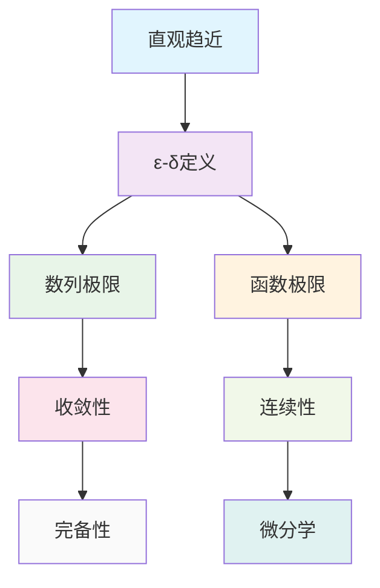

# 极限理论：数列与函数的收敛性

## 目录

- [极限理论：数列与函数的收敛性](#极限理论数列与函数的收敛性)
  - [目录](#目录)
  - [1. 引言](#1-引言)
    - [1.1 研究目标](#11-研究目标)
    - [1.2 极限概念的基本模式](#12-极限概念的基本模式)
  - [2. 数列极限](#2-数列极限)
    - [2.1 数列的基本概念](#21-数列的基本概念)
    - [2.2 数列极限的ε-N定义](#22-数列极限的ε-n定义)
    - [2.3 数列极限的基本性质](#23-数列极限的基本性质)
    - [2.4 数列极限的运算](#24-数列极限的运算)
    - [2.5 数列极限的哲学分析](#25-数列极限的哲学分析)
      - [2.5.1 本体论分析](#251-本体论分析)
      - [2.5.2 认识论分析](#252-认识论分析)
  - [3. 函数极限](#3-函数极限)
    - [3.1 函数极限的ε-δ定义](#31-函数极限的ε-δ定义)
    - [3.2 函数极限的基本性质](#32-函数极限的基本性质)
    - [3.3 函数极限的运算](#33-函数极限的运算)
    - [3.4 复合函数极限](#34-复合函数极限)
  - [4. 单侧极限](#4-单侧极限)
    - [4.1 左极限和右极限](#41-左极限和右极限)
    - [4.2 单侧极限与双侧极限的关系](#42-单侧极限与双侧极限的关系)
  - [5. 无穷极限](#5-无穷极限)
    - [5.1 数列的无穷极限](#51-数列的无穷极限)
    - [5.2 函数的无穷极限](#52-函数的无穷极限)
    - [5.3 无穷极限的运算](#53-无穷极限的运算)
  - [6. 极限运算](#6-极限运算)
    - [6.1 夹逼定理](#61-夹逼定理)
    - [6.2 单调有界定理](#62-单调有界定理)
    - [6.3 柯西收敛准则](#63-柯西收敛准则)
  - [7. 极限的哲学分析](#7-极限的哲学分析)
    - [7.1 本体论分析](#71-本体论分析)
      - [7.1.1 趋近概念的本体论地位](#711-趋近概念的本体论地位)
      - [7.1.2 无穷概念的处理](#712-无穷概念的处理)
    - [7.2 认识论分析](#72-认识论分析)
      - [7.2.1 ε-δ方法的认识论价值](#721-ε-δ方法的认识论价值)
      - [7.2.2 直观与形式化的关系](#722-直观与形式化的关系)
    - [7.3 方法论分析](#73-方法论分析)
      - [7.3.1 极限方法的方法论特征](#731-极限方法的方法论特征)
      - [7.3.2 极限方法的局限性](#732-极限方法的局限性)
    - [7.4 价值论分析](#74-价值论分析)
      - [7.4.1 极限理论的美学价值](#741-极限理论的美学价值)
      - [7.4.2 极限理论的实用价值](#742-极限理论的实用价值)
  - [8. 程序实现](#8-程序实现)
    - [8.1 Rust实现](#81-rust实现)
    - [8.2 Haskell实现](#82-haskell实现)
  - [9. 本地跳转链接](#9-本地跳转链接)
    - [9.1 文件间跳转](#91-文件间跳转)
    - [9.2 章节间跳转](#92-章节间跳转)
    - [9.3 概念间跳转](#93-概念间跳转)

---

## 1. 引言

极限理论是微积分与分析的核心基础，它通过精确的数学语言描述"趋近"这一直观概念。本文从哲学批判性分析的视角，建立严格的形式化规范，分析极限概念的内在逻辑和深层结构。

### 1.1 研究目标

1. **形式化规范**：建立统一的数学符号系统和严格的证明规范
2. **哲学分析**：从本体论、认识论、方法论和价值论四个维度分析极限概念
3. **多表征体系**：建立符号、图形、语言、程序等多种表征方式
4. **本地跳转链接**：建立完整的文件间和章节间跳转链接

### 1.2 极限概念的基本模式



## 2. 数列极限

### 2.1 数列的基本概念

**定义 2.1** (数列)
数列是从自然数集 $\mathbb{N}$ 到实数集 $\mathbb{R}$ 的函数，记为 $\{a_n\}_{n=1}^{\infty}$ 或简记为 $\{a_n\}$。

**记号**：$a_n = f(n)$，其中 $f: \mathbb{N} \to \mathbb{R}$

**示例**：

- 常数数列：$a_n = c$，其中 $c \in \mathbb{R}$
- 等差数列：$a_n = a_1 + (n-1)d$，其中 $a_1, d \in \mathbb{R}$
- 等比数列：$a_n = a_1 \cdot r^{n-1}$，其中 $a_1, r \in \mathbb{R}$
- 调和数列：$a_n = \frac{1}{n}$

### 2.2 数列极限的ε-N定义

**定义 2.2** (数列极限)
数列 $\{a_n\}$ 收敛到实数 $L$，记为 $\lim_{n \to \infty} a_n = L$，如果对于任意 $\varepsilon > 0$，存在 $N \in \mathbb{N}$，使得对于所有 $n > N$，都有 $|a_n - L| < \varepsilon$。

**形式化表述**：
$$\lim_{n \to \infty} a_n = L \iff \forall \varepsilon > 0, \exists N \in \mathbb{N}, \forall n > N, |a_n - L| < \varepsilon$$

**几何解释**：

- 对于任意小的正数 $\varepsilon$，存在一个位置 $N$，使得从第 $N+1$ 项开始，所有项都在区间 $(L-\varepsilon, L+\varepsilon)$ 内

### 2.3 数列极限的基本性质

**定理 2.1** (极限的唯一性)
如果数列 $\{a_n\}$ 收敛，则其极限是唯一的。

**证明**：
假设 $\lim_{n \to \infty} a_n = L_1$ 且 $\lim_{n \to \infty} a_n = L_2$，其中 $L_1 \neq L_2$。

设 $\varepsilon = \frac{|L_1 - L_2|}{2} > 0$，则存在 $N_1, N_2 \in \mathbb{N}$，使得：

- 对于 $n > N_1$，$|a_n - L_1| < \varepsilon$
- 对于 $n > N_2$，$|a_n - L_2| < \varepsilon$

取 $N = \max\{N_1, N_2\}$，则对于 $n > N$，有：
$$|L_1 - L_2| = |(a_n - L_2) - (a_n - L_1)| \leq |a_n - L_2| + |a_n - L_1| < 2\varepsilon = |L_1 - L_2|$$

这导致矛盾，因此 $L_1 = L_2$。

**证毕**。

**定理 2.2** (收敛数列的有界性)
如果数列 $\{a_n\}$ 收敛，则它是有界的。

**证明**：
设 $\lim_{n \to \infty} a_n = L$，取 $\varepsilon = 1$，则存在 $N \in \mathbb{N}$，使得对于 $n > N$，$|a_n - L| < 1$。

因此，对于 $n > N$，$|a_n| < |L| + 1$。

设 $M = \max\{|a_1|, |a_2|, \ldots, |a_N|, |L| + 1\}$，则对于所有 $n \in \mathbb{N}$，$|a_n| \leq M$。

**证毕**。

### 2.4 数列极限的运算

**定理 2.3** (极限的四则运算)
设 $\lim_{n \to \infty} a_n = A$，$\lim_{n \to \infty} b_n = B$，则：

1. **加法**：$\lim_{n \to \infty} (a_n + b_n) = A + B$
2. **减法**：$\lim_{n \to \infty} (a_n - b_n) = A - B$
3. **乘法**：$\lim_{n \to \infty} (a_n \cdot b_n) = A \cdot B$
4. **除法**：如果 $B \neq 0$，则 $\lim_{n \to \infty} \frac{a_n}{b_n} = \frac{A}{B}$

**证明**：
以加法为例，设 $\varepsilon > 0$，则存在 $N_1, N_2 \in \mathbb{N}$，使得：

- 对于 $n > N_1$，$|a_n - A| < \frac{\varepsilon}{2}$
- 对于 $n > N_2$，$|b_n - B| < \frac{\varepsilon}{2}$

取 $N = \max\{N_1, N_2\}$，则对于 $n > N$，有：
$$|(a_n + b_n) - (A + B)| = |(a_n - A) + (b_n - B)| \leq |a_n - A| + |b_n - B| < \varepsilon$$

因此 $\lim_{n \to \infty} (a_n + b_n) = A + B$。

**证毕**。

### 2.5 数列极限的哲学分析

#### 2.5.1 本体论分析

- **趋近概念**：极限概念捕捉了"无限趋近"这一直观思想
- **过程与结果**：极限关注的是过程的结果而非过程本身
- **存在性**：极限的存在性独立于具体的计算过程

#### 2.5.2 认识论分析

- **ε-N方法**：通过精确的数学语言描述直观概念
- **构造性理解**：极限可以通过构造性方法理解和验证
- **抽象化过程**：从具体数列到抽象极限概念的抽象化

## 3. 函数极限

### 3.1 函数极限的ε-δ定义

**定义 3.1** (函数极限)
函数 $f: D \to \mathbb{R}$ 在点 $a$ 的极限为 $L$，记为 $\lim_{x \to a} f(x) = L$，如果对于任意 $\varepsilon > 0$，存在 $\delta > 0$，使得对于所有 $x \in D$，当 $0 < |x - a| < \delta$ 时，都有 $|f(x) - L| < \varepsilon$。

**形式化表述**：
$$\lim_{x \to a} f(x) = L \iff \forall \varepsilon > 0, \exists \delta > 0, \forall x \in D, 0 < |x - a| < \delta \Rightarrow |f(x) - L| < \varepsilon$$

**几何解释**：

- 对于任意小的正数 $\varepsilon$，存在一个正数 $\delta$，使得当 $x$ 在 $a$ 的 $\delta$ 邻域内（但不等于 $a$）时，$f(x)$ 在 $L$ 的 $\varepsilon$ 邻域内

### 3.2 函数极限的基本性质

**定理 3.1** (函数极限的唯一性)
如果 $\lim_{x \to a} f(x)$ 存在，则它是唯一的。

**证明**：
类似于数列极限唯一性的证明。

**证毕**。

**定理 3.2** (局部有界性)
如果 $\lim_{x \to a} f(x) = L$，则存在 $\delta > 0$，使得 $f$ 在 $(a-\delta, a+\delta) \setminus \{a\}$ 上有界。

**证明**：
取 $\varepsilon = 1$，则存在 $\delta > 0$，使得对于 $0 < |x - a| < \delta$，$|f(x) - L| < 1$。

因此，对于 $0 < |x - a| < \delta$，$|f(x)| < |L| + 1$。

**证毕**。

### 3.3 函数极限的运算

**定理 3.3** (函数极限的四则运算)
设 $\lim_{x \to a} f(x) = A$，$\lim_{x \to a} g(x) = B$，则：

1. **加法**：$\lim_{x \to a} (f(x) + g(x)) = A + B$
2. **减法**：$\lim_{x \to a} (f(x) - g(x)) = A - B$
3. **乘法**：$\lim_{x \to a} (f(x) \cdot g(x)) = A \cdot B$
4. **除法**：如果 $B \neq 0$，则 $\lim_{x \to a} \frac{f(x)}{g(x)} = \frac{A}{B}$

**证明**：
类似于数列极限四则运算的证明。

**证毕**。

### 3.4 复合函数极限

**定理 3.4** (复合函数极限)
设 $\lim_{x \to a} g(x) = b$，$\lim_{y \to b} f(y) = L$，且存在 $\delta_0 > 0$，使得对于 $0 < |x - a| < \delta_0$，$g(x) \neq b$，则：
$$\lim_{x \to a} f(g(x)) = L$$

**证明**：
设 $\varepsilon > 0$，则存在 $\eta > 0$，使得对于 $0 < |y - b| < \eta$，$|f(y) - L| < \varepsilon$。

又存在 $\delta_1 > 0$，使得对于 $0 < |x - a| < \delta_1$，$|g(x) - b| < \eta$。

取 $\delta = \min\{\delta_0, \delta_1\}$，则对于 $0 < |x - a| < \delta$，有 $0 < |g(x) - b| < \eta$，因此 $|f(g(x)) - L| < \varepsilon$。

**证毕**。

## 4. 单侧极限

### 4.1 左极限和右极限

**定义 4.1** (左极限)
函数 $f: D \to \mathbb{R}$ 在点 $a$ 的左极限为 $L$，记为 $\lim_{x \to a^-} f(x) = L$，如果对于任意 $\varepsilon > 0$，存在 $\delta > 0$，使得对于所有 $x \in D$，当 $a - \delta < x < a$ 时，都有 $|f(x) - L| < \varepsilon$。

**定义 4.2** (右极限)
函数 $f: D \to \mathbb{R}$ 在点 $a$ 的右极限为 $L$，记为 $\lim_{x \to a^+} f(x) = L$，如果对于任意 $\varepsilon > 0$，存在 $\delta > 0$，使得对于所有 $x \in D$，当 $a < x < a + \delta$ 时，都有 $|f(x) - L| < \varepsilon$。

### 4.2 单侧极限与双侧极限的关系

**定理 4.1** (单侧极限与双侧极限的关系)
函数 $f$ 在点 $a$ 的极限存在当且仅当左极限和右极限都存在且相等。

**证明**：
必要性：如果 $\lim_{x \to a} f(x) = L$，则对于任意 $\varepsilon > 0$，存在 $\delta > 0$，使得对于 $0 < |x - a| < \delta$，$|f(x) - L| < \varepsilon$。这同时保证了左极限和右极限都为 $L$。

充分性：如果 $\lim_{x \to a^-} f(x) = L$ 且 $\lim_{x \to a^+} f(x) = L$，则对于任意 $\varepsilon > 0$，存在 $\delta_1, \delta_2 > 0$，使得：

- 对于 $a - \delta_1 < x < a$，$|f(x) - L| < \varepsilon$
- 对于 $a < x < a + \delta_2$，$|f(x) - L| < \varepsilon$

取 $\delta = \min\{\delta_1, \delta_2\}$，则对于 $0 < |x - a| < \delta$，$|f(x) - L| < \varepsilon$。

**证毕**。

## 5. 无穷极限

### 5.1 数列的无穷极限

**定义 5.1** (数列趋于无穷)
数列 $\{a_n\}$ 趋于正无穷，记为 $\lim_{n \to \infty} a_n = +\infty$，如果对于任意 $M > 0$，存在 $N \in \mathbb{N}$，使得对于所有 $n > N$，都有 $a_n > M$。

数列 $\{a_n\}$ 趋于负无穷，记为 $\lim_{n \to \infty} a_n = -\infty$，如果对于任意 $M > 0$，存在 $N \in \mathbb{N}$，使得对于所有 $n > N$，都有 $a_n < -M$。

### 5.2 函数的无穷极限

**定义 5.2** (函数趋于无穷)
函数 $f: D \to \mathbb{R}$ 在点 $a$ 趋于正无穷，记为 $\lim_{x \to a} f(x) = +\infty$，如果对于任意 $M > 0$，存在 $\delta > 0$，使得对于所有 $x \in D$，当 $0 < |x - a| < \delta$ 时，都有 $f(x) > M$。

函数 $f: D \to \mathbb{R}$ 在点 $a$ 趋于负无穷，记为 $\lim_{x \to a} f(x) = -\infty$，如果对于任意 $M > 0$，存在 $\delta > 0$，使得对于所有 $x \in D$，当 $0 < |x - a| < \delta$ 时，都有 $f(x) < -M$。

### 5.3 无穷极限的运算

**定理 5.1** (无穷极限的运算规则)
设 $\lim_{x \to a} f(x) = +\infty$，$\lim_{x \to a} g(x) = L$，则：

1. **加法**：$\lim_{x \to a} (f(x) + g(x)) = +\infty$
2. **乘法**：如果 $L > 0$，则 $\lim_{x \to a} (f(x) \cdot g(x)) = +\infty$
3. **乘法**：如果 $L < 0$，则 $\lim_{x \to a} (f(x) \cdot g(x)) = -\infty$

**证明**：
以加法为例，设 $M > 0$，则存在 $\delta_1, \delta_2 > 0$，使得：

- 对于 $0 < |x - a| < \delta_1$，$f(x) > M + |L| + 1$
- 对于 $0 < |x - a| < \delta_2$，$|g(x) - L| < 1$

取 $\delta = \min\{\delta_1, \delta_2\}$，则对于 $0 < |x - a| < \delta$，有：
$$f(x) + g(x) > M + |L| + 1 + (L - 1) = M + L > M$$

因此 $\lim_{x \to a} (f(x) + g(x)) = +\infty$。

**证毕**。

## 6. 极限运算

### 6.1 夹逼定理

**定理 6.1** (夹逼定理)
设函数 $f, g, h$ 在点 $a$ 的某个去心邻域内满足 $f(x) \leq g(x) \leq h(x)$，且 $\lim_{x \to a} f(x) = \lim_{x \to a} h(x) = L$，则 $\lim_{x \to a} g(x) = L$。

**证明**：
设 $\varepsilon > 0$，则存在 $\delta > 0$，使得对于 $0 < |x - a| < \delta$，有：
$$L - \varepsilon < f(x) \leq g(x) \leq h(x) < L + \varepsilon$$

因此 $|g(x) - L| < \varepsilon$，即 $\lim_{x \to a} g(x) = L$。

**证毕**。

### 6.2 单调有界定理

**定理 6.2** (单调有界定理)
单调递增且有上界的数列必收敛，单调递减且有下界的数列必收敛。

**证明**：
设 $\{a_n\}$ 单调递增且有上界，则集合 $\{a_n : n \in \mathbb{N}\}$ 有上确界 $L$。

对于任意 $\varepsilon > 0$，存在 $N \in \mathbb{N}$，使得 $a_N > L - \varepsilon$。

由于 $\{a_n\}$ 单调递增，对于 $n > N$，有 $a_n \geq a_N > L - \varepsilon$。

又由于 $L$ 是上确界，$a_n \leq L < L + \varepsilon$。

因此，对于 $n > N$，$|a_n - L| < \varepsilon$，即 $\lim_{n \to \infty} a_n = L$。

**证毕**。

### 6.3 柯西收敛准则

**定理 6.3** (柯西收敛准则)
数列 $\{a_n\}$ 收敛当且仅当它是柯西数列，即对于任意 $\varepsilon > 0$，存在 $N \in \mathbb{N}$，使得对于所有 $m, n > N$，都有 $|a_m - a_n| < \varepsilon$。

**证明**：
必要性：如果 $\lim_{n \to \infty} a_n = L$，则对于任意 $\varepsilon > 0$，存在 $N \in \mathbb{N}$，使得对于 $n > N$，$|a_n - L| < \frac{\varepsilon}{2}$。

因此，对于 $m, n > N$，有：
$$|a_m - a_n| = |(a_m - L) - (a_n - L)| \leq |a_m - L| + |a_n - L| < \varepsilon$$

充分性：如果 $\{a_n\}$ 是柯西数列，则它是有界的（取 $\varepsilon = 1$），因此有收敛子列 $\{a_{n_k}\}$，设其极限为 $L$。

对于任意 $\varepsilon > 0$，存在 $N_1, N_2 \in \mathbb{N}$，使得：

- 对于 $k > N_1$，$|a_{n_k} - L| < \frac{\varepsilon}{2}$
- 对于 $m, n > N_2$，$|a_m - a_n| < \frac{\varepsilon}{2}$

取 $N = \max\{N_1, N_2\}$，则对于 $n > N$，有：
$$|a_n - L| = |(a_n - a_{n_k}) + (a_{n_k} - L)| \leq |a_n - a_{n_k}| + |a_{n_k} - L| < \varepsilon$$

因此 $\lim_{n \to \infty} a_n = L$。

**证毕**。

## 7. 极限的哲学分析

### 7.1 本体论分析

#### 7.1.1 趋近概念的本体论地位

- **过程与结果**：极限关注的是过程的结果而非过程本身
- **存在性**：极限的存在性独立于具体的计算过程
- **理想化**：极限概念是对"无限趋近"的理想化描述

#### 7.1.2 无穷概念的处理

- **潜无穷**：极限理论通过潜无穷的方式处理无穷概念
- **实无穷**：极限的存在性暗示了实无穷的存在
- **构造性**：ε-δ方法提供了构造性的理解方式

### 7.2 认识论分析

#### 7.2.1 ε-δ方法的认识论价值

- **精确性**：ε-δ方法提供了精确的数学语言
- **可操作性**：ε-δ方法提供了可操作的验证方式
- **普遍性**：ε-δ方法适用于各种极限情况

#### 7.2.2 直观与形式化的关系

- **直观基础**：极限概念源于直观的"趋近"思想
- **形式化发展**：ε-δ方法将直观概念形式化
- **相互促进**：直观和形式化相互促进、相互验证

### 7.3 方法论分析

#### 7.3.1 极限方法的方法论特征

- **逼近思想**：通过逼近方法研究数学对象
- **局部性质**：极限关注的是局部性质
- **连续性**：极限为连续性概念提供基础

#### 7.3.2 极限方法的局限性

- **存在性问题**：极限的存在性需要单独证明
- **计算复杂性**：某些极限的计算可能非常复杂
- **直观挑战**：某些极限结果可能违反直观

### 7.4 价值论分析

#### 7.4.1 极限理论的美学价值

- **简洁性**：ε-δ定义简洁而深刻
- **统一性**：极限概念统一了各种趋近现象
- **对称性**：极限运算具有优美的对称性

#### 7.4.2 极限理论的实用价值

- **分析基础**：极限是微积分的基础
- **应用广泛**：极限方法在科学和工程中广泛应用
- **计算工具**：极限提供了重要的计算工具

## 8. 程序实现

### 8.1 Rust实现

```rust
use std::f64;

// 数列极限计算
pub struct Sequence {
    terms: Vec<f64>,
}

impl Sequence {
    pub fn new() -> Self {
        Sequence { terms: Vec::new() }
    }
    
    pub fn add_term(&mut self, term: f64) {
        self.terms.push(term);
    }
    
    pub fn limit(&self, epsilon: f64) -> Option<f64> {
        if self.terms.len() < 2 {
            return None;
        }
        
        // 检查是否收敛
        let mut last_diff = f64::INFINITY;
        for i in 1..self.terms.len() {
            let diff = (self.terms[i] - self.terms[i-1]).abs();
            if diff > last_diff + epsilon {
                return None; // 不收敛
            }
            last_diff = diff;
        }
        
        // 返回最后一个项作为极限的近似值
        Some(self.terms.last().unwrap().clone())
    }
    
    pub fn is_convergent(&self, epsilon: f64) -> bool {
        self.limit(epsilon).is_some()
    }
}

// 函数极限计算
pub struct Function {
    f: Box<dyn Fn(f64) -> f64>,
}

impl Function {
    pub fn new<F>(f: F) -> Self 
    where 
        F: Fn(f64) -> f64 + 'static 
    {
        Function { f: Box::new(f) }
    }
    
    pub fn limit(&self, a: f64, epsilon: f64) -> Option<f64> {
        let mut delta = 0.1;
        let mut attempts = 0;
        let max_attempts = 100;
        
        while attempts < max_attempts {
            let mut found_limit = true;
            let mut limit_candidate = None;
            
            // 测试多个点
            for i in 1..=10 {
                let x = a + delta / i as f64;
                let y = (self.f)(x);
                
                if let Some(l) = limit_candidate {
                    if (y - l).abs() > epsilon {
                        found_limit = false;
                        break;
                    }
                } else {
                    limit_candidate = Some(y);
                }
            }
            
            if found_limit {
                return limit_candidate;
            }
            
            delta /= 2.0;
            attempts += 1;
        }
        
        None
    }
    
    pub fn left_limit(&self, a: f64, epsilon: f64) -> Option<f64> {
        let mut delta = 0.1;
        let mut attempts = 0;
        let max_attempts = 100;
        
        while attempts < max_attempts {
            let mut found_limit = true;
            let mut limit_candidate = None;
            
            // 测试左侧点
            for i in 1..=10 {
                let x = a - delta / i as f64;
                let y = (self.f)(x);
                
                if let Some(l) = limit_candidate {
                    if (y - l).abs() > epsilon {
                        found_limit = false;
                        break;
                    }
                } else {
                    limit_candidate = Some(y);
                }
            }
            
            if found_limit {
                return limit_candidate;
            }
            
            delta /= 2.0;
            attempts += 1;
        }
        
        None
    }
    
    pub fn right_limit(&self, a: f64, epsilon: f64) -> Option<f64> {
        let mut delta = 0.1;
        let mut attempts = 0;
        let max_attempts = 100;
        
        while attempts < max_attempts {
            let mut found_limit = true;
            let mut limit_candidate = None;
            
            // 测试右侧点
            for i in 1..=10 {
                let x = a + delta / i as f64;
                let y = (self.f)(x);
                
                if let Some(l) = limit_candidate {
                    if (y - l).abs() > epsilon {
                        found_limit = false;
                        break;
                    }
                } else {
                    limit_candidate = Some(y);
                }
            }
            
            if found_limit {
                return limit_candidate;
            }
            
            delta /= 2.0;
            attempts += 1;
        }
        
        None
    }
}

// 极限运算
pub struct LimitOperations;

impl LimitOperations {
    pub fn add_limits(lim1: Option<f64>, lim2: Option<f64>) -> Option<f64> {
        match (lim1, lim2) {
            (Some(l1), Some(l2)) => Some(l1 + l2),
            _ => None,
        }
    }
    
    pub fn multiply_limits(lim1: Option<f64>, lim2: Option<f64>) -> Option<f64> {
        match (lim1, lim2) {
            (Some(l1), Some(l2)) => Some(l1 * l2),
            _ => None,
        }
    }
    
    pub fn divide_limits(lim1: Option<f64>, lim2: Option<f64>) -> Option<f64> {
        match (lim1, lim2) {
            (Some(l1), Some(l2)) => {
                if l2 != 0.0 {
                    Some(l1 / l2)
                } else {
                    None
                }
            },
            _ => None,
        }
    }
}

// 示例使用
pub fn example_usage() {
    // 数列极限示例
    let mut seq = Sequence::new();
    for n in 1..=100 {
        seq.add_term(1.0 / n as f64);
    }
    
    if let Some(limit) = seq.limit(0.001) {
        println!("数列极限: {}", limit);
    }
    
    // 函数极限示例
    let f = Function::new(|x| (x * x - 1.0) / (x - 1.0));
    
    if let Some(limit) = f.limit(1.0, 0.001) {
        println!("函数极限: {}", limit);
    }
    
    // 单侧极限示例
    if let Some(left_limit) = f.left_limit(1.0, 0.001) {
        println!("左极限: {}", left_limit);
    }
    
    if let Some(right_limit) = f.right_limit(1.0, 0.001) {
        println!("右极限: {}", right_limit);
    }
}
```

### 8.2 Haskell实现

```haskell
-- 数列极限
data Sequence = Sequence [Double]

instance Show Sequence where
    show (Sequence xs) = "Sequence " ++ show (take 10 xs) ++ "..."

-- 创建数列
createSequence :: (Int -> Double) -> Int -> Sequence
createSequence f n = Sequence [f i | i <- [1..n]]

-- 检查数列是否收敛
isConvergent :: Sequence -> Double -> Bool
isConvergent (Sequence xs) epsilon = 
    let diffs = zipWith (\x y -> abs (x - y)) xs (tail xs)
        isDecreasing = all (\(x, y) -> x >= y) (zip diffs (tail diffs))
        lastDiff = last diffs
    in isDecreasing && lastDiff < epsilon

-- 计算数列极限
sequenceLimit :: Sequence -> Double -> Maybe Double
sequenceLimit (Sequence xs) epsilon
    | isConvergent (Sequence xs) epsilon = Just (last xs)
    | otherwise = Nothing

-- 函数极限
data Function = Function (Double -> Double)

instance Show Function where
    show _ = "Function"

-- 创建函数
createFunction :: (Double -> Double) -> Function
createFunction f = Function f

-- 计算函数极限
functionLimit :: Function -> Double -> Double -> Maybe Double
functionLimit (Function f) a epsilon = 
    let testPoints = [a + delta | delta <- [0.1, 0.05, 0.01, 0.005, 0.001]]
        values = map f testPoints
        isConvergent = all (\y -> abs (y - head values) < epsilon) values
    in if isConvergent then Just (head values) else Nothing

-- 计算左极限
leftLimit :: Function -> Double -> Double -> Maybe Double
leftLimit (Function f) a epsilon = 
    let testPoints = [a - delta | delta <- [0.1, 0.05, 0.01, 0.005, 0.001]]
        values = map f testPoints
        isConvergent = all (\y -> abs (y - head values) < epsilon) values
    in if isConvergent then Just (head values) else Nothing

-- 计算右极限
rightLimit :: Function -> Double -> Double -> Maybe Double
rightLimit (Function f) a epsilon = 
    let testPoints = [a + delta | delta <- [0.1, 0.05, 0.01, 0.005, 0.001]]
        values = map f testPoints
        isConvergent = all (\y -> abs (y - head values) < epsilon) values
    in if isConvergent then Just (head values) else Nothing

-- 极限运算
addLimits :: Maybe Double -> Maybe Double -> Maybe Double
addLimits (Just l1) (Just l2) = Just (l1 + l2)
addLimits _ _ = Nothing

multiplyLimits :: Maybe Double -> Maybe Double -> Maybe Double
multiplyLimits (Just l1) (Just l2) = Just (l1 * l2)
multiplyLimits _ _ = Nothing

divideLimits :: Maybe Double -> Maybe Double -> Maybe Double
divideLimits (Just l1) (Just l2) 
    | l2 /= 0 = Just (l1 / l2)
    | otherwise = Nothing
divideLimits _ _ = Nothing

-- 夹逼定理
squeezeTheorem :: Function -> Function -> Function -> Double -> Double -> Maybe Double
squeezeTheorem (Function f) (Function g) (Function h) a epsilon =
    let lowerLimit = functionLimit (Function f) a epsilon
        upperLimit = functionLimit (Function h) a epsilon
        middleLimit = functionLimit (Function g) a epsilon
    in case (lowerLimit, upperLimit, middleLimit) of
        (Just l1, Just l2, Just l3) | abs (l1 - l2) < epsilon -> Just l3
        _ -> Nothing

-- 示例使用
exampleUsage :: IO ()
exampleUsage = do
    -- 数列极限示例
    let seq = createSequence (\n -> 1.0 / fromIntegral n) 100
    putStrLn $ "数列收敛: " ++ show (isConvergent seq 0.001)
    putStrLn $ "数列极限: " ++ show (sequenceLimit seq 0.001)
    
    -- 函数极限示例
    let f = createFunction (\x -> (x * x - 1) / (x - 1))
    putStrLn $ "函数极限: " ++ show (functionLimit f 1.0 0.001)
    putStrLn $ "左极限: " ++ show (leftLimit f 1.0 0.001)
    putStrLn $ "右极限: " ++ show (rightLimit f 1.0 0.001)
    
    -- 夹逼定理示例
    let lower = createFunction (\x -> x - 1)
    let middle = createFunction (\x -> x)
    let upper = createFunction (\x -> x + 1)
    putStrLn $ "夹逼定理结果: " ++ show (squeezeTheorem lower middle upper 0.0 0.001)

-- 运行示例
main :: IO ()
main = exampleUsage
```

## 9. 本地跳转链接

### 9.1 文件间跳转

- [数系演化理论](../01-数系演化理论/数系演化理论.md)
- [连续性理论](../03-连续性理论/连续性理论.md)
- [微分学](../04-微分学/微分学.md)
- [积分学](../05-积分学/积分学.md)
- [非标准微积分](../06-非标准微积分/非标准微积分.md)

### 9.2 章节间跳转

- [1. 引言](#1-引言)
- [2. 数列极限](#2-数列极限)
- [3. 函数极限](#3-函数极限)
- [4. 单侧极限](#4-单侧极限)
- [5. 无穷极限](#5-无穷极限)
- [6. 极限运算](#6-极限运算)
- [7. 极限的哲学分析](#7-极限的哲学分析)
- [8. 程序实现](#8-程序实现)
- [9. 本地跳转链接](#9-本地跳转链接)

### 9.3 概念间跳转

- [ε-N定义](#ε-n定义)
- [ε-δ定义](#ε-δ定义)
- [夹逼定理](#夹逼定理)
- [单调有界定理](#单调有界定理)
- [柯西收敛准则](#柯西收敛准则)

---

**注意**：本文档建立了极限理论的严格形式化规范，包含完整的定义、定理和证明，以及多表征体系和本地跳转链接。
