# 复分析基础

## 目录

- [复分析基础](#复分析基础)
  - [目录](#目录)
  - [1. 引言与基本概念](#1-引言与基本概念)
    - [1.1 复分析的研究对象](#11-复分析的研究对象)
    - [1.2 复数的几何意义](#12-复数的几何意义)
    - [1.3 复分析的重要性](#13-复分析的重要性)
  - [2. 复数系理论](#2-复数系理论)
    - [2.1 复数的代数结构](#21-复数的代数结构)
      - [2.1.1 复数的定义](#211-复数的定义)
      - [2.1.2 复数的运算](#212-复数的运算)
      - [2.1.3 复数的代数性质](#213-复数的代数性质)
    - [2.2 复数的几何表示](#22-复数的几何表示)
      - [2.2.1 复平面](#221-复平面)
      - [2.2.2 极坐标表示](#222-极坐标表示)
      - [2.2.3 德摩弗公式](#223-德摩弗公式)
    - [2.3 复数的拓扑性质](#23-复数的拓扑性质)
      - [2.3.1 复平面的拓扑](#231-复平面的拓扑)
      - [2.3.2 开集和闭集](#232-开集和闭集)
      - [2.3.3 连通性](#233-连通性)
  - [3. 复函数论](#3-复函数论)
    - [3.1 复函数的定义](#31-复函数的定义)
      - [3.1.1 复函数](#311-复函数)
      - [3.1.2 复函数的表示](#312-复函数的表示)
    - [3.2 复函数的连续性](#32-复函数的连续性)
      - [3.2.1 连续性的定义](#321-连续性的定义)
      - [3.2.2 连续性的等价条件](#322-连续性的等价条件)
    - [3.3 复函数的可微性](#33-复函数的可微性)
      - [3.3.1 复导数的定义](#331-复导数的定义)
      - [3.3.2 可微性的几何意义](#332-可微性的几何意义)
  - [4. 解析函数](#4-解析函数)
    - [4.1 解析函数的定义](#41-解析函数的定义)
      - [4.1.1 解析函数](#411-解析函数)
      - [4.1.2 全纯函数](#412-全纯函数)
      - [4.1.3 整函数](#413-整函数)
    - [4.2 柯西-黎曼方程](#42-柯西-黎曼方程)
      - [4.2.1 柯西-黎曼方程](#421-柯西-黎曼方程)
      - [4.2.2 柯西-黎曼方程的几何意义](#422-柯西-黎曼方程的几何意义)
    - [4.3 解析函数的性质](#43-解析函数的性质)
      - [4.3.1 解析函数的幂级数展开](#431-解析函数的幂级数展开)
      - [4.3.2 解析函数的唯一性](#432-解析函数的唯一性)
      - [4.3.3 解析函数的极值原理](#433-解析函数的极值原理)
  - [5. 复积分](#5-复积分)
    - [5.1 复积分的定义](#51-复积分的定义)
      - [5.1.1 复积分的定义](#511-复积分的定义)
      - [5.1.2 复积分的性质](#512-复积分的性质)
    - [5.2 柯西积分定理](#52-柯西积分定理)
      - [5.2.1 柯西积分定理](#521-柯西积分定理)
      - [5.2.2 柯西积分定理的推广](#522-柯西积分定理的推广)
    - [5.3 柯西积分公式](#53-柯西积分公式)
      - [5.3.1 柯西积分公式](#531-柯西积分公式)
      - [5.3.2 高阶导数公式](#532-高阶导数公式)
      - [5.3.3 柯西积分公式的应用](#533-柯西积分公式的应用)
  - [6. 幂级数与泰勒级数](#6-幂级数与泰勒级数)
    - [6.1 幂级数的收敛性](#61-幂级数的收敛性)
      - [6.1.1 幂级数](#611-幂级数)
      - [6.1.2 收敛半径](#612-收敛半径)
      - [6.1.3 收敛圆](#613-收敛圆)
    - [6.2 泰勒级数](#62-泰勒级数)
      - [6.2.1 泰勒级数](#621-泰勒级数)
      - [6.2.2 常见函数的泰勒级数](#622-常见函数的泰勒级数)
    - [6.3 解析延拓](#63-解析延拓)
      - [6.3.1 解析延拓的定义](#631-解析延拓的定义)
      - [6.3.2 解析延拓的唯一性](#632-解析延拓的唯一性)
  - [7. 留数理论](#7-留数理论)
    - [7.1 孤立奇点](#71-孤立奇点)
      - [7.1.1 孤立奇点的定义](#711-孤立奇点的定义)
      - [7.1.2 孤立奇点的分类](#712-孤立奇点的分类)
    - [7.2 留数的定义](#72-留数的定义)
      - [7.2.1 留数](#721-留数)
      - [7.2.2 留数的计算](#722-留数的计算)
    - [7.3 留数定理](#73-留数定理)
      - [7.3.1 留数定理](#731-留数定理)
      - [7.3.2 留数定理的应用](#732-留数定理的应用)
  - [8. 共形映射](#8-共形映射)
    - [8.1 共形映射的定义](#81-共形映射的定义)
      - [8.1.1 共形映射](#811-共形映射)
      - [8.1.2 共形映射的性质](#812-共形映射的性质)
    - [8.2 线性分式变换](#82-线性分式变换)
      - [8.2.1 线性分式变换](#821-线性分式变换)
      - [8.2.2 线性分式变换的性质](#822-线性分式变换的性质)
    - [8.3 黎曼映射定理](#83-黎曼映射定理)
      - [8.3.1 黎曼映射定理](#831-黎曼映射定理)
      - [8.3.2 黎曼映射定理的意义](#832-黎曼映射定理的意义)
  - [9. 调和函数](#9-调和函数)
    - [9.1 调和函数的定义](#91-调和函数的定义)
      - [9.1.1 调和函数](#911-调和函数)
      - [9.1.2 调和函数与解析函数的关系](#912-调和函数与解析函数的关系)
    - [9.2 调和函数的性质](#92-调和函数的性质)
      - [9.2.1 平均值性质](#921-平均值性质)
      - [9.2.2 极值原理](#922-极值原理)
    - [9.3 泊松公式](#93-泊松公式)
      - [9.3.1 泊松公式](#931-泊松公式)
      - [9.3.2 泊松公式的应用](#932-泊松公式的应用)
  - [10. 批判性分析](#10-批判性分析)
    - [10.1 复分析的哲学基础](#101-复分析的哲学基础)
      - [10.1.1 虚数的现实意义](#1011-虚数的现实意义)
      - [10.1.2 复数的几何解释](#1012-复数的几何解释)
    - [10.2 虚数的现实意义](#102-虚数的现实意义)
      - [10.2.1 物理应用](#1021-物理应用)
      - [10.2.2 数学应用](#1022-数学应用)
    - [10.3 解析函数的限制](#103-解析函数的限制)
      - [10.3.1 解析性的严格性](#1031-解析性的严格性)
      - [10.3.2 非解析函数](#1032-非解析函数)
    - [10.4 复分析的应用局限](#104-复分析的应用局限)
      - [10.4.1 计算复杂性](#1041-计算复杂性)
      - [10.4.2 物理世界的限制](#1042-物理世界的限制)
  - [11. 应用与展望](#11-应用与展望)
    - [11.1 物理学应用](#111-物理学应用)
      - [11.1.1 量子力学](#1111-量子力学)
      - [11.1.2 电磁学](#1112-电磁学)
    - [11.2 工程学应用](#112-工程学应用)
      - [11.2.1 信号处理](#1121-信号处理)
      - [11.2.2 控制理论](#1122-控制理论)
    - [11.3 数学应用](#113-数学应用)
      - [11.3.1 数论](#1131-数论)
      - [11.3.2 代数几何](#1132-代数几何)
    - [11.4 计算机科学应用](#114-计算机科学应用)
      - [11.4.1 数值分析](#1141-数值分析)
      - [11.4.2 图像处理](#1142-图像处理)
    - [11.5 未来发展方向](#115-未来发展方向)
      - [11.5.1 多复变函数论](#1151-多复变函数论)
      - [11.5.2 复动力系统](#1152-复动力系统)
      - [11.5.3 复几何](#1153-复几何)
  - [代码示例](#代码示例)
    - [Rust 实现：复数运算和复积分](#rust-实现复数运算和复积分)
    - [Haskell 实现：解析函数和共形映射](#haskell-实现解析函数和共形映射)
  - [思维导图](#思维导图)

---

## 1. 引言与基本概念

### 1.1 复分析的研究对象

复分析是研究复变量函数的数学分支，它扩展了实分析的概念到复数域。复分析主要研究：

- 复函数的连续性、可微性和解析性
- 复积分和柯西理论
- 幂级数和解析延拓
- 留数理论和积分计算
- 共形映射和几何性质

### 1.2 复数的几何意义

复数 $z = x + iy$ 可以表示为复平面上的点 $(x, y)$，其中：

- $x$ 是实部，对应横坐标
- $y$ 是虚部，对应纵坐标
- $i$ 是虚数单位，满足 $i^2 = -1$

### 1.3 复分析的重要性

复分析在数学和物理中有重要应用：

- 为实积分提供强大的计算工具
- 在量子力学中描述波函数
- 在信号处理中分析频率响应
- 在流体力学中描述势流

## 2. 复数系理论

### 2.1 复数的代数结构

#### 2.1.1 复数的定义

复数集 $\mathbb{C}$ 定义为：
$$\mathbb{C} = \{z = x + iy : x, y \in \mathbb{R}\}$$

其中 $i$ 是虚数单位，满足 $i^2 = -1$。

#### 2.1.2 复数的运算

- **加法**：$(x_1 + iy_1) + (x_2 + iy_2) = (x_1 + x_2) + i(y_1 + y_2)$
- **乘法**：$(x_1 + iy_1)(x_2 + iy_2) = (x_1x_2 - y_1y_2) + i(x_1y_2 + x_2y_1)$
- **共轭**：$\overline{z} = x - iy$
- **模**：$|z| = \sqrt{x^2 + y^2}$

#### 2.1.3 复数的代数性质

- $\mathbb{C}$ 是一个域
- $\mathbb{C}$ 是代数闭域（任何多项式都有根）
- $\mathbb{C}$ 不是有序域

### 2.2 复数的几何表示

#### 2.2.1 复平面

复数 $z = x + iy$ 对应复平面上的点 $(x, y)$。

#### 2.2.2 极坐标表示

复数 $z = x + iy$ 可以表示为：
$$z = r(\cos \theta + i \sin \theta) = re^{i\theta}$$

其中：

- $r = |z| = \sqrt{x^2 + y^2}$ 是模
- $\theta = \arg z = \arctan \frac{y}{x}$ 是辐角

#### 2.2.3 德摩弗公式

$$(\cos \theta + i \sin \theta)^n = \cos n\theta + i \sin n\theta$$

### 2.3 复数的拓扑性质

#### 2.3.1 复平面的拓扑

复平面 $\mathbb{C}$ 与 $\mathbb{R}^2$ 同胚，具有相同的拓扑性质。

#### 2.3.2 开集和闭集

- **开圆盘**：$D(a, r) = \{z : |z - a| < r\}$
- **闭圆盘**：$\overline{D}(a, r) = \{z : |z - a| \leq r\}$
- **圆周**：$C(a, r) = \{z : |z - a| = r\}$

#### 2.3.3 连通性

复平面是连通的，任何两点都可以用连续曲线连接。

## 3. 复函数论

### 3.1 复函数的定义

#### 3.1.1 复函数

复函数是从复数集到复数集的映射：
$$f: \Omega \to \mathbb{C}$$

其中 $\Omega \subset \mathbb{C}$ 是定义域。

#### 3.1.2 复函数的表示

复函数 $f(z)$ 可以表示为：
$$f(z) = u(x, y) + iv(x, y)$$

其中 $u$ 和 $v$ 是实值函数。

### 3.2 复函数的连续性

#### 3.2.1 连续性的定义

复函数 $f$ 在点 $z_0$ 处连续，如果：
$$\lim_{z \to z_0} f(z) = f(z_0)$$

#### 3.2.2 连续性的等价条件

$f$ 在 $z_0$ 处连续当且仅当：

1. $u$ 和 $v$ 在 $(x_0, y_0)$ 处连续
2. 对于任意 $\epsilon > 0$，存在 $\delta > 0$ 使得当 $|z - z_0| < \delta$ 时，$|f(z) - f(z_0)| < \epsilon$

### 3.3 复函数的可微性

#### 3.3.1 复导数的定义

复函数 $f$ 在点 $z_0$ 处可微，如果极限：
$$f'(z_0) = \lim_{h \to 0} \frac{f(z_0 + h) - f(z_0)}{h}$$

存在，其中 $h$ 是复数。

#### 3.3.2 可微性的几何意义

复导数 $f'(z_0)$ 表示函数在 $z_0$ 处的局部线性变换：

- $|f'(z_0)|$ 表示局部伸缩因子
- $\arg f'(z_0)$ 表示局部旋转角度

## 4. 解析函数

### 4.1 解析函数的定义

#### 4.1.1 解析函数

函数 $f$ 在开集 $\Omega$ 上解析，如果它在 $\Omega$ 的每一点处都可微。

#### 4.1.2 全纯函数

解析函数也称为全纯函数（holomorphic function）。

#### 4.1.3 整函数

在整个复平面上解析的函数称为整函数。

### 4.2 柯西-黎曼方程

#### 4.2.1 柯西-黎曼方程

如果 $f(z) = u(x, y) + iv(x, y)$ 在点 $z_0 = x_0 + iy_0$ 处可微，则：
$$\frac{\partial u}{\partial x} = \frac{\partial v}{\partial y}, \quad \frac{\partial u}{\partial y} = -\frac{\partial v}{\partial x}$$

#### 4.2.2 柯西-黎曼方程的几何意义

柯西-黎曼方程表示函数在可微点处的雅可比矩阵具有特殊形式：
$$J = \begin{pmatrix} a & -b \\ b & a \end{pmatrix}$$

这对应于复数的乘法。

### 4.3 解析函数的性质

#### 4.3.1 解析函数的幂级数展开

解析函数在任意点附近都可以展开为幂级数。

#### 4.3.2 解析函数的唯一性

如果两个解析函数在某个点集上相等，且该点集有聚点，则它们在公共定义域上相等。

#### 4.3.3 解析函数的极值原理

解析函数的模在区域内部不能达到最大值，除非函数为常数。

## 5. 复积分

### 5.1 复积分的定义

#### 5.1.1 复积分的定义

复积分定义为：
$$\int_C f(z) dz = \int_a^b f(\gamma(t)) \gamma'(t) dt$$

其中 $C$ 是参数曲线 $\gamma: [a, b] \to \mathbb{C}$。

#### 5.1.2 复积分的性质

- **线性性**：$\int_C (af + bg)(z) dz = a\int_C f(z) dz + b\int_C g(z) dz$
- **路径可加性**：$\int_{C_1 + C_2} f(z) dz = \int_{C_1} f(z) dz + \int_{C_2} f(z) dz$
- **方向性**：$\int_{-C} f(z) dz = -\int_C f(z) dz$

### 5.2 柯西积分定理

#### 5.2.1 柯西积分定理

如果 $f$ 在单连通区域 $\Omega$ 上解析，$C$ 是 $\Omega$ 内的简单闭曲线，则：
$$\int_C f(z) dz = 0$$

#### 5.2.2 柯西积分定理的推广

对于多连通区域，柯西积分定理仍然成立，但需要考虑所有边界曲线。

### 5.3 柯西积分公式

#### 5.3.1 柯西积分公式

如果 $f$ 在简单闭曲线 $C$ 及其内部解析，$z_0$ 在 $C$ 内部，则：
$$f(z_0) = \frac{1}{2\pi i} \int_C \frac{f(z)}{z - z_0} dz$$

#### 5.3.2 高阶导数公式

$$f^{(n)}(z_0) = \frac{n!}{2\pi i} \int_C \frac{f(z)}{(z - z_0)^{n+1}} dz$$

#### 5.3.3 柯西积分公式的应用

柯西积分公式提供了计算复积分的强大工具，特别是对于有理函数的积分。

## 6. 幂级数与泰勒级数

### 6.1 幂级数的收敛性

#### 6.1.1 幂级数

幂级数形如：
$$\sum_{n=0}^{\infty} a_n (z - z_0)^n$$

#### 6.1.2 收敛半径

幂级数的收敛半径为：
$$R = \frac{1}{\limsup_{n \to \infty} \sqrt[n]{|a_n|}}$$

#### 6.1.3 收敛圆

幂级数在圆盘 $|z - z_0| < R$ 内收敛，在 $|z - z_0| > R$ 外发散。

### 6.2 泰勒级数

#### 6.2.1 泰勒级数

解析函数 $f$ 在点 $z_0$ 处的泰勒级数为：
$$f(z) = \sum_{n=0}^{\infty} \frac{f^{(n)}(z_0)}{n!} (z - z_0)^n$$

#### 6.2.2 常见函数的泰勒级数

- $e^z = \sum_{n=0}^{\infty} \frac{z^n}{n!}$
- $\sin z = \sum_{n=0}^{\infty} \frac{(-1)^n z^{2n+1}}{(2n+1)!}$
- $\cos z = \sum_{n=0}^{\infty} \frac{(-1)^n z^{2n}}{(2n)!}$
- $\frac{1}{1-z} = \sum_{n=0}^{\infty} z^n$ （当 $|z| < 1$）

### 6.3 解析延拓

#### 6.3.1 解析延拓的定义

如果函数 $f_1$ 在区域 $\Omega_1$ 上解析，$f_2$ 在区域 $\Omega_2$ 上解析，且 $f_1 = f_2$ 在 $\Omega_1 \cap \Omega_2$ 上，则称 $f_2$ 是 $f_1$ 的解析延拓。

#### 6.3.2 解析延拓的唯一性

解析延拓是唯一的，这由解析函数的唯一性定理保证。

## 7. 留数理论

### 7.1 孤立奇点

#### 7.1.1 孤立奇点的定义

点 $z_0$ 是函数 $f$ 的孤立奇点，如果 $f$ 在 $z_0$ 的某个去心邻域内解析。

#### 7.1.2 孤立奇点的分类

- **可去奇点**：$\lim_{z \to z_0} f(z)$ 存在且有限
- **极点**：$\lim_{z \to z_0} f(z) = \infty$
- **本性奇点**：$\lim_{z \to z_0} f(z)$ 不存在

### 7.2 留数的定义

#### 7.2.1 留数

函数 $f$ 在孤立奇点 $z_0$ 处的留数定义为：
$$\text{Res}(f, z_0) = \frac{1}{2\pi i} \int_C f(z) dz$$

其中 $C$ 是围绕 $z_0$ 的小圆周。

#### 7.2.2 留数的计算

- **可去奇点**：$\text{Res}(f, z_0) = 0$
- **极点**：$\text{Res}(f, z_0) = \frac{1}{(m-1)!} \lim_{z \to z_0} \frac{d^{m-1}}{dz^{m-1}} [(z-z_0)^m f(z)]$
- **本性奇点**：需要展开洛朗级数

### 7.3 留数定理

#### 7.3.1 留数定理

如果 $f$ 在简单闭曲线 $C$ 及其内部除有限个孤立奇点外解析，则：
$$\int_C f(z) dz = 2\pi i \sum \text{Res}(f, z_k)$$

其中求和是对 $C$ 内部的所有孤立奇点。

#### 7.3.2 留数定理的应用

留数定理是计算复积分和实积分的强大工具。

## 8. 共形映射

### 8.1 共形映射的定义

#### 8.1.1 共形映射

解析函数 $f$ 在点 $z_0$ 处是共形的，如果 $f'(z_0) \neq 0$。

#### 8.1.2 共形映射的性质

- 保持角度
- 保持方向
- 局部相似变换

### 8.2 线性分式变换

#### 8.2.1 线性分式变换

线性分式变换形如：
$$w = \frac{az + b}{cz + d}$$

其中 $ad - bc \neq 0$。

#### 8.2.2 线性分式变换的性质

- 将圆映射为圆或直线
- 将直线映射为圆或直线
- 保持交比

### 8.3 黎曼映射定理

#### 8.3.1 黎曼映射定理

任何单连通区域（不等于整个复平面）都可以共形映射到单位圆盘。

#### 8.3.2 黎曼映射定理的意义

黎曼映射定理表明单连通区域在共形等价意义下只有一种类型。

## 9. 调和函数

### 9.1 调和函数的定义

#### 9.1.1 调和函数

实值函数 $u$ 是调和的，如果它满足拉普拉斯方程：
$$\Delta u = \frac{\partial^2 u}{\partial x^2} + \frac{\partial^2 u}{\partial y^2} = 0$$

#### 9.1.2 调和函数与解析函数的关系

如果 $f = u + iv$ 是解析函数，则 $u$ 和 $v$ 都是调和函数。

### 9.2 调和函数的性质

#### 9.2.1 平均值性质

调和函数在任意圆上的值等于圆心处的值。

#### 9.2.2 极值原理

调和函数在区域内部不能达到极值，除非函数为常数。

### 9.3 泊松公式

#### 9.3.1 泊松公式

如果 $u$ 在单位圆盘上调和，在闭圆盘上连续，则：
$$u(re^{i\theta}) = \frac{1}{2\pi} \int_0^{2\pi} \frac{1-r^2}{1-2r\cos(\theta-\phi)+r^2} u(e^{i\phi}) d\phi$$

#### 9.3.2 泊松公式的应用

泊松公式提供了求解狄利克雷问题的工具。

## 10. 批判性分析

### 10.1 复分析的哲学基础

#### 10.1.1 虚数的现实意义

虚数在历史上曾被认为是"虚构的"，但它在数学和物理中有重要应用。

#### 10.1.2 复数的几何解释

复数可以通过几何方式解释，这为其提供了直观的理解。

### 10.2 虚数的现实意义

#### 10.2.1 物理应用

虚数在量子力学、电磁学等物理理论中有重要应用。

#### 10.2.2 数学应用

虚数为代数方程的求解提供了完整的理论框架。

### 10.3 解析函数的限制

#### 10.3.1 解析性的严格性

解析函数具有非常严格的性质，这限制了其应用范围。

#### 10.3.2 非解析函数

许多重要的函数（如 $|z|$）不是解析的。

### 10.4 复分析的应用局限

#### 10.4.1 计算复杂性

复积分的计算可能非常复杂。

#### 10.4.2 物理世界的限制

物理世界可能不需要复数的全部结构。

## 11. 应用与展望

### 11.1 物理学应用

#### 11.1.1 量子力学

- **波函数**：量子态用复函数描述
- **薛定谔方程**：涉及复函数的时间演化
- **概率幅**：量子概率用复数的模平方表示

#### 11.1.2 电磁学

- **复数阻抗**：交流电路分析
- **电磁波**：平面波的复数表示
- **麦克斯韦方程**：在某些情况下可以用复数形式

### 11.2 工程学应用

#### 11.2.1 信号处理

- **傅里叶变换**：信号分析的基本工具
- **滤波器设计**：基于复频率响应
- **调制解调**：通信系统中的应用

#### 11.2.2 控制理论

- **传递函数**：系统分析的复数方法
- **频率响应**：系统稳定性和性能分析
- **根轨迹法**：控制系统设计

### 11.3 数学应用

#### 11.3.1 数论

- **解析数论**：使用复分析方法研究数论问题
- **黎曼猜想**：关于黎曼ζ函数零点的著名猜想
- **素数分布**：使用复积分研究素数分布

#### 11.3.2 代数几何

- **黎曼面**：复代数曲线的几何
- **复流形**：高维复几何
- **霍奇理论**：复几何中的重要理论

### 11.4 计算机科学应用

#### 11.4.1 数值分析

- **复数值方法**：求解复系数方程
- **快速傅里叶变换**：高效的信号处理算法
- **复积分数值计算**：留数定理的应用

#### 11.4.2 图像处理

- **复数滤波器**：图像增强和去噪
- **相位分析**：图像特征提取
- **复数小波**：多尺度分析

### 11.5 未来发展方向

#### 11.5.1 多复变函数论

研究多个复变量的函数，在代数几何和数论中有重要应用。

#### 11.5.2 复动力系统

研究复平面上的迭代映射，如曼德博集合和朱利亚集合。

#### 11.5.3 复几何

研究复流形和复代数几何，在现代数学中有重要地位。

---

## 代码示例

### Rust 实现：复数运算和复积分

```rust
use std::f64::consts::PI;

/// 复数结构
#[derive(Debug, Clone, Copy)]
pub struct Complex {
    pub real: f64,
    pub imag: f64,
}

impl Complex {
    pub fn new(real: f64, imag: f64) -> Self {
        Complex { real, imag }
    }
    
    /// 模
    pub fn modulus(&self) -> f64 {
        (self.real * self.real + self.imag * self.imag).sqrt()
    }
    
    /// 辐角
    pub fn argument(&self) -> f64 {
        self.imag.atan2(self.real)
    }
    
    /// 共轭
    pub fn conjugate(&self) -> Self {
        Complex::new(self.real, -self.imag)
    }
    
    /// 指数形式
    pub fn exp(&self) -> Self {
        let r = self.real.exp();
        Complex::new(r * self.imag.cos(), r * self.imag.sin())
    }
    
    /// 对数
    pub fn log(&self) -> Self {
        Complex::new(self.modulus().ln(), self.argument())
    }
    
    /// 幂
    pub fn pow(&self, n: f64) -> Self {
        let r = self.modulus().powf(n);
        let theta = self.argument() * n;
        Complex::new(r * theta.cos(), r * theta.sin())
    }
}

impl std::ops::Add for Complex {
    type Output = Self;
    
    fn add(self, other: Self) -> Self {
        Complex::new(self.real + other.real, self.imag + other.imag)
    }
}

impl std::ops::Mul for Complex {
    type Output = Self;
    
    fn mul(self, other: Self) -> Self {
        Complex::new(
            self.real * other.real - self.imag * other.imag,
            self.real * other.imag + self.imag * other.real
        )
    }
}

/// 复积分计算
pub fn complex_integral<F>(f: F, a: Complex, b: Complex, n: usize) -> Complex 
where 
    F: Fn(Complex) -> Complex 
{
    let mut sum = Complex::new(0.0, 0.0);
    let step = (b - a) * Complex::new(1.0 / n as f64, 0.0);
    
    for i in 0..n {
        let z = a + step * Complex::new(i as f64, 0.0);
        sum = sum + f(z) * step;
    }
    
    sum
}

/// 留数计算
pub fn residue<F>(f: F, z0: Complex, order: usize) -> Complex 
where 
    F: Fn(Complex) -> Complex 
{
    let mut sum = Complex::new(0.0, 0.0);
    let n = 1000;
    
    for k in 0..n {
        let theta = 2.0 * PI * k as f64 / n as f64;
        let z = z0 + Complex::new(0.1 * theta.cos(), 0.1 * theta.sin());
        let dz = Complex::new(-0.1 * theta.sin(), 0.1 * theta.cos()) * Complex::new(0.1, 0.0);
        sum = sum + f(z) * dz;
    }
    
    sum * Complex::new(1.0 / (2.0 * PI), 0.0)
}

/// 快速傅里叶变换
pub fn fft(data: &[Complex]) -> Vec<Complex> {
    let n = data.len();
    if n == 1 {
        return data.to_vec();
    }
    
    // 分治
    let mut even = Vec::new();
    let mut odd = Vec::new();
    for i in (0..n).step_by(2) {
        even.push(data[i]);
        odd.push(data[i + 1]);
    }
    
    let even_fft = fft(&even);
    let odd_fft = fft(&odd);
    
    let mut result = vec![Complex::new(0.0, 0.0); n];
    
    for k in 0..n/2 {
        let angle = -2.0 * PI * k as f64 / n as f64;
        let w = Complex::new(angle.cos(), angle.sin());
        
        result[k] = even_fft[k] + w * odd_fft[k];
        result[k + n/2] = even_fft[k] - w * odd_fft[k];
    }
    
    result
}

/// 测试函数
fn test_complex_analysis() {
    // 测试复数运算
    let z1 = Complex::new(1.0, 2.0);
    let z2 = Complex::new(3.0, 4.0);
    println!("z1 = {:?}", z1);
    println!("z2 = {:?}", z2);
    println!("z1 + z2 = {:?}", z1 + z2);
    println!("z1 * z2 = {:?}", z1 * z2);
    println!("|z1| = {}", z1.modulus());
    
    // 测试复积分
    let f = |z: Complex| z * z;
    let result = complex_integral(f, Complex::new(0.0, 0.0), Complex::new(1.0, 0.0), 1000);
    println!("积分结果: {:?}", result);
    
    // 测试FFT
    let data = vec![
        Complex::new(1.0, 0.0),
        Complex::new(2.0, 0.0),
        Complex::new(3.0, 0.0),
        Complex::new(4.0, 0.0)
    ];
    let fft_result = fft(&data);
    println!("FFT结果: {:?}", fft_result);
}
```

### Haskell 实现：解析函数和共形映射

```haskell
-- 复数类型
data Complex = Complex Double Double deriving (Show, Eq)

-- 复数运算
instance Num Complex where
    (Complex a b) + (Complex c d) = Complex (a + c) (b + d)
    (Complex a b) * (Complex c d) = Complex (a*c - b*d) (a*d + b*c)
    negate (Complex a b) = Complex (-a) (-b)
    abs z = Complex (modulus z) 0
    signum z = Complex (cos (argument z)) (sin (argument z))
    fromInteger n = Complex (fromInteger n) 0

instance Fractional Complex where
    (Complex a b) / (Complex c d) = 
        let denom = c*c + d*d
        in Complex ((a*c + b*d)/denom) ((b*c - a*d)/denom)
    fromRational r = Complex (fromRational r) 0

-- 复数函数
modulus :: Complex -> Double
modulus (Complex a b) = sqrt (a*a + b*b)

argument :: Complex -> Double
argument (Complex a b) = atan2 b a

conjugate :: Complex -> Complex
conjugate (Complex a b) = Complex a (-b)

-- 指数函数
exp :: Complex -> Complex
exp (Complex a b) = Complex (exp a * cos b) (exp a * sin b)

-- 对数函数
log :: Complex -> Complex
log z = Complex (log (modulus z)) (argument z)

-- 幂函数
pow :: Complex -> Double -> Complex
pow z n = Complex (r^n * cos (theta * n)) (r^n * sin (theta * n))
  where
    r = modulus z
    theta = argument z

-- 解析函数类型类
class AnalyticFunction f where
    derivative :: f -> Complex -> Complex
    taylorSeries :: f -> Complex -> [Complex]

-- 多项式函数
data Polynomial = Poly [Complex] deriving Show

instance AnalyticFunction Polynomial where
    derivative (Poly coeffs) = Poly (zipWith (*) [1..] (tail coeffs))
    taylorSeries (Poly coeffs) z0 = 
        [eval (Poly coeffs) z0] ++ 
        [eval (derivative (Poly coeffs)) z0] ++ 
        taylorSeries (derivative (Poly coeffs)) z0

-- 多项式求值
eval :: Polynomial -> Complex -> Complex
eval (Poly coeffs) z = sum (zipWith (*) coeffs (powers z))

powers :: Complex -> [Complex]
powers z = 1 : map (* z) (powers z)

-- 共形映射
class ConformalMapping f where
    map :: f -> Complex -> Complex
    derivative :: f -> Complex -> Complex

-- 线性分式变换
data LinearFractional = LFT Complex Complex Complex Complex deriving Show

instance ConformalMapping LinearFractional where
    map (LFT a b c d) z = (a*z + b) / (c*z + d)
    derivative (LFT a b c d) z = (a*d - b*c) / ((c*z + d)^2)

-- 幂函数映射
data PowerMap = Power Double deriving Show

instance ConformalMapping PowerMap where
    map (Power n) z = pow z n
    derivative (Power n) z = Complex (fromIntegral n) 0 * pow z (n-1)

-- 指数映射
data ExponentialMap = Exp deriving Show

instance ConformalMapping ExponentialMap where
    map Exp z = exp z
    derivative Exp z = exp z

-- 复积分
complexIntegral :: (Complex -> Complex) -> Complex -> Complex -> Int -> Complex
complexIntegral f a b n = 
    let step = (b - a) / fromIntegral n
        points = [a + step * fromIntegral i | i <- [0..n-1]]
    in sum (map (\z -> f z * step) points)

-- 留数计算
residue :: (Complex -> Complex) -> Complex -> Int -> Complex
residue f z0 n = 
    let r = 0.1
        points = [z0 + Complex (r * cos t) (r * sin t) | 
                 t <- [2*pi*k/fromIntegral n | k <- [0..n-1]]]
        dz = Complex (-r * sin (2*pi/fromIntegral n)) (r * cos (2*pi/fromIntegral n))
    in sum (map (\z -> f z * dz) points) / Complex (2*pi) 0

-- 示例使用
example :: IO ()
example = do
    let z1 = Complex 1 2
    let z2 = Complex 3 4
    
    putStrLn "复数运算:"
    putStrLn $ "z1 = " ++ show z1
    putStrLn $ "z2 = " ++ show z2
    putStrLn $ "z1 + z2 = " ++ show (z1 + z2)
    putStrLn $ "z1 * z2 = " ++ show (z1 * z2)
    putStrLn $ "|z1| = " ++ show (modulus z1)
    
    putStrLn "\n解析函数:"
    let p = Poly [Complex 1 0, Complex 0 1, Complex 1 0]  -- 1 + iz + z^2
    putStrLn $ "多项式: " ++ show p
    putStrLn $ "在 z=1+i 处的值: " ++ show (eval p (Complex 1 1))
    
    putStrLn "\n共形映射:"
    let lft = LFT (Complex 1 0) (Complex 0 0) (Complex 0 0) (Complex 1 0)
    putStrLn $ "线性分式变换: " ++ show (map lft z1)
    
    putStrLn "\n复积分:"
    let f = \z -> z * z
    let result = complexIntegral f (Complex 0 0) (Complex 1 0) 1000
    putStrLn $ "积分结果: " ++ show result
```

## 思维导图

```mermaid
graph TD
    A[复分析基础] --> B[复数系理论]
    A --> C[复函数论]
    A --> D[解析函数]
    A --> E[复积分]
    A --> F[幂级数]
    A --> G[留数理论]
    A --> H[共形映射]
    A --> I[调和函数]
    
    B --> B1[代数结构]
    B --> B2[几何表示]
    B --> B3[拓扑性质]
    
    C --> C1[复函数定义]
    C --> C2[连续性]
    C --> C3[可微性]
    
    D --> D1[解析函数定义]
    D --> D2[柯西-黎曼方程]
    D --> D3[解析函数性质]
    
    E --> E1[复积分定义]
    E --> E2[柯西积分定理]
    E --> E3[柯西积分公式]
    
    F --> F1[幂级数收敛]
    F --> F2[泰勒级数]
    F --> F3[解析延拓]
    
    G --> G1[孤立奇点]
    G --> G2[留数定义]
    G --> G3[留数定理]
    
    H --> H1[共形映射定义]
    H --> H2[线性分式变换]
    H --> H3[黎曼映射定理]
    
    I --> I1[调和函数定义]
    I --> I2[调和函数性质]
    I --> I3[泊松公式]
```


