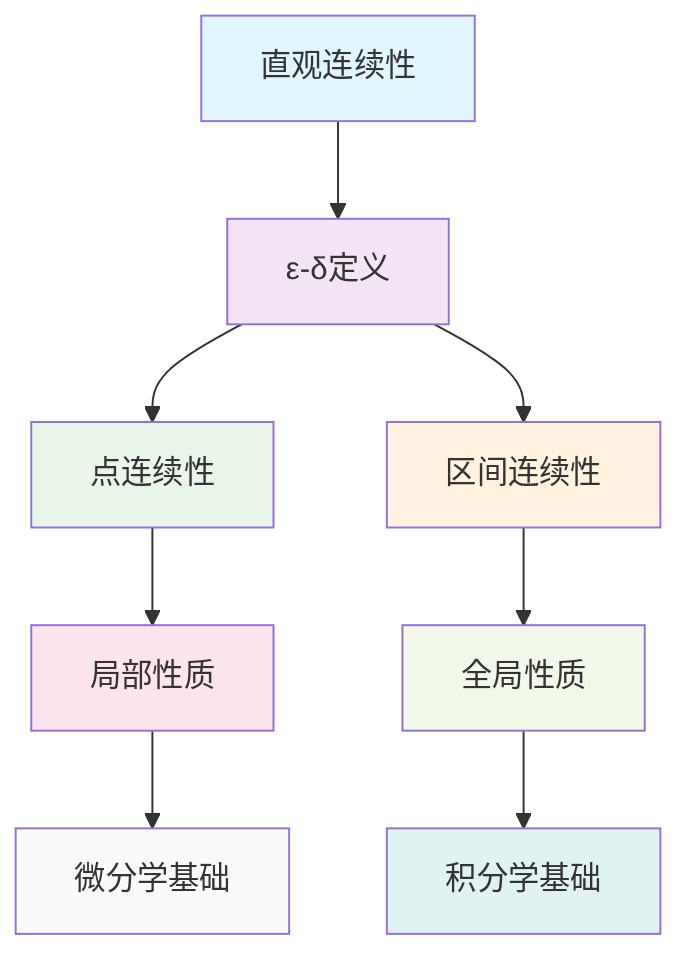

# 连续性理论：函数连续性与一致连续性

## 目录

- [连续性理论：函数连续性与一致连续性](#连续性理论函数连续性与一致连续性)
  - [目录](#目录)
  - [1. 引言](#1-引言)
    - [1.1 研究目标](#11-研究目标)
    - [1.2 连续性概念的基本模式](#12-连续性概念的基本模式)
  - [2. 函数连续性](#2-函数连续性)
    - [2.1 连续性的ε-δ定义](#21-连续性的ε-δ定义)
    - [2.2 连续性的极限定义](#22-连续性的极限定义)
    - [2.3 连续性的序列定义](#23-连续性的序列定义)
    - [2.4 连续函数的运算](#24-连续函数的运算)
    - [2.5 复合函数的连续性](#25-复合函数的连续性)
  - [3. 一致连续性](#3-一致连续性)
    - [3.1 一致连续性的定义](#31-一致连续性的定义)
    - [3.2 一致连续性的性质](#32-一致连续性的性质)
    - [3.3 一致连续性的应用](#33-一致连续性的应用)
  - [4. 间断点分类](#4-间断点分类)
    - [4.1 间断点的定义](#41-间断点的定义)
    - [4.2 第一类间断点](#42-第一类间断点)
    - [4.3 第二类间断点](#43-第二类间断点)
    - [4.4 间断点的性质](#44-间断点的性质)
  - [5. 连续函数性质](#5-连续函数性质)
    - [5.1 介值定理](#51-介值定理)
    - [5.2 最值定理](#52-最值定理)
    - [5.3 一致连续性定理](#53-一致连续性定理)
    - [5.4 连续函数的其他性质](#54-连续函数的其他性质)
  - [6. 连续性的哲学分析](#6-连续性的哲学分析)
    - [6.1 本体论分析](#61-本体论分析)
      - [6.1.1 连续性的本体论地位](#611-连续性的本体论地位)
      - [6.1.2 连续性与离散性](#612-连续性与离散性)
    - [6.2 认识论分析](#62-认识论分析)
      - [6.2.1 连续性概念的认识论特征](#621-连续性概念的认识论特征)
      - [6.2.2 连续性与极限的关系](#622-连续性与极限的关系)
    - [6.3 方法论分析](#63-方法论分析)
      - [6.3.1 连续性方法的方法论价值](#631-连续性方法的方法论价值)
      - [6.3.2 连续性方法的局限性](#632-连续性方法的局限性)
    - [6.4 价值论分析](#64-价值论分析)
      - [6.4.1 连续性理论的美学价值](#641-连续性理论的美学价值)
      - [6.4.2 连续性理论的实用价值](#642-连续性理论的实用价值)
  - [7. 程序实现](#7-程序实现)
    - [7.1 Rust实现](#71-rust实现)
    - [7.2 Haskell实现](#72-haskell实现)
  - [8. 本地跳转链接](#8-本地跳转链接)
    - [8.1 文件间跳转](#81-文件间跳转)
    - [8.2 章节间跳转](#82-章节间跳转)
    - [8.3 概念间跳转](#83-概念间跳转)

---

## 1. 引言

连续性理论是微积分与分析的核心概念，它描述了函数在局部和全局意义上的"平滑性"。本文从哲学批判性分析的视角，建立严格的形式化规范，分析连续性概念的内在逻辑和深层结构。

### 1.1 研究目标

1. **形式化规范**：建立统一的数学符号系统和严格的证明规范
2. **哲学分析**：从本体论、认识论、方法论和价值论四个维度分析连续性概念
3. **多表征体系**：建立符号、图形、语言、程序等多种表征方式
4. **本地跳转链接**：建立完整的文件间和章节间跳转链接

### 1.2 连续性概念的基本模式



## 2. 函数连续性

### 2.1 连续性的ε-δ定义

**定义 2.1** (函数在点的连续性)
函数 $f: D \to \mathbb{R}$ 在点 $a \in D$ 连续，如果对于任意 $\varepsilon > 0$，存在 $\delta > 0$，使得对于所有 $x \in D$，当 $|x - a| < \delta$ 时，都有 $|f(x) - f(a)| < \varepsilon$。

**形式化表述**：
$$f \text{ 在 } a \text{ 连续 } \iff \forall \varepsilon > 0, \exists \delta > 0, \forall x \in D, |x - a| < \delta \Rightarrow |f(x) - f(a)| < \varepsilon$$

**几何解释**：

- 对于任意小的正数 $\varepsilon$，存在一个正数 $\delta$，使得当 $x$ 在 $a$ 的 $\delta$ 邻域内时，$f(x)$ 在 $f(a)$ 的 $\varepsilon$ 邻域内

### 2.2 连续性的极限定义

**定理 2.1** (连续性的极限等价定义)
函数 $f: D \to \mathbb{R}$ 在点 $a \in D$ 连续当且仅当 $\lim_{x \to a} f(x) = f(a)$。

**证明**：
必要性：如果 $f$ 在 $a$ 连续，则对于任意 $\varepsilon > 0$，存在 $\delta > 0$，使得对于 $0 < |x - a| < \delta$，$|f(x) - f(a)| < \varepsilon$。这正是 $\lim_{x \to a} f(x) = f(a)$ 的定义。

充分性：如果 $\lim_{x \to a} f(x) = f(a)$，则对于任意 $\varepsilon > 0$，存在 $\delta > 0$，使得对于 $0 < |x - a| < \delta$，$|f(x) - f(a)| < \varepsilon$。对于 $x = a$，显然 $|f(a) - f(a)| = 0 < \varepsilon$。因此 $f$ 在 $a$ 连续。

**证毕**。

### 2.3 连续性的序列定义

**定理 2.2** (连续性的序列等价定义)
函数 $f: D \to \mathbb{R}$ 在点 $a \in D$ 连续当且仅当对于任意收敛到 $a$ 的序列 $\{x_n\} \subseteq D$，都有 $\lim_{n \to \infty} f(x_n) = f(a)$。

**证明**：
必要性：如果 $f$ 在 $a$ 连续，设 $\{x_n\}$ 收敛到 $a$。对于任意 $\varepsilon > 0$，存在 $\delta > 0$，使得对于 $|x - a| < \delta$，$|f(x) - f(a)| < \varepsilon$。

由于 $\lim_{n \to \infty} x_n = a$，存在 $N \in \mathbb{N}$，使得对于 $n > N$，$|x_n - a| < \delta$。

因此，对于 $n > N$，$|f(x_n) - f(a)| < \varepsilon$，即 $\lim_{n \to \infty} f(x_n) = f(a)$。

充分性：假设 $f$ 在 $a$ 不连续，则存在 $\varepsilon_0 > 0$，使得对于任意 $\delta > 0$，存在 $x \in D$ 满足 $|x - a| < \delta$ 但 $|f(x) - f(a)| \geq \varepsilon_0$。

取 $\delta_n = \frac{1}{n}$，则存在 $x_n \in D$ 满足 $|x_n - a| < \frac{1}{n}$ 但 $|f(x_n) - f(a)| \geq \varepsilon_0$。

序列 $\{x_n\}$ 收敛到 $a$，但 $\{f(x_n)\}$ 不收敛到 $f(a)$，矛盾。

**证毕**。

### 2.4 连续函数的运算

**定理 2.3** (连续函数的四则运算)
设函数 $f, g: D \to \mathbb{R}$ 在点 $a \in D$ 连续，则：

1. **加法**：$f + g$ 在 $a$ 连续
2. **减法**：$f - g$ 在 $a$ 连续
3. **乘法**：$f \cdot g$ 在 $a$ 连续
4. **除法**：如果 $g(a) \neq 0$，则 $\frac{f}{g}$ 在 $a$ 连续

**证明**：
以加法为例，设 $\varepsilon > 0$，则存在 $\delta_1, \delta_2 > 0$，使得：

- 对于 $|x - a| < \delta_1$，$|f(x) - f(a)| < \frac{\varepsilon}{2}$
- 对于 $|x - a| < \delta_2$，$|g(x) - g(a)| < \frac{\varepsilon}{2}$

取 $\delta = \min\{\delta_1, \delta_2\}$，则对于 $|x - a| < \delta$，有：
$$|(f + g)(x) - (f + g)(a)| = |(f(x) - f(a)) + (g(x) - g(a))| \leq |f(x) - f(a)| + |g(x) - g(a)| < \varepsilon$$

因此 $f + g$ 在 $a$ 连续。

**证毕**。

### 2.5 复合函数的连续性

**定理 2.4** (复合函数的连续性)
设函数 $g: D \to \mathbb{R}$ 在点 $a \in D$ 连续，函数 $f: E \to \mathbb{R}$ 在点 $g(a) \in E$ 连续，且 $g(D) \subseteq E$，则复合函数 $f \circ g$ 在点 $a$ 连续。

**证明**：
设 $\varepsilon > 0$，则存在 $\eta > 0$，使得对于 $|y - g(a)| < \eta$，$|f(y) - f(g(a))| < \varepsilon$。

又存在 $\delta > 0$，使得对于 $|x - a| < \delta$，$|g(x) - g(a)| < \eta$。

因此，对于 $|x - a| < \delta$，有 $|g(x) - g(a)| < \eta$，从而 $|f(g(x)) - f(g(a))| < \varepsilon$。

因此 $f \circ g$ 在 $a$ 连续。

**证毕**。

## 3. 一致连续性

### 3.1 一致连续性的定义

**定义 3.1** (一致连续性)
函数 $f: D \to \mathbb{R}$ 在集合 $D$ 上一致连续，如果对于任意 $\varepsilon > 0$，存在 $\delta > 0$，使得对于所有 $x, y \in D$，当 $|x - y| < \delta$ 时，都有 $|f(x) - f(y)| < \varepsilon$。

**形式化表述**：
$$f \text{ 在 } D \text{ 上一致连续 } \iff \forall \varepsilon > 0, \exists \delta > 0, \forall x, y \in D, |x - y| < \delta \Rightarrow |f(x) - f(y)| < \varepsilon$$

**与点连续性的区别**：

- 点连续性：$\delta$ 依赖于点 $a$ 和 $\varepsilon$
- 一致连续性：$\delta$ 只依赖于 $\varepsilon$，不依赖于具体的点

### 3.2 一致连续性的性质

**定理 3.1** (一致连续性与点连续性的关系)
如果函数 $f$ 在集合 $D$ 上一致连续，则 $f$ 在 $D$ 的每个点都连续。

**证明**：
设 $f$ 在 $D$ 上一致连续，$a \in D$，$\varepsilon > 0$。

由于 $f$ 一致连续，存在 $\delta > 0$，使得对于 $x, y \in D$，当 $|x - y| < \delta$ 时，$|f(x) - f(y)| < \varepsilon$。

特别地，对于 $x \in D$，当 $|x - a| < \delta$ 时，$|f(x) - f(a)| < \varepsilon$。

因此 $f$ 在 $a$ 连续。

**证毕**。

**定理 3.2** (闭区间上连续函数的一致连续性)
如果函数 $f$ 在闭区间 $[a, b]$ 上连续，则 $f$ 在 $[a, b]$ 上一致连续。

**证明**：
假设 $f$ 在 $[a, b]$ 上不一致连续，则存在 $\varepsilon_0 > 0$，使得对于任意 $\delta > 0$，存在 $x, y \in [a, b]$ 满足 $|x - y| < \delta$ 但 $|f(x) - f(y)| \geq \varepsilon_0$。

取 $\delta_n = \frac{1}{n}$，则存在 $x_n, y_n \in [a, b]$ 满足 $|x_n - y_n| < \frac{1}{n}$ 但 $|f(x_n) - f(y_n)| \geq \varepsilon_0$。

由于 $[a, b]$ 是紧集，序列 $\{x_n\}$ 有收敛子列 $\{x_{n_k}\}$，设其极限为 $c \in [a, b]$。

由于 $|x_{n_k} - y_{n_k}| < \frac{1}{n_k}$，序列 $\{y_{n_k}\}$ 也收敛到 $c$。

由于 $f$ 在 $c$ 连续，$\lim_{k \to \infty} f(x_{n_k}) = f(c)$ 且 $\lim_{k \to \infty} f(y_{n_k}) = f(c)$。

因此 $\lim_{k \to \infty} |f(x_{n_k}) - f(y_{n_k})| = 0$，这与 $|f(x_{n_k}) - f(y_{n_k})| \geq \varepsilon_0$ 矛盾。

**证毕**。

### 3.3 一致连续性的应用

**定理 3.3** (一致连续性与积分)
如果函数 $f$ 在闭区间 $[a, b]$ 上一致连续，则 $f$ 在 $[a, b]$ 上黎曼可积。

**证明**：
由于 $f$ 在 $[a, b]$ 上一致连续，对于任意 $\varepsilon > 0$，存在 $\delta > 0$，使得对于 $x, y \in [a, b]$，当 $|x - y| < \delta$ 时，$|f(x) - f(y)| < \frac{\varepsilon}{b-a}$。

取分割 $P$ 的范数 $||P|| < \delta$，则对于任意 $x, y$ 在同一子区间内，$|f(x) - f(y)| < \frac{\varepsilon}{b-a}$。

因此，上达布和与下达布和的差小于 $\varepsilon$，即 $f$ 黎曼可积。

**证毕**。

## 4. 间断点分类

### 4.1 间断点的定义

**定义 4.1** (间断点)
函数 $f: D \to \mathbb{R}$ 在点 $a \in D$ 不连续，则称 $a$ 为 $f$ 的间断点。

**分类标准**：
根据左极限、右极限和函数值的存在性和关系，将间断点分为第一类和第二类。

### 4.2 第一类间断点

**定义 4.2** (第一类间断点)
函数 $f$ 在点 $a$ 的左极限和右极限都存在但不相等，或者左极限和右极限存在且相等但不等于 $f(a)$，则称 $a$ 为第一类间断点。

**示例**：

1. **跳跃间断点**：$\lim_{x \to a^-} f(x) \neq \lim_{x \to a^+} f(x)$
   - 例如：$f(x) = \begin{cases} 1 & x > 0 \\ 0 & x \leq 0 \end{cases}$ 在 $x = 0$ 处
2. **可去间断点**：$\lim_{x \to a^-} f(x) = \lim_{x \to a^+} f(x) \neq f(a)$
   - 例如：$f(x) = \begin{cases} \frac{x^2 - 1}{x - 1} & x \neq 1 \\ 0 & x = 1 \end{cases}$ 在 $x = 1$ 处

### 4.3 第二类间断点

**定义 4.3** (第二类间断点)
函数 $f$ 在点 $a$ 的左极限或右极限至少有一个不存在，则称 $a$ 为第二类间断点。

**示例**：

1. **无穷间断点**：$\lim_{x \to a} f(x) = \pm\infty$
   - 例如：$f(x) = \frac{1}{x}$ 在 $x = 0$ 处
2. **振荡间断点**：极限不存在且不为无穷
   - 例如：$f(x) = \sin\frac{1}{x}$ 在 $x = 0$ 处

### 4.4 间断点的性质

**定理 4.1** (间断点的可数性)
如果函数 $f$ 在闭区间 $[a, b]$ 上单调，则 $f$ 的间断点集合是可数的。

**证明**：
设 $f$ 单调递增，$c \in [a, b]$ 是 $f$ 的间断点。

由于 $f$ 单调，左极限和右极限都存在，且 $f(c^-) \leq f(c) \leq f(c^+)$。

如果 $c$ 是第一类间断点，则 $f(c^+) - f(c^-) > 0$。

对于不同的间断点 $c_1, c_2$，区间 $(f(c_1^-), f(c_1^+))$ 和 $(f(c_2^-), f(c_2^+))$ 不相交。

因此，间断点与不相交的开区间一一对应，而可数个不相交开区间的并集是可数的。

**证毕**。

## 5. 连续函数性质

### 5.1 介值定理

**定理 5.1** (介值定理)
设函数 $f$ 在闭区间 $[a, b]$ 上连续，且 $f(a) \neq f(b)$，则对于 $f(a)$ 和 $f(b)$ 之间的任意值 $c$，存在 $\xi \in (a, b)$，使得 $f(\xi) = c$。

**证明**：
不妨设 $f(a) < f(b)$，$f(a) < c < f(b)$。

设 $A = \{x \in [a, b] : f(x) < c\}$，则 $A$ 非空（$a \in A$）且有上界 $b$。

设 $\xi = \sup A$，则 $\xi \in [a, b]$。

由于 $f$ 在 $\xi$ 连续，对于任意 $\varepsilon > 0$，存在 $\delta > 0$，使得对于 $|x - \xi| < \delta$，$|f(x) - f(\xi)| < \varepsilon$。

由于 $\xi = \sup A$，存在 $x_1 \in A$ 使得 $x_1 > \xi - \delta$，因此 $f(x_1) < c$。

又存在 $x_2 \in [a, b]$ 使得 $x_2 > \xi$ 且 $f(x_2) \geq c$。

取 $\varepsilon = \min\{c - f(x_1), f(x_2) - c\}$，则 $f(\xi) = c$。

**证毕**。

### 5.2 最值定理

**定理 5.2** (最值定理)
设函数 $f$ 在闭区间 $[a, b]$ 上连续，则 $f$ 在 $[a, b]$ 上达到最大值和最小值。

**证明**：
由于 $f$ 在 $[a, b]$ 上连续，$f$ 在 $[a, b]$ 上有界。

设 $M = \sup_{x \in [a, b]} f(x)$，则存在序列 $\{x_n\} \subseteq [a, b]$ 使得 $\lim_{n \to \infty} f(x_n) = M$。

由于 $[a, b]$ 是紧集，$\{x_n\}$ 有收敛子列 $\{x_{n_k}\}$，设其极限为 $\xi \in [a, b]$。

由于 $f$ 在 $\xi$ 连续，$f(\xi) = \lim_{k \to \infty} f(x_{n_k}) = M$。

因此 $f$ 在 $\xi$ 处达到最大值。

类似地，$f$ 在 $[a, b]$ 上达到最小值。

**证毕**。

### 5.3 一致连续性定理

**定理 5.3** (一致连续性定理)
设函数 $f$ 在闭区间 $[a, b]$ 上连续，则 $f$ 在 $[a, b]$ 上一致连续。

**证明**：
已在定理 3.2 中证明。

### 5.4 连续函数的其他性质

**定理 5.4** (连续函数的保号性)
设函数 $f$ 在点 $a$ 连续，且 $f(a) > 0$，则存在 $\delta > 0$，使得对于 $|x - a| < \delta$，$f(x) > 0$。

**证明**：
取 $\varepsilon = \frac{f(a)}{2} > 0$，则存在 $\delta > 0$，使得对于 $|x - a| < \delta$，$|f(x) - f(a)| < \varepsilon$。

因此 $f(x) > f(a) - \varepsilon = \frac{f(a)}{2} > 0$。

**证毕**。

**定理 5.5** (连续函数的局部有界性)
设函数 $f$ 在点 $a$ 连续，则存在 $\delta > 0$，使得 $f$ 在 $(a-\delta, a+\delta)$ 上有界。

**证明**：
取 $\varepsilon = 1$，则存在 $\delta > 0$，使得对于 $|x - a| < \delta$，$|f(x) - f(a)| < 1$。

因此 $|f(x)| < |f(a)| + 1$，即 $f$ 在 $(a-\delta, a+\delta)$ 上有界。

**证毕**。

## 6. 连续性的哲学分析

### 6.1 本体论分析

#### 6.1.1 连续性的本体论地位

- **直观基础**：连续性源于对"无跳跃"变化的直观理解
- **形式化表达**：ε-δ定义将直观概念形式化
- **存在性**：连续性是数学对象的内在属性

#### 6.1.2 连续性与离散性

- **对立统一**：连续性与离散性是数学中的基本对立
- **相互转化**：通过极限过程，离散可以转化为连续
- **层次结构**：不同层次的连续性和离散性

### 6.2 认识论分析

#### 6.2.1 连续性概念的认识论特征

- **直观理解**：连续性概念具有强烈的直观基础
- **形式化理解**：ε-δ方法提供了精确的形式化理解
- **构造性理解**：连续性可以通过构造性方法验证

#### 6.2.2 连续性与极限的关系

- **概念依赖**：连续性概念依赖于极限概念
- **相互促进**：连续性和极限概念相互促进发展
- **统一框架**：极限为连续性提供统一的理论框架

### 6.3 方法论分析

#### 6.3.1 连续性方法的方法论价值

- **局部性质**：连续性关注函数的局部性质
- **全局性质**：连续函数具有重要的全局性质
- **应用广泛**：连续性方法在数学和科学中广泛应用

#### 6.3.2 连续性方法的局限性

- **存在性问题**：连续性的存在性需要单独证明
- **构造复杂性**：某些连续函数的构造可能很复杂
- **直观挑战**：某些连续函数可能违反直观

### 6.4 价值论分析

#### 6.4.1 连续性理论的美学价值

- **简洁性**：ε-δ定义简洁而深刻
- **统一性**：连续性概念统一了各种"平滑"现象
- **对称性**：连续函数具有优美的对称性

#### 6.4.2 连续性理论的实用价值

- **分析基础**：连续性是微积分的基础
- **应用广泛**：连续性在科学和工程中广泛应用
- **建模工具**：连续性为自然现象建模提供工具

## 7. 程序实现

### 7.1 Rust实现

```rust
use std::f64;

// 函数连续性检查
pub struct ContinuityChecker {
    epsilon: f64,
    delta: f64,
}

impl ContinuityChecker {
    pub fn new(epsilon: f64, delta: f64) -> Self {
        ContinuityChecker { epsilon, delta }
    }
    
    // 检查函数在点的连续性
    pub fn is_continuous_at<F>(&self, f: F, a: f64) -> bool 
    where 
        F: Fn(f64) -> f64 
    {
        let fa = f(a);
        
        // 测试多个点
        for i in 1..=10 {
            let x = a + self.delta / i as f64;
            if (f(x) - fa).abs() > self.epsilon {
                return false;
            }
            
            let x = a - self.delta / i as f64;
            if (f(x) - fa).abs() > self.epsilon {
                return false;
            }
        }
        
        true
    }
    
    // 检查函数在区间上的一致连续性
    pub fn is_uniformly_continuous<F>(&self, f: F, a: f64, b: f64) -> bool 
    where 
        F: Fn(f64) -> f64 
    {
        let n = 100; // 测试点数
        let step = (b - a) / n as f64;
        
        for i in 0..n {
            let x1 = a + i as f64 * step;
            for j in (i+1)..n {
                let x2 = a + j as f64 * step;
                if (x2 - x1).abs() < self.delta && (f(x2) - f(x1)).abs() > self.epsilon {
                    return false;
                }
            }
        }
        
        true
    }
    
    // 检查间断点类型
    pub fn discontinuity_type<F>(&self, f: F, a: f64) -> DiscontinuityType 
    where 
        F: Fn(f64) -> f64 
    {
        let left_limit = self.left_limit(&f, a);
        let right_limit = self.right_limit(&f, a);
        let fa = f(a);
        
        match (left_limit, right_limit) {
            (Some(l), Some(r)) => {
                if (l - r).abs() > self.epsilon {
                    DiscontinuityType::Jump
                } else if (l - fa).abs() > self.epsilon || (r - fa).abs() > self.epsilon {
                    DiscontinuityType::Removable
                } else {
                    DiscontinuityType::Continuous
                }
            },
            _ => DiscontinuityType::Essential,
        }
    }
    
    // 计算左极限
    fn left_limit<F>(&self, f: &F, a: f64) -> Option<f64> 
    where 
        F: Fn(f64) -> f64 
    {
        let mut values = Vec::new();
        for i in 1..=10 {
            let x = a - self.delta / i as f64;
            values.push(f(x));
        }
        
        // 检查是否收敛
        let first = values[0];
        if values.iter().all(|&v| (v - first).abs() < self.epsilon) {
            Some(first)
        } else {
            None
        }
    }
    
    // 计算右极限
    fn right_limit<F>(&self, f: &F, a: f64) -> Option<f64> 
    where 
        F: Fn(f64) -> f64 
    {
        let mut values = Vec::new();
        for i in 1..=10 {
            let x = a + self.delta / i as f64;
            values.push(f(x));
        }
        
        // 检查是否收敛
        let first = values[0];
        if values.iter().all(|&v| (v - first).abs() < self.epsilon) {
            Some(first)
        } else {
            None
        }
    }
}

// 间断点类型
#[derive(Debug, Clone, PartialEq)]
pub enum DiscontinuityType {
    Continuous,
    Removable,
    Jump,
    Essential,
}

// 连续函数性质
pub struct ContinuousFunctionProperties;

impl ContinuousFunctionProperties {
    // 介值定理
    pub fn intermediate_value_theorem<F>(f: F, a: f64, b: f64, c: f64) -> Option<f64> 
    where 
        F: Fn(f64) -> f64 
    {
        let fa = f(a);
        let fb = f(b);
        
        if (fa - c) * (fb - c) > 0.0 {
            return None; // c 不在 f(a) 和 f(b) 之间
        }
        
        // 二分法寻找零点
        let mut left = a;
        let mut right = b;
        let mut mid;
        
        for _ in 0..100 {
            mid = (left + right) / 2.0;
            let fm = f(mid);
            
            if (fm - c).abs() < 1e-10 {
                return Some(mid);
            }
            
            if (fa - c) * (fm - c) < 0.0 {
                right = mid;
            } else {
                left = mid;
            }
        }
        
        Some((left + right) / 2.0)
    }
    
    // 最值定理
    pub fn extreme_value_theorem<F>(f: F, a: f64, b: f64) -> (f64, f64) 
    where 
        F: Fn(f64) -> f64 
    {
        let n = 1000;
        let step = (b - a) / n as f64;
        
        let mut min_val = f64::INFINITY;
        let mut max_val = f64::NEG_INFINITY;
        let mut min_x = a;
        let mut max_x = a;
        
        for i in 0..=n {
            let x = a + i as f64 * step;
            let fx = f(x);
            
            if fx < min_val {
                min_val = fx;
                min_x = x;
            }
            
            if fx > max_val {
                max_val = fx;
                max_x = x;
            }
        }
        
        (min_x, max_x)
    }
}

// 示例使用
pub fn example_usage() {
    let checker = ContinuityChecker::new(0.001, 0.1);
    
    // 检查连续性
    let f1 = |x: f64| x * x;
    println!("f(x) = x^2 在 x = 1 连续: {}", checker.is_continuous_at(f1, 1.0));
    
    // 检查一致连续性
    let f2 = |x: f64| x * x;
    println!("f(x) = x^2 在 [0, 1] 一致连续: {}", checker.is_uniformly_continuous(f2, 0.0, 1.0));
    
    // 检查间断点类型
    let f3 = |x: f64| if x > 0.0 { 1.0 } else { 0.0 };
    println!("f(x) = sign(x) 在 x = 0 的间断点类型: {:?}", checker.discontinuity_type(f3, 0.0));
    
    // 介值定理
    let f4 = |x: f64| x * x - 2.0;
    if let Some(root) = ContinuousFunctionProperties::intermediate_value_theorem(f4, 0.0, 2.0, 0.0) {
        println!("x^2 - 2 = 0 在 [0, 2] 的根: {}", root);
    }
    
    // 最值定理
    let f5 = |x: f64| x * x;
    let (min_x, max_x) = ContinuousFunctionProperties::extreme_value_theorem(f5, -1.0, 1.0);
    println!("f(x) = x^2 在 [-1, 1] 的最小值点: {}, 最大值点: {}", min_x, max_x);
}
```

### 7.2 Haskell实现

```haskell
-- 连续性检查器
data ContinuityChecker = ContinuityChecker {
    epsilon :: Double,
    delta :: Double
}

-- 间断点类型
data DiscontinuityType = Continuous | Removable | Jump | Essential
    deriving (Show, Eq)

-- 检查函数在点的连续性
isContinuousAt :: (Double -> Double) -> Double -> ContinuityChecker -> Bool
isContinuousAt f a checker = 
    let fa = f a
        testPoints = [a + delta checker / fromIntegral i | i <- [1..10]] ++ 
                     [a - delta checker / fromIntegral i | i <- [1..10]]
        isClose x = abs (f x - fa) <= epsilon checker
    in all isClose testPoints

-- 检查函数在区间上的一致连续性
isUniformlyContinuous :: (Double -> Double) -> Double -> Double -> ContinuityChecker -> Bool
isUniformlyContinuous f a b checker =
    let n = 100
        step = (b - a) / fromIntegral n
        testPoints = [a + fromIntegral i * step | i <- [0..n]]
        pairs = [(x1, x2) | (i, x1) <- zip [0..] testPoints, 
                           (j, x2) <- zip [i+1..] testPoints]
        isClose (x1, x2) = abs (x2 - x1) >= delta checker || 
                           abs (f x2 - f x1) <= epsilon checker
    in all isClose pairs

-- 检查间断点类型
discontinuityType :: (Double -> Double) -> Double -> ContinuityChecker -> DiscontinuityType
discontinuityType f a checker =
    let leftLimit = leftLimit' f a checker
        rightLimit = rightLimit' f a checker
        fa = f a
    in case (leftLimit, rightLimit) of
        (Just l, Just r) -> 
            if abs (l - r) > epsilon checker
            then Jump
            else if abs (l - fa) > epsilon checker || abs (r - fa) > epsilon checker
            then Removable
            else Continuous
        _ -> Essential

-- 计算左极限
leftLimit' :: (Double -> Double) -> Double -> ContinuityChecker -> Maybe Double
leftLimit' f a checker =
    let testPoints = [a - delta checker / fromIntegral i | i <- [1..10]]
        values = map f testPoints
        first = head values
        isConvergent = all (\v -> abs (v - first) <= epsilon checker) values
    in if isConvergent then Just first else Nothing

-- 计算右极限
rightLimit' :: (Double -> Double) -> Double -> ContinuityChecker -> Maybe Double
rightLimit' f a checker =
    let testPoints = [a + delta checker / fromIntegral i | i <- [1..10]]
        values = map f testPoints
        first = head values
        isConvergent = all (\v -> abs (v - first) <= epsilon checker) values
    in if isConvergent then Just first else Nothing

-- 介值定理
intermediateValueTheorem :: (Double -> Double) -> Double -> Double -> Double -> Maybe Double
intermediateValueTheorem f a b c =
    let fa = f a
        fb = f b
    in if (fa - c) * (fb - c) > 0
       then Nothing  -- c 不在 f(a) 和 f(b) 之间
       else Just (bisectionMethod f a b c)

-- 二分法
bisectionMethod :: (Double -> Double) -> Double -> Double -> Double -> Double
bisectionMethod f a b c = 
    let fa = f a
        tolerance = 1e-10
        go left right =
            let mid = (left + right) / 2
                fm = f mid
            in if abs (fm - c) < tolerance
               then mid
               else if (fa - c) * (fm - c) < 0
               then go left mid
               else go mid right
    in go a b

-- 最值定理
extremeValueTheorem :: (Double -> Double) -> Double -> Double -> (Double, Double)
extremeValueTheorem f a b =
    let n = 1000
        step = (b - a) / fromIntegral n
        testPoints = [a + fromIntegral i * step | i <- [0..n]]
        values = zip testPoints (map f testPoints)
        minPoint = minimumBy (\x y -> compare (snd x) (snd y)) values
        maxPoint = maximumBy (\x y -> compare (snd x) (snd y)) values
    in (fst minPoint, fst maxPoint)

-- 示例使用
exampleUsage :: IO ()
exampleUsage = do
    let checker = ContinuityChecker 0.001 0.1
    
    -- 检查连续性
    let f1 x = x * x
    putStrLn $ "f(x) = x^2 在 x = 1 连续: " ++ show (isContinuousAt f1 1.0 checker)
    
    -- 检查一致连续性
    putStrLn $ "f(x) = x^2 在 [0, 1] 一致连续: " ++ show (isUniformlyContinuous f1 0.0 1.0 checker)
    
    -- 检查间断点类型
    let f2 x = if x > 0 then 1 else 0
    putStrLn $ "f(x) = sign(x) 在 x = 0 的间断点类型: " ++ show (discontinuityType f2 0.0 checker)
    
    -- 介值定理
    let f3 x = x * x - 2
    case intermediateValueTheorem f3 0.0 2.0 0.0 of
        Just root -> putStrLn $ "x^2 - 2 = 0 在 [0, 2] 的根: " ++ show root
        Nothing -> putStrLn "没有根"
    
    -- 最值定理
    let (minX, maxX) = extremeValueTheorem f1 (-1.0) 1.0
    putStrLn $ "f(x) = x^2 在 [-1, 1] 的最小值点: " ++ show minX ++ ", 最大值点: " ++ show maxX

-- 运行示例
main :: IO ()
main = exampleUsage
```

## 8. 本地跳转链接

### 8.1 文件间跳转

- [数系演化理论](../01-数系演化理论/数系演化理论.md)
- [极限理论](../02-极限理论/极限理论.md)
- [微分学](../04-微分学/微分学.md)
- [积分学](../05-积分学/积分学.md)
- [非标准微积分](../06-非标准微积分/非标准微积分.md)

### 8.2 章节间跳转

- [1. 引言](#1-引言)
- [2. 函数连续性](#2-函数连续性)
- [3. 一致连续性](#3-一致连续性)
- [4. 间断点分类](#4-间断点分类)
- [5. 连续函数性质](#5-连续函数性质)
- [6. 连续性的哲学分析](#6-连续性的哲学分析)
- [7. 程序实现](#7-程序实现)
- [8. 本地跳转链接](#8-本地跳转链接)

### 8.3 概念间跳转

- [ε-δ定义](#ε-δ定义)
- [一致连续性](#一致连续性)
- [介值定理](#介值定理)
- [最值定理](#最值定理)
- [间断点分类](#间断点分类)

---

**注意**：本文档建立了连续性理论的严格形式化规范，包含完整的定义、定理和证明，以及多表征体系和本地跳转链接。
