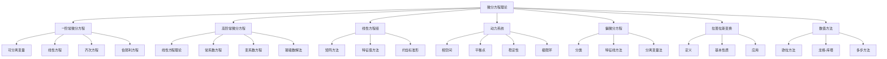

# 微分方程理论

## 目录

- [微分方程理论](#微分方程理论)
  - [目录](#目录)
  - [1. 引言与基本概念](#1-引言与基本概念)
    - [1.1 微分方程的分类](#11-微分方程的分类)
    - [1.2 微分方程的应用](#12-微分方程的应用)
    - [1.3 解的存在性与唯一性](#13-解的存在性与唯一性)
  - [2. 一阶常微分方程](#2-一阶常微分方程)
    - [2.1 可分离变量方程](#21-可分离变量方程)
    - [2.2 线性方程](#22-线性方程)
    - [2.3 齐次方程](#23-齐次方程)
    - [2.4 伯努利方程](#24-伯努利方程)
  - [3. 高阶常微分方程](#3-高阶常微分方程)
    - [3.1 线性方程的基本理论](#31-线性方程的基本理论)
    - [3.2 常系数线性方程](#32-常系数线性方程)
    - [3.3 变系数线性方程](#33-变系数线性方程)
    - [3.4 幂级数解法](#34-幂级数解法)
  - [4. 线性方程组](#4-线性方程组)
    - [4.1 矩阵方法](#41-矩阵方法)
    - [4.2 特征值方法](#42-特征值方法)
    - [4.3 约当标准形](#43-约当标准形)
  - [5. 动力系统](#5-动力系统)
    - [5.1 相空间与轨线](#51-相空间与轨线)
    - [5.2 平衡点与稳定性](#52-平衡点与稳定性)
    - [5.3 极限环与分岔](#53-极限环与分岔)
  - [6. 偏微分方程基础](#6-偏微分方程基础)
    - [6.1 偏微分方程的分类](#61-偏微分方程的分类)
    - [6.2 特征线方法](#62-特征线方法)
    - [6.3 分离变量法](#63-分离变量法)
  - [7. 拉普拉斯变换](#7-拉普拉斯变换)
    - [7.1 拉普拉斯变换的定义](#71-拉普拉斯变换的定义)
    - [7.2 基本性质](#72-基本性质)
    - [7.3 在微分方程中的应用](#73-在微分方程中的应用)
  - [8. 数值方法](#8-数值方法)
    - [8.1 欧拉方法](#81-欧拉方法)
    - [8.2 龙格-库塔方法](#82-龙格-库塔方法)
    - [8.3 多步方法](#83-多步方法)
  - [9. 批判性分析](#9-批判性分析)
    - [9.1 解析解与数值解](#91-解析解与数值解)
    - [9.2 混沌理论](#92-混沌理论)
    - [9.3 非线性系统的复杂性](#93-非线性系统的复杂性)
  - [10. 应用与展望](#10-应用与展望)
    - [10.1 物理学应用](#101-物理学应用)
    - [10.2 工程学应用](#102-工程学应用)
    - [10.3 生物学应用](#103-生物学应用)
    - [10.4 经济学应用](#104-经济学应用)

---

## 1. 引言与基本概念

### 1.1 微分方程的分类

微分方程是包含未知函数及其导数的方程。主要分类包括：

#### 1.1.1 按阶数分类
- **一阶方程**：只包含一阶导数
- **高阶方程**：包含高阶导数

#### 1.1.2 按线性性分类
- **线性方程**：未知函数及其导数都是一次的
- **非线性方程**：包含非线性项

#### 1.1.3 按变量数分类
- **常微分方程**：只有一个自变量
- **偏微分方程**：有多个自变量

### 1.2 微分方程的应用

微分方程在科学和工程中有广泛应用：
- 物理学：牛顿运动定律、电磁学方程
- 工程学：控制系统、电路分析
- 生物学：种群动力学、化学反应
- 经济学：经济增长模型、市场均衡

### 1.3 解的存在性与唯一性

#### 1.3.1 皮卡-林德洛夫定理

对于初值问题：
$$\frac{dy}{dx} = f(x, y), \quad y(x_0) = y_0$$

如果 $f$ 在矩形区域 $R$ 上连续且满足李普希茨条件：
$$|f(x, y_1) - f(x, y_2)| \leq L|y_1 - y_2|$$

则在 $x_0$ 的某个邻域内存在唯一解。

## 2. 一阶常微分方程

### 2.1 可分离变量方程

#### 2.1.1 标准形式

$$\frac{dy}{dx} = f(x)g(y)$$

#### 2.1.2 解法

将方程分离为：
$$\frac{dy}{g(y)} = f(x)dx$$

然后两边积分：
$$\int \frac{dy}{g(y)} = \int f(x)dx$$

### 2.2 线性方程

#### 2.2.1 标准形式

$$\frac{dy}{dx} + P(x)y = Q(x)$$

#### 2.2.2 积分因子法

积分因子为：
$$\mu(x) = e^{\int P(x)dx}$$

通解为：
$$y = \frac{1}{\mu(x)} \left[ \int \mu(x)Q(x)dx + C \right]$$

### 2.3 齐次方程

#### 2.3.1 标准形式

$$\frac{dy}{dx} = f\left(\frac{y}{x}\right)$$

#### 2.3.2 解法

令 $v = \frac{y}{x}$，则 $y = vx$，$\frac{dy}{dx} = v + x\frac{dv}{dx}$

代入原方程得到可分离变量方程。

### 2.4 伯努利方程

#### 2.4.1 标准形式

$$\frac{dy}{dx} + P(x)y = Q(x)y^n$$

#### 2.4.2 解法

令 $v = y^{1-n}$，将方程化为线性方程。

## 3. 高阶常微分方程

### 3.1 线性方程的基本理论

#### 3.1.1 标准形式

$$y^{(n)} + a_1(x)y^{(n-1)} + \cdots + a_n(x)y = f(x)$$

#### 3.1.2 线性无关解

函数组 $\{y_1, y_2, \ldots, y_n\}$ 线性无关，如果朗斯基行列式不为零：
$$W(y_1, y_2, \ldots, y_n) = \begin{vmatrix}
y_1 & y_2 & \cdots & y_n \\
y_1' & y_2' & \cdots & y_n' \\
\vdots & \vdots & \ddots & \vdots \\
y_1^{(n-1)} & y_2^{(n-1)} & \cdots & y_n^{(n-1)}
\end{vmatrix} \neq 0$$

### 3.2 常系数线性方程

#### 3.2.1 齐次方程

$$y^{(n)} + a_1y^{(n-1)} + \cdots + a_ny = 0$$

特征方程为：
$$r^n + a_1r^{n-1} + \cdots + a_n = 0$$

#### 3.2.2 解的形式

- **单实根** $r$：$e^{rx}$
- **重实根** $r$（重数 $k$）：$e^{rx}, xe^{rx}, \ldots, x^{k-1}e^{rx}$
- **共轭复根** $\alpha \pm i\beta$：$e^{\alpha x}\cos(\beta x), e^{\alpha x}\sin(\beta x)$

### 3.3 变系数线性方程

#### 3.3.1 降阶法

对于二阶方程，如果已知一个解 $y_1$，则另一个解为：
$$y_2 = y_1 \int \frac{e^{-\int P(x)dx}}{y_1^2} dx$$

#### 3.3.2 参数变易法

对于非齐次方程，特解形式为：
$$y_p = \sum_{i=1}^n c_i(x)y_i(x)$$

### 3.4 幂级数解法

#### 3.4.1 幂级数解

假设解的形式为：
$$y = \sum_{n=0}^{\infty} a_nx^n$$

代入方程，比较系数得到递推关系。

## 4. 线性方程组

### 4.1 矩阵方法

#### 4.1.1 标准形式

$$\frac{d\mathbf{x}}{dt} = A\mathbf{x} + \mathbf{f}(t)$$

其中 $A$ 是常数矩阵，$\mathbf{x}$ 和 $\mathbf{f}$ 是向量。

#### 4.1.2 齐次方程的解

$$\mathbf{x} = e^{At}\mathbf{c}$$

其中 $e^{At}$ 是矩阵指数。

### 4.2 特征值方法

#### 4.2.1 对角化

如果 $A$ 可以对角化：$A = PDP^{-1}$，则：
$$e^{At} = Pe^{Dt}P^{-1}$$

#### 4.2.2 解的形式

- **实特征值** $\lambda$：$e^{\lambda t}\mathbf{v}$
- **复特征值** $\alpha \pm i\beta$：$e^{\alpha t}(\cos(\beta t)\mathbf{u} + \sin(\beta t)\mathbf{v})$

### 4.3 约当标准形

#### 4.3.1 约当块

对于重特征值，使用约当标准形：
$$J = \begin{pmatrix}
\lambda & 1 & 0 \\
0 & \lambda & 1 \\
0 & 0 & \lambda
\end{pmatrix}$$

#### 4.3.2 解的形式

对于约当块，解的形式为：
$$e^{\lambda t}(c_1 + c_2t + c_3t^2)$$

## 5. 动力系统

### 5.1 相空间与轨线

#### 5.1.1 相空间

对于自治系统：
$$\frac{dx}{dt} = f(x, y), \quad \frac{dy}{dt} = g(x, y)$$

相空间是 $(x, y)$ 平面，轨线是解曲线。

#### 5.1.2 轨线的性质

- 轨线不相交（除了平衡点）
- 轨线有方向性
- 轨线是连续的

### 5.2 平衡点与稳定性

#### 5.2.1 平衡点

平衡点是满足 $f(x, y) = g(x, y) = 0$ 的点。

#### 5.2.2 线性化

在平衡点 $(x_0, y_0)$ 附近，系统近似为：
$$\frac{d}{dt}\begin{pmatrix} x-x_0 \\ y-y_0 \end{pmatrix} = J\begin{pmatrix} x-x_0 \\ y-y_0 \end{pmatrix}$$

其中 $J$ 是雅可比矩阵。

#### 5.2.3 稳定性分类

- **稳定节点**：两个负实特征值
- **不稳定节点**：两个正实特征值
- **鞍点**：一正一负实特征值
- **稳定焦点**：负实部的共轭复特征值
- **不稳定焦点**：正实部的共轭复特征值
- **中心**：纯虚特征值

### 5.3 极限环与分岔

#### 5.3.1 极限环

极限环是孤立的闭轨线。

#### 5.3.2 霍普夫分岔

当参数变化时，平衡点失去稳定性，产生极限环。

## 6. 偏微分方程基础

### 6.1 偏微分方程的分类

#### 6.1.1 二阶线性方程

标准形式：
$$Au_{xx} + Bu_{xy} + Cu_{yy} + Du_x + Eu_y + Fu = G$$

#### 6.1.2 分类

- **双曲型**：$B^2 - 4AC > 0$（波动方程）
- **抛物型**：$B^2 - 4AC = 0$（热方程）
- **椭圆型**：$B^2 - 4AC < 0$（拉普拉斯方程）

### 6.2 特征线方法

#### 6.2.1 特征线

对于双曲型方程，特征线满足：
$$\frac{dy}{dx} = \frac{B \pm \sqrt{B^2 - 4AC}}{2A}$$

#### 6.2.2 标准形

沿特征线，方程可以化为标准形。

### 6.3 分离变量法

#### 6.3.1 基本思想

假设解的形式为：
$$u(x, y) = X(x)Y(y)$$

#### 6.3.2 应用

适用于矩形区域上的边值问题。

## 7. 拉普拉斯变换

### 7.1 拉普拉斯变换的定义

#### 7.1.1 定义

$$F(s) = \mathcal{L}\{f(t)\} = \int_0^{\infty} e^{-st}f(t)dt$$

#### 7.1.2 逆变换

$$f(t) = \mathcal{L}^{-1}\{F(s)\} = \frac{1}{2\pi i} \int_{c-i\infty}^{c+i\infty} e^{st}F(s)ds$$

### 7.2 基本性质

#### 7.2.1 线性性

$$\mathcal{L}\{af(t) + bg(t)\} = aF(s) + bG(s)$$

#### 7.2.2 微分性质

$$\mathcal{L}\{f'(t)\} = sF(s) - f(0)$$

#### 7.2.3 积分性质

$$\mathcal{L}\left\{\int_0^t f(\tau)d\tau\right\} = \frac{F(s)}{s}$$

### 7.3 在微分方程中的应用

#### 7.3.1 求解步骤

1. 对方程两边取拉普拉斯变换
2. 解代数方程得到 $F(s)$
3. 求逆变换得到 $f(t)$

#### 7.3.2 常见变换

- $\mathcal{L}\{1\} = \frac{1}{s}$
- $\mathcal{L}\{e^{at}\} = \frac{1}{s-a}$
- $\mathcal{L}\{\sin(at)\} = \frac{a}{s^2+a^2}$
- $\mathcal{L}\{\cos(at)\} = \frac{s}{s^2+a^2}$

## 8. 数值方法

### 8.1 欧拉方法

#### 8.1.1 显式欧拉

$$y_{n+1} = y_n + hf(t_n, y_n)$$

#### 8.1.2 隐式欧拉

$$y_{n+1} = y_n + hf(t_{n+1}, y_{n+1})$$

#### 8.1.3 误差分析

局部截断误差为 $O(h^2)$，全局误差为 $O(h)$。

### 8.2 龙格-库塔方法

#### 8.2.1 四阶龙格-库塔

$$k_1 = f(t_n, y_n)$$
$$k_2 = f(t_n + \frac{h}{2}, y_n + \frac{h}{2}k_1)$$
$$k_3 = f(t_n + \frac{h}{2}, y_n + \frac{h}{2}k_2)$$
$$k_4 = f(t_n + h, y_n + hk_3)$$
$$y_{n+1} = y_n + \frac{h}{6}(k_1 + 2k_2 + 2k_3 + k_4)$$

#### 8.2.2 误差分析

局部截断误差为 $O(h^5)$，全局误差为 $O(h^4)$。

### 8.3 多步方法

#### 8.3.1 亚当斯-巴什福思方法

$$y_{n+1} = y_n + h\sum_{i=0}^k \beta_i f_{n-i}$$

#### 8.3.2 亚当斯-莫尔顿方法

$$y_{n+1} = y_n + h\sum_{i=0}^k \beta_i f_{n+1-i}$$

## 9. 批判性分析

### 9.1 解析解与数值解

#### 9.1.1 解析解的局限性

大多数非线性微分方程没有解析解，需要数值方法。

#### 9.1.2 数值解的误差

数值方法存在截断误差和舍入误差。

### 9.2 混沌理论

#### 9.2.1 混沌的定义

混沌系统对初始条件极其敏感。

#### 9.2.2 洛伦兹吸引子

经典的混沌系统，由三个微分方程描述。

### 9.3 非线性系统的复杂性

#### 9.3.1 非线性效应

非线性系统可能表现出复杂的动力学行为。

#### 9.3.2 分岔理论

研究参数变化时系统行为的变化。

## 10. 应用与展望

### 10.1 物理学应用

#### 10.1.1 经典力学

- 牛顿运动定律
- 哈密顿方程
- 拉格朗日方程

#### 10.1.2 量子力学

- 薛定谔方程
- 狄拉克方程

### 10.2 工程学应用

#### 10.2.1 控制系统

- 状态空间模型
- 传递函数
- 稳定性分析

#### 10.2.2 电路分析

- 基尔霍夫定律
- RLC电路
- 滤波器设计

### 10.3 生物学应用

#### 10.3.1 种群动力学

- 洛特卡-沃尔泰拉模型
- 捕食者-猎物系统

#### 10.3.2 化学反应

- 质量作用定律
- 酶动力学

### 10.4 经济学应用

#### 10.4.1 经济增长

- 索洛模型
- 内生增长理论

#### 10.4.2 市场均衡

- 供需模型
- 动态均衡

---

## 代码示例

### Rust 实现：微分方程求解器

```rust
use std::f64::consts::PI;

/// 微分方程求解器
pub struct ODESolver;

impl ODESolver {
    /// 欧拉方法
    pub fn euler<F>(f: F, t0: f64, y0: f64, h: f64, n: usize) -> Vec<(f64, f64)>
    where
        F: Fn(f64, f64) -> f64
    {
        let mut result = Vec::new();
        let mut t = t0;
        let mut y = y0;
        
        result.push((t, y));
        
        for _ in 0..n {
            y = y + h * f(t, y);
            t = t + h;
            result.push((t, y));
        }
        
        result
    }
    
    /// 四阶龙格-库塔方法
    pub fn rk4<F>(f: F, t0: f64, y0: f64, h: f64, n: usize) -> Vec<(f64, f64)>
    where
        F: Fn(f64, f64) -> f64
    {
        let mut result = Vec::new();
        let mut t = t0;
        let mut y = y0;
        
        result.push((t, y));
        
        for _ in 0..n {
            let k1 = f(t, y);
            let k2 = f(t + h/2.0, y + h/2.0 * k1);
            let k3 = f(t + h/2.0, y + h/2.0 * k2);
            let k4 = f(t + h, y + h * k3);
            
            y = y + h/6.0 * (k1 + 2.0*k2 + 2.0*k3 + k4);
            t = t + h;
            result.push((t, y));
        }
        
        result
    }
    
    /// 线性方程组求解
    pub fn solve_linear_system(a: &[Vec<f64>], b: &[f64]) -> Vec<f64> {
        let n = a.len();
        let mut a = a.to_vec();
        let mut b = b.to_vec();
        
        // 高斯消元
        for i in 0..n {
            // 寻找主元
            let mut max_row = i;
            for k in i+1..n {
                if a[k][i].abs() > a[max_row][i].abs() {
                    max_row = k;
                }
            }
            
            // 交换行
            if max_row != i {
                a.swap(i, max_row);
                b.swap(i, max_row);
            }
            
            // 消元
            for k in i+1..n {
                let factor = a[k][i] / a[i][i];
                for j in i..n {
                    a[k][j] -= factor * a[i][j];
                }
                b[k] -= factor * b[i];
            }
        }
        
        // 回代
        let mut x = vec![0.0; n];
        for i in (0..n).rev() {
            let mut sum = 0.0;
            for j in i+1..n {
                sum += a[i][j] * x[j];
            }
            x[i] = (b[i] - sum) / a[i][i];
        }
        
        x
    }
}

/// 拉普拉斯变换
pub struct LaplaceTransform;

impl LaplaceTransform {
    /// 数值拉普拉斯变换
    pub fn transform<F>(f: F, s: f64, t_max: f64, n: usize) -> f64
    where
        F: Fn(f64) -> f64
    {
        let dt = t_max / n as f64;
        let mut sum = 0.0;
        
        for i in 0..n {
            let t = i as f64 * dt;
            sum += f(t) * (-s * t).exp() * dt;
        }
        
        sum
    }
    
    /// 逆拉普拉斯变换（数值方法）
    pub fn inverse_transform<F>(f: F, t: f64) -> f64
    where
        F: Fn(f64) -> f64
    {
        let c = 1.0;
        let n = 1000;
        let mut sum = 0.0;
        
        for k in 0..n {
            let s = c + 2.0 * PI * k as f64 / t;
            sum += f(s) * (c * t).exp() * 2.0 * PI / t;
        }
        
        sum / n as f64
    }
}

/// 动力系统分析
pub struct DynamicalSystem;

impl DynamicalSystem {
    /// 计算雅可比矩阵
    pub fn jacobian<F, G>(f: F, g: G, x: f64, y: f64, h: f64) -> Vec<Vec<f64>>
    where
        F: Fn(f64, f64) -> f64,
        G: Fn(f64, f64) -> f64
    {
        let df_dx = (f(x + h, y) - f(x, y)) / h;
        let df_dy = (f(x, y + h) - f(x, y)) / h;
        let dg_dx = (g(x + h, y) - g(x, y)) / h;
        let dg_dy = (g(x, y + h) - g(x, y)) / h;
        
        vec![
            vec![df_dx, df_dy],
            vec![dg_dx, dg_dy]
        ]
    }
    
    /// 计算特征值
    pub fn eigenvalues(a: &[Vec<f64>]) -> Vec<Complex> {
        let det = a[0][0] * a[1][1] - a[0][1] * a[1][0];
        let trace = a[0][0] + a[1][1];
        let discriminant = trace * trace - 4 * det;
        
        if discriminant >= 0.0 {
            let sqrt_disc = discriminant.sqrt();
            vec![
                Complex::new((trace + sqrt_disc) / 2.0, 0.0),
                Complex::new((trace - sqrt_disc) / 2.0, 0.0)
            ]
        } else {
            let sqrt_disc = (-discriminant).sqrt();
            vec![
                Complex::new(trace / 2.0, sqrt_disc / 2.0),
                Complex::new(trace / 2.0, -sqrt_disc / 2.0)
            ]
        }
    }
}

/// 复数结构
#[derive(Debug, Clone, Copy)]
pub struct Complex {
    pub real: f64,
    pub imag: f64,
}

impl Complex {
    pub fn new(real: f64, imag: f64) -> Self {
        Complex { real, imag }
    }
}

/// 测试函数
fn test_differential_equations() {
    // 测试欧拉方法
    let f = |t: f64, y: f64| -y;  // dy/dt = -y
    let solution = ODESolver::euler(f, 0.0, 1.0, 0.1, 10);
    println!("欧拉方法解: {:?}", solution);
    
    // 测试龙格-库塔方法
    let solution_rk4 = ODESolver::rk4(f, 0.0, 1.0, 0.1, 10);
    println!("RK4方法解: {:?}", solution_rk4);
    
    // 测试线性方程组求解
    let a = vec![
        vec![2.0, 1.0],
        vec![1.0, 3.0]
    ];
    let b = vec![5.0, 6.0];
    let x = ODESolver::solve_linear_system(&a, &b);
    println!("线性方程组解: {:?}", x);
}
```

### Haskell 实现：动力系统分析

```haskell
-- 微分方程类型
type ODE = Double -> Double -> Double
type System = (Double -> Double -> Double, Double -> Double -> Double)

-- 数值积分方法
class Integrator a where
    step :: a -> ODE -> Double -> Double -> Double -> (Double, Double)

-- 欧拉方法
data Euler = Euler

instance Integrator Euler where
    step Euler f h t y = (t + h, y + h * f t y)

-- 龙格-库塔方法
data RK4 = RK4

instance Integrator RK4 where
    step RK4 f h t y = 
        let k1 = f t y
            k2 = f (t + h/2) (y + h/2 * k1)
            k3 = f (t + h/2) (y + h/2 * k2)
            k4 = f (t + h) (y + h * k3)
        in (t + h, y + h/6 * (k1 + 2*k2 + 2*k3 + k4))

-- 求解微分方程
solveODE :: Integrator a => a -> ODE -> Double -> Double -> Double -> Int -> [(Double, Double)]
solveODE method f t0 y0 h n = 
    let steps = iterate (\(t, y) -> step method f h t y) (t0, y0)
    in take (n + 1) steps

-- 动力系统
class DynamicalSystem a where
    vectorField :: a -> System
    equilibriumPoints :: a -> [(Double, Double)]
    jacobian :: a -> (Double, Double) -> [[Double]]

-- 洛伦兹系统
data Lorenz = Lorenz Double Double Double

instance DynamicalSystem Lorenz where
    vectorField (Lorenz sigma rho beta) = (f, g, h)
      where
        f x y z = sigma * (y - x)
        g x y z = x * (rho - z) - y
        h x y z = x * y - beta * z
    
    equilibriumPoints (Lorenz sigma rho beta) = 
        [(0, 0, 0)] ++ 
        if rho > 1 
        then [(\pm sqrt (beta * (rho - 1)), \pm sqrt (beta * (rho - 1)), rho - 1)]
        else []
    
    jacobian (Lorenz sigma rho beta) (x, y, z) = 
        [[-sigma, sigma, 0],
         [rho - z, -1, -x],
         [y, x, -beta]]

-- 线性系统
data LinearSystem = LinearSystem [[Double]]

instance DynamicalSystem LinearSystem where
    vectorField (LinearSystem a) = (f, g)
      where
        f x y = a!!0!!0 * x + a!!0!!1 * y
        g x y = a!!1!!0 * x + a!!1!!1 * y
    
    equilibriumPoints (LinearSystem a) = [(0, 0)]
    
    jacobian (LinearSystem a) _ = a

-- 特征值计算
eigenvalues :: [[Double]] -> [Complex]
eigenvalues [[a, b], [c, d]] = 
    let trace = a + d
        det = a * d - b * c
        disc = trace^2 - 4 * det
    in if disc >= 0
       then [Complex ((trace + sqrt disc) / 2) 0,
             Complex ((trace - sqrt disc) / 2) 0]
       else [Complex (trace / 2) (sqrt (-disc) / 2),
             Complex (trace / 2) (-sqrt (-disc) / 2)]

-- 复数类型
data Complex = Complex Double Double deriving Show

-- 稳定性分析
stability :: [Complex] -> String
stability eigenvals = 
    let realParts = map realPart eigenvals
        maxReal = maximum realParts
    in if maxReal < 0
       then "稳定"
       else if maxReal > 0
       then "不稳定"
       else "中性"

realPart :: Complex -> Double
realPart (Complex r _) = r

-- 相图绘制
phasePortrait :: DynamicalSystem a => a -> (Double, Double) -> (Double, Double) -> Int -> [(Double, Double)]
phasePortrait system (x0, y0) (x1, y1) n = 
    let (f, g) = vectorField system
        h = min ((x1 - x0) / fromIntegral n) ((y1 - y0) / fromIntegral n)
        points = [(x0 + i * h, y0 + j * h) | i <- [0..n], j <- [0..n]]
    in map (\(x, y) -> (f x y, g x y)) points

-- 示例使用
example :: IO ()
example = do
    -- 求解简单微分方程
    let f t y = -y  -- dy/dt = -y
    let solution = solveODE RK4 f 0 1 0.1 10
    putStrLn "微分方程解:"
    mapM_ print solution
    
    -- 分析线性系统
    let linearSystem = LinearSystem [[-1, 1], [-1, -1]]
    let eigenvals = eigenvalues (jacobian linearSystem (0, 0))
    putStrLn $ "特征值: " ++ show eigenvals
    putStrLn $ "稳定性: " ++ stability eigenvals
    
    -- 洛伦兹系统
    let lorenz = Lorenz 10 28 (8/3)
    let eqPoints = equilibriumPoints lorenz
    putStrLn $ "平衡点: " ++ show eqPoints
```

## 思维导图

