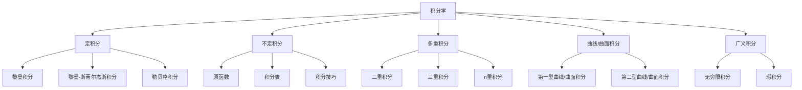

# 积分学总览

## 1. 积分学在微积分中的地位

积分学与微分学共同构成了微积分的两大支柱，它们之间通过微积分基本定理建立了深刻的联系。积分学研究的核心问题是：

1. **面积与体积计算**：如何精确计算曲线下方的面积、曲面下方的体积等几何量
2. **累积变化量**：如何计算变化率函数的累积效应
3. **反导数问题**：如何求解给定函数的原函数

积分学发展历程从古典几何中求解面积问题，经过牛顿-莱布尼茨时代的无穷小分析，到现代的黎曼积分、勒贝格积分等理论，形成了一套严密的数学体系。

## 2. 积分学的核心概念体系

## 3. 积分学的基本内容框架

### 3.1 定积分的定义与性质

- **定积分的直观含义**：曲线下方的面积
- **黎曼和与黎曼积分**：通过极限过程定义积分
- **定积分的性质**：线性性、区间可加性、单调性、有界性等
- **可积条件**：连续函数、单调函数、有界函数的可积性

### 3.2 微积分基本定理

- **第一基本定理**：变速率的累积等于位移
- **第二基本定理**：定积分与不定积分的关系
- **牛顿-莱布尼茨公式**：$\int_a^b f(x) dx = F(b) - F(a)$
- **微分与积分的互逆关系**

### 3.3 不定积分与积分技巧

- **原函数与不定积分**：概念与基本性质
- **基本积分公式**：常见函数的积分
- **积分技巧**：
  - 换元积分法
  - 分部积分法
  - 有理函数积分
  - 三角函数积分
  - 无理函数积分

### 3.4 定积分的应用

- **面积计算**：平面区域的面积
- **体积计算**：旋转体、截面已知的立体
- **弧长计算**：平面曲线、空间曲线的长度
- **物理应用**：质心、转动惯量、功与能等
- **概率论应用**：概率密度函数与期望值

### 3.5 广义积分

- **无穷限积分**：$\int_a^{\infty} f(x) dx$ 和 $\int_{-\infty}^b f(x) dx$
- **瑕积分**：被积函数在积分区间内有奇点
- **收敛性判别**：比较判别法、极限比较判别法等
- **条件收敛与绝对收敛**

### 3.6 多重积分

- **二重积分**：定义、计算和应用
- **三重积分**：定义、计算和应用
- **坐标变换**：极坐标、柱坐标、球坐标等
- **雅可比行列式**：变量代换的数学基础

### 3.7 曲线积分与曲面积分

- **第一型曲线/曲面积分**：关于弧长/面积的积分
- **第二型曲线/曲面积分**：关于坐标的积分
- **格林公式、斯托克斯公式和高斯公式**：联系不同类型积分的重要定理
- **保守场与势函数**：物理学中的重要应用

## 4. 积分学的理论深化

### 4.1 勒贝格积分

- **测度论基础**：勒贝格测度的引入
- **勒贝格积分的定义**：可测函数与积分
- **勒贝格积分与黎曼积分的关系**
- **勒贝格积分的优越性**：完备性和极限定理

### 4.2 泛函分析视角下的积分

- **积分作为线性泛函**
- **希尔伯特空间中的积分**
- **分布理论与广义函数的积分**

### 4.3 数值积分方法

- **矩形法、梯形法和辛普森法**
- **高斯求积公式**
- **蒙特卡洛积分**：随机抽样方法

## 5. 积分学的哲学思考

- **无穷累加的本质**：从有限到无限的过渡
- **连续与离散的统一**：积分作为求和的推广
- **局部与整体的关系**：微分方程与积分方程

## 6. 积分学的历史发展

| 时期 | 主要贡献者 | 关键概念与方法 |
|------|------------|----------------|
| 古希腊时期 | 阿基米德 | 穷竭法计算面积和体积 |
| 17世纪 | 牛顿、莱布尼茨 | 微积分的发明，无穷小分析 |
| 18-19世纪 | 柯西、黎曼 | 积分的严格化，黎曼积分 |
| 19-20世纪 | 勒贝格、斯蒂尔杰斯 | 测度论，勒贝格积分 |
| 20世纪 | 索博列夫、施瓦茨 | 分布理论，广义函数 |

## 7. 积分学与其他数学分支的联系

- **微分方程**：求解微分方程的积分方法
- **复变函数**：复积分与留数定理
- **概率论**：随机变量的期望与积分
- **微分几何**：曲面的积分不变量
- **调和分析**：傅里叶变换与积分算子

## 8. 参考资料与进阶阅读

1. Rudin, W. (1976). *Principles of Mathematical Analysis*.
2. Apostol, T. M. (1974). *Mathematical Analysis*.
3. Spivak, M. (2006). *Calculus*.
4. Lebesgue, H. (1904). *Leçons sur l'intégration et la recherche des fonctions primitives*.
5. Royden, H. L. (1988). *Real Analysis*.

---

**本文档关联**：

- 上游：[微积分与分析总览](../00-微积分与分析总览.md)
- 同级：[微分学总览](../03-微分学/00-微分学总览.md)
- 下游：[定积分基础](./01-定积分基础.md)、[不定积分与计算方法](./02-不定积分与计算方法.md)
