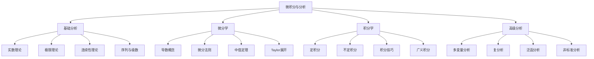
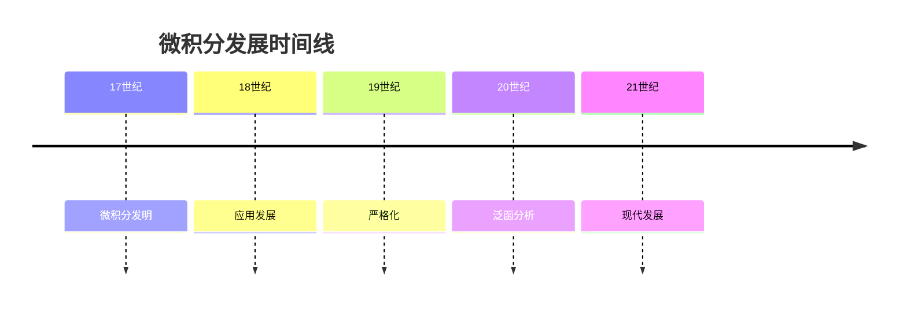

# 微积分与分析

## 目录

- [微积分与分析](#微积分与分析)
  - [目录](#目录)
  - [1. 主题概述](#1-主题概述)
    - [1.1 学习目标](#11-学习目标)
    - [1.2 核心价值](#12-核心价值)
    - [1.3 知识体系](#13-知识体系)
  - [2. 学习路径](#2-学习路径)
    - [2.1 基础路径](#21-基础路径)
    - [2.2 进阶路径](#22-进阶路径)
    - [2.3 应用路径](#23-应用路径)
  - [3. 核心概念索引](#3-核心概念索引)
    - [3.1 基础概念](#31-基础概念)
    - [3.2 高级概念](#32-高级概念)
    - [3.3 应用概念](#33-应用概念)
  - [4. 重要定理索引](#4-重要定理索引)
    - [4.1 极限定理](#41-极限定理)
    - [4.2 连续性定理](#42-连续性定理)
    - [4.3 微分定理](#43-微分定理)
    - [4.4 积分定理](#44-积分定理)
    - [4.5 级数定理](#45-级数定理)
  - [5. 应用案例索引](#5-应用案例索引)
    - [5.1 物理学应用](#51-物理学应用)
    - [5.2 工程学应用](#52-工程学应用)
    - [5.3 经济学应用](#53-经济学应用)
    - [5.4 生物学应用](#54-生物学应用)
  - [6. 历史发展](#6-历史发展)
    - [6.1 重要人物](#61-重要人物)
    - [6.2 重要事件](#62-重要事件)
    - [6.3 发展脉络](#63-发展脉络)
  - [7. 学习资源](#7-学习资源)
    - [7.1 推荐教材](#71-推荐教材)
    - [7.2 在线资源](#72-在线资源)
    - [7.3 软件工具](#73-软件工具)
  - [8. 质量检查](#8-质量检查)
    - [8.1 内容完整性](#81-内容完整性)
    - [8.2 证明严谨性](#82-证明严谨性)
    - [8.3 应用充分性](#83-应用充分性)

---

## 1. 主题概述

### 1.1 学习目标

微积分与分析是数学的核心分支，研究连续变化和累积过程。通过本主题的学习，您将：

- **掌握基础概念**：理解极限、连续性、微分、积分等基本概念
- **建立理论框架**：掌握实分析的公理化方法和理论体系
- **培养分析思维**：发展从局部到整体、从离散到连续的数学思维
- **应用数学工具**：学会将分析理论应用于实际问题解决
- **理解现代发展**：了解非标准分析、泛函分析等现代理论

### 1.2 核心价值

1. **理论深度**：提供严格的数学理论基础
2. **应用广度**：在多个学科领域有重要应用
3. **思维训练**：培养分析思维和逻辑推理能力
4. **创新基础**：为数学创新和发现提供工具

### 1.3 知识体系

## 2. 学习路径

### 2.1 基础路径

-**适合初学者，建立分析思维基础**

1. **实数理论** (前置知识)
   - 实数完备性
   - 上确界与下确界
   - 区间与邻域

2. **极限理论** (第1-2周)
   - 数列极限
   - 函数极限
   - 极限运算法则
   - 夹逼定理

3. **连续性理论** (第3-4周)
   - 连续函数定义
   - 连续函数性质
   - 中间值定理
   - 最值定理

4. **微分学基础** (第5-8周)
   - 导数定义
   - 微分法则
   - 中值定理
   - 单调性与极值

5. **积分学基础** (第9-12周)
   - 定积分定义
   - 积分基本定理
   - 积分技巧
   - 应用问题

### 2.2 进阶路径

-**适合有一定基础的学习者，深化理论理解**

1. **序列与级数** (第1-4周)
   - 数列收敛性
   - 级数收敛性
   - 幂级数
   - Taylor级数

2. **微分学深化** (第5-8周)
   - 高阶导数
   - Taylor展开
   - 凸函数理论
   - 微分方程基础

3. **积分学深化** (第9-12周)
   - 广义积分
   - 积分技巧深化
   - 积分应用
   - 微分方程

4. **多变量分析** (第13-16周)
   - 多元函数极限
   - 偏导数
   - 方向导数
   - 多重积分

### 2.3 应用路径

-**适合应用导向的学习者，关注实际应用**

1. **物理学应用** (第1-4周)
   - 运动学与动力学
   - 电磁学
   - 热力学
   - 量子力学

2. **工程学应用** (第5-8周)
   - 结构分析
   - 信号处理
   - 控制系统
   - 优化理论

3. **经济学应用** (第9-12周)
   - 边际分析
   - 最优化理论
   - 动态系统
   - 金融数学

4. **生物学应用** (第13-16周)
   - 种群动力学
   - 生理学模型
   - 药代动力学
   - 生态学模型

## 3. 核心概念索引

### 3.1 基础概念

- **极限 (Limit)**
  - 定义：函数在某点的极限值
  - 文件：`01-极限与连续性/极限理论.md`
  - 关键词：ε-δ定义、夹逼定理、单调有界

- **连续性 (Continuity)**
  - 定义：函数在某点的连续性
  - 文件：`01-极限与连续性/连续性理论.md`
  - 关键词：连续函数、中间值定理、一致连续

- **导数 (Derivative)**
  - 定义：函数在某点的变化率
  - 文件：`02-微分学/导数概念.md`
  - 关键词：微分法则、中值定理、Taylor展开

- **积分 (Integral)**
  - 定义：函数的累积效应
  - 文件：`03-积分学/积分概念.md`
  - 关键词：定积分、不定积分、积分基本定理

### 3.2 高级概念

- **级数 (Series)**
  - 定义：无穷项的和
  - 文件：`04-实分析/级数理论.md`
  - 关键词：收敛性、幂级数、Taylor级数

- **多变量分析 (Multivariable Analysis)**
  - 定义：多元函数的分析
  - 文件：`05-多变量微积分/多变量分析.md`
  - 关键词：偏导数、方向导数、多重积分

- **复分析 (Complex Analysis)**
  - 定义：复变函数的分析
  - 文件：`06-复分析/复分析基础.md`
  - 关键词：解析函数、Cauchy积分、留数定理

### 3.3 应用概念

- **微分方程 (Differential Equations)**
  - 定义：包含导数的方程
  - 文件：`07-微分方程/微分方程基础.md`
  - 关键词：常微分方程、偏微分方程、初值问题

- **泛函分析 (Functional Analysis)**
  - 定义：函数空间的分析
  - 文件：`08-泛函分析/泛函分析基础.md`
  - 关键词：Banach空间、Hilbert空间、算子理论

## 4. 重要定理索引

### 4.1 极限定理

- **夹逼定理**
  - 内容：通过两个收敛序列夹逼第三个序列
  - 文件：`01-极限与连续性/极限理论.md`
  - 证明：基于ε-δ定义

- **单调有界定理**
  - 内容：单调有界序列必收敛
  - 文件：`01-极限与连续性/极限理论.md`
  - 证明：基于实数完备性

### 4.2 连续性定理

- **中间值定理**
  - 内容：连续函数在区间上取遍中间值
  - 文件：`01-极限与连续性/连续性理论.md`
  - 证明：基于实数完备性

- **最值定理**
  - 内容：闭区间上连续函数必有最值
  - 文件：`01-极限与连续性/连续性理论.md`
  - 证明：基于紧性

### 4.3 微分定理

- **中值定理**
  - 内容：可导函数在区间上的平均变化率
  - 文件：`02-微分学/中值定理.md`
  - 证明：基于Rolle定理

- **Taylor定理**
  - 内容：函数的多项式逼近
  - 文件：`02-微分学/Taylor展开.md`
  - 证明：基于中值定理

### 4.4 积分定理

- **积分基本定理**
  - 内容：积分与导数的关系
  - 文件：`03-积分学/积分基本定理.md`
  - 证明：基于Riemann和

- **分部积分公式**
  - 内容：积分的分部积分法
  - 文件：`03-积分学/积分技巧.md`
  - 证明：基于乘积求导法则

### 4.5 级数定理

- **比较判别法**
  - 内容：通过比较判断级数收敛性
  - 文件：`04-实分析/级数理论.md`
  - 证明：基于单调性

- **比值判别法**
  - 内容：通过比值判断级数收敛性
  - 文件：`04-实分析/级数理论.md`
  - 证明：基于几何级数

## 5. 应用案例索引

### 5.1 物理学应用

- **运动学分析**
  - 原理：位置、速度、加速度的关系
  - 文件：`09-应用案例/物理学应用.md`
  - 分析工具：导数、积分

- **电磁学**
  - 原理：电场、磁场的数学描述
  - 文件：`09-应用案例/电磁学应用.md`
  - 分析工具：向量分析、偏微分方程

### 5.2 工程学应用

- **结构分析**
  - 原理：应力、应变的数学描述
  - 文件：`09-应用案例/工程学应用.md`
  - 分析工具：微分方程、变分法

- **信号处理**
  - 原理：信号的数学分析
  - 文件：`09-应用案例/信号处理应用.md`
  - 分析工具：傅里叶分析、积分变换

### 5.3 经济学应用

- **边际分析**
  - 原理：边际成本、边际收益的分析
  - 文件：`09-应用案例/经济学应用.md`
  - 分析工具：导数、最优化

- **动态系统**
  - 原理：经济系统的动态演化
  - 文件：`09-应用案例/动态系统应用.md`
  - 分析工具：微分方程、稳定性理论

### 5.4 生物学应用

- **种群动力学**
  - 原理：种群数量的变化规律
  - 文件：`09-应用案例/生物学应用.md`
  - 分析工具：微分方程、稳定性分析

- **生理学模型**
  - 原理：生理过程的数学建模
  - 文件：`09-应用案例/生理学应用.md`
  - 分析工具：微分方程、参数估计

## 6. 历史发展

### 6.1 重要人物

- **Isaac Newton (1643-1727)**
  - 贡献：微积分的发明者之一
  - 影响：物理学和数学的革命性发展

- **Gottfried Leibniz (1646-1716)**
  - 贡献：微积分的发明者之一
  - 影响：符号系统和形式化方法

- **Augustin-Louis Cauchy (1789-1857)**
  - 贡献：分析的严格化
  - 影响：现代分析学的基础

### 6.2 重要事件

- **17世纪**：微积分的发明
- **19世纪**：分析的严格化
- **20世纪**：泛函分析的发展
- **21世纪**：非标准分析的兴起

### 6.3 发展脉络

## 7. 学习资源

### 7.1 推荐教材

- **基础教材**
  - 《微积分》(Stewart)
  - 《数学分析》(Rudin)
  - 《实分析》(Royden)

- **进阶教材**
  - 《复分析》(Ahlfors)
  - 《泛函分析》(Rudin)
  - 《偏微分方程》(Evans)

### 7.2 在线资源

- **课程资源**
  - MIT OpenCourseWare
  - Coursera微积分课程
  - edX数学课程

- **研究资源**
  - arXiv数学预印本
  - MathSciNet数据库
  - Zentralblatt MATH

### 7.3 软件工具

- **计算工具**
  - Mathematica
  - MATLAB
  - SageMath

- **可视化工具**
  - GeoGebra
  - Desmos
  - Wolfram Alpha

## 8. 质量检查

### 8.1 内容完整性

- [ ] 所有核心概念已包含
- [ ] 重要定理有完整证明
- [ ] 应用案例充分
- [ ] 历史背景完整

### 8.2 证明严谨性

- [ ] 证明逻辑清晰
- [ ] 步骤完整
- [ ] 符号规范
- [ ] 引用准确

### 8.3 应用充分性

- [ ] 应用案例丰富
- [ ] 实际价值明确
- [ ] 跨学科联系充分
- [ ] 现代应用涵盖

---

**最后更新**：2024-01-15  
**版本**：v1.0.0  
**状态**：建设中 🚀
