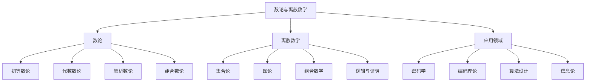

# 00-数论与离散数学总览

## 1. 概述

### 1.1 数论与离散数学的基本概念

数论与离散数学是数学的两个重要分支，它们研究离散的数学结构和整数性质：

- **数论**：研究整数的性质和规律，包括素数分布、同余理论、代数数论等
- **离散数学**：研究离散的数学结构，包括集合论、图论、组合数学、逻辑等
- **应用领域**：密码学、计算机科学、信息论、编码理论等

### 1.2 数论与离散数学的哲学基础

## 2. 历史发展

### 2.1 数论的历史

#### 2.1.1 古代数论

**古希腊时期**：
- 欧几里得：素数无穷性证明
- 毕达哥拉斯：完全数、亲和数
- 丢番图：不定方程

**中国古代**：
- 《九章算术》：同余理论
- 孙子定理：中国剩余定理
- 秦九韶：大衍求一术

#### 2.1.2 近代数论

**17-18世纪**：
- 费马：费马大定理、费马小定理
- 欧拉：欧拉函数、欧拉定理
- 拉格朗日：二次剩余理论

**19世纪**：
- 高斯：二次互反律
- 狄利克雷：素数定理
- 黎曼：黎曼猜想

#### 2.1.3 现代数论

**20世纪**：
- 哈代-李特尔伍德：圆法
- 塞尔伯格：素数定理初等证明
- 怀尔斯：费马大定理证明

**21世纪**：
- 张益唐：孪生素数猜想
- 佩雷尔曼：庞加莱猜想
- 望月新一：ABC猜想

### 2.2 离散数学的历史

#### 2.2.1 早期发展

**集合论**：
- 康托尔：集合论基础
- 策梅洛-弗兰克尔：公理化集合论
- 哥德尔：不完备性定理

**图论**：
- 欧拉：柯尼斯堡七桥问题
- 哈密顿：哈密顿回路
- 凯莱：树的理论

#### 2.2.2 现代发展

**组合数学**：
- 拉姆齐理论
- 极值组合学
- 代数组合学

**逻辑学**：
- 布尔代数
- 命题逻辑
- 谓词逻辑

## 3. 理论基础

### 3.1 数论基础

#### 3.1.1 整除理论

**定义 3.1.1** 整除关系：
对于整数 $a, b$，如果存在整数 $c$ 使得 $b = ac$，则称 $a$ 整除 $b$，记作 $a \mid b$。

**基本性质**：
1. 传递性：若 $a \mid b$ 且 $b \mid c$，则 $a \mid c$
2. 线性组合：若 $a \mid b$ 且 $a \mid c$，则 $a \mid (mb + nc)$
3. 反身性：$a \mid a$

#### 3.1.2 素数理论

**定义 3.1.2** 素数：
大于1的整数 $p$ 是素数，如果它的正因子只有1和 $p$。

**基本定理**：
1. **算术基本定理**：每个大于1的整数都可以唯一地表示为素数的乘积
2. **素数无穷性**：素数有无穷多个
3. **素数分布**：素数定理描述了素数的分布规律

#### 3.1.3 同余理论

**定义 3.1.3** 同余：
对于整数 $a, b, m$，如果 $m \mid (a - b)$，则称 $a$ 与 $b$ 模 $m$ 同余，记作 $a \equiv b \pmod{m}$。

**基本性质**：
1. 反身性：$a \equiv a \pmod{m}$
2. 对称性：若 $a \equiv b \pmod{m}$，则 $b \equiv a \pmod{m}$
3. 传递性：若 $a \equiv b \pmod{m}$ 且 $b \equiv c \pmod{m}$，则 $a \equiv c \pmod{m}$

### 3.2 离散数学基础

#### 3.2.1 集合论

**定义 3.2.1** 集合：
集合是一些确定的不同对象的总体，这些对象称为集合的元素。

**基本运算**：
1. 并集：$A \cup B = \{x : x \in A \text{ 或 } x \in B\}$
2. 交集：$A \cap B = \{x : x \in A \text{ 且 } x \in B\}$
3. 差集：$A \setminus B = \{x : x \in A \text{ 且 } x \notin B\}$
4. 补集：$A^c = \{x : x \notin A\}$

#### 3.2.2 关系理论

**定义 3.2.2** 二元关系：
集合 $A$ 上的二元关系是 $A \times A$ 的子集。

**重要关系类型**：
1. **等价关系**：自反、对称、传递
2. **偏序关系**：自反、反对称、传递
3. **全序关系**：偏序关系且任意两个元素可比较

#### 3.2.3 函数理论

**定义 3.2.3** 函数：
从集合 $A$ 到集合 $B$ 的函数 $f$ 是一个规则，对每个 $a \in A$ 唯一地指定一个 $b \in B$。

**函数性质**：
1. **单射**：不同的输入对应不同的输出
2. **满射**：每个输出都有对应的输入
3. **双射**：既是单射又是满射

## 4. 主要分支

### 4.1 数论分支

#### 4.1.1 初等数论

**研究内容**：
- 整除性质
- 素数分布
- 同余理论
- 二次剩余
- 原根理论

**重要定理**：
- 费马小定理
- 欧拉定理
- 中国剩余定理
- 二次互反律

#### 4.1.2 代数数论

**研究内容**：
- 代数数域
- 理想理论
- 类域论
- 椭圆曲线

**核心概念**：
- 代数整数
- 理想类群
- 单位群
- 判别式

#### 4.1.3 解析数论

**研究内容**：
- 素数分布
- 狄利克雷级数
- 黎曼ζ函数
- 筛法理论

**重要方法**：
- 圆法
- 筛法
- 指数和估计
- 解析延拓

### 4.2 离散数学分支

#### 4.2.1 图论

**研究内容**：
- 图的基本概念
- 连通性
- 匹配理论
- 着色理论
- 网络流

**重要定理**：
- 欧拉定理
- 哈密顿定理
- 四色定理
- 最大流最小割定理

#### 4.2.2 组合数学

**研究内容**：
- 排列组合
- 生成函数
- 拉姆齐理论
- 极值组合学
- 代数组合学

**核心概念**：
- 组合恒等式
- 鸽巢原理
- 容斥原理
- 波利亚计数

#### 4.2.3 逻辑与证明

**研究内容**：
- 命题逻辑
- 谓词逻辑
- 证明理论
- 模型论
- 递归论

**重要概念**：
- 形式系统
- 公理化方法
- 不完备性
- 可计算性

## 5. 应用领域

### 5.1 密码学

#### 5.1.1 理论基础

**数论基础**：
- 大整数分解
- 离散对数
- 椭圆曲线
- 格理论

**安全假设**：
- RSA假设
- 离散对数假设
- 椭圆曲线离散对数假设
- 格困难问题

#### 5.1.2 密码系统

**公钥密码**：
- RSA算法
- ElGamal算法
- 椭圆曲线密码
- 格基密码

**数字签名**：
- RSA签名
- DSA签名
- ECDSA签名
- 格基签名

### 5.2 编码理论

#### 5.2.1 纠错码

**线性码**：
- 汉明码
- BCH码
- Reed-Solomon码
- LDPC码

**代数几何码**：
- Goppa码
- Hermitian码
- 超椭圆曲线码

#### 5.2.2 压缩编码

**无损压缩**：
- 霍夫曼编码
- 算术编码
- Lempel-Ziv算法

**有损压缩**：
- 变换编码
- 量化
- 熵编码

### 5.3 算法设计

#### 5.3.1 数论算法

**素数测试**：
- 费马测试
- Miller-Rabin测试
- AKS算法

**因子分解**：
- 试除法
- Pollard's ρ算法
- 二次筛法
- 数域筛法

#### 5.3.2 图论算法

**最短路径**：
- Dijkstra算法
- Bellman-Ford算法
- Floyd-Warshall算法

**最小生成树**：
- Kruskal算法
- Prim算法

**网络流**：
- Ford-Fulkerson算法
- Edmonds-Karp算法

## 6. 哲学思考

### 6.1 数学基础

#### 6.1.1 构造主义

**观点**：
- 数学对象必须能够构造
- 存在性证明必须提供构造方法
- 排中律不总是有效

**影响**：
- 直觉主义数学
- 构造性证明
- 可计算性理论

#### 6.1.2 形式主义

**观点**：
- 数学是形式系统的游戏
- 数学对象没有独立的存在性
- 一致性是唯一的要求

**影响**：
- 公理化方法
- 形式化证明
- 计算机辅助证明

### 6.2 数学哲学

#### 6.2.1 柏拉图主义

**观点**：
- 数学对象客观存在
- 数学真理是发现的
- 数学具有必然性

**问题**：
- 认识论问题
- 本体论问题
- 应用性问题

#### 6.2.2 经验主义

**观点**：
- 数学来源于经验
- 数学真理是归纳的
- 数学具有偶然性

**问题**：
- 必然性问题
- 抽象性问题
- 应用性问题

## 7. 现代发展

### 7.1 计算数论

#### 7.1.1 算法发展

**多项式时间算法**：
- AKS素数测试
- 椭圆曲线因子分解
- 格基约简

**量子算法**：
- Shor算法
- Grover算法
- 量子随机行走

#### 7.1.2 应用扩展

**密码学应用**：
- 后量子密码
- 同态加密
- 零知识证明

**区块链技术**：
- 共识机制
- 智能合约
- 隐私保护

### 7.2 离散数学发展

#### 7.2.1 理论进展

**极值组合学**：
- 拉姆齐理论
- 极值图论
- 组合几何

**代数组合学**：
- 对称函数
- 表示论
- 代数几何

#### 7.2.2 应用扩展

**机器学习**：
- 图神经网络
- 组合优化
- 概率图模型

**生物信息学**：
- 序列比对
- 蛋白质结构
- 进化树

## 8. 未来展望

### 8.1 理论方向

#### 8.1.1 数论前沿

**未解决问题**：
- 黎曼猜想
- 孪生素数猜想
- ABC猜想
- 朗兰兹纲领

**新兴领域**：
- 算术几何
- 模形式
- 自守形式
- 表示论

#### 8.1.2 离散数学前沿

**未解决问题**：
- P vs NP问题
- 图着色猜想
- 拉姆齐数
- 组合设计

**新兴领域**：
- 随机图论
- 网络科学
- 算法博弈论
- 量子计算

### 8.2 应用方向

#### 8.2.1 技术应用

**量子计算**：
- 量子密码学
- 量子算法
- 量子纠错

**人工智能**：
- 图神经网络
- 组合优化
- 概率推理

#### 8.2.2 跨学科应用

**生物数学**：
- 基因组学
- 蛋白质组学
- 系统生物学

**社会科学**：
- 网络分析
- 博弈论
- 决策理论

## 9. 参考文献

1. Hardy, G. H., & Wright, E. M. (2008). *An introduction to the theory of numbers*. Oxford University Press.
2. Ireland, K., & Rosen, M. (1990). *A classical introduction to modern number theory*. Springer.
3. Rosen, K. H. (2018). *Discrete mathematics and its applications*. McGraw-Hill Education.
4. Graham, R. L., Knuth, D. E., & Patashnik, O. (1994). *Concrete mathematics: a foundation for computer science*. Addison-Wesley.
5. Bollobás, B. (1998). *Modern graph theory*. Springer.

---

*本文档是数论与离散数学的全面概述，涵盖了从基础理论到现代应用的各个方面。通过历史发展、哲学思考和未来展望，展示了这一领域在数学科学中的核心地位。*

> **文档信息**
>
> - **创建时间**：2024年12月19日
> - **最后更新**：2024年12月19日
> - **版本**：1.0
> - **作者**：数学知识重构项目组
> - **状态**：已完成 