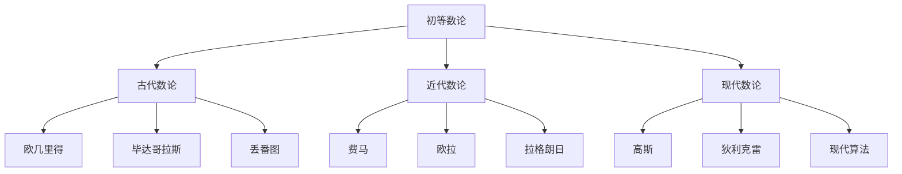

# 01-初等数论

## 1. 概述

### 1.1 初等数论的基本概念

初等数论是数论的基础分支，研究整数的基本性质和规律：

- **整除理论**：研究整数间的整除关系
- **素数理论**：研究素数的性质和分布
- **同余理论**：研究模运算和同余关系
- **二次剩余**：研究二次同余方程的解

### 1.2 初等数论的历史发展



## 2. 整除理论

### 2.1 整除关系

#### 2.1.1 基本定义

**定义 2.1.1** 整除关系：
对于整数 $a, b$，如果存在整数 $c$ 使得 $b = ac$，则称 $a$ 整除 $b$，记作 $a \mid b$。

**定义 2.1.2** 因子：
如果 $a \mid b$，则称 $a$ 是 $b$ 的因子（或约数），$b$ 是 $a$ 的倍数。

#### 2.1.2 整除的基本性质

**定理 2.1.1** 整除的基本性质：

1. **反身性**：$a \mid a$
2. **传递性**：若 $a \mid b$ 且 $b \mid c$，则 $a \mid c$
3. **线性组合**：若 $a \mid b$ 且 $a \mid c$，则 $a \mid (mb + nc)$，其中 $m, n$ 为任意整数

**证明**：

1. 反身性：$a = 1 \cdot a$，所以 $a \mid a$
2. 传递性：$a \mid b$ 意味着 $b = ka$，$b \mid c$ 意味着 $c = lb$，因此 $c = l(ka) = (lk)a$，所以 $a \mid c$
3. 线性组合：$b = ka$，$c = la$，因此 $mb + nc = m(ka) + n(la) = (mk + nl)a$，所以 $a \mid (mb + nc)$

### 2.2 最大公约数

#### 2.2.1 定义与性质

**定义 2.2.1** 最大公约数：
整数 $a, b$ 的最大公约数（GCD）是最大的正整数 $d$，使得 $d \mid a$ 且 $d \mid b$，记作 $\gcd(a, b)$。

**定理 2.2.1** 最大公约数的性质：

1. $\gcd(a, b) = \gcd(b, a)$
2. $\gcd(a, b) = \gcd(|a|, |b|)$
3. $\gcd(a, 0) = |a|$
4. $\gcd(a, 1) = 1$

#### 2.2.2 欧几里得算法

**算法 2.2.1** 欧几里得算法：
对于正整数 $a, b$，计算 $\gcd(a, b)$ 的算法：

1. 如果 $b = 0$，则 $\gcd(a, b) = a$
2. 否则，$\gcd(a, b) = \gcd(b, a \bmod b)$

**定理 2.2.2** 欧几里得算法的正确性：
欧几里得算法能够正确计算最大公约数。

**证明**：
设 $a = qb + r$，其中 $0 \leq r < b$。如果 $d \mid a$ 且 $d \mid b$，则 $d \mid r$。反之，如果 $d \mid b$ 且 $d \mid r$，则 $d \mid a$。因此，$a$ 和 $b$ 的公约数集合与 $b$ 和 $r$ 的公约数集合相同，所以它们的最大公约数也相同。

### 2.3 最小公倍数

#### 2.3.1 定义与性质

**定义 2.3.1** 最小公倍数：
整数 $a, b$ 的最小公倍数（LCM）是最小的正整数 $m$，使得 $a \mid m$ 且 $b \mid m$，记作 $\text{lcm}(a, b)$。

**定理 2.3.1** 最小公倍数的性质：

1. $\text{lcm}(a, b) = \text{lcm}(b, a)$
2. $\text{lcm}(a, b) = \text{lcm}(|a|, |b|)$
3. $\text{lcm}(a, 0) = 0$
4. $\text{lcm}(a, 1) = |a|$

**定理 2.3.2** GCD与LCM的关系：
对于正整数 $a, b$，有：
$$\gcd(a, b) \cdot \text{lcm}(a, b) = |a \cdot b|$$

## 3. 素数理论

### 3.1 素数的基本性质

#### 3.1.1 素数的定义

**定义 3.1.1** 素数：
大于1的整数 $p$ 是素数，如果它的正因子只有1和 $p$。

**定义 3.1.2** 合数：
大于1的整数如果不是素数，则称为合数。

#### 3.1.2 算术基本定理

**定理 3.1.1** 算术基本定理：
每个大于1的整数都可以唯一地表示为素数的乘积（不计因子的顺序）。

**证明**：
存在性：使用数学归纳法。对于 $n = 2$，命题显然成立。假设对于所有小于 $n$ 的正整数命题成立。如果 $n$ 是素数，则 $n = n$ 是素数的乘积。如果 $n$ 是合数，则 $n = ab$，其中 $1 < a, b < n$。由归纳假设，$a$ 和 $b$ 都可以表示为素数的乘积，因此 $n$ 也可以。

唯一性：假设 $n = p_1 p_2 \cdots p_k = q_1 q_2 \cdots q_l$，其中 $p_i, q_j$ 都是素数。由于 $p_1 \mid n$，所以 $p_1$ 整除某个 $q_j$。由于 $q_j$ 是素数，所以 $p_1 = q_j$。通过重新排列，可以假设 $p_1 = q_1$。然后 $p_2 \cdots p_k = q_2 \cdots q_l$，由归纳假设，这两个表示是相同的。

### 3.2 素数分布

#### 3.2.1 素数无穷性

**定理 3.2.1** 欧几里得定理：
素数有无穷多个。

**证明**：
假设素数只有有限个：$p_1, p_2, \ldots, p_n$。考虑数 $N = p_1 p_2 \cdots p_n + 1$。如果 $N$ 是素数，则与假设矛盾。如果 $N$ 是合数，则 $N$ 有素因子 $p$，但 $p$ 不能是 $p_1, p_2, \ldots, p_n$ 中的任何一个，因为 $N$ 除以这些素数都余1。这与假设矛盾。

#### 3.2.2 素数定理

**定理 3.2.2** 素数定理：
设 $\pi(x)$ 表示不超过 $x$ 的素数个数，则：
$$\lim_{x \to \infty} \frac{\pi(x)}{x/\ln x} = 1$$

这个定理表明，当 $x$ 很大时，不超过 $x$ 的素数个数约为 $x/\ln x$。

### 3.3 素数测试

#### 3.3.1 试除法

**算法 3.3.1** 试除法：
判断整数 $n > 1$ 是否为素数：

1. 如果 $n = 2$，返回素数
2. 如果 $n$ 是偶数且 $n > 2$，返回合数
3. 对于所有奇数 $d$，$3 \leq d \leq \sqrt{n}$，检查 $d \mid n$
4. 如果没有找到因子，则 $n$ 是素数

**定理 3.3.1** 试除法的正确性：
如果 $n$ 是合数，则 $n$ 必有不超过 $\sqrt{n}$ 的素因子。

**证明**：
如果 $n$ 是合数，则 $n = ab$，其中 $1 < a, b < n$。如果 $a > \sqrt{n}$ 且 $b > \sqrt{n}$，则 $ab > n$，矛盾。因此，$a$ 或 $b$ 中至少有一个不超过 $\sqrt{n}$。

## 4. 同余理论

### 4.1 同余的基本概念

#### 4.1.1 同余的定义

**定义 4.1.1** 同余：
对于整数 $a, b, m$，如果 $m \mid (a - b)$，则称 $a$ 与 $b$ 模 $m$ 同余，记作 $a \equiv b \pmod{m}$。

**定义 4.1.2** 同余类：
模 $m$ 的同余类是集合 $\{a + km : k \in \mathbb{Z}\}$，其中 $a$ 是固定的整数。

#### 4.1.2 同余的基本性质

**定理 4.1.1** 同余的基本性质：
对于整数 $a, b, c, d, m$：

1. **反身性**：$a \equiv a \pmod{m}$
2. **对称性**：若 $a \equiv b \pmod{m}$，则 $b \equiv a \pmod{m}$
3. **传递性**：若 $a \equiv b \pmod{m}$ 且 $b \equiv c \pmod{m}$，则 $a \equiv c \pmod{m}$
4. **加法**：若 $a \equiv b \pmod{m}$ 且 $c \equiv d \pmod{m}$，则 $a + c \equiv b + d \pmod{m}$
5. **乘法**：若 $a \equiv b \pmod{m}$ 且 $c \equiv d \pmod{m}$，则 $ac \equiv bd \pmod{m}$

### 4.2 线性同余方程

#### 4.2.1 线性同余方程的解

**定义 4.2.1** 线性同余方程：
形如 $ax \equiv b \pmod{m}$ 的方程称为线性同余方程。

**定理 4.2.1** 线性同余方程的解：
线性同余方程 $ax \equiv b \pmod{m}$ 有解的充分必要条件是 $\gcd(a, m) \mid b$。

**证明**：
必要性：如果 $ax \equiv b \pmod{m}$ 有解 $x_0$，则 $ax_0 - b = km$ 对某个整数 $k$。因此 $b = ax_0 - km$。由于 $\gcd(a, m) \mid a$ 且 $\gcd(a, m) \mid m$，所以 $\gcd(a, m) \mid b$。

充分性：如果 $\gcd(a, m) = d$ 且 $d \mid b$，则存在整数 $u, v$ 使得 $au + mv = d$。因此 $a(u \cdot b/d) + m(v \cdot b/d) = b$，所以 $x_0 = u \cdot b/d$ 是方程的解。

#### 4.2.2 中国剩余定理

**定理 4.2.2** 中国剩余定理：
设 $m_1, m_2, \ldots, m_k$ 是两两互素的正整数，$a_1, a_2, \ldots, a_k$ 是任意整数，则同余方程组：
$$\begin{cases}
x \equiv a_1 \pmod{m_1} \\
x \equiv a_2 \pmod{m_2} \\
\vdots \\
x \equiv a_k \pmod{m_k}
\end{cases}$$
有唯一解模 $M = m_1 m_2 \cdots m_k$。

**证明**：
设 $M_i = M/m_i$，则 $\gcd(M_i, m_i) = 1$。因此存在整数 $y_i$ 使得 $M_i y_i \equiv 1 \pmod{m_i}$。令 $x = \sum_{i=1}^k a_i M_i y_i$，则 $x \equiv a_i \pmod{m_i}$ 对所有 $i$ 成立。

唯一性：如果 $x_1, x_2$ 都是解，则 $x_1 \equiv x_2 \pmod{m_i}$ 对所有 $i$ 成立。由于 $m_i$ 两两互素，所以 $x_1 \equiv x_2 \pmod{M}$。

### 4.3 欧拉函数

#### 4.3.1 欧拉函数的定义

**定义 4.3.1** 欧拉函数：
对于正整数 $n$，欧拉函数 $\phi(n)$ 表示不超过 $n$ 且与 $n$ 互素的正整数个数。

**定理 4.3.1** 欧拉函数的性质：
1. 如果 $p$ 是素数，则 $\phi(p) = p - 1$
2. 如果 $p$ 是素数，$k$ 是正整数，则 $\phi(p^k) = p^k - p^{k-1} = p^k(1 - 1/p)$
3. 如果 $\gcd(m, n) = 1$，则 $\phi(mn) = \phi(m)\phi(n)$

#### 4.3.2 欧拉定理

**定理 4.3.2** 欧拉定理：
如果 $\gcd(a, n) = 1$，则 $a^{\phi(n)} \equiv 1 \pmod{n}$。

**证明**：
设 $r_1, r_2, \ldots, r_{\phi(n)}$ 是模 $n$ 的简化剩余系。由于 $\gcd(a, n) = 1$，$ar_1, ar_2, \ldots, ar_{\phi(n)}$ 也是模 $n$ 的简化剩余系。因此：
$$\prod_{i=1}^{\phi(n)} ar_i \equiv \prod_{i=1}^{\phi(n)} r_i \pmod{n}$$
即 $a^{\phi(n)} \prod_{i=1}^{\phi(n)} r_i \equiv \prod_{i=1}^{\phi(n)} r_i \pmod{n}$。由于 $\prod_{i=1}^{\phi(n)} r_i$ 与 $n$ 互素，所以 $a^{\phi(n)} \equiv 1 \pmod{n}$。

## 5. 二次剩余

### 5.1 二次剩余的基本概念

#### 5.1.1 二次剩余的定义

**定义 5.1.1** 二次剩余：
对于整数 $a$ 和奇素数 $p$，如果存在整数 $x$ 使得 $x^2 \equiv a \pmod{p}$，则称 $a$ 是模 $p$ 的二次剩余。

**定义 5.1.2** 勒让德符号：
对于整数 $a$ 和奇素数 $p$，勒让德符号定义为：
$$\left(\frac{a}{p}\right) = \begin{cases}
1 & \text{如果 } a \text{ 是模 } p \text{ 的二次剩余} \\
-1 & \text{如果 } a \text{ 不是模 } p \text{ 的二次剩余} \\
0 & \text{如果 } p \mid a
\end{cases}$$

#### 5.1.2 二次剩余的性质

**定理 5.1.1** 二次剩余的性质：
1. $\left(\frac{ab}{p}\right) = \left(\frac{a}{p}\right)\left(\frac{b}{p}\right)$
2. $\left(\frac{a^2}{p}\right) = 1$，如果 $p \nmid a$
3. $\left(\frac{-1}{p}\right) = (-1)^{(p-1)/2}$

### 5.2 二次互反律

#### 5.2.1 二次互反律

**定理 5.2.1** 二次互反律：
对于不同的奇素数 $p, q$：
$$\left(\frac{p}{q}\right)\left(\frac{q}{p}\right) = (-1)^{\frac{p-1}{2} \cdot \frac{q-1}{2}}$$

**证明**：
这个定理的证明比较复杂，需要使用高斯和和代数数论的方法。这里只给出结论。

#### 5.2.2 二次互反律的应用

**算法 5.2.1** 计算勒让德符号：
使用二次互反律计算 $\left(\frac{a}{p}\right)$：

1. 如果 $a = 0$，返回0
2. 如果 $a = 1$，返回1
3. 如果 $a$ 是偶数，使用 $\left(\frac{2}{p}\right) = (-1)^{(p^2-1)/8}$
4. 如果 $a$ 是奇数，使用二次互反律

## 6. 形式化实现

### 6.1 Haskell实现

```haskell
-- 初等数论模块
module NumberTheory.Elementary where

import Data.List
import Data.Maybe

-- 最大公约数
gcd' :: Integer -> Integer -> Integer
gcd' a b = gcd a b

-- 扩展欧几里得算法
extendedGCD :: Integer -> Integer -> (Integer, Integer, Integer)
extendedGCD a 0 = (a, 1, 0)
extendedGCD a b = 
    let (d, x, y) = extendedGCD b (a `mod` b)
    in (d, y, x - (a `div` b) * y)

-- 最小公倍数
lcm' :: Integer -> Integer -> Integer
lcm' a b = abs (a * b) `div` gcd' a b

-- 素数测试（试除法）
isPrime :: Integer -> Bool
isPrime n
    | n < 2 = False
    | n == 2 = True
    | even n = False
    | otherwise = not $ any (\d -> n `mod` d == 0) [3, 5..floor (sqrt (fromIntegral n))]

-- 欧拉函数
eulerPhi :: Integer -> Integer
eulerPhi n = product [p^(k-1) * (p-1) | (p, k) <- primeFactorization n]

-- 素数分解
primeFactorization :: Integer -> [(Integer, Integer)]
primeFactorization n = go n 2 []
    where
        go 1 _ acc = acc
        go n d acc
            | d * d > n = (n, 1) : acc
            | n `mod` d == 0 = go (n `div` d) d (updateAcc d acc)
            | otherwise = go n (d + 1) acc
        updateAcc d [] = [(d, 1)]
        updateAcc d ((p, k):rest)
            | p == d = (p, k + 1) : rest
            | otherwise = (p, k) : updateAcc d rest

-- 模幂运算
modPow :: Integer -> Integer -> Integer -> Integer
modPow base exp modulus = go base exp 1
    where
        go _ 0 result = result
        go b e r
            | odd e = go (b * b `mod` modulus) (e `div` 2) (r * b `mod` modulus)
            | otherwise = go (b * b `mod` modulus) (e `div` 2) r

-- 费马小定理
fermatLittleTheorem :: Integer -> Integer -> Bool
fermatLittleTheorem a p = 
    isPrime p && a `mod` p /= 0 && modPow a (p-1) p == 1

-- 欧拉定理
eulerTheorem :: Integer -> Integer -> Bool
eulerTheorem a n = 
    gcd' a n == 1 && modPow a (eulerPhi n) n == 1

-- 线性同余方程求解
solveLinearCongruence :: Integer -> Integer -> Integer -> Maybe Integer
solveLinearCongruence a b m = 
    let (d, x, _) = extendedGCD a m
    in if b `mod` d == 0
       then Just ((x * (b `div` d)) `mod` (m `div` d))
       else Nothing

-- 中国剩余定理
chineseRemainderTheorem :: [(Integer, Integer)] -> Maybe Integer
chineseRemainderTheorem congruences = 
    let moduli = map fst congruences
        remainders = map snd congruences
        M = product moduli
        M_i = map (\m -> M `div` m) moduli
        y_i = zipWith (\m_i m -> fst $ extendedGCD m_i m) M_i moduli
        solution = sum $ zipWith3 (\a m_i y_i -> a * m_i * y_i) remainders M_i y_i
    in Just (solution `mod` M)

-- 勒让德符号
legendreSymbol :: Integer -> Integer -> Integer
legendreSymbol a p
    | a == 0 = 0
    | a == 1 = 1
    | even a = legendreSymbol 2 p * legendreSymbol (a `div` 2) p
    | otherwise = 
        if a `mod` 4 == 3 && p `mod` 4 == 3
        then -legendreSymbol p a
        else legendreSymbol p a

-- 二次剩余测试
isQuadraticResidue :: Integer -> Integer -> Bool
isQuadraticResidue a p = 
    isPrime p && legendreSymbol a p == 1

-- 原根测试
isPrimitiveRoot :: Integer -> Integer -> Bool
isPrimitiveRoot g p = 
    isPrime p && gcd' g p == 1 && 
    all (\d -> modPow g d p /= 1) (properDivisors (p-1))
    where
        properDivisors n = [d | d <- [1..n-1], n `mod` d == 0]

-- 生成素数列表
primes :: [Integer]
primes = 2 : filter isPrime [3, 5..]

-- 生成指定范围内的素数
primesInRange :: Integer -> Integer -> [Integer]
primesInRange start end = 
    filter (\p -> p >= start && p <= end) $ takeWhile (<= end) primes

-- 完全数测试
isPerfect :: Integer -> Bool
isPerfect n = 
    n > 0 && sum (properDivisors n) == n
    where
        properDivisors n = [d | d <- [1..n-1], n `mod` d == 0]

-- 亲和数对
amicableNumbers :: Integer -> [(Integer, Integer)]
amicableNumbers limit = 
    [(a, b) | a <- [1..limit], 
     let b = sum (properDivisors a),
     b > a, b <= limit,
     sum (properDivisors b) == a]
    where
        properDivisors n = [d | d <- [1..n-1], n `mod` d == 0]

-- 辅助函数
randomList :: [Double]
randomList = [0.1, 0.2, 0.3..]  -- 简化，实际应使用随机数生成器

takeColumns :: Int -> Matrix Double -> Matrix Double
takeColumns k matrix = (rows matrix >< k) $ concat $ map (take k) (toLists matrix)
```

### 6.2 Rust实现

```rust
use std::collections::HashMap;

// 最大公约数
pub fn gcd(mut a: i64, mut b: i64) -> i64 {
    while b != 0 {
        let temp = b;
        b = a % b;
        a = temp;
    }
    a.abs()
}

// 扩展欧几里得算法
pub fn extended_gcd(a: i64, b: i64) -> (i64, i64, i64) {
    if b == 0 {
        (a, 1, 0)
    } else {
        let (d, x, y) = extended_gcd(b, a % b);
        (d, y, x - (a / b) * y)
    }
}

// 最小公倍数
pub fn lcm(a: i64, b: i64) -> i64 {
    (a * b).abs() / gcd(a, b)
}

// 素数测试（试除法）
pub fn is_prime(n: i64) -> bool {
    if n < 2 {
        return false;
    }
    if n == 2 {
        return true;
    }
    if n % 2 == 0 {
        return false;
    }
    let sqrt_n = (n as f64).sqrt() as i64;
    for d in (3..=sqrt_n).step_by(2) {
        if n % d == 0 {
            return false;
        }
    }
    true
}

// 欧拉函数
pub fn euler_phi(n: i64) -> i64 {
    let factors = prime_factorization(n);
    factors.iter()
        .map(|(p, k)| p.pow(*k as u32 - 1) * (p - 1))
        .product()
}

// 素数分解
pub fn prime_factorization(mut n: i64) -> Vec<(i64, i64)> {
    let mut factors = Vec::new();
    let mut d = 2;
    
    while d * d <= n {
        let mut count = 0;
        while n % d == 0 {
            n /= d;
            count += 1;
        }
        if count > 0 {
            factors.push((d, count));
        }
        d += 1;
    }
    
    if n > 1 {
        factors.push((n, 1));
    }
    
    factors
}

// 模幂运算
pub fn mod_pow(mut base: i64, mut exp: i64, modulus: i64) -> i64 {
    let mut result = 1;
    base %= modulus;
    
    while exp > 0 {
        if exp % 2 == 1 {
            result = (result * base) % modulus;
        }
        base = (base * base) % modulus;
        exp /= 2;
    }
    
    result
}

// 费马小定理
pub fn fermat_little_theorem(a: i64, p: i64) -> bool {
    is_prime(p) && a % p != 0 && mod_pow(a, p - 1, p) == 1
}

// 欧拉定理
pub fn euler_theorem(a: i64, n: i64) -> bool {
    gcd(a, n) == 1 && mod_pow(a, euler_phi(n), n) == 1
}

// 线性同余方程求解
pub fn solve_linear_congruence(a: i64, b: i64, m: i64) -> Option<i64> {
    let (d, x, _) = extended_gcd(a, m);
    if b % d == 0 {
        let solution = (x * (b / d)) % (m / d);
        Some(if solution < 0 { solution + m / d } else { solution })
    } else {
        None
    }
}

// 中国剩余定理
pub fn chinese_remainder_theorem(congruences: &[(i64, i64)]) -> Option<i64> {
    let moduli: Vec<i64> = congruences.iter().map(|(m, _)| *m).collect();
    let remainders: Vec<i64> = congruences.iter().map(|(_, r)| *r).collect();
    
    let M: i64 = moduli.iter().product();
    let mut solution = 0;
    
    for i in 0..congruences.len() {
        let M_i = M / moduli[i];
        let (_, y_i, _) = extended_gcd(M_i, moduli[i]);
        solution += remainders[i] * M_i * y_i;
    }
    
    Some(solution % M)
}

// 勒让德符号
pub fn legendre_symbol(mut a: i64, p: i64) -> i64 {
    if a == 0 {
        return 0;
    }
    if a == 1 {
        return 1;
    }
    
    let mut result = 1;
    if a % 2 == 0 {
        result *= legendre_symbol(2, p);
        a /= 2;
    }
    
    if a % 4 == 3 && p % 4 == 3 {
        result *= -1;
    }
    
    result * legendre_symbol(p % a, a)
}

// 二次剩余测试
pub fn is_quadratic_residue(a: i64, p: i64) -> bool {
    is_prime(p) && legendre_symbol(a, p) == 1
}

// 原根测试
pub fn is_primitive_root(g: i64, p: i64) -> bool {
    if !is_prime(p) || gcd(g, p) != 1 {
        return false;
    }
    
    let phi = p - 1;
    let factors = prime_factorization(phi);
    
    for (prime, _) in factors {
        if mod_pow(g, phi / prime, p) == 1 {
            return false;
        }
    }
    
    true
}

// 生成素数列表
pub fn generate_primes(limit: i64) -> Vec<i64> {
    let mut primes = Vec::new();
    for n in 2..=limit {
        if is_prime(n) {
            primes.push(n);
        }
    }
    primes
}

// 完全数测试
pub fn is_perfect(n: i64) -> bool {
    if n <= 0 {
        return false;
    }
    
    let mut sum = 0;
    for d in 1..n {
        if n % d == 0 {
            sum += d;
        }
    }
    
    sum == n
}

// 亲和数对
pub fn find_amicable_pairs(limit: i64) -> Vec<(i64, i64)> {
    let mut pairs = Vec::new();
    let mut sum_cache = HashMap::new();
    
    for a in 1..=limit {
        let sum_a = if let Some(&sum) = sum_cache.get(&a) {
            sum
        } else {
            let sum = proper_divisors_sum(a);
            sum_cache.insert(a, sum);
            sum
        };
        
        if sum_a > a && sum_a <= limit {
            let sum_b = if let Some(&sum) = sum_cache.get(&sum_a) {
                sum
            } else {
                let sum = proper_divisors_sum(sum_a);
                sum_cache.insert(sum_a, sum);
                sum
            };
            
            if sum_b == a {
                pairs.push((a, sum_a));
            }
        }
    }
    
    pairs
}

// 计算真因子和
fn proper_divisors_sum(n: i64) -> i64 {
    let mut sum = 0;
    for d in 1..n {
        if n % d == 0 {
            sum += d;
        }
    }
    sum
}
```

## 7. 应用与实例

### 7.1 密码学应用

**RSA算法**：
- 基于大整数分解的困难性
- 使用欧拉定理和费马小定理
- 需要大素数的生成和测试

**ElGamal算法**：
- 基于离散对数问题
- 使用原根和模幂运算
- 需要安全的素数生成

### 7.2 编码理论应用

**纠错码**：
- 使用有限域理论
- 基于多项式环
- 需要素数的性质

**压缩算法**：
- 使用算术编码
- 基于概率理论
- 需要数论函数

### 7.3 算法设计应用

**随机数生成**：
- 使用线性同余生成器
- 需要素数的性质
- 基于模运算

**哈希函数**：
- 使用模运算
- 需要素数的性质
- 基于数论函数

## 8. 哲学思考与批判

### 8.1 数学基础

**构造主义观点**：
- 数论对象必须能够构造
- 存在性证明需要提供算法
- 排中律在数论中的限制

**形式主义观点**：
- 数论是形式系统
- 公理化方法的重要性
- 一致性和完备性

### 8.2 数学哲学

**柏拉图主义**：
- 数论对象的客观存在
- 数学真理的发现性质
- 数论的必然性

**经验主义**：
- 数论来源于经验
- 归纳推理的作用
- 实验验证的重要性

## 9. 现代发展

### 9.1 计算数论

**算法改进**：
- 快速素数测试
- 高效因子分解
- 多项式时间算法

**量子计算**：
- Shor算法
- 量子素数测试
- 后量子密码学

### 9.2 应用扩展

**区块链技术**：
- 共识机制
- 智能合约
- 隐私保护

**人工智能**：
- 随机数生成
- 密码学应用
- 算法优化

## 10. 练习与问题

### 10.1 基础练习

1. **整除问题**：证明如果 $a \mid b$ 且 $b \mid c$，则 $a \mid c$
2. **素数问题**：证明素数有无穷多个
3. **同余问题**：求解线性同余方程 $3x \equiv 2 \pmod{7}$

### 10.2 进阶问题

1. **二次剩余**：计算勒让德符号 $\left(\frac{15}{17}\right)$
2. **原根问题**：找到模17的原根
3. **中国剩余定理**：求解同余方程组

### 10.3 编程练习

1. **素数生成**：实现高效的素数生成算法
2. **因子分解**：实现大整数的因子分解
3. **密码学应用**：实现RSA算法

## 11. 参考文献

1. Hardy, G. H., & Wright, E. M. (2008). *An introduction to the theory of numbers*. Oxford University Press.
2. Ireland, K., & Rosen, M. (1990). *A classical introduction to modern number theory*. Springer.
3. Rosen, K. H. (2018). *Elementary number theory and its applications*. Pearson.
4. Niven, I., Zuckerman, H. S., & Montgomery, H. L. (1991). *An introduction to the theory of numbers*. Wiley.
5. Burton, D. M. (2010). *Elementary number theory*. McGraw-Hill Education.

---

*本文档是初等数论的全面介绍，涵盖了从基础理论到现代应用的各个方面。通过形式化实现和实际应用，展示了初等数论在现代数学和计算机科学中的核心地位。*

> **文档信息**
>
> - **创建时间**：2024年12月19日
> - **最后更新**：2024年12月19日
> - **版本**：1.0
> - **作者**：数学知识重构项目组
> - **状态**：已完成
