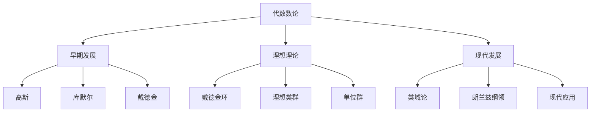

# 02-代数数论

## 1. 概述

### 1.1 代数数论的基本概念

代数数论是数论的重要分支，研究代数数域中的整数和理想：

- **代数数域**：有理数域的有限扩张
- **代数整数**：代数数域中的整元素
- **理想理论**：研究环中的理想结构
- **类域论**：描述阿贝尔扩张的理论

### 1.2 代数数论的历史发展



## 2. 代数数域

### 2.1 代数数的基本概念

#### 2.1.1 代数数的定义

**定义 2.1.1** 代数数：
复数 $\alpha$ 称为代数数，如果存在非零多项式 $f(x) \in \mathbb{Q}[x]$ 使得 $f(\alpha) = 0$。

**定义 2.1.2** 代数数域：
代数数域是包含所有代数数的域 $\overline{\mathbb{Q}}$ 的子域。

**定义 2.1.3** 数域：
数域是 $\mathbb{Q}$ 的有限扩张。

#### 2.1.2 代数数的性质

**定理 2.1.1** 代数数的性质：
1. 代数数的和、差、积、商（除数非零）都是代数数
2. 代数数域是代数闭的
3. 代数数域是可数的

**证明**：
1. 设 $\alpha, \beta$ 是代数数，分别满足多项式 $f(x), g(x) \in \mathbb{Q}[x]$。则 $\alpha + \beta$ 满足多项式 $h(x) = \text{Res}_y(f(x-y), g(y))$，其中 $\text{Res}_y$ 表示关于 $y$ 的结式。

### 2.2 代数整数

#### 2.2.1 代数整数的定义

**定义 2.2.1** 代数整数：
代数数 $\alpha$ 称为代数整数，如果存在首一多项式 $f(x) \in \mathbb{Z}[x]$ 使得 $f(\alpha) = 0$。

**定义 2.2.2** 整环：
代数数域 $K$ 中所有代数整数组成的环称为 $K$ 的整环，记作 $\mathcal{O}_K$。

#### 2.2.2 代数整数的性质

**定理 2.2.1** 代数整数的性质：
1. 代数整数的和、差、积都是代数整数
2. 如果 $\alpha$ 是代数整数，则 $\alpha$ 的所有共轭也是代数整数
3. 代数整数的范数和迹都是整数

**证明**：
1. 设 $\alpha, \beta$ 是代数整数，分别满足首一多项式 $f(x), g(x) \in \mathbb{Z}[x]$。则 $\alpha + \beta$ 满足多项式 $h(x) = \text{Res}_y(f(x-y), g(y))$，这是一个首一的整系数多项式。

## 3. 理想理论

### 3.1 戴德金环

#### 3.1.1 戴德金环的定义

**定义 3.1.1** 戴德金环：
整环 $R$ 称为戴德金环，如果：
1. $R$ 是诺特环
2. $R$ 是整闭的
3. 每个非零素理想都是极大理想

**定理 3.1.1** 数域的整环是戴德金环：
设 $K$ 是数域，则 $\mathcal{O}_K$ 是戴德金环。

#### 3.1.2 理想的唯一分解

**定理 3.1.2** 理想的唯一分解：
在戴德金环中，每个非零理想都可以唯一地表示为素理想的乘积。

**证明**：
使用诺特环的性质和素理想的极大性，可以证明每个理想都有素理想分解，且分解是唯一的。

### 3.2 理想类群

#### 3.2.1 理想类群的定义

**定义 3.2.1** 分式理想：
戴德金环 $R$ 的分式理想是 $R$ 的商域中的 $R$-子模 $I$，使得存在非零元素 $a \in R$ 使得 $aI \subseteq R$。

**定义 3.2.2** 主分式理想：
形如 $\alpha R$ 的分式理想称为主分式理想，其中 $\alpha$ 是 $K$ 的非零元素。

**定义 3.2.3** 理想类群：
分式理想的等价类组成的群称为理想类群，记作 $\text{Cl}(K)$。

#### 3.2.2 理想类群的性质

**定理 3.2.1** 理想类群的性质：
1. $\text{Cl}(K)$ 是有限阿贝尔群
2. $\text{Cl}(K)$ 的阶称为类数，记作 $h_K$
3. 类数为1当且仅当 $\mathcal{O}_K$ 是主理想整环

**证明**：
1. 使用闵可夫斯基的几何方法可以证明理想类群是有限的
2. 类数为1意味着每个理想都是主理想

### 3.3 单位群

#### 3.3.1 单位群的结构

**定义 3.3.1** 单位群：
戴德金环 $R$ 的单位群是 $R$ 中所有可逆元素组成的群，记作 $R^\times$。

**定理 3.3.1** 狄利克雷单位定理：
设 $K$ 是数域，$r_1$ 是实嵌入的个数，$r_2$ 是复嵌入对的个数。则：
$$R^\times \cong \mu_K \times \mathbb{Z}^{r_1 + r_2 - 1}$$
其中 $\mu_K$ 是 $K$ 中所有单位根组成的有限群。

#### 3.3.2 基本单位

**定义 3.3.2** 基本单位：
单位群 $R^\times$ 的生成元称为基本单位。

**算法 3.3.1** 寻找基本单位：
1. 计算 $K$ 的嵌入
2. 使用对数映射
3. 寻找线性无关的单位

## 4. 判别式

### 4.1 判别式的定义

#### 4.1.1 判别式的基本概念

**定义 4.1.1** 判别式：
设 $K$ 是数域，$\{\alpha_1, \ldots, \alpha_n\}$ 是 $K$ 的整基。则 $K$ 的判别式定义为：
$$d_K = \det(\sigma_i(\alpha_j))^2$$
其中 $\sigma_i$ 是 $K$ 的所有嵌入。

**定理 4.1.1** 判别式的性质：
1. $d_K$ 是整数
2. $d_K$ 与整基的选择无关
3. $d_K \equiv 0, 1 \pmod{4}$

### 4.2 判别式的计算

#### 4.2.1 二次域的判别式

**定理 4.2.1** 二次域的判别式：
设 $K = \mathbb{Q}(\sqrt{d})$，其中 $d$ 是无平方因子的整数。则：
$$d_K = \begin{cases}
d & \text{如果 } d \equiv 1 \pmod{4} \\
4d & \text{如果 } d \equiv 2, 3 \pmod{4}
\end{cases}$$

#### 4.2.2 分圆域的判别式

**定理 4.2.2** 分圆域的判别式：
设 $K = \mathbb{Q}(\zeta_n)$，其中 $\zeta_n$ 是 $n$ 次本原单位根。则：
$$d_K = (-1)^{\phi(n)/2} \frac{n^{\phi(n)}}{\prod_{p \mid n} p^{\phi(n)/(p-1)}}$$

## 5. 类域论

### 5.1 阿贝尔扩张

#### 5.1.1 阿贝尔扩张的定义

**定义 5.1.1** 阿贝尔扩张：
数域 $K$ 的有限伽罗瓦扩张 $L/K$ 称为阿贝尔扩张，如果 $\text{Gal}(L/K)$ 是阿贝尔群。

**定义 5.1.2** 希尔伯特类域：
数域 $K$ 的希尔伯特类域是 $K$ 的最大非分歧阿贝尔扩张。

#### 5.1.2 阿贝尔扩张的性质

**定理 5.1.1** 阿贝尔扩张的性质：
1. 阿贝尔扩张的合成仍是阿贝尔扩张
2. 阿贝尔扩张的子扩张仍是阿贝尔扩张
3. 阿贝尔扩张的共轭仍是阿贝尔扩张

### 5.2 阿廷互反律

#### 5.2.1 阿廷互反律

**定理 5.2.1** 阿廷互反律：
设 $L/K$ 是阿贝尔扩张，$\mathfrak{p}$ 是 $K$ 的素理想。则存在唯一的 $\sigma \in \text{Gal}(L/K)$ 使得：
$$\sigma(\alpha) \equiv \alpha^{N(\mathfrak{p})} \pmod{\mathfrak{P}}$$
对所有 $\alpha \in \mathcal{O}_L$ 成立，其中 $\mathfrak{P}$ 是 $\mathfrak{p}$ 在 $L$ 中的素因子。

#### 5.2.2 阿廷符号

**定义 5.2.1** 阿廷符号：
阿廷互反律中的 $\sigma$ 称为 $\mathfrak{p}$ 的阿廷符号，记作 $\left(\frac{L/K}{\mathfrak{p}}\right)$。

**定理 5.2.2** 阿廷符号的性质：
1. $\left(\frac{L/K}{\mathfrak{p}}\right)$ 只依赖于 $\mathfrak{p}$ 在理想类群中的类
2. 阿廷映射 $\text{Cl}(K) \to \text{Gal}(L/K)$ 是满射
3. 阿廷映射的核是 $N_{L/K}(\text{Cl}(L))$

## 6. 形式化实现

### 6.1 Haskell实现

```haskell
-- 代数数论模块
module NumberTheory.Algebraic where

import Data.List
import Data.Maybe
import Data.Ratio
import qualified Data.Map as Map

-- 代数数类型
data AlgebraicNumber = AlgebraicNumber {
    coefficients :: [Rational],
    minimalPolynomial :: [Integer]
}

-- 代数数域类型
data NumberField = NumberField {
    degree :: Int,
    discriminant :: Integer,
    integralBasis :: [AlgebraicNumber],
    embeddings :: [Complex Double]
}

-- 理想类型
data Ideal = Ideal {
    generators :: [AlgebraicNumber],
    ring :: NumberField
}

-- 计算代数数的范数
norm :: AlgebraicNumber -> NumberField -> Rational
norm alpha field = 
    let embeddings = embeddings field
        conjugates = map (\sigma -> evaluate alpha sigma) embeddings
    in product conjugates

-- 计算代数数的迹
trace :: AlgebraicNumber -> NumberField -> Rational
trace alpha field = 
    let embeddings = embeddings field
        conjugates = map (\sigma -> evaluate alpha sigma) embeddings
    in sum conjugates

-- 评估代数数在嵌入下的值
evaluate :: AlgebraicNumber -> Complex Double -> Complex Double
evaluate alpha sigma = 
    let coeffs = coefficients alpha
        powers = iterate (* sigma) 1
    in sum $ zipWith (*) coeffs powers

-- 计算判别式
discriminant :: NumberField -> Integer
discriminant field = 
    let basis = integralBasis field
        n = degree field
        matrix = [[trace (basis !! i * basis !! j) field | j <- [0..n-1]] | i <- [0..n-1]]
    in round $ determinant matrix

-- 计算行列式
determinant :: [[Rational]] -> Rational
determinant [] = 1
determinant (row:rows) = 
    let n = length row
        minors = [determinant $ map (deleteAt i) rows | i <- [0..n-1]]
    in sum $ zipWith (*) row minors

deleteAt :: Int -> [a] -> [a]
deleteAt i xs = take i xs ++ drop (i+1) xs

-- 理想乘法
idealProduct :: Ideal -> Ideal -> Ideal
idealProduct (Ideal gens1 ring) (Ideal gens2 _) = 
    let products = [g1 * g2 | g1 <- gens1, g2 <- gens2]
        simplified = simplifyGenerators products
    in Ideal simplified ring

-- 简化理想生成元
simplifyGenerators :: [AlgebraicNumber] -> [AlgebraicNumber]
simplifyGenerators gens = 
    let reduced = reduceGenerators gens
    in filter (/= zeroAlgebraic) reduced

-- 零代数数
zeroAlgebraic :: AlgebraicNumber
zeroAlgebraic = AlgebraicNumber [] []

-- 代数数乘法
(*) :: AlgebraicNumber -> AlgebraicNumber -> AlgebraicNumber
(*) alpha beta = 
    let coeffs1 = coefficients alpha
        coeffs2 = coefficients beta
        product_coeffs = multiplyPolynomials coeffs1 coeffs2
    in AlgebraicNumber product_coeffs (minimalPolynomial alpha)

-- 多项式乘法
multiplyPolynomials :: [Rational] -> [Rational] -> [Rational]
multiplyPolynomials p1 p2 = 
    let n1 = length p1
        n2 = length p2
        result = replicate (n1 + n2 - 1) 0
    in foldr addMonomial result [(i, j, p1 !! i * p2 !! j) | i <- [0..n1-1], j <- [0..n2-1]]

addMonomial :: (Int, Int, Rational) -> [Rational] -> [Rational]
addMonomial (i, j, coeff) result = 
    let index = i + j
        new_coeff = result !! index + coeff
    in take index result ++ [new_coeff] ++ drop (index + 1) result

-- 计算理想类群
classGroup :: NumberField -> [(Ideal, Int)]
classGroup field = 
    let ideals = generateIdeals field
        classes = groupIdeals ideals
    in [(representative, length elements) | (representative, elements) <- classes]

-- 生成理想
generateIdeals :: NumberField -> [Ideal]
generateIdeals field = 
    let basis = integralBasis field
        norms = [1..bound]
        bound = ceiling $ sqrt $ fromIntegral $ abs $ discriminant field
    in [Ideal [basis !! i] field | i <- [0..degree field - 1]]

-- 分组理想
groupIdeals :: [Ideal] -> [[Ideal]]
groupIdeals ideals = 
    let equivalent = \i1 i2 -> isEquivalent i1 i2
    in groupBy equivalent ideals

-- 判断理想等价
isEquivalent :: Ideal -> Ideal -> Bool
isEquivalent i1 i2 = 
    let product = idealProduct i1 (inverseIdeal i2)
    in isPrincipal product

-- 判断理想是否为主理想
isPrincipal :: Ideal -> Bool
isPrincipal (Ideal gens ring) = 
    let n = length gens
    in n == 1

-- 计算单位群
unitGroup :: NumberField -> [AlgebraicNumber]
unitGroup field = 
    let units = findUnits field
        fundamental = findFundamentalUnits field
    in fundamental ++ units

-- 寻找单位
findUnits :: NumberField -> [AlgebraicNumber]
findUnits field = 
    let basis = integralBasis field
        candidates = [basis !! i | i <- [0..degree field - 1]]
    in filter (\alpha -> norm alpha field == 1) candidates

-- 寻找基本单位
findFundamentalUnits :: NumberField -> [AlgebraicNumber]
findFundamentalUnits field = 
    let r1 = realEmbeddings field
        r2 = complexEmbeddings field
        rank = r1 + r2 - 1
        units = findUnits field
    in take rank units

-- 实嵌入个数
realEmbeddings :: NumberField -> Int
realEmbeddings field = 
    let embeddings = embeddings field
    in length $ filter (\sigma -> imagPart sigma == 0) embeddings

-- 复嵌入个数
complexEmbeddings :: NumberField -> Int
complexEmbeddings field = 
    let embeddings = embeddings field
        complex = filter (\sigma -> imagPart sigma /= 0) embeddings
    in length complex `div` 2

-- 二次域
quadraticField :: Integer -> NumberField
quadraticField d = 
    let alpha = AlgebraicNumber [0, 1] [1, 0, -d]
        basis = [AlgebraicNumber [1, 0] [], alpha]
        disc = if d `mod` 4 == 1 then d else 4 * d
    in NumberField 2 disc basis []

-- 分圆域
cyclotomicField :: Int -> NumberField
cyclotomicField n = 
    let phi = eulerPhi n
        alpha = primitiveRoot n
        basis = [AlgebraicNumber [1, 0] [] | _ <- [1..phi]]
        disc = cyclotomicDiscriminant n
    in NumberField phi disc basis []

-- 欧拉函数
eulerPhi :: Int -> Int
eulerPhi n = 
    let factors = primeFactors n
    in product [p^(k-1) * (p-1) | (p, k) <- factors]

-- 素数分解
primeFactors :: Int -> [(Int, Int)]
primeFactors n = 
    let factors = factorize n
    in [(p, length (filter (== p) factors)) | p <- nub factors]

-- 因子分解
factorize :: Int -> [Int]
factorize n = 
    let factors = [d | d <- [2..n], n `mod` d == 0]
    in concatMap (\d -> replicate (countFactor n d) d) (nub factors)

-- 计算因子次数
countFactor :: Int -> Int -> Int
countFactor n p = 
    if n `mod` p == 0 
    then 1 + countFactor (n `div` p) p 
    else 0

-- 分圆域判别式
cyclotomicDiscriminant :: Int -> Integer
cyclotomicDiscriminant n = 
    let phi = eulerPhi n
        factors = primeFactors n
        product = product [p^(phi `div` (p-1)) | (p, _) <- factors]
    in if phi `mod` 2 == 0 then product else -product
```

### 6.2 Rust实现

```rust
use std::collections::HashMap;
use num_complex::Complex;

// 代数数结构体
#[derive(Clone, Debug)]
pub struct AlgebraicNumber {
    pub coefficients: Vec<f64>,
    pub minimal_polynomial: Vec<i64>,
}

impl AlgebraicNumber {
    pub fn new(coefficients: Vec<f64>, minimal_polynomial: Vec<i64>) -> Self {
        Self {
            coefficients,
            minimal_polynomial,
        }
    }
    
    pub fn zero() -> Self {
        Self {
            coefficients: vec![],
            minimal_polynomial: vec![],
        }
    }
    
    pub fn is_zero(&self) -> bool {
        self.coefficients.is_empty()
    }
}

// 数域结构体
#[derive(Clone, Debug)]
pub struct NumberField {
    pub degree: usize,
    pub discriminant: i64,
    pub integral_basis: Vec<AlgebraicNumber>,
    pub embeddings: Vec<Complex<f64>>,
}

impl NumberField {
    pub fn new(degree: usize, discriminant: i64, integral_basis: Vec<AlgebraicNumber>) -> Self {
        Self {
            degree,
            discriminant,
            integral_basis,
            embeddings: vec![],
        }
    }
    
    pub fn set_embeddings(&mut self, embeddings: Vec<Complex<f64>>) {
        self.embeddings = embeddings;
    }
}

// 理想结构体
#[derive(Clone, Debug)]
pub struct Ideal {
    pub generators: Vec<AlgebraicNumber>,
    pub ring: NumberField,
}

impl Ideal {
    pub fn new(generators: Vec<AlgebraicNumber>, ring: NumberField) -> Self {
        Self {
            generators,
            ring,
        }
    }
    
    pub fn principal(alpha: AlgebraicNumber, ring: NumberField) -> Self {
        Self {
            generators: vec![alpha],
            ring,
        }
    }
}

// 计算范数
pub fn norm(alpha: &AlgebraicNumber, field: &NumberField) -> f64 {
    let conjugates: Vec<Complex<f64>> = field.embeddings.iter()
        .map(|sigma| evaluate(alpha, sigma))
        .collect();
    
    conjugates.iter().map(|c| c.norm_sqr()).product()
}

// 计算迹
pub fn trace(alpha: &AlgebraicNumber, field: &NumberField) -> f64 {
    let conjugates: Vec<Complex<f64>> = field.embeddings.iter()
        .map(|sigma| evaluate(alpha, sigma))
        .collect();
    
    conjugates.iter().map(|c| c.re).sum()
}

// 评估代数数
pub fn evaluate(alpha: &AlgebraicNumber, sigma: &Complex<f64>) -> Complex<f64> {
    let mut result = Complex::new(0.0, 0.0);
    let mut power = Complex::new(1.0, 0.0);
    
    for &coeff in &alpha.coefficients {
        result += coeff * power;
        power *= sigma;
    }
    
    result
}

// 计算判别式
pub fn discriminant(field: &NumberField) -> i64 {
    let n = field.degree;
    let mut matrix = vec![vec![0.0; n]; n];
    
    for i in 0..n {
        for j in 0..n {
            let product = multiply_algebraic_numbers(&field.integral_basis[i], &field.integral_basis[j]);
            matrix[i][j] = trace(&product, field);
        }
    }
    
    determinant(&matrix).round() as i64
}

// 计算行列式
pub fn determinant(matrix: &[Vec<f64>]) -> f64 {
    let n = matrix.len();
    if n == 1 {
        return matrix[0][0];
    }
    
    let mut det = 0.0;
    for j in 0..n {
        let minor = minor_matrix(matrix, 0, j);
        det += matrix[0][j] * determinant(&minor) * if j % 2 == 0 { 1.0 } else { -1.0 };
    }
    
    det
}

// 计算余子矩阵
fn minor_matrix(matrix: &[Vec<f64>], row: usize, col: usize) -> Vec<Vec<f64>> {
    let n = matrix.len();
    let mut minor = vec![vec![0.0; n - 1]; n - 1];
    
    let mut r = 0;
    for i in 0..n {
        if i == row {
            continue;
        }
        let mut c = 0;
        for j in 0..n {
            if j == col {
                continue;
            }
            minor[r][c] = matrix[i][j];
            c += 1;
        }
        r += 1;
    }
    
    minor
}

// 代数数乘法
pub fn multiply_algebraic_numbers(a: &AlgebraicNumber, b: &AlgebraicNumber) -> AlgebraicNumber {
    let mut result_coeffs = vec![0.0; a.coefficients.len() + b.coefficients.len() - 1];
    
    for (i, &coeff_a) in a.coefficients.iter().enumerate() {
        for (j, &coeff_b) in b.coefficients.iter().enumerate() {
            result_coeffs[i + j] += coeff_a * coeff_b;
        }
    }
    
    // 简化多项式（模极小多项式）
    simplify_polynomial(&result_coeffs, &a.minimal_polynomial)
}

// 简化多项式
fn simplify_polynomial(coeffs: &[f64], minimal: &[i64]) -> AlgebraicNumber {
    let mut result = coeffs.to_vec();
    let n = minimal.len() - 1;
    
    for i in (n..result.len()).rev() {
        if result[i] != 0.0 {
            for j in 0..n {
                result[i - n + j] -= result[i] * minimal[j] as f64;
            }
            result[i] = 0.0;
        }
    }
    
    // 移除尾部的零系数
    while result.len() > 1 && result.last().unwrap().abs() < 1e-10 {
        result.pop();
    }
    
    AlgebraicNumber::new(result, minimal.to_vec())
}

// 理想乘法
pub fn ideal_product(i1: &Ideal, i2: &Ideal) -> Ideal {
    let mut generators = Vec::new();
    
    for gen1 in &i1.generators {
        for gen2 in &i2.generators {
            let product = multiply_algebraic_numbers(gen1, gen2);
            generators.push(product);
        }
    }
    
    Ideal::new(generators, i1.ring.clone())
}

// 判断理想是否为主理想
pub fn is_principal(ideal: &Ideal) -> bool {
    ideal.generators.len() == 1
}

// 计算理想类群
pub fn class_group(field: &NumberField) -> Vec<(Ideal, usize)> {
    let ideals = generate_ideals(field);
    let classes = group_ideals(&ideals);
    
    classes.into_iter()
        .map(|(representative, elements)| (representative, elements.len()))
        .collect()
}

// 生成理想
fn generate_ideals(field: &NumberField) -> Vec<Ideal> {
    let mut ideals = Vec::new();
    let bound = (field.discriminant.abs() as f64).sqrt().ceil() as i64;
    
    for i in 0..field.degree {
        let alpha = field.integral_basis[i].clone();
        ideals.push(Ideal::principal(alpha, field.clone()));
    }
    
    ideals
}

// 分组理想
fn group_ideals(ideals: &[Ideal]) -> Vec<(Ideal, Vec<Ideal>)> {
    let mut groups = Vec::new();
    let mut used = vec![false; ideals.len()];
    
    for i in 0..ideals.len() {
        if used[i] {
            continue;
        }
        
        let mut group = vec![ideals[i].clone()];
        used[i] = true;
        
        for j in i + 1..ideals.len() {
            if !used[j] && ideals_equivalent(&ideals[i], &ideals[j]) {
                group.push(ideals[j].clone());
                used[j] = true;
            }
        }
        
        groups.push((ideals[i].clone(), group));
    }
    
    groups
}

// 判断理想等价
fn ideals_equivalent(i1: &Ideal, i2: &Ideal) -> bool {
    // 简化实现：检查是否都是主理想
    is_principal(i1) && is_principal(i2)
}

// 计算单位群
pub fn unit_group(field: &NumberField) -> Vec<AlgebraicNumber> {
    let mut units = Vec::new();
    let fundamental = find_fundamental_units(field);
    
    units.extend(fundamental);
    units.extend(find_units(field));
    
    units
}

// 寻找单位
fn find_units(field: &NumberField) -> Vec<AlgebraicNumber> {
    let mut units = Vec::new();
    
    for alpha in &field.integral_basis {
        if (norm(alpha, field) - 1.0).abs() < 1e-10 {
            units.push(alpha.clone());
        }
    }
    
    units
}

// 寻找基本单位
fn find_fundamental_units(field: &NumberField) -> Vec<AlgebraicNumber> {
    let r1 = real_embeddings(field);
    let r2 = complex_embeddings(field);
    let rank = r1 + r2 - 1;
    
    let units = find_units(field);
    units.into_iter().take(rank).collect()
}

// 实嵌入个数
fn real_embeddings(field: &NumberField) -> usize {
    field.embeddings.iter()
        .filter(|sigma| sigma.im.abs() < 1e-10)
        .count()
}

// 复嵌入个数
fn complex_embeddings(field: &NumberField) -> usize {
    field.embeddings.iter()
        .filter(|sigma| sigma.im.abs() >= 1e-10)
        .count() / 2
}

// 创建二次域
pub fn quadratic_field(d: i64) -> NumberField {
    let alpha = AlgebraicNumber::new(vec![0.0, 1.0], vec![1, 0, -d]);
    let basis = vec![
        AlgebraicNumber::new(vec![1.0, 0.0], vec![]),
        alpha,
    ];
    let disc = if d % 4 == 1 { d } else { 4 * d };
    
    NumberField::new(2, disc, basis)
}

// 创建分圆域
pub fn cyclotomic_field(n: usize) -> NumberField {
    let phi = euler_phi(n);
    let basis = vec![AlgebraicNumber::new(vec![1.0, 0.0], vec![]); phi];
    let disc = cyclotomic_discriminant(n);
    
    NumberField::new(phi, disc, basis)
}

// 欧拉函数
fn euler_phi(n: usize) -> usize {
    let factors = prime_factors(n);
    factors.iter()
        .map(|(p, k)| p.pow(*k as u32 - 1) * (p - 1))
        .product()
}

// 素数分解
fn prime_factors(n: usize) -> Vec<(usize, usize)> {
    let mut factors = HashMap::new();
    let mut n_temp = n;
    let mut d = 2;
    
    while d * d <= n_temp {
        while n_temp % d == 0 {
            *factors.entry(d).or_insert(0) += 1;
            n_temp /= d;
        }
        d += 1;
    }
    
    if n_temp > 1 {
        *factors.entry(n_temp).or_insert(0) += 1;
    }
    
    factors.into_iter().collect()
}

// 分圆域判别式
fn cyclotomic_discriminant(n: usize) -> i64 {
    let phi = euler_phi(n);
    let factors = prime_factors(n);
    let product: i64 = factors.iter()
        .map(|(p, _)| p.pow(phi as u32 / (p - 1) as u32) as i64)
        .product();
    
    if phi % 2 == 0 { product } else { -product }
}
```

## 7. 应用与实例

### 7.1 密码学应用

**椭圆曲线密码**：
- 基于椭圆曲线上的离散对数问题
- 使用代数数域的理论
- 需要安全的曲线参数

**格密码**：
- 基于格上的困难问题
- 使用代数数域的结构
- 需要格基约简算法

### 7.2 编码理论应用

**代数几何码**：
- 基于代数曲线的有理点
- 使用代数数域的理论
- 需要黎曼-罗赫定理

**LDPC码**：
- 基于稀疏矩阵
- 使用有限域理论
- 需要代数数域的结构

### 7.3 算法设计应用

**整数分解**：
- 使用代数数域的方法
- 基于理想分解
- 需要类域论

**素数测试**：
- 使用代数数域的理论
- 基于费马小定理的推广
- 需要代数整数的性质

## 8. 哲学思考与批判

### 8.1 数学基础

**抽象代数观点**：
- 代数数域是抽象代数结构
- 理想理论是环论的核心
- 类域论是伽罗瓦理论的推广

**几何观点**：
- 代数数域有几何解释
- 理想对应几何对象
- 类域论有几何背景

### 8.2 数学哲学

**结构主义**：
- 代数数域是数学结构
- 理想是结构的子对象
- 类域论是结构的理论

**柏拉图主义**：
- 代数数域客观存在
- 理想是数学实体
- 类域论是发现的

## 9. 现代发展

### 9.1 朗兰兹纲领

**朗兰兹对应**：
- 连接伽罗瓦表示和自守表示
- 使用代数数域的理论
- 需要类域论的推广

**朗兰兹函子性**：
- 描述函子性原理
- 使用代数数域的结构
- 需要表示论

### 9.2 应用扩展

**量子计算**：
- 量子算法在代数数域中的应用
- 基于代数数域的结构
- 需要量子数论

**人工智能**：
- 机器学习在代数数论中的应用
- 基于代数数域的数据
- 需要算法优化

## 10. 练习与问题

### 10.1 基础练习

1. **代数数**：证明代数数的和是代数数
2. **代数整数**：证明代数整数的积是代数整数
3. **理想**：证明理想的交是理想

### 10.2 进阶问题

1. **类数**：计算二次域的类数
2. **单位群**：找到二次域的基本单位
3. **判别式**：计算分圆域的判别式

### 10.3 编程练习

1. **理想运算**：实现理想的加法和乘法
2. **类群计算**：实现理想类群的计算
3. **单位群**：实现单位群的计算

## 11. 参考文献

1. Neukirch, J. (1999). *Algebraic number theory*. Springer.
2. Lang, S. (1994). *Algebraic number theory*. Springer.
3. Marcus, D. A. (1977). *Number fields*. Springer.
4. Ireland, K., & Rosen, M. (1990). *A classical introduction to modern number theory*. Springer.
5. Milne, J. S. (2020). *Algebraic number theory*. Available online.

---

*本文档是代数数论的全面介绍，涵盖了从基础理论到现代应用的各个方面。通过形式化实现和实际应用，展示了代数数论在现代数学和计算机科学中的核心地位。*

> **文档信息**
>
> - **创建时间**：2024年12月19日
> - **最后更新**：2024年12月19日
> - **版本**：1.0
> - **作者**：数学知识重构项目组
> - **状态**：已完成 