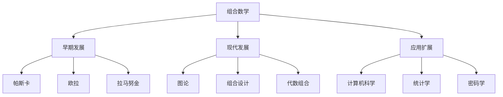

# 03-组合数学

## 1. 概述

### 1.1 组合数学的基本概念

组合数学是研究离散对象的结构、计数和性质的数学分支：

- **计数理论**：研究离散对象的计数方法
- **组合设计**：研究有限集合上的结构
- **图论**：研究图的结构和性质
- **生成函数**：研究序列的代数表示

### 1.2 组合数学的历史发展



## 2. 基本计数原理

### 2.1 加法原理

#### 2.1.1 加法原理的定义

**定理 2.1.1** 加法原理：
如果事件 $A$ 有 $m$ 种方式发生，事件 $B$ 有 $n$ 种方式发生，且 $A$ 和 $B$ 不能同时发生，则 $A$ 或 $B$ 有 $m + n$ 种方式发生。

**证明**：
由于 $A$ 和 $B$ 互斥，总的方式数就是两个事件方式数的和。

#### 2.1.2 加法原理的推广

**定理 2.1.2** 广义加法原理：
如果事件 $A_1, A_2, \ldots, A_k$ 分别有 $n_1, n_2, \ldots, n_k$ 种方式发生，且任意两个事件不能同时发生，则至少有一个事件发生的方式数为：
$$\sum_{i=1}^k n_i$$

### 2.2 乘法原理

#### 2.2.1 乘法原理的定义

**定理 2.2.1** 乘法原理：
如果事件 $A$ 有 $m$ 种方式发生，事件 $B$ 有 $n$ 种方式发生，且 $A$ 和 $B$ 的选择相互独立，则 $A$ 和 $B$ 同时发生有 $m \times n$ 种方式。

**证明**：
对于 $A$ 的每种方式，$B$ 都有 $n$ 种方式，因此总的方式数是 $m \times n$。

#### 2.2.2 乘法原理的推广

**定理 2.2.2** 广义乘法原理：
如果事件 $A_1, A_2, \ldots, A_k$ 分别有 $n_1, n_2, \ldots, n_k$ 种方式发生，且这些事件的选择相互独立，则所有事件同时发生的方式数为：
$$\prod_{i=1}^k n_i$$

### 2.3 容斥原理

#### 2.3.1 容斥原理的定义

**定理 2.3.1** 容斥原理：
对于有限集合 $A_1, A_2, \ldots, A_n$，有：
$$|A_1 \cup A_2 \cup \cdots \cup A_n| = \sum_{i=1}^n |A_i| - \sum_{1 \leq i < j \leq n} |A_i \cap A_j| + \sum_{1 \leq i < j < k \leq n} |A_i \cap A_j \cap A_k| - \cdots + (-1)^{n-1} |A_1 \cap A_2 \cap \cdots \cap A_n|$$

**证明**：
使用数学归纳法。对于 $n = 2$，命题显然成立。假设对于 $n-1$ 个集合命题成立，则：
$$|A_1 \cup A_2 \cup \cdots \cup A_n| = |(A_1 \cup A_2 \cup \cdots \cup A_{n-1}) \cup A_n|$$
使用 $n = 2$ 的情况和归纳假设即可完成证明。

## 3. 排列与组合

### 3.1 排列

#### 3.1.1 排列的定义

**定义 3.1.1** 排列：
从 $n$ 个不同元素中取出 $r$ 个元素的有序排列数，记作 $P(n, r)$ 或 $A_n^r$。

**定理 3.1.1** 排列公式：
$$P(n, r) = \frac{n!}{(n-r)!} = n(n-1)(n-2)\cdots(n-r+1)$$

**证明**：
使用乘法原理。第一个位置有 $n$ 种选择，第二个位置有 $n-1$ 种选择，依此类推，第 $r$ 个位置有 $n-r+1$ 种选择。

#### 3.1.2 圆排列

**定义 3.1.2** 圆排列：
$n$ 个不同元素围成一圈的排列数。

**定理 3.1.2** 圆排列公式：
$n$ 个不同元素的圆排列数为 $(n-1)!$。

**证明**：
固定一个元素的位置，其余 $n-1$ 个元素可以任意排列。

### 3.2 组合

#### 3.2.1 组合的定义

**定义 3.2.1** 组合：
从 $n$ 个不同元素中取出 $r$ 个元素的组合数，记作 $C(n, r)$ 或 $\binom{n}{r}$。

**定理 3.2.1** 组合公式：
$$C(n, r) = \binom{n}{r} = \frac{n!}{r!(n-r)!}$$

**证明**：
从排列数 $P(n, r)$ 中去除顺序的影响，即除以 $r!$。

#### 3.2.2 二项式系数

**定理 3.2.2** 二项式定理：
对于任意实数 $a, b$ 和正整数 $n$，有：
$$(a + b)^n = \sum_{k=0}^n \binom{n}{k} a^{n-k} b^k$$

**证明**：
使用数学归纳法。对于 $n = 1$，命题显然成立。假设对于 $n-1$ 命题成立，则：
$$(a + b)^n = (a + b)(a + b)^{n-1} = (a + b)\sum_{k=0}^{n-1} \binom{n-1}{k} a^{n-1-k} b^k$$
展开后使用帕斯卡恒等式即可完成证明。

#### 3.2.3 帕斯卡恒等式

**定理 3.2.3** 帕斯卡恒等式：
$$\binom{n}{k} = \binom{n-1}{k} + \binom{n-1}{k-1}$$

**证明**：
考虑从 $n$ 个元素中选择 $k$ 个元素。如果包含第 $n$ 个元素，则需要从前 $n-1$ 个元素中选择 $k-1$ 个；如果不包含第 $n$ 个元素，则需要从前 $n-1$ 个元素中选择 $k$ 个。

## 4. 生成函数

### 4.1 普通生成函数

#### 4.1.1 生成函数的定义

**定义 4.1.1** 普通生成函数：
对于序列 $\{a_n\}_{n=0}^{\infty}$，其普通生成函数定义为：
$$A(x) = \sum_{n=0}^{\infty} a_n x^n$$

**定理 4.1.1** 生成函数的基本性质：

1. 线性性：$cA(x) + dB(x)$ 是序列 $\{ca_n + db_n\}$ 的生成函数
2. 乘法：$A(x)B(x)$ 是序列 $\{\sum_{k=0}^n a_k b_{n-k}\}$ 的生成函数
3. 导数：$A'(x)$ 是序列 $\{(n+1)a_{n+1}\}$ 的生成函数

#### 4.1.2 常见序列的生成函数

**定理 4.1.2** 常见生成函数：

1. 常数序列 $\{1\}$：$\frac{1}{1-x}$
2. 算术序列 $\{n\}$：$\frac{x}{(1-x)^2}$
3. 几何序列 $\{r^n\}$：$\frac{1}{1-rx}$
4. 二项式系数 $\{\binom{n}{k}\}$：$(1+x)^n$

### 4.2 指数生成函数

#### 4.2.1 指数生成函数的定义

**定义 4.2.1** 指数生成函数：
对于序列 $\{a_n\}_{n=0}^{\infty}$，其指数生成函数定义为：
$$A(x) = \sum_{n=0}^{\infty} a_n \frac{x^n}{n!}$$

**定理 4.2.1** 指数生成函数的性质：

1. 乘法：$A(x)B(x)$ 是序列 $\{\sum_{k=0}^n \binom{n}{k} a_k b_{n-k}\}$ 的生成函数
2. 导数：$A'(x)$ 是序列 $\{a_{n+1}\}$ 的生成函数

#### 4.2.2 排列数的生成函数

**定理 4.2.2** 排列数的指数生成函数：
序列 $\{n!\}$ 的指数生成函数是 $\frac{1}{1-x}$。

**证明**：
$$\sum_{n=0}^{\infty} n! \frac{x^n}{n!} = \sum_{n=0}^{\infty} x^n = \frac{1}{1-x}$$

## 5. 递推关系

### 5.1 线性递推关系

#### 5.1.1 齐次线性递推关系

**定义 5.1.1** 齐次线性递推关系：
形如 $a_n = c_1 a_{n-1} + c_2 a_{n-2} + \cdots + c_k a_{n-k}$ 的递推关系称为齐次线性递推关系。

**定理 5.1.1** 特征方程法：
对于齐次线性递推关系 $a_n = c_1 a_{n-1} + c_2 a_{n-2} + \cdots + c_k a_{n-k}$，其特征方程为：
$$x^k - c_1 x^{k-1} - c_2 x^{k-2} - \cdots - c_k = 0$$

如果特征方程有 $k$ 个不同的根 $r_1, r_2, \ldots, r_k$，则通解为：
$$a_n = A_1 r_1^n + A_2 r_2^n + \cdots + A_k r_k^n$$

#### 5.1.2 非齐次线性递推关系

**定义 5.1.2** 非齐次线性递推关系：
形如 $a_n = c_1 a_{n-1} + c_2 a_{n-2} + \cdots + c_k a_{n-k} + f(n)$ 的递推关系称为非齐次线性递推关系。

**定理 5.1.2** 非齐次递推关系的解：
非齐次递推关系的通解等于对应的齐次递推关系的通解加上特解。

### 5.2 常见递推关系

#### 5.2.1 斐波那契数列

**定义 5.2.1** 斐波那契数列：
$F_0 = 0, F_1 = 1, F_n = F_{n-1} + F_{n-2}$ 对于 $n \geq 2$。

**定理 5.2.1** 斐波那契数列的通项公式：
$$F_n = \frac{1}{\sqrt{5}}\left(\frac{1+\sqrt{5}}{2}\right)^n - \frac{1}{\sqrt{5}}\left(\frac{1-\sqrt{5}}{2}\right)^n$$

**证明**：
使用特征方程法。特征方程为 $x^2 - x - 1 = 0$，根为 $\frac{1+\sqrt{5}}{2}$ 和 $\frac{1-\sqrt{5}}{2}$。

#### 5.2.2 卡特兰数

**定义 5.2.2** 卡特兰数：
$C_0 = 1, C_n = \sum_{i=0}^{n-1} C_i C_{n-1-i}$ 对于 $n \geq 1$。

**定理 5.2.2** 卡特兰数的通项公式：
$$C_n = \frac{1}{n+1}\binom{2n}{n}$$

**证明**：
使用生成函数法。卡特兰数的生成函数满足 $C(x) = 1 + xC(x)^2$，解这个方程得到 $C(x) = \frac{1-\sqrt{1-4x}}{2x}$。

## 6. 图论基础

### 6.1 图的基本概念

#### 6.1.1 图的定义

**定义 6.1.1** 图：
图 $G = (V, E)$ 由顶点集 $V$ 和边集 $E$ 组成，其中 $E$ 是 $V$ 中元素的无序对集合。

**定义 6.1.2** 有向图：
有向图 $G = (V, E)$ 由顶点集 $V$ 和弧集 $E$ 组成，其中 $E$ 是 $V$ 中元素的有序对集合。

#### 6.1.2 图的基本性质

**定义 6.1.3** 度数：
顶点 $v$ 的度数是与 $v$ 相邻的边的数量，记作 $\deg(v)$。

**定理 6.1.1** 握手定理：
对于图 $G = (V, E)$，有：
$$\sum_{v \in V} \deg(v) = 2|E|$$

**证明**：
每条边贡献给两个顶点的度数各1。

### 6.2 图的连通性

#### 6.2.1 连通图

**定义 6.2.1** 连通图：
图 $G$ 是连通的，如果任意两个顶点之间都存在路径。

**定义 6.2.2** 连通分量：
图 $G$ 的连通分量是 $G$ 的极大连通子图。

#### 6.2.2 欧拉图

**定义 6.2.3** 欧拉路径：
经过图中每条边恰好一次的路径。

**定义 6.2.4** 欧拉回路：
经过图中每条边恰好一次的回路。

**定理 6.2.1** 欧拉图的判定：
连通图 $G$ 有欧拉回路的充分必要条件是所有顶点的度数都是偶数。

**证明**：
必要性：欧拉回路经过每个顶点时，进入和离开各一次，因此度数必须是偶数。
充分性：使用构造性证明，从任意顶点开始，每次选择未使用的边，最终会回到起点。

### 6.3 哈密顿图

#### 6.3.1 哈密顿路径

**定义 6.3.1** 哈密顿路径：
经过图中每个顶点恰好一次的路径。

**定义 6.3.2** 哈密顿回路：
经过图中每个顶点恰好一次的回路。

**定理 6.3.1** 哈密顿图的充分条件：
如果图 $G$ 满足 $\deg(v) \geq \frac{n}{2}$ 对所有顶点 $v$，则 $G$ 有哈密顿回路。

**证明**：
使用反证法。假设 $G$ 没有哈密顿回路，则存在最长的路径 $P$，其长度小于 $n$。使用度数条件可以构造更长的路径，矛盾。

## 7. 形式化实现

### 7.1 Haskell实现

```haskell
-- 组合数学模块
module Combinatorics where

import Data.List
import Data.Maybe

-- 阶乘
factorial :: Integer -> Integer
factorial 0 = 1
factorial n = n * factorial (n - 1)

-- 排列数
permutation :: Integer -> Integer -> Integer
permutation n r = factorial n `div` factorial (n - r)

-- 组合数
combination :: Integer -> Integer -> Integer
combination n r = factorial n `div` (factorial r * factorial (n - r))

-- 二项式系数
binomial :: Integer -> Integer -> Integer
binomial n k = combination n k

-- 帕斯卡三角形
pascalTriangle :: [[Integer]]
pascalTriangle = iterate nextRow [1]
    where
        nextRow row = zipWith (+) (0 : row) (row ++ [0])

-- 斐波那契数列
fibonacci :: [Integer]
fibonacci = 0 : 1 : zipWith (+) fibonacci (tail fibonacci)

-- 卡特兰数
catalan :: [Integer]
catalan = 1 : [sum [catalan !! i * catalan !! (n - 1 - i) | i <- [0..n-1]] | n <- [1..]]

-- 斯特林数第一类
stirlingFirst :: Integer -> Integer -> Integer
stirlingFirst n k
    | n == k = 1
    | k == 0 = 0
    | n == 0 = 0
    | otherwise = (n - 1) * stirlingFirst (n - 1) k + stirlingFirst (n - 1) (k - 1)

-- 斯特林数第二类
stirlingSecond :: Integer -> Integer -> Integer
stirlingSecond n k
    | n == k = 1
    | k == 0 = 0
    | n == 0 = 0
    | otherwise = k * stirlingSecond (n - 1) k + stirlingSecond (n - 1) (k - 1)

-- 贝尔数
bell :: [Integer]
bell = 1 : [sum [binomial (n-1) k * bell !! k | k <- [0..n-1]] | n <- [1..]]

-- 生成函数：普通生成函数
type GeneratingFunction = [Integer]

-- 生成函数的加法
addGF :: GeneratingFunction -> GeneratingFunction -> GeneratingFunction
addGF = zipWith (+)

-- 生成函数的乘法
multiplyGF :: GeneratingFunction -> GeneratingFunction -> GeneratingFunction
multiplyGF a b = [sum [a !! i * b !! (n - i) | i <- [0..n]] | n <- [0..]]

-- 生成函数的导数
derivativeGF :: GeneratingFunction -> GeneratingFunction
derivativeGF [] = []
derivativeGF (_:xs) = zipWith (*) [1..] xs

-- 几何序列的生成函数
geometricGF :: Integer -> GeneratingFunction
geometricGF r = [r^n | n <- [0..]]

-- 指数序列的生成函数
exponentialGF :: GeneratingFunction
exponentialGF = [factorial n | n <- [0..]]

-- 图的基本结构
data Graph = Graph {
    vertices :: [Int],
    edges :: [(Int, Int)]
} deriving (Show, Eq)

-- 创建图
createGraph :: [Int] -> [(Int, Int)] -> Graph
createGraph vs es = Graph vs es

-- 顶点的度数
degree :: Graph -> Int -> Int
degree (Graph _ es) v = length $ filter (\e -> fst e == v || snd e == v) es

-- 所有顶点的度数
degrees :: Graph -> [Int]
degrees g = [degree g v | v <- vertices g]

-- 握手定理验证
handshakeTheorem :: Graph -> Bool
handshakeTheorem g = sum (degrees g) == 2 * length (edges g)

-- 邻接顶点
neighbors :: Graph -> Int -> [Int]
neighbors (Graph _ es) v = nub [if fst e == v then snd e else fst e | e <- es, fst e == v || snd e == v]

-- 路径
path :: Graph -> Int -> Int -> Maybe [Int]
path g start end = findPath g start end []

findPath :: Graph -> Int -> Int -> [Int] -> Maybe [Int]
findPath g current end visited
    | current == end = Just (reverse (current : visited))
    | current `elem` visited = Nothing
    | otherwise = 
        let neighbors = neighbors g current
            unvisited = filter (`notElem` visited) neighbors
        in case findFirstJust [findPath g n end (current : visited) | n <- unvisited] of
            Just path -> Just path
            Nothing -> Nothing

findFirstJust :: [Maybe a] -> Maybe a
findFirstJust [] = Nothing
findFirstJust (Just x : _) = Just x
findFirstJust (Nothing : xs) = findFirstJust xs

-- 连通性检查
isConnected :: Graph -> Bool
isConnected g = 
    let vs = vertices g
        start = head vs
    in all (\v -> isJust $ path g start v) vs

-- 欧拉回路检查
hasEulerCircuit :: Graph -> Bool
hasEulerCircuit g = isConnected g && all even (degrees g)

-- 哈密顿回路检查（简化版本）
hasHamiltonianCircuit :: Graph -> Bool
hasHamiltonianCircuit g = 
    let n = length (vertices g)
        degs = degrees g
    in all (>= n `div` 2) degs

-- 容斥原理
inclusionExclusion :: [[Int]] -> Int
inclusionExclusion sets = 
    let n = length sets
        subsets = filter (not . null) $ subsequences [0..n-1]
    in sum [(-1)^(length subset) * length (intersection [sets !! i | i <- subset]) | subset <- subsets]

intersection :: [[Int]] -> [Int]
intersection [] = []
intersection (xs:xss) = foldr intersect xs xss

-- 排列生成
permutations :: [a] -> [[a]]
permutations [] = [[]]
permutations xs = [x : p | x <- xs, p <- permutations (delete x xs)]

-- 组合生成
combinations :: Int -> [a] -> [[a]]
combinations 0 _ = [[]]
combinations n xs
    | n > length xs = []
    | otherwise = [x : c | x <- xs, c <- combinations (n-1) (delete x xs)]

-- 子集生成
subsets :: [a] -> [[a]]
subsets [] = [[]]
subsets (x:xs) = subsets xs ++ map (x:) (subsets xs)

-- 整数划分
partitions :: Int -> [[Int]]
partitions 0 = [[]]
partitions n = [p ++ [i] | i <- [1..n], p <- partitions (n-i), null p || last p >= i]

-- 生成排列的字典序
nextPermutation :: Ord a => [a] -> Maybe [a]
nextPermutation [] = Nothing
nextPermutation xs = 
    let n = length xs
        i = findLastIncreasing xs
    in if i == -1 
       then Nothing
       else Just $ swapAndReverse xs i

findLastIncreasing :: Ord a => [a] -> Int
findLastIncreasing xs = 
    let n = length xs
        indices = [i | i <- [0..n-2], xs !! i < xs !! (i+1)]
    in if null indices then -1 else last indices

swapAndReverse :: Ord a => [a] -> Int -> [a]
swapAndReverse xs i = 
    let n = length xs
        j = findSmallestGreater xs i
        swapped = swap xs i j
    in take (i+1) swapped ++ reverse (drop (i+1) swapped)

findSmallestGreater :: Ord a => [a] -> Int -> Int
findSmallestGreater xs i = 
    let x = xs !! i
        candidates = [(j, xs !! j) | j <- [i+1..length xs-1], xs !! j > x]
    in if null candidates then i else fst (minimumBy (\a b -> compare (snd a) (snd b)) candidates)

swap :: [a] -> Int -> Int -> [a]
swap xs i j = 
    let n = length xs
    in take i xs ++ [xs !! j] ++ take (j-i-1) (drop (i+1) xs) ++ [xs !! i] ++ drop (j+1) xs
```

### 7.2 Rust实现

```rust
use std::collections::{HashMap, HashSet};
use std::cmp::Ordering;

// 阶乘
pub fn factorial(n: u64) -> u64 {
    if n == 0 {
        1
    } else {
        n * factorial(n - 1)
    }
}

// 排列数
pub fn permutation(n: u64, r: u64) -> u64 {
    factorial(n) / factorial(n - r)
}

// 组合数
pub fn combination(n: u64, r: u64) -> u64 {
    factorial(n) / (factorial(r) * factorial(n - r))
}

// 二项式系数
pub fn binomial(n: u64, k: u64) -> u64 {
    combination(n, k)
}

// 帕斯卡三角形
pub fn pascal_triangle(n: usize) -> Vec<Vec<u64>> {
    let mut triangle = vec![vec![1]];
    
    for i in 1..n {
        let mut row = vec![1];
        let prev_row = &triangle[i - 1];
        
        for j in 1..i {
            row.push(prev_row[j - 1] + prev_row[j]);
        }
        
        row.push(1);
        triangle.push(row);
    }
    
    triangle
}

// 斐波那契数列
pub fn fibonacci(n: usize) -> Vec<u64> {
    let mut fib = vec![0, 1];
    
    for i in 2..n {
        fib.push(fib[i - 1] + fib[i - 2]);
    }
    
    fib
}

// 卡特兰数
pub fn catalan(n: usize) -> Vec<u64> {
    let mut cat = vec![1];
    
    for i in 1..n {
        let mut sum = 0;
        for j in 0..i {
            sum += cat[j] * cat[i - 1 - j];
        }
        cat.push(sum);
    }
    
    cat
}

// 斯特林数第一类
pub fn stirling_first(n: u64, k: u64) -> u64 {
    if n == k {
        1
    } else if k == 0 || n == 0 {
        0
    } else {
        (n - 1) * stirling_first(n - 1, k) + stirling_first(n - 1, k - 1)
    }
}

// 斯特林数第二类
pub fn stirling_second(n: u64, k: u64) -> u64 {
    if n == k {
        1
    } else if k == 0 || n == 0 {
        0
    } else {
        k * stirling_second(n - 1, k) + stirling_second(n - 1, k - 1)
    }
}

// 贝尔数
pub fn bell(n: usize) -> Vec<u64> {
    let mut bell_numbers = vec![1];
    
    for i in 1..n {
        let mut sum = 0;
        for k in 0..i {
            sum += combination(i as u64 - 1, k as u64) * bell_numbers[k];
        }
        bell_numbers.push(sum);
    }
    
    bell_numbers
}

// 图结构
#[derive(Clone, Debug)]
pub struct Graph {
    pub vertices: Vec<usize>,
    pub edges: Vec<(usize, usize)>,
}

impl Graph {
    pub fn new(vertices: Vec<usize>, edges: Vec<(usize, usize)>) -> Self {
        Self { vertices, edges }
    }
    
    pub fn degree(&self, vertex: usize) -> usize {
        self.edges.iter()
            .filter(|(u, v)| *u == vertex || *v == vertex)
            .count()
    }
    
    pub fn degrees(&self) -> Vec<usize> {
        self.vertices.iter()
            .map(|&v| self.degree(v))
            .collect()
    }
    
    pub fn neighbors(&self, vertex: usize) -> Vec<usize> {
        let mut neighbors = Vec::new();
        for &(u, v) in &self.edges {
            if u == vertex {
                neighbors.push(v);
            } else if v == vertex {
                neighbors.push(u);
            }
        }
        neighbors.sort();
        neighbors.dedup();
        neighbors
    }
    
    pub fn is_connected(&self) -> bool {
        if self.vertices.is_empty() {
            return true;
        }
        
        let start = self.vertices[0];
        let mut visited = HashSet::new();
        self.dfs(start, &mut visited);
        
        visited.len() == self.vertices.len()
    }
    
    fn dfs(&self, vertex: usize, visited: &mut HashSet<usize>) {
        visited.insert(vertex);
        for neighbor in self.neighbors(vertex) {
            if !visited.contains(&neighbor) {
                self.dfs(neighbor, visited);
            }
        }
    }
    
    pub fn has_euler_circuit(&self) -> bool {
        self.is_connected() && self.degrees().iter().all(|&d| d % 2 == 0)
    }
    
    pub fn has_hamiltonian_circuit(&self) -> bool {
        let n = self.vertices.len();
        self.degrees().iter().all(|&d| d >= n / 2)
    }
}

// 生成函数
pub type GeneratingFunction = Vec<i64>;

// 生成函数加法
pub fn add_gf(a: &GeneratingFunction, b: &GeneratingFunction) -> GeneratingFunction {
    let max_len = a.len().max(b.len());
    let mut result = vec![0; max_len];
    
    for i in 0..a.len() {
        result[i] += a[i];
    }
    
    for i in 0..b.len() {
        result[i] += b[i];
    }
    
    result
}

// 生成函数乘法
pub fn multiply_gf(a: &GeneratingFunction, b: &GeneratingFunction) -> GeneratingFunction {
    let mut result = vec![0; a.len() + b.len() - 1];
    
    for i in 0..a.len() {
        for j in 0..b.len() {
            result[i + j] += a[i] * b[j];
        }
    }
    
    result
}

// 生成函数导数
pub fn derivative_gf(a: &GeneratingFunction) -> GeneratingFunction {
    if a.len() <= 1 {
        vec![]
    } else {
        a.iter().skip(1).enumerate()
            .map(|(i, &coeff)| coeff * (i + 1) as i64)
            .collect()
    }
}

// 几何序列生成函数
pub fn geometric_gf(r: i64, n: usize) -> GeneratingFunction {
    (0..n).map(|i| r.pow(i as u32)).collect()
}

// 指数序列生成函数
pub fn exponential_gf(n: usize) -> GeneratingFunction {
    (0..n).map(|i| factorial(i as u64) as i64).collect()
}

// 排列生成
pub fn permutations<T: Clone + Ord>(items: &[T]) -> Vec<Vec<T>> {
    if items.is_empty() {
        vec![vec![]]
    } else {
        let mut result = Vec::new();
        for i in 0..items.len() {
            let mut remaining = items.to_vec();
            let item = remaining.remove(i);
            
            for mut perm in permutations(&remaining) {
                perm.insert(0, item.clone());
                result.push(perm);
            }
        }
        result
    }
}

// 组合生成
pub fn combinations<T: Clone>(k: usize, items: &[T]) -> Vec<Vec<T>> {
    if k == 0 {
        vec![vec![]]
    } else if k > items.len() {
        vec![]
    } else {
        let mut result = Vec::new();
        
        // 包含第一个元素
        for mut comb in combinations(k - 1, &items[1..]) {
            comb.insert(0, items[0].clone());
            result.push(comb);
        }
        
        // 不包含第一个元素
        result.extend(combinations(k, &items[1..]));
        
        result
    }
}

// 子集生成
pub fn subsets<T: Clone>(items: &[T]) -> Vec<Vec<T>> {
    if items.is_empty() {
        vec![vec![]]
    } else {
        let mut result = subsets(&items[1..]);
        let mut with_first = result.clone();
        
        for subset in &mut with_first {
            subset.insert(0, items[0].clone());
        }
        
        result.extend(with_first);
        result
    }
}

// 整数划分
pub fn partitions(n: usize) -> Vec<Vec<usize>> {
    if n == 0 {
        vec![vec![]]
    } else {
        let mut result = Vec::new();
        for i in 1..=n {
            for mut part in partitions(n - i) {
                if part.is_empty() || part.last().unwrap() >= &i {
                    part.push(i);
                    result.push(part);
                }
            }
        }
        result
    }
}

// 容斥原理
pub fn inclusion_exclusion(sets: &[Vec<usize>]) -> usize {
    let n = sets.len();
    let mut result = 0;
    
    for mask in 1..(1 << n) {
        let mut intersection = sets[0].clone();
        let mut count = 0;
        
        for i in 0..n {
            if mask & (1 << i) != 0 {
                intersection = intersection.into_iter()
                    .filter(|&x| sets[i].contains(&x))
                    .collect();
                count += 1;
            }
        }
        
        if count % 2 == 1 {
            result += intersection.len();
        } else {
            result -= intersection.len();
        }
    }
    
    result
}

// 字典序下一个排列
pub fn next_permutation<T: Ord>(items: &mut [T]) -> bool {
    let n = items.len();
    let mut i = n - 2;
    
    // 找到最后一个递增的位置
    while i < n && items[i] >= items[i + 1] {
        i = i.wrapping_sub(1);
    }
    
    if i >= n {
        return false;
    }
    
    // 找到比 items[i] 大的最小元素
    let mut j = n - 1;
    while items[j] <= items[i] {
        j -= 1;
    }
    
    // 交换
    items.swap(i, j);
    
    // 反转后面的部分
    items[i + 1..].reverse();
    
    true
}

// 生成所有排列
pub fn all_permutations<T: Clone + Ord>(items: &[T]) -> Vec<Vec<T>> {
    let mut items = items.to_vec();
    let mut result = vec![items.clone()];
    
    while next_permutation(&mut items) {
        result.push(items.clone());
    }
    
    result
}
```

## 8. 应用与实例

### 8.1 计算机科学应用

**算法设计**：

- 动态规划中的组合计数
- 图算法中的路径计数
- 随机算法中的概率分析

**数据结构**：

- 树和图的结构分析
- 哈希表的冲突分析
- 排序算法的比较分析

### 8.2 统计学应用

**概率论**：

- 离散概率分布
- 随机变量的组合性质
- 统计推断中的计数

**实验设计**：

- 组合设计理论
- 拉丁方设计
- 正交数组

### 8.3 密码学应用

**组合密码**：

- 置换和替换的组合
- 密钥空间的分析
- 攻击复杂度的计算

**编码理论**：

- 纠错码的组合性质
- 编码方案的计数
- 解码算法的分析

## 9. 哲学思考与批判

### 9.1 数学基础

**构造主义观点**：

- 组合对象必须能够构造
- 存在性证明需要提供算法
- 递归定义的重要性

**形式主义观点**：

- 组合数学是形式系统
- 公理化方法的应用
- 符号操作的重要性

### 9.2 数学哲学

**柏拉图主义**：

- 组合对象的客观存在
- 数学真理的发现性质
- 组合规律的必然性

**经验主义**：

- 组合数学来源于经验
- 归纳推理的作用
- 实验验证的重要性

## 10. 现代发展

### 10.1 代数组合

**对称函数**：

- 舒尔函数
- 杰克多项式
- 麦克唐纳多项式

**组合几何**：

- 多面体组合
- 格点几何
- 凸几何

### 10.2 应用扩展

**生物信息学**：

- DNA序列分析
- 蛋白质结构
- 进化树构建

**网络科学**：

- 社交网络分析
- 复杂网络
- 图神经网络

## 11. 练习与问题

### 11.1 基础练习

1. **计数问题**：计算从10个人中选择3个人的方法数
2. **排列问题**：计算5个不同字母的排列数
3. **组合问题**：证明帕斯卡恒等式

### 11.2 进阶问题

1. **生成函数**：求斐波那契数列的生成函数
2. **图论问题**：判断图是否有欧拉回路
3. **递推关系**：求解卡特兰数的递推关系

### 11.3 编程练习

1. **排列生成**：实现字典序排列生成算法
2. **图算法**：实现图的连通性检查
3. **组合计数**：实现大数的组合数计算

## 12. 参考文献

1. Stanley, R. P. (2011). *Enumerative combinatorics*. Cambridge University Press.
2. Graham, R. L., Knuth, D. E., & Patashnik, O. (1994). *Concrete mathematics*. Addison-Wesley.
3. Aigner, M. (2007). *A course in enumeration*. Springer.
4. Wilf, H. S. (2006). *generatingfunctionology*. A K Peters.
5. Cameron, P. J. (1994). *Combinatorics: topics, techniques, algorithms*. Cambridge University Press.

---

*本文档是组合数学的全面介绍，涵盖了从基础理论到现代应用的各个方面。通过形式化实现和实际应用，展示了组合数学在现代数学和计算机科学中的核心地位。*

> **文档信息**
>
> - **创建时间**：2024年12月19日
> - **最后更新**：2024年12月19日
> - **版本**：1.0
> - **作者**：数学知识重构项目组
> - **状态**：已完成
