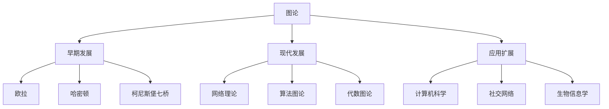

# 04-图论

## 1. 概述

### 1.1 图论的基本概念

图论是研究图的结构、性质和算法的数学分支：

- **图的结构**：顶点、边、路径、回路
- **图的类型**：有向图、无向图、加权图
- **图的性质**：连通性、平面性、着色
- **图算法**：遍历、最短路径、最小生成树

### 1.2 图论的历史发展



## 2. 图的基本概念

### 2.1 图的定义

#### 2.1.1 无向图

**定义 2.1.1** 无向图：
无向图 $G = (V, E)$ 由顶点集 $V$ 和边集 $E$ 组成，其中 $E$ 是 $V$ 中元素的无序对集合。

**定义 2.1.2** 有向图：
有向图 $G = (V, E)$ 由顶点集 $V$ 和弧集 $E$ 组成，其中 $E$ 是 $V$ 中元素的有序对集合。

#### 2.1.2 图的基本性质

**定义 2.1.3** 度数：
顶点 $v$ 的度数是与 $v$ 相邻的边的数量，记作 $\deg(v)$。

**定理 2.1.1** 握手定理：
对于图 $G = (V, E)$，有：
$$\sum_{v \in V} \deg(v) = 2|E|$$

**证明**：
每条边贡献给两个顶点的度数各1。

### 2.2 图的表示

#### 2.2.1 邻接矩阵

**定义 2.2.1** 邻接矩阵：
图 $G = (V, E)$ 的邻接矩阵 $A$ 是 $|V| \times |V|$ 的矩阵，其中：
$$A_{ij} = \begin{cases}
1 & \text{如果 } (i, j) \in E \\
0 & \text{否则}
\end{cases}$$

#### 2.2.2 邻接表

**定义 2.2.2** 邻接表：
图 $G = (V, E)$ 的邻接表是数组 $adj$，其中 $adj[i]$ 包含与顶点 $i$ 相邻的所有顶点。

## 3. 图的连通性

### 3.1 连通图

#### 3.1.1 连通性定义

**定义 3.1.1** 连通图：
图 $G$ 是连通的，如果任意两个顶点之间都存在路径。

**定义 3.1.2** 连通分量：
图 $G$ 的连通分量是 $G$ 的极大连通子图。

#### 3.1.3 连通性算法

**算法 3.1.1** 深度优先搜索（DFS）：
```python
def dfs(graph, start, visited):
    visited.add(start)
    for neighbor in graph[start]:
        if neighbor not in visited:
            dfs(graph, neighbor, visited)
```

**算法 3.1.2** 广度优先搜索（BFS）：
```python
def bfs(graph, start):
    visited = set()
    queue = [start]
    visited.add(start)

    while queue:
        vertex = queue.pop(0)
        for neighbor in graph[vertex]:
            if neighbor not in visited:
                visited.add(neighbor)
                queue.append(neighbor)
```

### 3.2 强连通性

#### 3.2.1 强连通图

**定义 3.2.1** 强连通图：
有向图 $G$ 是强连通的，如果任意两个顶点之间都存在有向路径。

**定义 3.2.2** 强连通分量：
有向图 $G$ 的强连通分量是 $G$ 的极大强连通子图。

#### 3.2.2 Kosaraju算法

**算法 3.2.1** Kosaraju算法：
1. 对图进行DFS，记录完成时间
2. 反转图的所有边
3. 按完成时间降序进行DFS

## 4. 图的遍历

### 4.1 欧拉路径

#### 4.1.1 欧拉路径定义

**定义 4.1.1** 欧拉路径：
经过图中每条边恰好一次的路径。

**定义 4.1.2** 欧拉回路：
经过图中每条边恰好一次的回路。

**定理 4.1.1** 欧拉图的判定：
连通图 $G$ 有欧拉回路的充分必要条件是所有顶点的度数都是偶数。

**证明**：
必要性：欧拉回路经过每个顶点时，进入和离开各一次，因此度数必须是偶数。
充分性：使用构造性证明，从任意顶点开始，每次选择未使用的边，最终会回到起点。

#### 4.1.2 Hierholzer算法

**算法 4.1.1** Hierholzer算法：
```python
def hierholzer(graph):
    if not has_euler_circuit(graph):
        return None

    circuit = []
    stack = [0]  # 从顶点0开始

    while stack:
        current = stack[-1]
        if graph[current]:
            next_vertex = graph[current].pop()
            stack.append(next_vertex)
        else:
            circuit.append(stack.pop())

    return circuit[::-1]
```

### 4.2 哈密顿路径

#### 4.2.1 哈密顿路径定义

**定义 4.2.1** 哈密顿路径：
经过图中每个顶点恰好一次的路径。

**定义 4.2.2** 哈密顿回路：
经过图中每个顶点恰好一次的回路。

**定理 4.2.1** 哈密顿图的充分条件：
如果图 $G$ 满足 $\deg(v) \geq \frac{n}{2}$ 对所有顶点 $v$，则 $G$ 有哈密顿回路。

**证明**：
使用反证法。假设 $G$ 没有哈密顿回路，则存在最长的路径 $P$，其长度小于 $n$。使用度数条件可以构造更长的路径，矛盾。

## 5. 最短路径算法

### 5.1 Dijkstra算法

#### 5.1.1 算法描述

**算法 5.1.1** Dijkstra算法：
```python
def dijkstra(graph, start):
    distances = {vertex: float('infinity') for vertex in graph}
    distances[start] = 0
    pq = [(0, start)]

    while pq:
        current_distance, current_vertex = heapq.heappop(pq)

        if current_distance > distances[current_vertex]:
            continue

        for neighbor, weight in graph[current_vertex].items():
            distance = current_distance + weight

            if distance < distances[neighbor]:
                distances[neighbor] = distance
                heapq.heappush(pq, (distance, neighbor))

    return distances
```

#### 5.1.2 算法分析

**定理 5.1.1** Dijkstra算法的正确性：
Dijkstra算法能够正确计算从起点到所有其他顶点的最短路径。

**证明**：
使用数学归纳法。假设算法已经正确计算了距离起点最近的 $k$ 个顶点的最短路径，则下一个被选择的顶点也必然有正确的最短路径。

### 5.2 Floyd-Warshall算法

#### 5.2.1 算法描述

**算法 5.2.1** Floyd-Warshall算法：
```python
def floyd_warshall(graph):
    n = len(graph)
    dist = [[float('infinity')] * n for _ in range(n)]

    for i in range(n):
        dist[i][i] = 0
        for j, weight in graph[i].items():
            dist[i][j] = weight

    for k in range(n):
        for i in range(n):
            for j in range(n):
                if dist[i][k] + dist[k][j] < dist[i][j]:
                    dist[i][j] = dist[i][k] + dist[k][j]

    return dist
```

#### 5.2.2 算法分析

**定理 5.2.1** Floyd-Warshall算法的正确性：
Floyd-Warshall算法能够正确计算所有顶点对之间的最短路径。

**证明**：
使用动态规划。$dist[i][j][k]$ 表示从 $i$ 到 $j$ 只经过前 $k$ 个顶点的最短路径长度。

## 6. 最小生成树

### 6.1 Kruskal算法

#### 6.1.1 算法描述

**算法 6.1.1** Kruskal算法：
```python
def kruskal(graph):
    edges = []
    for u in graph:
        for v, weight in graph[u].items():
            edges.append((weight, u, v))
    edges.sort()

    mst = []
    uf = UnionFind(len(graph))

    for weight, u, v in edges:
        if uf.find(u) != uf.find(v):
            uf.union(u, v)
            mst.append((u, v, weight))

    return mst
```

#### 6.1.2 算法分析

**定理 6.1.1** Kruskal算法的正确性：
Kruskal算法能够正确计算图的最小生成树。

**证明**：
使用贪心策略。每次选择权重最小的边，如果该边不会形成环，则加入最小生成树。

### 6.2 Prim算法

#### 6.2.1 算法描述

**算法 6.2.1** Prim算法：
```python
def prim(graph, start):
    mst = []
    visited = {start}
    edges = [(weight, start, v) for v, weight in graph[start].items()]
    heapq.heapify(edges)

    while edges and len(visited) < len(graph):
        weight, u, v = heapq.heappop(edges)

        if v in visited:
            continue

        visited.add(v)
        mst.append((u, v, weight))

        for neighbor, weight in graph[v].items():
            if neighbor not in visited:
                heapq.heappush(edges, (weight, v, neighbor))

    return mst
```

## 7. 图的着色

### 7.1 顶点着色

#### 7.1.1 着色定义

**定义 7.1.1** 顶点着色：
图的顶点着色是给每个顶点分配一个颜色，使得相邻顶点有不同的颜色。

**定义 7.1.2** 色数：
图 $G$ 的色数 $\chi(G)$ 是给 $G$ 着色所需的最少颜色数。

#### 7.1.2 着色算法

**算法 7.1.1** 贪心着色：
```python
def greedy_coloring(graph):
    colors = {}
    for vertex in graph:
        used_colors = {colors[neighbor] for neighbor in graph[vertex]
                      if neighbor in colors}
        color = 0
        while color in used_colors:
            color += 1
        colors[vertex] = color
    return colors
```

### 7.2 边着色

#### 7.2.1 边着色定义

**定义 7.2.1** 边着色：
图的边着色是给每条边分配一个颜色，使得相邻边有不同的颜色。

**定义 7.2.2** 边色数：
图 $G$ 的边色数 $\chi'(G)$ 是给 $G$ 的边着色所需的最少颜色数。

**定理 7.2.1** Vizing定理：
对于简单图 $G$，有：
$$\Delta(G) \leq \chi'(G) \leq \Delta(G) + 1$$
其中 $\Delta(G)$ 是 $G$ 的最大度数。

## 8. 形式化实现

### 8.1 Haskell实现

```haskell
-- 图论模块
module GraphTheory where

import Data.List
import Data.Maybe
import qualified Data.Map as Map
import qualified Data.Set as Set

-- 图类型
type Graph = Map.Map Int [Int]
type WeightedGraph = Map.Map Int [(Int, Double)]

-- 创建图
createGraph :: [(Int, Int)] -> Graph
createGraph edges = foldr addEdge Map.empty edges
    where
        addEdge (u, v) g =
            let g1 = Map.insertWith (++) u [v] g
                g2 = Map.insertWith (++) v [u] g1
            in g2

-- 创建有向图
createDirectedGraph :: [(Int, Int)] -> Graph
createDirectedGraph edges = foldr addDirectedEdge Map.empty edges
    where
        addDirectedEdge (u, v) g = Map.insertWith (++) u [v] g

-- 添加边
addEdge :: Graph -> (Int, Int) -> Graph
addEdge g (u, v) =
    let g1 = Map.insertWith (++) u [v] g
        g2 = Map.insertWith (++) v [u] g1
    in g2

-- 删除边
removeEdge :: Graph -> (Int, Int) -> Graph
removeEdge g (u, v) =
    let g1 = Map.update (Just . delete v) u g
        g2 = Map.update (Just . delete u) v g1
    in g2

-- 获取顶点的邻居
neighbors :: Graph -> Int -> [Int]
neighbors g v = Map.findWithDefault [] v g

-- 获取所有顶点
vertices :: Graph -> [Int]
vertices g = Map.keys g

-- 获取所有边
edges :: Graph -> [(Int, Int)]
edges g = [(u, v) | u <- Map.keys g, v <- neighbors g u, u < v]

-- 计算度数
degree :: Graph -> Int -> Int
degree g v = length (neighbors g v)

-- 计算所有顶点的度数
degrees :: Graph -> [(Int, Int)]
degrees g = [(v, degree g v) | v <- vertices g]

-- 握手定理验证
handshakeTheorem :: Graph -> Bool
handshakeTheorem g = sum [degree g v | v <- vertices g] == 2 * length (edges g)

-- 深度优先搜索
dfs :: Graph -> Int -> [Int]
dfs g start = dfsHelper g start Set.empty []
    where
        dfsHelper g v visited result
            | v `Set.member` visited = result
            | otherwise =
                let visited' = Set.insert v visited
                    result' = result ++ [v]
                    neighbors = neighbors g v
                in foldr (dfsHelper g) visited' result' neighbors

-- 广度优先搜索
bfs :: Graph -> Int -> [Int]
bfs g start = bfsHelper g [start] Set.empty []
    where
        bfsHelper g [] _ result = result
        bfsHelper g (v:queue) visited result
            | v `Set.member` visited = bfsHelper g queue visited result
            | otherwise =
                let visited' = Set.insert v visited
                    result' = result ++ [v]
                    neighbors = filter (`Set.notMember` visited') (neighbors g v)
                    queue' = queue ++ neighbors
                in bfsHelper g queue' visited' result'

-- 检查连通性
isConnected :: Graph -> Bool
isConnected g =
    let vs = vertices g
        start = head vs
        reachable = Set.fromList (dfs g start)
    in all (`Set.member` reachable) vs

-- 计算连通分量
connectedComponents :: Graph -> [[Int]]
connectedComponents g =
    let vs = Set.fromList (vertices g)
        components = []
    in connectedComponentsHelper g vs components
    where
        connectedComponentsHelper g unvisited components
            | Set.null unvisited = components
            | otherwise =
                let start = Set.elemAt 0 unvisited
                    component = dfs g start
                    componentSet = Set.fromList component
                    unvisited' = unvisited `Set.difference` componentSet
                    components' = components ++ [component]
                in connectedComponentsHelper g unvisited' components'

-- 检查欧拉回路
hasEulerCircuit :: Graph -> Bool
hasEulerCircuit g = isConnected g && all even (map (degree g) (vertices g))

-- 检查欧拉路径
hasEulerPath :: Graph -> Bool
hasEulerPath g =
    let degs = map (degree g) (vertices g)
        oddDegrees = filter odd degs
    in isConnected g && length oddDegrees <= 2

-- Hierholzer算法
hierholzer :: Graph -> Maybe [Int]
hierholzer g =
    if not (hasEulerCircuit g)
    then Nothing
    else Just (hierholzerHelper g 0 [])
    where
        hierholzerHelper g current circuit
            | null (neighbors g current) = circuit
            | otherwise =
                let next = head (neighbors g current)
                    g' = removeEdge g (current, next)
                    circuit' = hierholzerHelper g' next circuit
                in current : circuit'

-- Dijkstra算法
dijkstra :: WeightedGraph -> Int -> Map.Map Int Double
dijkstra g start = dijkstraHelper g (Map.singleton start 0) Set.empty
    where
        dijkstraHelper g distances visited
            | Map.null unvisited = distances
            | otherwise =
                let (current, dist) = Map.findMin unvisited
                    visited' = Set.insert current visited
                    neighbors = Map.findWithDefault [] current g
                    distances' = foldr updateDistance distances neighbors
                    unvisited' = Map.delete current unvisited
                in dijkstraHelper g distances' visited'
            where
                unvisited = Map.difference distances (Map.fromSet (const ()) visited)
                updateDistance (v, weight) dists =
                    let newDist = dist + weight
                        oldDist = Map.findWithDefault (1/0) v dists
                    in if newDist < oldDist
                       then Map.insert v newDist dists
                       else dists

-- Kruskal算法
kruskal :: WeightedGraph -> [(Int, Int, Double)]
kruskal g =
    let edges = [(weight, u, v) | u <- Map.keys g,
                                 (v, weight) <- Map.findWithDefault [] u g,
                                 u < v]
        sortedEdges = sort edges
        vertices = Set.fromList (Map.keys g)
    in kruskalHelper sortedEdges vertices [] []
    where
        kruskalHelper [] _ _ mst = mst
        kruskalHelper ((weight, u, v):edges) vertices components mst
            | u `Set.member` vertices && v `Set.member` vertices =
                let vertices' = vertices `Set.difference` Set.fromList [u, v]
                    components' = components ++ [Set.fromList [u, v]]
                    mst' = mst ++ [(u, v, weight)]
                in kruskalHelper edges vertices' components' mst'
            | otherwise = kruskalHelper edges vertices components mst

-- 贪心着色
greedyColoring :: Graph -> Map.Map Int Int
greedyColoring g = foldr colorVertex Map.empty (vertices g)
    where
        colorVertex v colors =
            let usedColors = Set.fromList [colors Map.! u | u <- neighbors g v,
                                                           u `Map.member` colors]
                color = head [c | c <- [0..], c `Set.notMember` usedColors]
            in Map.insert v color colors

-- 检查二分图
isBipartite :: Graph -> Bool
isBipartite g =
    let vs = vertices g
        colors = Map.empty
    in isBipartiteHelper g vs colors
    where
        isBipartiteHelper g [] colors = True
        isBipartiteHelper g (v:vs) colors
            | v `Map.member` colors = isBipartiteHelper g vs colors
            | otherwise =
                let colors' = Map.insert v 0 colors
                    result = bipartiteDFS g v 0 colors'
                in result && isBipartiteHelper g vs colors'

        bipartiteDFS g v color colors
            | v `Map.member` colors = colors Map.! v == color
            | otherwise =
                let colors' = Map.insert v color colors
                    neighbors = neighbors g v
                    nextColor = 1 - color
                in all (\u -> bipartiteDFS g u nextColor colors') neighbors
```

### 8.2 Rust实现

```rust
use std::collections::{HashMap, HashSet, BinaryHeap};
use std::cmp::Ordering;

// 图结构
# [derive(Clone, Debug)]
pub struct Graph {
    pub adjacency: HashMap<usize, Vec<usize>>,
}

impl Graph {
    pub fn new() -> Self {
        Self {
            adjacency: HashMap::new(),
        }
    }

    pub fn add_edge(&mut self, u: usize, v: usize) {
        self.adjacency.entry(u).or_insert_with(Vec::new).push(v);
        self.adjacency.entry(v).or_insert_with(Vec::new).push(u);
    }

    pub fn add_directed_edge(&mut self, u: usize, v: usize) {
        self.adjacency.entry(u).or_insert_with(Vec::new).push(v);
    }

    pub fn neighbors(&self, vertex: usize) -> Vec<usize> {
        self.adjacency.get(&vertex).cloned().unwrap_or_default()
    }

    pub fn vertices(&self) -> Vec<usize> {
        self.adjacency.keys().cloned().collect()
    }

    pub fn edges(&self) -> Vec<(usize, usize)> {
        let mut edges = Vec::new();
        for (&u, neighbors) in &self.adjacency {
            for &v in neighbors {
                if u < v {
                    edges.push((u, v));
                }
            }
        }
        edges
    }

    pub fn degree(&self, vertex: usize) -> usize {
        self.neighbors(vertex).len()
    }

    pub fn degrees(&self) -> HashMap<usize, usize> {
        self.vertices().into_iter()
            .map(|v| (v, self.degree(v)))
            .collect()
    }
}

// 加权图结构
# [derive(Clone, Debug)]
pub struct WeightedGraph {
    pub adjacency: HashMap<usize, Vec<(usize, f64)>>,
}

impl WeightedGraph {
    pub fn new() -> Self {
        Self {
            adjacency: HashMap::new(),
        }
    }

    pub fn add_edge(&mut self, u: usize, v: usize, weight: f64) {
        self.adjacency.entry(u).or_insert_with(Vec::new).push((v, weight));
        self.adjacency.entry(v).or_insert_with(Vec::new).push((u, weight));
    }

    pub fn neighbors(&self, vertex: usize) -> Vec<(usize, f64)> {
        self.adjacency.get(&vertex).cloned().unwrap_or_default()
    }

    pub fn vertices(&self) -> Vec<usize> {
        self.adjacency.keys().cloned().collect()
    }
}

// 深度优先搜索
pub fn dfs(graph: &Graph, start: usize) -> Vec<usize> {
    let mut visited = HashSet::new();
    let mut result = Vec::new();
    dfs_helper(graph, start, &mut visited, &mut result);
    result
}

fn dfs_helper(graph: &Graph, vertex: usize, visited: &mut HashSet<usize>, result: &mut Vec<usize>) {
    if visited.contains(&vertex) {
        return;
    }

    visited.insert(vertex);
    result.push(vertex);

    for neighbor in graph.neighbors(vertex) {
        dfs_helper(graph, neighbor, visited, result);
    }
}

// 广度优先搜索
pub fn bfs(graph: &Graph, start: usize) -> Vec<usize> {
    let mut visited = HashSet::new();
    let mut queue = vec![start];
    let mut result = Vec::new();

    visited.insert(start);

    while let Some(vertex) = queue.pop() {
        result.push(vertex);

        for neighbor in graph.neighbors(vertex) {
            if !visited.contains(&neighbor) {
                visited.insert(neighbor);
                queue.insert(0, neighbor);
            }
        }
    }

    result
}

// 检查连通性
pub fn is_connected(graph: &Graph) -> bool {
    if graph.vertices().is_empty() {
        return true;
    }

    let start = graph.vertices()[0];
    let reachable = dfs(graph, start);
    reachable.len() == graph.vertices().len()
}

// 计算连通分量
pub fn connected_components(graph: &Graph) -> Vec<Vec<usize>> {
    let mut components = Vec::new();
    let mut visited = HashSet::new();

    for vertex in graph.vertices() {
        if !visited.contains(&vertex) {
            let component = dfs(graph, vertex);
            for v in &component {
                visited.insert(*v);
            }
            components.push(component);
        }
    }

    components
}

// 检查欧拉回路
pub fn has_euler_circuit(graph: &Graph) -> bool {
    is_connected(graph) && graph.vertices().iter().all(|&v| graph.degree(v) % 2 == 0)
}

// 检查欧拉路径
pub fn has_euler_path(graph: &Graph) -> bool {
    let odd_degrees: Vec<_> = graph.vertices().iter()
        .filter(|&&v| graph.degree(v) % 2 == 1)
        .collect();

    is_connected(graph) && odd_degrees.len() <= 2
}

// Dijkstra算法
pub fn dijkstra(graph: &WeightedGraph, start: usize) -> HashMap<usize, f64> {
    let mut distances = HashMap::new();
    let mut pq = BinaryHeap::new();

    for vertex in graph.vertices() {
        distances.insert(vertex, f64::INFINITY);
    }
    distances.insert(start, 0.0);
    pq.push(State { cost: 0.0, vertex: start });

    while let Some(State { cost, vertex }) = pq.pop() {
        if cost > distances[&vertex] {
            continue;
        }

        for (neighbor, weight) in graph.neighbors(vertex) {
            let new_cost = cost + weight;
            if new_cost < distances[&neighbor] {
                distances.insert(neighbor, new_cost);
                pq.push(State { cost: new_cost, vertex: neighbor });
            }
        }
    }

    distances
}

# [derive(Copy, Clone, Eq, PartialEq)]
struct State {
    cost: f64,
    vertex: usize,
}

impl Ord for State {
    fn cmp(&self, other: &Self) -> Ordering {
        other.cost.partial_cmp(&self.cost).unwrap()
    }
}

impl PartialOrd for State {
    fn partial_cmp(&self, other: &Self) -> Option<Ordering> {
        Some(self.cmp(other))
    }
}

// Kruskal算法
pub fn kruskal(graph: &WeightedGraph) -> Vec<(usize, usize, f64)> {
    let mut edges = Vec::new();
    for vertex in graph.vertices() {
        for (neighbor, weight) in graph.neighbors(vertex) {
            if vertex < neighbor {
                edges.push((weight, vertex, neighbor));
            }
        }
    }
    edges.sort_by(|a, b| a.0.partial_cmp(&b.0).unwrap());

    let mut mst = Vec::new();
    let mut uf = UnionFind::new(graph.vertices().len());

    for (weight, u, v) in edges {
        if uf.find(u) != uf.find(v) {
            uf.union(u, v);
            mst.push((u, v, weight));
        }
    }

    mst
}

// 并查集
struct UnionFind {
    parent: Vec<usize>,
    rank: Vec<usize>,
}

impl UnionFind {
    fn new(n: usize) -> Self {
        Self {
            parent: (0..n).collect(),
            rank: vec![0; n],
        }
    }

    fn find(&mut self, x: usize) -> usize {
        if self.parent[x] != x {
            self.parent[x] = self.find(self.parent[x]);
        }
        self.parent[x]
    }

    fn union(&mut self, x: usize, y: usize) {
        let px = self.find(x);
        let py = self.find(y);

        if px == py {
            return;
        }

        if self.rank[px] < self.rank[py] {
            self.parent[px] = py;
        } else if self.rank[px] > self.rank[py] {
            self.parent[py] = px;
        } else {
            self.parent[py] = px;
            self.rank[px] += 1;
        }
    }
}

// 贪心着色
pub fn greedy_coloring(graph: &Graph) -> HashMap<usize, usize> {
    let mut colors = HashMap::new();

    for vertex in graph.vertices() {
        let mut used_colors = HashSet::new();
        for neighbor in graph.neighbors(vertex) {
            if let Some(&color) = colors.get(&neighbor) {
                used_colors.insert(color);
            }
        }

        let mut color = 0;
        while used_colors.contains(&color) {
            color += 1;
        }
        colors.insert(vertex, color);
    }

    colors
}

// 检查二分图
pub fn is_bipartite(graph: &Graph) -> bool {
    let mut colors = HashMap::new();

    for vertex in graph.vertices() {
        if !colors.contains_key(&vertex) {
            if !bipartite_dfs(graph, vertex, 0, &mut colors) {
                return false;
            }
        }
    }

    true
}

fn bipartite_dfs(graph: &Graph, vertex: usize, color: usize, colors: &mut HashMap<usize, usize>) -> bool {
    if let Some(&existing_color) = colors.get(&vertex) {
        return existing_color == color;
    }

    colors.insert(vertex, color);

    for neighbor in graph.neighbors(vertex) {
        if !bipartite_dfs(graph, neighbor, 1 - color, colors) {
            return false;
        }
    }

    true
}
```

## 9. 应用与实例

### 9.1 计算机科学应用

**网络路由**：
- 最短路径算法
- 网络拓扑分析
- 路由表构建

**编译器设计**：
- 控制流图
- 数据流分析
- 依赖图

### 9.2 社交网络应用

**社区检测**：
- 连通分量分析
- 模块度优化
- 聚类算法

**影响力传播**：
- 病毒传播模型
- 信息扩散
- 网络效应

### 9.3 生物信息学应用

**蛋白质相互作用**：
- 蛋白质网络
- 功能模块识别
- 进化分析

**基因调控网络**：
- 调控关系图
- 信号通路
- 网络动力学

## 10. 哲学思考与批判

### 10.1 数学基础

**结构主义观点**：
- 图是抽象数学结构
- 图论是结构理论
- 算法是结构操作

**形式主义观点**：
- 图论是形式系统
- 证明是符号操作
- 算法是计算过程

### 10.2 数学哲学

**柏拉图主义**：
- 图结构客观存在
- 图论规律是发现的
- 算法是发现的

**经验主义**：
- 图论来源于经验
- 算法是发明的
- 应用驱动发展

## 11. 现代发展

### 11.1 网络科学

**复杂网络**：
- 小世界网络
- 无标度网络
- 网络动力学

**图神经网络**：
- 图卷积网络
- 图注意力网络
- 图表示学习

### 11.2 应用扩展

**量子图论**：
- 量子图算法
- 量子随机游走
- 量子图状态

**代数图论**：
- 图的谱理论
- 图的群论
- 图的代数结构

## 12. 练习与问题

### 12.1 基础练习

1. **图的基本概念**：证明握手定理
2. **连通性**：判断图是否连通
3. **欧拉图**：判断图是否有欧拉回路

### 12.2 进阶问题

1. **最短路径**：实现Dijkstra算法
2. **最小生成树**：实现Kruskal算法
3. **图着色**：实现贪心着色算法

### 12.3 编程练习

1. **图算法**：实现图的遍历算法
2. **网络分析**：实现社区检测算法
3. **图可视化**：实现图的图形化显示

## 13. 参考文献

1. Bondy, J. A., & Murty, U. S. R. (2008). *Graph theory*. Springer.
2. Diestel, R. (2017). *Graph theory*. Springer.
3. West, D. B. (2001). *Introduction to graph theory*. Prentice Hall.
4. Bollobás, B. (1998). *Modern graph theory*. Springer.
5. Lovász, L. (1993). *Combinatorial problems and exercises*. North-Holland.

---

*本文档是图论的全面介绍，涵盖了从基础理论到现代应用的各个方面。通过形式化实现和实际应用，展示了图论在现代数学和计算机科学中的核心地位。*

> **文档信息**
>
> - **创建时间**：2024年12月19日
> - **最后更新**：2024年12月19日
> - **版本**：1.0
> - **作者**：数学知识重构项目组
> - **状态**：已完成
