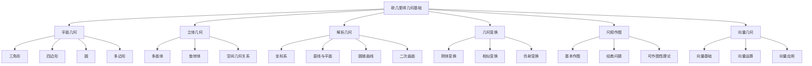

# 欧几里得几何基础

## 目录

- [欧几里得几何基础](#欧几里得几何基础)
  - [目录](#目录)
  - [1. 引言与基本概念](#1-引言与基本概念)
    - [1.1 欧几里得几何的本质](#11-欧几里得几何的本质)
      - [1.1.1 欧几里得空间的特征](#111-欧几里得空间的特征)
      - [1.1.2 欧几里得几何的重要性](#112-欧几里得几何的重要性)
    - [1.2 基本元素与关系](#12-基本元素与关系)
      - [1.2.1 基本元素](#121-基本元素)
      - [1.2.2 基本关系](#122-基本关系)
    - [1.3 公理化方法](#13-公理化方法)
      - [1.3.1 欧几里得的公理体系](#131-欧几里得的公理体系)
      - [1.3.2 公理化方法的意义](#132-公理化方法的意义)
  - [2. 平面几何](#2-平面几何)
    - [2.1 三角形](#21-三角形)
      - [2.1.1 三角形的基本概念](#211-三角形的基本概念)
      - [2.1.2 三角形的分类](#212-三角形的分类)
      - [2.1.3 三角形的重要性质](#213-三角形的重要性质)
      - [2.1.4 三角形的特殊线段](#214-三角形的特殊线段)
      - [2.1.5 三角形的全等](#215-三角形的全等)
      - [2.1.6 三角形的相似](#216-三角形的相似)
    - [2.2 四边形](#22-四边形)
      - [2.2.1 四边形的基本概念](#221-四边形的基本概念)
      - [2.2.2 四边形的分类](#222-四边形的分类)
      - [2.2.3 四边形的性质](#223-四边形的性质)
    - [2.3 圆](#23-圆)
      - [2.3.1 圆的基本概念](#231-圆的基本概念)
      - [2.3.2 圆的基本元素](#232-圆的基本元素)
      - [2.3.3 圆的重要性质](#233-圆的重要性质)
      - [2.3.4 圆的面积和周长](#234-圆的面积和周长)
    - [2.4 多边形](#24-多边形)
      - [2.4.1 多边形的概念](#241-多边形的概念)
      - [2.4.2 正多边形](#242-正多边形)
      - [2.4.3 多边形的性质](#243-多边形的性质)
  - [3. 立体几何](#3-立体几何)
    - [3.1 多面体](#31-多面体)
      - [3.1.1 多面体的概念](#311-多面体的概念)
      - [3.1.2 正多面体](#312-正多面体)
      - [3.1.3 棱柱](#313-棱柱)
      - [3.1.4 棱锥](#314-棱锥)
    - [3.2 旋转体](#32-旋转体)
      - [3.2.1 圆柱](#321-圆柱)
      - [3.2.2 圆锥](#322-圆锥)
      - [3.2.3 球](#323-球)
    - [3.3 空间几何关系](#33-空间几何关系)
      - [3.3.1 直线与平面的关系](#331-直线与平面的关系)
      - [3.3.2 平面与平面的关系](#332-平面与平面的关系)
  - [4. 解析几何](#4-解析几何)
    - [4.1 坐标系](#41-坐标系)
      - [4.1.1 平面直角坐标系](#411-平面直角坐标系)
      - [4.1.2 空间直角坐标系](#412-空间直角坐标系)
      - [4.1.3 极坐标系](#413-极坐标系)
    - [4.2 直线与平面](#42-直线与平面)
      - [4.2.1 直线的方程](#421-直线的方程)
      - [4.2.2 平面的方程](#422-平面的方程)
      - [4.2.3 距离公式](#423-距离公式)
    - [4.3 圆锥曲线](#43-圆锥曲线)
      - [4.3.1 圆](#431-圆)
      - [4.3.2 椭圆](#432-椭圆)
      - [4.3.3 双曲线](#433-双曲线)
      - [4.3.4 抛物线](#434-抛物线)
    - [4.4 二次曲面](#44-二次曲面)
      - [4.4.1 椭球面](#441-椭球面)
      - [4.4.2 双曲面](#442-双曲面)
      - [4.4.3 抛物面](#443-抛物面)
  - [5. 几何变换](#5-几何变换)
    - [5.1 刚体变换](#51-刚体变换)
      - [5.1.1 平移](#511-平移)
      - [5.1.2 旋转](#512-旋转)
      - [5.1.3 反射](#513-反射)
    - [5.2 相似变换](#52-相似变换)
      - [5.2.1 相似变换的定义](#521-相似变换的定义)
      - [5.2.2 相似变换的性质](#522-相似变换的性质)
    - [5.3 仿射变换](#53-仿射变换)
      - [5.3.1 仿射变换的定义](#531-仿射变换的定义)
      - [5.3.2 仿射变换的性质](#532-仿射变换的性质)
  - [6. 尺规作图](#6-尺规作图)
    - [6.1 基本作图](#61-基本作图)
      - [6.1.1 基本工具](#611-基本工具)
      - [6.1.2 基本作图](#612-基本作图)
    - [6.2 经典问题](#62-经典问题)
      - [6.2.1 三大几何问题](#621-三大几何问题)
      - [6.2.2 问题的解决](#622-问题的解决)
    - [6.3 可作图性理论](#63-可作图性理论)
      - [6.3.1 可作图数的定义](#631-可作图数的定义)
      - [6.3.2 可作图数的性质](#632-可作图数的性质)
  - [7. 向量几何](#7-向量几何)
    - [7.1 向量基础](#71-向量基础)
      - [7.1.1 向量的定义](#711-向量的定义)
      - [7.1.2 向量的表示](#712-向量的表示)
      - [7.1.3 向量的基本概念](#713-向量的基本概念)
    - [7.2 向量运算](#72-向量运算)
      - [7.2.1 向量加法](#721-向量加法)
      - [7.2.2 向量数乘](#722-向量数乘)
      - [7.2.3 向量点积](#723-向量点积)
      - [7.2.4 向量叉积](#724-向量叉积)
    - [7.3 向量应用](#73-向量应用)
      - [7.3.1 直线方程](#731-直线方程)
      - [7.3.2 平面方程](#732-平面方程)
      - [7.3.3 距离计算](#733-距离计算)
  - [8. 批判性分析](#8-批判性分析)
    - [8.1 欧几里得几何的哲学基础](#81-欧几里得几何的哲学基础)
      - [8.1.1 柏拉图主义](#811-柏拉图主义)
      - [8.1.2 经验主义](#812-经验主义)
      - [8.1.3 理性主义](#813-理性主义)
    - [8.2 平行公设的争议](#82-平行公设的争议)
      - [8.2.1 历史争议](#821-历史争议)
      - [8.2.2 非欧几何的发现](#822-非欧几何的发现)
      - [8.2.3 几何学的革命](#823-几何学的革命)
    - [8.3 几何直观的局限性](#83-几何直观的局限性)
      - [8.3.1 直观的不可靠性](#831-直观的不可靠性)
      - [8.3.2 抽象的必要性](#832-抽象的必要性)
      - [8.3.3 形式化的价值](#833-形式化的价值)
    - [8.4 欧几里得几何的应用局限](#84-欧几里得几何的应用局限)
      - [8.4.1 物理世界的复杂性](#841-物理世界的复杂性)
      - [8.4.2 相对论的挑战](#842-相对论的挑战)
      - [8.4.3 现代几何的发展](#843-现代几何的发展)
  - [9. 应用与展望](#9-应用与展望)
    - [9.1 物理学应用](#91-物理学应用)
      - [9.1.1 经典力学](#911-经典力学)
      - [9.1.2 光学](#912-光学)
      - [9.1.3 电磁学](#913-电磁学)
    - [9.2 工程学应用](#92-工程学应用)
      - [9.2.1 建筑学](#921-建筑学)
      - [9.2.2 机械工程](#922-机械工程)
      - [9.2.3 土木工程](#923-土木工程)
    - [9.3 计算机图形学应用](#93-计算机图形学应用)
      - [9.3.1 3D建模](#931-3d建模)
      - [9.3.2 渲染技术](#932-渲染技术)
      - [9.3.3 动画制作](#933-动画制作)
    - [9.4 艺术与设计应用](#94-艺术与设计应用)
      - [9.4.1 绘画](#941-绘画)
      - [9.4.2 雕塑](#942-雕塑)
      - [9.4.3 建筑设计](#943-建筑设计)
    - [9.5 未来发展方向](#95-未来发展方向)
      - [9.5.1 计算几何](#951-计算几何)
      - [9.5.2 几何建模](#952-几何建模)
      - [9.5.3 几何优化](#953-几何优化)
  - [代码示例](#代码示例)
    - [Rust 实现：几何计算库](#rust-实现几何计算库)
    - [Haskell 实现：几何计算](#haskell-实现几何计算)
  - [思维导图](#思维导图)

---

## 1. 引言与基本概念

### 1.1 欧几里得几何的本质

欧几里得几何是以古希腊数学家欧几里得命名的几何体系，它基于一组公理和公设，通过逻辑推理建立起来的数学理论。欧几里得几何研究的是我们日常经验中的"平直"空间，即欧几里得空间。

#### 1.1.1 欧几里得空间的特征

- **平直性**：空间是"平直"的，没有曲率
- **无限性**：空间向各个方向无限延伸
- **均匀性**：空间各点、各方向性质相同
- **各向同性**：空间没有特殊方向

#### 1.1.2 欧几里得几何的重要性

欧几里得几何不仅是数学的基础，也是人类认识空间的基本框架，在科学、工程、艺术等领域有广泛应用。

### 1.2 基本元素与关系

#### 1.2.1 基本元素

- **点 (Point)**：没有大小，只有位置的几何对象
- **直线 (Line)**：无限延伸的一维几何对象
- **平面 (Plane)**：无限延伸的二维几何对象
- **空间 (Space)**：三维几何对象

#### 1.2.2 基本关系

- **属于关系**：点在直线上，点在平面上
- **平行关系**：两条直线在同一平面内永不相交
- **垂直关系**：两条直线相交成直角
- **包含关系**：直线在平面上，平面包含直线

### 1.3 公理化方法

#### 1.3.1 欧几里得的公理体系

欧几里得在《几何原本》中提出了五条公设：

1. **第一公设**：两点之间可以画一条直线
2. **第二公设**：有限直线可以无限延长
3. **第三公设**：以任意点为圆心，任意距离为半径可以画圆
4. **第四公设**：所有直角都相等
5. **第五公设**（平行公设）：过直线外一点，有且仅有一条直线与已知直线平行

#### 1.3.2 公理化方法的意义

公理化方法使得几何学成为一个逻辑严密、自洽的理论体系，为现代数学的发展奠定了基础。

## 2. 平面几何

### 2.1 三角形

#### 2.1.1 三角形的基本概念

三角形是由三条线段围成的平面图形，是平面几何中最基本的图形之一。

#### 2.1.2 三角形的分类

- **按边长分类**：
  - 等边三角形：三条边相等
  - 等腰三角形：两条边相等
  - 不等边三角形：三条边都不相等

- **按角度分类**：
  - 锐角三角形：三个角都是锐角
  - 直角三角形：有一个角是直角
  - 钝角三角形：有一个角是钝角

#### 2.1.3 三角形的重要性质

- **内角和定理**：三角形内角和等于180°
- **外角和定理**：三角形外角和等于360°
- **三角形不等式**：任意两边之和大于第三边

#### 2.1.4 三角形的特殊线段

- **中线**：连接顶点和对边中点的线段
- **高线**：从顶点到对边的垂线
- **角平分线**：平分内角的射线
- **垂直平分线**：垂直平分边的直线

#### 2.1.5 三角形的全等

两个三角形全等，当且仅当它们的对应边和对应角都相等。

**全等判定定理**：

- **SSS**：三边对应相等
- **SAS**：两边及其夹角对应相等
- **ASA**：两角及其夹边对应相等
- **AAS**：两角及其中一角的对边对应相等
- **HL**：直角三角形中，斜边和一条直角边对应相等

#### 2.1.6 三角形的相似

两个三角形相似，当且仅当它们的对应角相等，对应边成比例。

**相似判定定理**：

- **AA**：两个角对应相等
- **SAS**：两边成比例且夹角相等
- **SSS**：三边成比例

### 2.2 四边形

#### 2.2.1 四边形的基本概念

四边形是由四条线段围成的平面图形。

#### 2.2.2 四边形的分类

- **平行四边形**：对边平行的四边形
- **矩形**：四个角都是直角的四边形
- **菱形**：四条边都相等的四边形
- **正方形**：四条边相等且四个角都是直角的四边形
- **梯形**：一组对边平行的四边形

#### 2.2.3 四边形的性质

- **内角和**：四边形内角和等于360°
- **对角线**：四边形的对角线性质
- **面积公式**：不同四边形的面积计算方法

### 2.3 圆

#### 2.3.1 圆的基本概念

圆是平面上到定点（圆心）距离相等的点的集合。

#### 2.3.2 圆的基本元素

- **圆心**：圆的中心点
- **半径**：圆心到圆上任意点的距离
- **直径**：通过圆心的弦
- **弦**：圆上任意两点间的线段
- **弧**：圆上两点间的部分
- **切线**：与圆只有一个交点的直线

#### 2.3.3 圆的重要性质

- **圆心角定理**：圆心角是对应圆周角的2倍
- **圆周角定理**：同弧上的圆周角相等
- **切线性质**：切线与半径垂直
- **弦长公式**：$l = 2r\sin\frac{\theta}{2}$

#### 2.3.4 圆的面积和周长

- **周长**：$C = 2\pi r$
- **面积**：$S = \pi r^2$

### 2.4 多边形

#### 2.4.1 多边形的概念

多边形是由三条或更多线段围成的平面图形。

#### 2.4.2 正多边形

正多边形是各边相等、各角相等的多边形。

#### 2.4.3 多边形的性质

- **内角和**：$n$边形的内角和为$(n-2) \times 180°$
- **外角和**：任意多边形的外角和为360°
- **对角线数**：$n$边形的对角线数为$\frac{n(n-3)}{2}$

## 3. 立体几何

### 3.1 多面体

#### 3.1.1 多面体的概念

多面体是由平面多边形围成的立体图形。

#### 3.1.2 正多面体

正多面体是各面都是全等的正多边形，各多面角都相等的多面体。

**五种正多面体**：

- **正四面体**：4个正三角形面
- **正六面体**（立方体）：6个正方形面
- **正八面体**：8个正三角形面
- **正十二面体**：12个正五边形面
- **正二十面体**：20个正三角形面

#### 3.1.3 棱柱

棱柱是由两个全等的多边形底面和若干个平行四边形侧面围成的多面体。

#### 3.1.4 棱锥

棱锥是由一个多边形底面和若干个三角形侧面围成的多面体。

### 3.2 旋转体

#### 3.2.1 圆柱

圆柱是由两个全等的圆底面和一个圆柱面围成的立体。

**体积**：$V = \pi r^2h$
**表面积**：$S = 2\pi r^2 + 2\pi rh$

#### 3.2.2 圆锥

圆锥是由一个圆底面和一个圆锥面围成的立体。

**体积**：$V = \frac{1}{3}\pi r^2h$
**表面积**：$S = \pi r^2 + \pi rl$（$l$为母线长）

#### 3.2.3 球

球是空间中到定点（球心）距离相等的点的集合。

**体积**：$V = \frac{4}{3}\pi r^3$
**表面积**：$S = 4\pi r^2$

### 3.3 空间几何关系

#### 3.3.1 直线与平面的关系

- **直线在平面内**：直线上所有点都在平面内
- **直线与平面平行**：直线与平面没有交点
- **直线与平面相交**：直线与平面有一个交点

#### 3.3.2 平面与平面的关系

- **平面平行**：两个平面没有交线
- **平面相交**：两个平面有一条交线
- **平面重合**：两个平面完全相同

## 4. 解析几何

### 4.1 坐标系

#### 4.1.1 平面直角坐标系

平面直角坐标系由两条互相垂直的数轴组成，通常称为$x$轴和$y$轴。

#### 4.1.2 空间直角坐标系

空间直角坐标系由三条互相垂直的数轴组成，通常称为$x$轴、$y$轴和$z$轴。

#### 4.1.3 极坐标系

极坐标系用距离和角度来表示点的位置。

### 4.2 直线与平面

#### 4.2.1 直线的方程

- **点斜式**：$y - y_1 = k(x - x_1)$
- **斜截式**：$y = kx + b$
- **两点式**：$\frac{y - y_1}{y_2 - y_1} = \frac{x - x_1}{x_2 - x_1}$
- **一般式**：$Ax + By + C = 0$

#### 4.2.2 平面的方程

- **点法式**：$A(x - x_0) + B(y - y_0) + C(z - z_0) = 0$
- **一般式**：$Ax + By + Cz + D = 0$

#### 4.2.3 距离公式

- **点到直线的距离**：$d = \frac{|Ax_0 + By_0 + C|}{\sqrt{A^2 + B^2}}$
- **点到平面的距离**：$d = \frac{|Ax_0 + By_0 + Cz_0 + D|}{\sqrt{A^2 + B^2 + C^2}}$

### 4.3 圆锥曲线

#### 4.3.1 圆

**标准方程**：$(x - h)^2 + (y - k)^2 = r^2$

#### 4.3.2 椭圆

**标准方程**：$\frac{(x - h)^2}{a^2} + \frac{(y - k)^2}{b^2} = 1$

**性质**：

- 焦点：$F_1(-c, 0)$，$F_2(c, 0)$，其中$c^2 = a^2 - b^2$
- 离心率：$e = \frac{c}{a} < 1$

#### 4.3.3 双曲线

**标准方程**：$\frac{(x - h)^2}{a^2} - \frac{(y - k)^2}{b^2} = 1$

**性质**：

- 焦点：$F_1(-c, 0)$，$F_2(c, 0)$，其中$c^2 = a^2 + b^2$
- 离心率：$e = \frac{c}{a} > 1$
- 渐近线：$y = \pm\frac{b}{a}x$

#### 4.3.4 抛物线

**标准方程**：$y = ax^2 + bx + c$

**性质**：

- 焦点：$F(0, \frac{1}{4a})$
- 准线：$y = -\frac{1}{4a}$
- 离心率：$e = 1$

### 4.4 二次曲面

#### 4.4.1 椭球面

**标准方程**：$\frac{x^2}{a^2} + \frac{y^2}{b^2} + \frac{z^2}{c^2} = 1$

#### 4.4.2 双曲面

**单叶双曲面**：$\frac{x^2}{a^2} + \frac{y^2}{b^2} - \frac{z^2}{c^2} = 1$
**双叶双曲面**：$\frac{x^2}{a^2} - \frac{y^2}{b^2} - \frac{z^2}{c^2} = 1$

#### 4.4.3 抛物面

**椭圆抛物面**：$\frac{x^2}{a^2} + \frac{y^2}{b^2} = z$
**双曲抛物面**：$\frac{x^2}{a^2} - \frac{y^2}{b^2} = z$

## 5. 几何变换

### 5.1 刚体变换

#### 5.1.1 平移

平移是将图形沿某个方向移动一定距离的变换。

**坐标变换**：
$$
\begin{cases}
x' = x + a \\
y' = y + b
\end{cases}
$$

#### 5.1.2 旋转

旋转是将图形绕某个点旋转一定角度的变换。

**坐标变换**：
$$
\begin{cases}
x' = x\cos\theta - y\sin\theta \\
y' = x\sin\theta + y\cos\theta
\end{cases}
$$

#### 5.1.3 反射

反射是将图形关于某条直线作镜像的变换。

**关于x轴的反射**：
$$
\begin{cases}
x' = x \\
y' = -y
\end{cases}
$$

### 5.2 相似变换

#### 5.2.1 相似变换的定义

相似变换是保持图形形状不变，但大小可以改变的变换。

#### 5.2.2 相似变换的性质

- 保持角度不变
- 保持平行关系
- 长度按比例变化

### 5.3 仿射变换

#### 5.3.1 仿射变换的定义

仿射变换是保持平行关系的变换。

#### 5.3.2 仿射变换的性质

- 保持平行关系
- 保持共线性
- 保持面积比

## 6. 尺规作图

### 6.1 基本作图

#### 6.1.1 基本工具

- **直尺**：用于画直线
- **圆规**：用于画圆

#### 6.1.2 基本作图

- 作已知线段的垂直平分线
- 作已知角的角平分线
- 过一点作已知直线的垂线
- 过一点作已知直线的平行线

### 6.2 经典问题

#### 6.2.1 三大几何问题

- **倍立方问题**：作一个立方体，使其体积是已知立方体的2倍
- **三等分角问题**：用尺规作图三等分任意角
- **化圆为方问题**：作一个正方形，使其面积等于已知圆的面积

#### 6.2.2 问题的解决

这些问题在19世纪被证明为不可能用尺规作图解决。

### 6.3 可作图性理论

#### 6.3.1 可作图数的定义

一个数是可作图的，如果可以用尺规作图构造出长度为该数的线段。

#### 6.3.2 可作图数的性质

可作图数构成一个域，包含有理数，且对开平方运算封闭。

## 7. 向量几何

### 7.1 向量基础

#### 7.1.1 向量的定义

向量是既有大小又有方向的量。

#### 7.1.2 向量的表示

- **坐标表示**：$\vec{v} = (x, y, z)$
- **几何表示**：有向线段

#### 7.1.3 向量的基本概念

- **零向量**：长度为0的向量
- **单位向量**：长度为1的向量
- **相等向量**：大小和方向都相同的向量

### 7.2 向量运算

#### 7.2.1 向量加法

**坐标运算**：$(x_1, y_1, z_1) + (x_2, y_2, z_2) = (x_1 + x_2, y_1 + y_2, z_1 + z_2)$

**几何意义**：平行四边形法则或三角形法则

#### 7.2.2 向量数乘

**坐标运算**：$k(x, y, z) = (kx, ky, kz)$

**几何意义**：改变向量长度，可能改变方向

#### 7.2.3 向量点积

**定义**：$\vec{a} \cdot \vec{b} = |\vec{a}||\vec{b}|\cos\theta$

**坐标运算**：$(x_1, y_1, z_1) \cdot (x_2, y_2, z_2) = x_1x_2 + y_1y_2 + z_1z_2$

#### 7.2.4 向量叉积

**定义**：$\vec{a} \times \vec{b} = |\vec{a}||\vec{b}|\sin\theta \vec{n}$

**坐标运算**：
$$
\vec{a} \times \vec{b} = \begin{vmatrix}
\mathbf{i} & \mathbf{j} & \mathbf{k} \\
x_1 & y_1 & z_1 \\
x_2 & y_2 & z_2
\end{vmatrix}
$$

### 7.3 向量应用

#### 7.3.1 直线方程

**参数方程**：$\vec{r} = \vec{r}_0 + t\vec{v}$

**对称方程**：$\frac{x - x_0}{a} = \frac{y - y_0}{b} = \frac{z - z_0}{c}$

#### 7.3.2 平面方程

**点法式**：$(\vec{r} - \vec{r}_0) \cdot \vec{n} = 0$

#### 7.3.3 距离计算

**点到直线距离**：$d = \frac{|\vec{v} \times \vec{PQ}|}{|\vec{v}|}$

**点到平面距离**：$d = \frac{|\vec{n} \cdot \vec{PQ}|}{|\vec{n}|}$

## 8. 批判性分析

### 8.1 欧几里得几何的哲学基础

#### 8.1.1 柏拉图主义

欧几里得几何体现了柏拉图主义的思想，认为几何对象是理想化的存在。

#### 8.1.2 经验主义

几何学最初来源于人类对空间的直观经验。

#### 8.1.3 理性主义

几何学通过理性推理建立严密的逻辑体系。

### 8.2 平行公设的争议

#### 8.2.1 历史争议

平行公设的独立性引发了长达两千年的研究。

#### 8.2.2 非欧几何的发现

对平行公设的否定导致了非欧几何的发现。

#### 8.2.3 几何学的革命

非欧几何的发现改变了人们对几何学的认识。

### 8.3 几何直观的局限性

#### 8.3.1 直观的不可靠性

几何直观在某些情况下可能产生误导。

#### 8.3.2 抽象的必要性

严格的逻辑推理比直观更可靠。

#### 8.3.3 形式化的价值

形式化方法确保了数学的严谨性。

### 8.4 欧几里得几何的应用局限

#### 8.4.1 物理世界的复杂性

现实世界可能不遵循欧几里得几何。

#### 8.4.2 相对论的挑战

爱因斯坦的相对论表明空间可能是弯曲的。

#### 8.4.3 现代几何的发展

现代几何学提供了更丰富的几何结构。

## 9. 应用与展望

### 9.1 物理学应用

#### 9.1.1 经典力学

欧几里得几何是经典力学的基础。

#### 9.1.2 光学

几何光学利用欧几里得几何研究光的传播。

#### 9.1.3 电磁学

电磁场的几何描述需要欧几里得几何。

### 9.2 工程学应用

#### 9.2.1 建筑学

建筑设计大量使用欧几里得几何。

#### 9.2.2 机械工程

机械设计需要精确的几何计算。

#### 9.2.3 土木工程

结构设计依赖于几何分析。

### 9.3 计算机图形学应用

#### 9.3.1 3D建模

3D建模软件基于欧几里得几何。

#### 9.3.2 渲染技术

光线追踪等渲染技术需要几何计算。

#### 9.3.3 动画制作

动画制作中的运动学基于几何变换。

### 9.4 艺术与设计应用

#### 9.4.1 绘画

透视法基于欧几里得几何。

#### 9.4.2 雕塑

雕塑设计需要立体几何知识。

#### 9.4.3 建筑设计

建筑设计中的比例和对称基于几何原理。

### 9.5 未来发展方向

#### 9.5.1 计算几何

算法化的几何问题求解。

#### 9.5.2 几何建模

计算机辅助的几何设计。

#### 9.5.3 几何优化

几何约束下的优化问题。

---

## 代码示例

### Rust 实现：几何计算库

```rust
use std::f64::consts::PI;

/// 点结构
#[derive(Debug, Clone, Copy)]
pub struct Point {
    pub x: f64,
    pub y: f64,
}

impl Point {
    pub fn new(x: f64, y: f64) -> Self {
        Point { x, y }
    }
    
    /// 计算两点间距离
    pub fn distance_to(&self, other: &Point) -> f64 {
        ((self.x - other.x).powi(2) + (self.y - other.y).powi(2)).sqrt()
    }
}

/// 向量结构
#[derive(Debug, Clone, Copy)]
pub struct Vector {
    pub x: f64,
    pub y: f64,
}

impl Vector {
    pub fn new(x: f64, y: f64) -> Self {
        Vector { x, y }
    }
    
    /// 向量长度
    pub fn magnitude(&self) -> f64 {
        (self.x.powi(2) + self.y.powi(2)).sqrt()
    }
    
    /// 单位向量
    pub fn unit(&self) -> Vector {
        let mag = self.magnitude();
        Vector::new(self.x / mag, self.y / mag)
    }
    
    /// 点积
    pub fn dot(&self, other: &Vector) -> f64 {
        self.x * other.x + self.y * other.y
    }
    
    /// 叉积（在2D中返回标量）
    pub fn cross(&self, other: &Vector) -> f64 {
        self.x * other.y - self.y * other.x
    }
}

/// 直线结构
#[derive(Debug, Clone)]
pub struct Line {
    pub a: f64,
    pub b: f64,
    pub c: f64,
}

impl Line {
    /// 从两点构造直线
    pub fn from_points(p1: &Point, p2: &Point) -> Self {
        let a = p2.y - p1.y;
        let b = p1.x - p2.x;
        let c = p2.x * p1.y - p1.x * p2.y;
        Line { a, b, c }
    }
    
    /// 点到直线距离
    pub fn distance_to_point(&self, point: &Point) -> f64 {
        (self.a * point.x + self.b * point.y + self.c).abs() / 
        (self.a.powi(2) + self.b.powi(2)).sqrt()
    }
    
    /// 两条直线的交点
    pub fn intersection(&self, other: &Line) -> Option<Point> {
        let det = self.a * other.b - other.a * self.b;
        if det.abs() < 1e-10 {
            None // 平行线
        } else {
            let x = (self.b * other.c - other.b * self.c) / det;
            let y = (other.a * self.c - self.a * other.c) / det;
            Some(Point::new(x, y))
        }
    }
}

/// 圆结构
#[derive(Debug, Clone)]
pub struct Circle {
    pub center: Point,
    pub radius: f64,
}

impl Circle {
    pub fn new(center: Point, radius: f64) -> Self {
        Circle { center, radius }
    }
    
    /// 圆面积
    pub fn area(&self) -> f64 {
        PI * self.radius.powi(2)
    }
    
    /// 圆周长
    pub fn circumference(&self) -> f64 {
        2.0 * PI * self.radius
    }
    
    /// 点是否在圆内
    pub fn contains_point(&self, point: &Point) -> bool {
        self.center.distance_to(point) <= self.radius
    }
    
    /// 两个圆的交点
    pub fn intersection(&self, other: &Circle) -> Vec<Point> {
        let d = self.center.distance_to(&other.center);
        let r1 = self.radius;
        let r2 = other.radius;
        
        if d > r1 + r2 || d < (r1 - r2).abs() {
            return vec![]; // 无交点
        }
        
        let a = (r1.powi(2) - r2.powi(2) + d.powi(2)) / (2.0 * d);
        let h = (r1.powi(2) - a.powi(2)).sqrt();
        
        let x2 = self.center.x + a * (other.center.x - self.center.x) / d;
        let y2 = self.center.y + a * (other.center.y - self.center.y) / d;
        
        if h.abs() < 1e-10 {
            // 一个交点
            vec![Point::new(x2, y2)]
        } else {
            // 两个交点
            let x3 = x2 + h * (other.center.y - self.center.y) / d;
            let y3 = y2 - h * (other.center.x - self.center.x) / d;
            let x4 = x2 - h * (other.center.y - self.center.y) / d;
            let y4 = y2 + h * (other.center.x - self.center.x) / d;
            vec![Point::new(x3, y3), Point::new(x4, y4)]
        }
    }
}

/// 三角形结构
#[derive(Debug, Clone)]
pub struct Triangle {
    pub a: Point,
    pub b: Point,
    pub c: Point,
}

impl Triangle {
    pub fn new(a: Point, b: Point, c: Point) -> Self {
        Triangle { a, b, c }
    }
    
    /// 三角形面积
    pub fn area(&self) -> f64 {
        let ab = Vector::new(self.b.x - self.a.x, self.b.y - self.a.y);
        let ac = Vector::new(self.c.x - self.a.x, self.c.y - self.a.y);
        ab.cross(&ac).abs() / 2.0
    }
    
    /// 三角形周长
    pub fn perimeter(&self) -> f64 {
        self.a.distance_to(&self.b) + 
        self.b.distance_to(&self.c) + 
        self.c.distance_to(&self.a)
    }
    
    /// 外接圆
    pub fn circumcircle(&self) -> Circle {
        let d = 2.0 * (self.a.x * (self.b.y - self.c.y) + 
                      self.b.x * (self.c.y - self.a.y) + 
                      self.c.x * (self.a.y - self.b.y));
        
        let ux = ((self.a.x.powi(2) + self.a.y.powi(2)) * (self.b.y - self.c.y) + 
                  (self.b.x.powi(2) + self.b.y.powi(2)) * (self.c.y - self.a.y) + 
                  (self.c.x.powi(2) + self.c.y.powi(2)) * (self.a.y - self.b.y)) / d;
        
        let uy = ((self.a.x.powi(2) + self.a.y.powi(2)) * (self.c.x - self.b.x) + 
                  (self.b.x.powi(2) + self.b.y.powi(2)) * (self.a.x - self.c.x) + 
                  (self.c.x.powi(2) + self.c.y.powi(2)) * (self.b.x - self.a.x)) / d;
        
        let center = Point::new(ux, uy);
        let radius = center.distance_to(&self.a);
        Circle::new(center, radius)
    }
}

/// 几何变换
pub struct Transform;

impl Transform {
    /// 平移变换
    pub fn translate(point: &Point, dx: f64, dy: f64) -> Point {
        Point::new(point.x + dx, point.y + dy)
    }
    
    /// 旋转变换
    pub fn rotate(point: &Point, center: &Point, angle: f64) -> Point {
        let cos_a = angle.cos();
        let sin_a = angle.sin();
        let dx = point.x - center.x;
        let dy = point.y - center.y;
        
        Point::new(
            center.x + dx * cos_a - dy * sin_a,
            center.y + dx * sin_a + dy * cos_a
        )
    }
    
    /// 缩放变换
    pub fn scale(point: &Point, center: &Point, sx: f64, sy: f64) -> Point {
        Point::new(
            center.x + (point.x - center.x) * sx,
            center.y + (point.y - center.y) * sy
        )
    }
}

/// 测试函数
fn test_geometry() {
    // 测试点和向量
    let p1 = Point::new(0.0, 0.0);
    let p2 = Point::new(3.0, 4.0);
    println!("距离: {}", p1.distance_to(&p2));
    
    let v1 = Vector::new(3.0, 4.0);
    let v2 = Vector::new(1.0, 2.0);
    println!("点积: {}", v1.dot(&v2));
    println!("叉积: {}", v1.cross(&v2));
    
    // 测试直线
    let line1 = Line::from_points(&p1, &p2);
    let p3 = Point::new(1.0, 1.0);
    println!("点到直线距离: {}", line1.distance_to_point(&p3));
    
    // 测试圆
    let circle1 = Circle::new(Point::new(0.0, 0.0), 5.0);
    let circle2 = Circle::new(Point::new(3.0, 0.0), 3.0);
    let intersections = circle1.intersection(&circle2);
    println!("圆交点数量: {}", intersections.len());
    
    // 测试三角形
    let triangle = Triangle::new(
        Point::new(0.0, 0.0),
        Point::new(3.0, 0.0),
        Point::new(0.0, 4.0)
    );
    println!("三角形面积: {}", triangle.area());
    println!("三角形周长: {}", triangle.perimeter());
}
```

### Haskell 实现：几何计算

```haskell
-- 点类型
data Point = Point Double Double deriving (Show, Eq)

-- 向量类型
data Vector = Vector Double Double deriving (Show, Eq)

-- 直线类型
data Line = Line Double Double Double deriving Show

-- 圆类型
data Circle = Circle Point Double deriving Show

-- 三角形类型
data Triangle = Triangle Point Point Point deriving Show

-- 点运算
distance :: Point -> Point -> Double
distance (Point x1 y1) (Point x2 y2) = sqrt ((x2-x1)^2 + (y2-y1)^2)

-- 向量运算
magnitude :: Vector -> Double
magnitude (Vector x y) = sqrt (x^2 + y^2)

unit :: Vector -> Vector
unit v@(Vector x y) = Vector (x/m) (y/m) where m = magnitude v

dot :: Vector -> Vector -> Double
dot (Vector x1 y1) (Vector x2 y2) = x1*x2 + y1*y2

cross :: Vector -> Vector -> Double
cross (Vector x1 y1) (Vector x2 y2) = x1*y2 - y1*x2

-- 从两点构造向量
vectorFromPoints :: Point -> Point -> Vector
vectorFromPoints (Point x1 y1) (Point x2 y2) = Vector (x2-x1) (y2-y1)

-- 直线运算
lineFromPoints :: Point -> Point -> Line
lineFromPoints (Point x1 y1) (Point x2 y2) = 
    Line (y2-y1) (x1-x2) (x2*y1 - x1*y2)

distanceToLine :: Line -> Point -> Double
distanceToLine (Line a b c) (Point x y) = 
    abs (a*x + b*y + c) / sqrt (a^2 + b^2)

lineIntersection :: Line -> Line -> Maybe Point
lineIntersection (Line a1 b1 c1) (Line a2 b2 c2) = 
    let det = a1*b2 - a2*b1
    in if abs det < 1e-10
       then Nothing
       else Just $ Point 
            ((b1*c2 - b2*c1) / det)
            ((a2*c1 - a1*c2) / det)

-- 圆运算
circleArea :: Circle -> Double
circleArea (Circle _ r) = pi * r^2

circleCircumference :: Circle -> Double
circleCircumference (Circle _ r) = 2 * pi * r

pointInCircle :: Circle -> Point -> Bool
pointInCircle (Circle center radius) point = 
    distance center point <= radius

circleIntersection :: Circle -> Circle -> [Point]
circleIntersection (Circle c1 r1) (Circle c2 r2) = 
    let d = distance c1 c2
        (Point x1 y1) = c1
        (Point x2 y2) = c2
    in if d > r1 + r2 || d < abs (r1 - r2)
       then [] -- 无交点
       else let a = (r1^2 - r2^2 + d^2) / (2*d)
                h = sqrt (r1^2 - a^2)
                x3 = x1 + a * (x2 - x1) / d
                y3 = y1 + a * (y2 - y1) / d
            in if abs h < 1e-10
               then [Point x3 y3] -- 一个交点
               else [Point (x3 + h*(y2-y1)/d) (y3 - h*(x2-x1)/d),
                     Point (x3 - h*(y2-y1)/d) (y3 + h*(x2-x1)/d)]

-- 三角形运算
triangleArea :: Triangle -> Double
triangleArea (Triangle a b c) = 
    let v1 = vectorFromPoints a b
        v2 = vectorFromPoints a c
    in abs (cross v1 v2) / 2

trianglePerimeter :: Triangle -> Double
trianglePerimeter (Triangle a b c) = 
    distance a b + distance b c + distance c a

-- 几何变换
translate :: Point -> Double -> Double -> Point
translate (Point x y) dx dy = Point (x + dx) (y + dy)

rotate :: Point -> Point -> Double -> Point
rotate (Point x y) (Point cx cy) angle = 
    let cos_a = cos angle
        sin_a = sin angle
        dx = x - cx
        dy = y - cy
    in Point (cx + dx*cos_a - dy*sin_a)
             (cy + dx*sin_a + dy*cos_a)

scale :: Point -> Point -> Double -> Double -> Point
scale (Point x y) (Point cx cy) sx sy = 
    Point (cx + (x - cx) * sx)
          (cy + (y - cy) * sy)

-- 示例使用
example :: IO ()
example = do
    let p1 = Point 0 0
    let p2 = Point 3 4
    putStrLn $ "距离: " ++ show (distance p1 p2)
    
    let v1 = Vector 3 4
    let v2 = Vector 1 2
    putStrLn $ "点积: " ++ show (dot v1 v2)
    putStrLn $ "叉积: " ++ show (cross v1 v2)
    
    let line = lineFromPoints p1 p2
    let p3 = Point 1 1
    putStrLn $ "点到直线距离: " ++ show (distanceToLine line p3)
    
    let circle1 = Circle (Point 0 0) 5
    let circle2 = Circle (Point 3 0) 3
    putStrLn $ "圆交点数量: " ++ show (length (circleIntersection circle1 circle2))
    
    let triangle = Triangle (Point 0 0) (Point 3 0) (Point 0 4)
    putStrLn $ "三角形面积: " ++ show (triangleArea triangle)
    putStrLn $ "三角形周长: " ++ show (trianglePerimeter triangle)
```

## 思维导图


