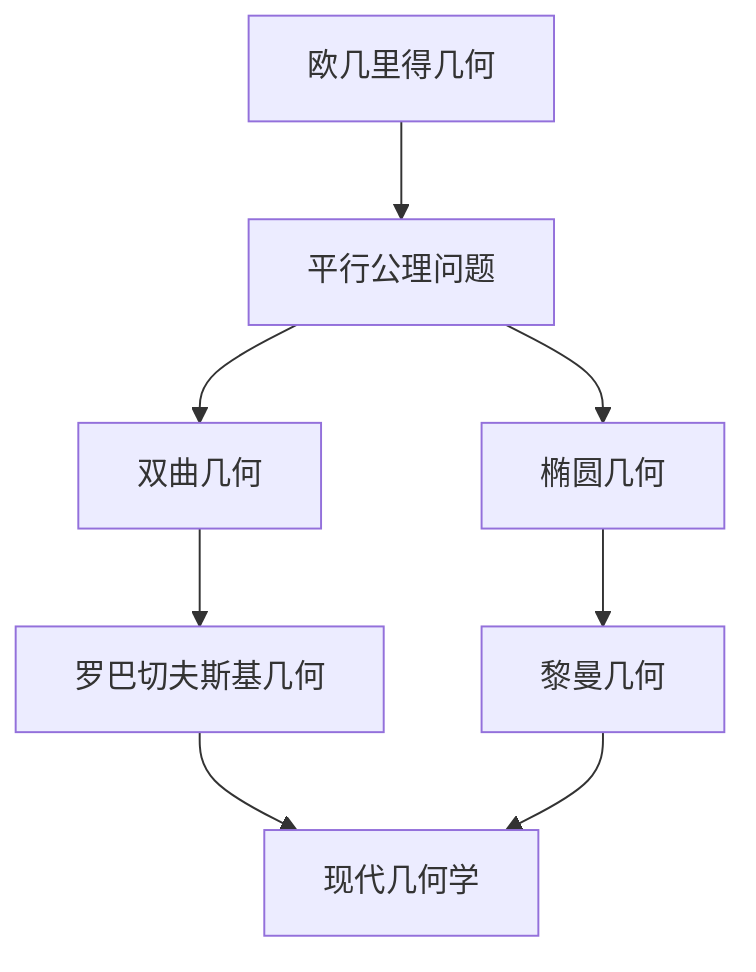

# 02-非欧几何基础

## 目录

- [1. 概述](#1-概述)
- [2. 双曲几何](#2-双曲几何)
  - [2.1 双曲几何模型](#21-双曲几何模型)
  - [2.2 双曲几何公理](#22-双曲几何公理)
  - [2.3 双曲几何性质](#23-双曲几何性质)
- [3. 椭圆几何](#3-椭圆几何)
  - [3.1 椭圆几何模型](#31-椭圆几何模型)
  - [3.2 椭圆几何公理](#32-椭圆几何公理)
  - [3.3 椭圆几何性质](#33-椭圆几何性质)
- [4. 射影几何](#4-射影几何)
  - [4.1 射影空间](#41-射影空间)
  - [4.2 射影变换](#42-射影变换)
  - [4.3 对偶原理](#43-对偶原理)
- [5. 几何统一理论](#5-几何统一理论)
- [6. 应用与扩展](#6-应用与扩展)
- [7. 批判性分析](#7-批判性分析)

## 1. 概述

### 1.1 非欧几何的历史背景

非欧几何的发现是数学史上最重要的突破之一，它挑战了欧几里得几何的绝对地位。



### 1.2 几何学分类

根据曲率，几何学可分为：

- **欧几里得几何**：零曲率
- **双曲几何**：负曲率
- **椭圆几何**：正曲率

## 2. 双曲几何

### 2.1 双曲几何模型

#### 2.1.1 庞加莱圆盘模型

在单位圆盘 $D = \{z \in \mathbb{C} : |z| < 1\}$ 上定义双曲度量：

$$ds^2 = \frac{4|dz|^2}{(1-|z|^2)^2}$$

```rust
// 双曲几何计算
struct HyperbolicGeometry {
    radius: f64,
}

impl HyperbolicGeometry {
    fn poincare_distance(&self, z1: Complex<f64>, z2: Complex<f64>) -> f64 {
        let diff = z1 - z2;
        let denom1 = 1.0 - z1.norm_sqr();
        let denom2 = 1.0 - z2.norm_sqr();
        
        2.0 * ((diff.norm() + (z1.norm_sqr() * z2.norm_sqr() - 2.0 * z1.dot(&z2) + 1.0).sqrt()) 
               / (denom1 * denom2).sqrt()).ln()
    }
    
    fn geodesic_arc(&self, p1: Complex<f64>, p2: Complex<f64>) -> Vec<Complex<f64>> {
        // 计算双曲直线（圆弧或直径）
        let mut points = Vec::new();
        let steps = 100;
        
        for i in 0..=steps {
            let t = i as f64 / steps as f64;
            let z = p1 * (1.0 - t) + p2 * t;
            points.push(z);
        }
        
        points
    }
}
```

#### 2.1.2 上半平面模型

在上半平面 $H = \{z \in \mathbb{C} : \text{Im}(z) > 0\}$ 上定义双曲度量：

$$ds^2 = \frac{|dz|^2}{(\text{Im}(z))^2}$$

### 2.2 双曲几何公理

#### 2.2.1 基本公理

1. **点公理**：存在点
2. **线公理**：存在直线
3. **平行公理**：过直线外一点，存在多条平行线

#### 2.2.2 双曲平行公理

对于任意直线 $l$ 和不在 $l$ 上的点 $P$，存在至少两条通过 $P$ 的直线与 $l$ 不相交。

### 2.3 双曲几何性质

#### 2.3.1 角度和

在双曲三角形中，内角和小于 $\pi$：

$$\alpha + \beta + \gamma < \pi$$

#### 2.3.2 面积公式

双曲三角形的面积：

$$A = \pi - (\alpha + \beta + \gamma)$$

```haskell
-- 双曲几何计算
data HyperbolicPoint = Point Double Double
data HyperbolicLine = Line HyperbolicPoint HyperbolicPoint

class HyperbolicGeometry a where
    distance :: a -> a -> Double
    angle :: a -> a -> a -> Double
    area :: a -> a -> a -> Double

instance HyperbolicGeometry HyperbolicPoint where
    distance (Point x1 y1) (Point x2 y2) = 
        let dx = x2 - x1
            dy = y2 - y1
            denom = (1 - x1^2 - y1^2) * (1 - x2^2 - y2^2)
        in 2 * log ((sqrt (dx^2 + dy^2) + sqrt (1 + x1^2*y2^2 + x2^2*y1^2 - 2*x1*x2 - 2*y1*y2)) / sqrt denom)
    
    angle p1 p2 p3 = 
        let a = distance p2 p3
            b = distance p1 p3
            c = distance p1 p2
            cosA = (cosh b * cosh c - cosh a) / (sinh b * sinh c)
        in acos cosA
    
    area p1 p2 p3 = 
        let alpha = angle p1 p2 p3
            beta = angle p2 p3 p1
            gamma = angle p3 p1 p2
        in pi - (alpha + beta + gamma)
```

## 3. 椭圆几何

### 3.1 椭圆几何模型

#### 3.1.1 球面模型

在单位球面 $S^2 = \{(x,y,z) \in \mathbb{R}^3 : x^2 + y^2 + z^2 = 1\}$ 上定义椭圆几何。

#### 3.1.2 射影平面模型

通过球面的对径点识别，得到射影平面 $\mathbb{RP}^2$。

### 3.2 椭圆几何公理

#### 3.2.1 基本公理

1. **点公理**：存在点
2. **线公理**：存在直线
3. **平行公理**：任意两条直线都相交

#### 3.2.2 椭圆平行公理

任意两条直线都有交点，不存在平行线。

### 3.3 椭圆几何性质

#### 3.3.1 角度和

在椭圆三角形中，内角和大于 $\pi$：

$$\alpha + \beta + \gamma > \pi$$

#### 3.3.2 面积公式

椭圆三角形的面积：

$$A = (\alpha + \beta + \gamma) - \pi$$

## 4. 射影几何

### 4.1 射影空间

#### 4.1.1 射影平面

射影平面 $\mathbb{RP}^2$ 是 $\mathbb{R}^3 \setminus \{0\}$ 中向量空间的商空间。

#### 4.1.2 齐次坐标

点 $[x:y:z]$ 表示等价类 $\{(λx, λy, λz) : λ \neq 0\}$。

```rust
// 射影几何计算
#[derive(Debug, Clone)]
struct ProjectivePoint {
    x: f64,
    y: f64,
    z: f64,
}

impl ProjectivePoint {
    fn new(x: f64, y: f64, z: f64) -> Self {
        let norm = (x*x + y*y + z*z).sqrt();
        ProjectivePoint {
            x: x / norm,
            y: y / norm,
            z: z / norm,
        }
    }
    
    fn cross_product(&self, other: &ProjectivePoint) -> ProjectivePoint {
        ProjectivePoint::new(
            self.y * other.z - self.z * other.y,
            self.z * other.x - self.x * other.z,
            self.x * other.y - self.y * other.x,
        )
    }
    
    fn dot_product(&self, other: &ProjectivePoint) -> f64 {
        self.x * other.x + self.y * other.y + self.z * other.z
    }
}
```

### 4.2 射影变换

#### 4.2.1 射影变换矩阵

射影变换由 $3 \times 3$ 可逆矩阵表示：

$$T = \begin{pmatrix} a_{11} & a_{12} & a_{13} \\ a_{21} & a_{22} & a_{23} \\ a_{31} & a_{32} & a_{33} \end{pmatrix}$$

#### 4.2.2 变换性质

- 保持共线性
- 保持交比
- 保持射影不变量

### 4.3 对偶原理

#### 4.3.1 点线对偶

在射影平面中，点和直线是对偶的：

- 两点确定一条直线
- 两直线确定一个点

#### 4.3.2 对偶定理

任何关于点和直线的定理，交换"点"和"直线"后仍然成立。

## 5. 几何统一理论

### 5.1 克莱因几何纲领

克莱因的埃尔朗根纲领将几何学统一为群论：


### 5.2 黎曼几何

黎曼几何提供了统一的几何框架：

$$ds^2 = g_{ij} dx^i dx^j$$

其中 $g_{ij}$ 是度量张量。

### 5.3 现代几何学

现代几何学基于微分流形和纤维丛理论：

```haskell
-- 现代几何学框架
class Manifold m where
    dimension :: m -> Int
    charts :: m -> [Chart]
    transitionMaps :: m -> [(Chart, Chart, TransitionMap)]

class FiberBundle b where
    baseSpace :: b -> Manifold
    fiber :: b -> Manifold
    projection :: b -> (Point -> Point)
    localTrivialization :: b -> [LocalTrivialization]

-- 黎曼度量
class RiemannianManifold m where
    metric :: m -> MetricTensor
    connection :: m -> AffineConnection
    curvature :: m -> CurvatureTensor
```

## 6. 应用与扩展

### 6.1 物理应用

#### 6.1.1 相对论

- 闵可夫斯基时空：伪黎曼几何
- 广义相对论：黎曼几何

#### 6.1.2 量子场论

- 纤维丛理论
- 规范场论

### 6.2 计算机科学应用

#### 6.2.1 计算机图形学

- 射影几何用于3D渲染
- 双曲几何用于网络可视化

#### 6.2.2 机器学习

- 流形学习
- 几何深度学习

### 6.3 其他应用

- 天文学：宇宙几何
- 生物学：蛋白质结构
- 经济学：偏好空间

## 7. 批判性分析

### 7.1 哲学意义

#### 7.1.1 几何真理观

非欧几何的发现挑战了传统的几何真理观：

- **绝对真理观**：几何学反映客观空间结构
- **相对真理观**：几何学是人为构造的理论体系
- **实用真理观**：几何学的价值在于其应用效果

#### 7.1.2 数学实在论

非欧几何对数学实在论提出了挑战：

- 数学对象是否独立存在？
- 几何学是否描述客观现实？
- 数学真理的本质是什么？

### 7.2 方法论反思

#### 7.2.1 公理化方法

非欧几何展示了公理化方法的威力：

- **优点**：逻辑严密，推理清晰
- **局限**：公理选择的主观性
- **发展**：形式化数学的兴起

#### 7.2.2 几何直觉

非欧几何挑战了几何直觉的可靠性：

- 直觉可能误导
- 形式推理的重要性
- 抽象思维的价值

### 7.3 教育意义

#### 7.3.1 数学教育

非欧几何对数学教育的影响：

- 培养批判性思维
- 理解数学的相对性
- 发展抽象思维能力

#### 7.3.2 科学教育

非欧几何对科学教育的启示：

- 科学理论的相对性
- 范式转换的重要性
- 创新思维的价值

### 7.4 现代发展

#### 7.4.1 代数几何

现代代数几何将几何与代数紧密结合：

- 概形理论
- 上同调理论
- 模空间理论

#### 7.4.2 微分几何

现代微分几何的发展：

- 黎曼几何
- 复几何
- 辛几何

#### 7.4.3 拓扑学

现代拓扑学与几何学的融合：

- 代数拓扑
- 微分拓扑
- 几何拓扑

### 7.5 未来展望

#### 7.5.1 理论发展

- 几何Langlands纲领
- 镜像对称
- 几何量子化

#### 7.5.2 应用前景

- 人工智能中的几何方法
- 量子计算中的几何结构
- 生物信息学中的几何模型

---

**参考文献**:

1. Greenberg, M. J. (2008). *Euclidean and Non-Euclidean Geometries: Development and History*. W. H. Freeman.
2. Stillwell, J. (2010). *Mathematics and Its History*. Springer.
3. Berger, M. (2003). *A Panoramic View of Riemannian Geometry*. Springer.
4. Coxeter, H. S. M. (2003). *Projective Geometry*. Springer.
5. Thurston, W. P. (1997). *Three-Dimensional Geometry and Topology*. Princeton University Press.

---

**相关链接**:

- [欧几里得几何基础](./01-欧几里得几何基础.md)
- [拓扑学基础](./03-拓扑学基础.md)
- [代数拓扑](./04-代数拓扑.md)
- [数学哲学基础](../01-哲学与元数学基础/01-数学哲学基础.md)
