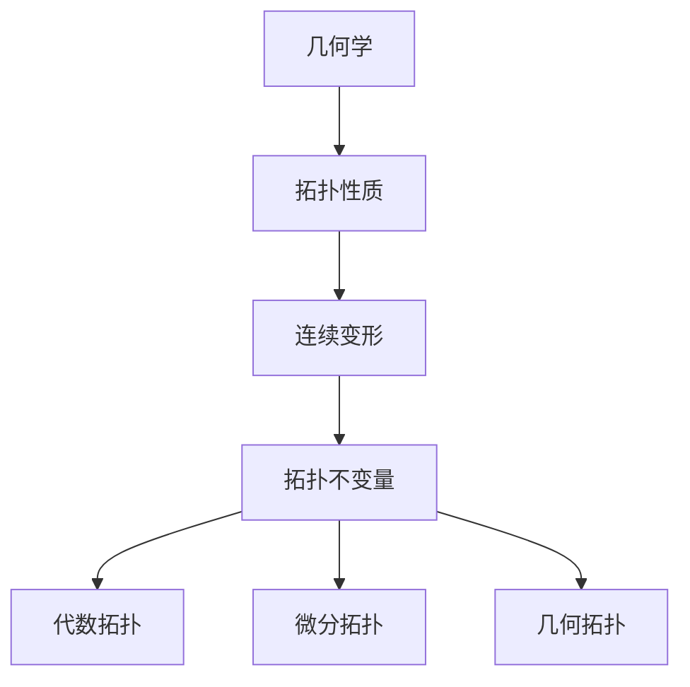

# 03-拓扑学基础

## 目录

- [1. 概述](#1-概述)
- [2. 拓扑空间](#2-拓扑空间)
  - [2.1 基本定义](#21-基本定义)
  - [2.2 拓扑基与子基](#22-拓扑基与子基)
  - [2.3 子空间拓扑](#23-子空间拓扑)
- [3. 连续映射](#3-连续映射)
  - [3.1 连续性定义](#31-连续性定义)
  - [3.2 同胚映射](#32-同胚映射)
  - [3.3 拓扑不变量](#33-拓扑不变量)
- [4. 分离公理](#4-分离公理)
- [5. 紧致性](#5-紧致性)
- [6. 连通性](#6-连通性)
- [7. 度量空间](#7-度量空间)
- [8. 应用与扩展](#8-应用与扩展)
- [9. 批判性分析](#9-批判性分析)

## 1. 概述

### 1.1 拓扑学的起源与发展

拓扑学起源于几何学，但关注的是几何对象的"拓扑性质"——在连续变形下保持不变的性质。



### 1.2 拓扑学的核心思想

拓扑学研究的是空间在连续变换下的不变性质，这些性质不依赖于具体的度量或几何结构。

## 2. 拓扑空间

### 2.1 基本定义

#### 2.1.1 拓扑空间定义

**定义**：拓扑空间是一个有序对 $(X, \tau)$，其中：

- $X$ 是一个集合
- $\tau$ 是 $X$ 的子集族，满足：
  1. $\emptyset, X \in \tau$
  2. 任意并集属于 $\tau$
  3. 有限交集属于 $\tau$

#### 2.1.2 开集与闭集

- **开集**：属于拓扑 $\tau$ 的集合
- **闭集**：补集为开集的集合

```rust
// 拓扑空间实现
use std::collections::HashSet;

#[derive(Debug, Clone)]
struct TopologicalSpace<T> {
    underlying_set: HashSet<T>,
    topology: HashSet<HashSet<T>>,
}

impl<T: Eq + std::hash::Hash + Clone> TopologicalSpace<T> {
    fn new(set: HashSet<T>) -> Self {
        let mut topology = HashSet::new();
        topology.insert(HashSet::new()); // 空集
        topology.insert(set.clone());    // 全集
        
        TopologicalSpace {
            underlying_set: set,
            topology,
        }
    }
    
    fn is_open(&self, subset: &HashSet<T>) -> bool {
        self.topology.contains(subset)
    }
    
    fn is_closed(&self, subset: &HashSet<T>) -> bool {
        let complement: HashSet<T> = self.underlying_set
            .difference(subset)
            .cloned()
            .collect();
        self.is_open(&complement)
    }
    
    fn interior(&self, subset: &HashSet<T>) -> HashSet<T> {
        // 最大开子集
        subset.iter()
            .filter(|&x| {
                // 检查是否存在包含x的开集U，使得U是subset的子集
                self.topology.iter()
                    .any(|open_set| open_set.contains(x) && open_set.is_subset(subset))
            })
            .cloned()
            .collect()
    }
    
    fn closure(&self, subset: &HashSet<T>) -> HashSet<T> {
        // 最小闭超集
        let mut closure = subset.clone();
        for x in &self.underlying_set {
            if !subset.contains(x) {
                // 检查x是否在subset的闭包中
                let complement_with_x: HashSet<T> = self.underlying_set
                    .difference(&closure)
                    .cloned()
                    .collect();
                if !self.is_open(&complement_with_x) {
                    closure.insert(x.clone());
                }
            }
        }
        closure
    }
}
```

### 2.2 拓扑基与子基

#### 2.2.1 拓扑基

**定义**：拓扑空间 $(X, \tau)$ 的子集族 $\mathcal{B}$ 称为拓扑基，如果：

1. $\mathcal{B} \subseteq \tau$
2. 每个开集都是基中元素的并集

#### 2.2.2 子基

**定义**：子集族 $\mathcal{S}$ 称为子基，如果其有限交集的族构成拓扑基。

```haskell
-- 拓扑空间类型类
class TopologicalSpace a where
    underlyingSet :: a -> Set Point
    topology :: a -> Set (Set Point)
    isOpen :: a -> Set Point -> Bool
    isClosed :: a -> Set Point -> Bool
    
-- 拓扑基
class TopologicalBase b where
    base :: b -> Set (Set Point)
    generateTopology :: b -> Set (Set Point)
    
-- 子基
class Subbase s where
    subbase :: s -> Set (Set Point)
    generateBase :: s -> Set (Set Point)
    generateTopology :: s -> Set (Set Point)

-- 实现
instance TopologicalBase StandardBase where
    base (StandardBase bs) = bs
    generateTopology b = 
        let baseSets = base b
        in foldr union empty [powerSet bs | bs <- toList baseSets]
        where
            powerSet xs = fromList [fromList ys | ys <- subsequences (toList xs)]
```

### 2.3 子空间拓扑

#### 2.3.1 子空间定义

**定义**：设 $(X, \tau)$ 是拓扑空间，$A \subseteq X$，则 $A$ 上的子空间拓扑为：
$$\tau_A = \{U \cap A : U \in \tau\}$$

#### 2.3.2 相对拓扑性质

子空间继承了原空间的某些拓扑性质，但不是全部。

## 3. 连续映射

### 3.1 连续性定义

#### 3.1.1 连续映射

**定义**：映射 $f: X \to Y$ 在点 $x \in X$ 处连续，如果对 $f(x)$ 的每个邻域 $V$，存在 $x$ 的邻域 $U$，使得 $f(U) \subseteq V$。

#### 3.1.2 全局连续性

**定义**：映射 $f: X \to Y$ 连续，如果它在每个点处都连续。

**等价条件**：$f$ 连续当且仅当对每个开集 $V \subseteq Y$，$f^{-1}(V)$ 是 $X$ 中的开集。

```rust
// 连续映射
trait ContinuousMap<X, Y> {
    fn map(&self, x: &X) -> Y;
    fn is_continuous_at(&self, x: &X, space_x: &TopologicalSpace<X>, space_y: &TopologicalSpace<Y>) -> bool;
    fn is_continuous(&self, space_x: &TopologicalSpace<X>, space_y: &TopologicalSpace<Y>) -> bool;
}

impl<X: Eq + std::hash::Hash + Clone, Y: Eq + std::hash::Hash + Clone> ContinuousMap<X, Y> 
for Function<X, Y> {
    fn map(&self, x: &X) -> Y {
        self.apply(x)
    }
    
    fn is_continuous_at(&self, x: &X, space_x: &TopologicalSpace<X>, space_y: &TopologicalSpace<Y>) -> bool {
        // 检查连续性定义
        let fx = self.map(x);
        // 这里需要实现邻域检查
        true // 简化实现
    }
    
    fn is_continuous(&self, space_x: &TopologicalSpace<X>, space_y: &TopologicalSpace<Y>) -> bool {
        // 检查所有开集的原像是否为开集
        for open_set in &space_y.topology {
            let preimage = self.preimage(open_set);
            if !space_x.is_open(&preimage) {
                return false;
            }
        }
        true
    }
}
```

### 3.2 同胚映射

#### 3.2.1 同胚定义

**定义**：双射 $f: X \to Y$ 称为同胚，如果 $f$ 和 $f^{-1}$ 都连续。

#### 3.2.2 同胚性质

- 保持拓扑性质
- 保持连通性
- 保持紧致性

```haskell
-- 同胚映射
class Homeomorphism f where
    map :: f -> Point -> Point
    inverse :: f -> Point -> Point
    isHomeomorphism :: f -> TopologicalSpace -> TopologicalSpace -> Bool

instance Homeomorphism BijectiveFunction where
    map (BijectiveFunction f _) = f
    inverse (BijectiveFunction _ g) = g
    isHomeomorphism h spaceX spaceY = 
        let f = map h
            g = inverse h
        in isContinuous f spaceX spaceY && isContinuous g spaceY spaceX
        where
            isContinuous f space1 space2 = 
                -- 检查连续性
                all (\openSet -> isOpen space1 (preimage f openSet)) (topology space2)
```

### 3.3 拓扑不变量

#### 3.3.1 基本不变量

- **连通性**：空间是否连通
- **紧致性**：空间是否紧致
- **分离性**：满足哪些分离公理

#### 3.3.2 代数不变量

- **基本群**：$\pi_1(X)$
- **同调群**：$H_n(X)$
- **上同调群**：$H^n(X)$

## 4. 分离公理

### 4.1 T0 空间

**定义**：对任意两个不同点，存在一个开集包含其中一个而不包含另一个。

### 4.2 T1 空间

**定义**：对任意两个不同点，存在开集包含一个而不包含另一个。

### 4.3 T2 空间（豪斯多夫空间）

**定义**：对任意两个不同点，存在不相交的开集分别包含它们。

### 4.4 T3 空间（正则空间）

**定义**：T1空间，且对任意闭集和不在其中的点，存在不相交的开集分别包含它们。

### 4.5 T4 空间（正规空间）

**定义**：T1空间，且对任意两个不相交的闭集，存在不相交的开集分别包含它们。

```rust
// 分离公理检查
impl<T: Eq + std::hash::Hash + Clone> TopologicalSpace<T> {
    fn is_t0(&self) -> bool {
        for x in &self.underlying_set {
            for y in &self.underlying_set {
                if x != y {
                    let mut found = false;
                    for open_set in &self.topology {
                        let contains_x = open_set.contains(x);
                        let contains_y = open_set.contains(y);
                        if contains_x != contains_y {
                            found = true;
                            break;
                        }
                    }
                    if !found {
                        return false;
                    }
                }
            }
        }
        true
    }
    
    fn is_t2(&self) -> bool {
        for x in &self.underlying_set {
            for y in &self.underlying_set {
                if x != y {
                    let mut found = false;
                    for u in &self.topology {
                        for v in &self.topology {
                            if u.contains(x) && v.contains(y) && u.is_disjoint(v) {
                                found = true;
                                break;
                            }
                        }
                        if found { break; }
                    }
                    if !found {
                        return false;
                    }
                }
            }
        }
        true
    }
}
```

## 5. 紧致性

### 5.1 紧致空间

#### 5.1.1 定义

**定义**：拓扑空间 $X$ 紧致，如果每个开覆盖都有有限子覆盖。

#### 5.1.2 等价条件

- 每个开覆盖有有限子覆盖
- 每个网都有收敛子网
- 每个滤子都有聚点

### 5.2 紧致性性质

#### 5.2.1 基本性质

- 紧致空间的闭子集紧致
- 紧致空间在连续映射下的像紧致
- 紧致豪斯多夫空间是正规的

#### 5.2.2 局部紧致性

**定义**：空间局部紧致，如果每个点都有紧致邻域。

```haskell
-- 紧致性检查
class CompactSpace a where
    isCompact :: a -> Bool
    hasFiniteSubcover :: a -> [OpenSet] -> Bool

instance CompactSpace TopologicalSpace where
    isCompact space = 
        let allOpenCovers = generateAllOpenCovers space
        in all (hasFiniteSubcover space) allOpenCovers
    
    hasFiniteSubcover space cover = 
        -- 检查是否存在有限子覆盖
        any (\subcover -> isCover space subcover && length subcover < maxBound) 
            (subsequences cover)
        where
            isCover space cover = 
                let union = foldr union empty cover
                in union == underlyingSet space
```

## 6. 连通性

### 6.1 连通空间

#### 6.1.1 定义

**定义**：拓扑空间 $X$ 连通，如果它不能表示为两个非空不相交开集的并集。

#### 6.1.2 等价条件

- 不能表示为两个非空不相交开集的并集
- 不能表示为两个非空不相交闭集的并集
- 只有空集和全集既是开集又是闭集

### 6.2 连通分支

#### 6.2.1 定义

**定义**：连通分支是最大的连通子集。

#### 6.2.2 性质

- 连通分支是闭集
- 不同连通分支不相交
- 空间是连通分支的并集

### 6.3 道路连通性

#### 6.3.1 定义

**定义**：空间道路连通，如果任意两点间存在连续道路。

#### 6.3.2 道路连通分支

道路连通分支是最大的道路连通子集。

```rust
// 连通性检查
impl<T: Eq + std::hash::Hash + Clone> TopologicalSpace<T> {
    fn is_connected(&self) -> bool {
        // 检查是否存在非平凡的开闭集
        for subset in &self.topology {
            if !subset.is_empty() && subset != &self.underlying_set {
                if self.is_closed(subset) {
                    return false;
                }
            }
        }
        true
    }
    
    fn connected_components(&self) -> Vec<HashSet<T>> {
        // 计算连通分支
        let mut components = Vec::new();
        let mut visited = HashSet::new();
        
        for point in &self.underlying_set {
            if !visited.contains(point) {
                let component = self.connected_component_containing(point);
                components.push(component.clone());
                visited.extend(component);
            }
        }
        
        components
    }
    
    fn connected_component_containing(&self, point: &T) -> HashSet<T> {
        // 计算包含指定点的连通分支
        let mut component = HashSet::new();
        let mut to_visit = vec![point.clone()];
        
        while let Some(current) = to_visit.pop() {
            if component.insert(current.clone()) {
                // 添加所有与current连通的点
                for open_set in &self.topology {
                    if open_set.contains(&current) {
                        for neighbor in open_set {
                            if !component.contains(neighbor) {
                                to_visit.push(neighbor.clone());
                            }
                        }
                    }
                }
            }
        }
        
        component
    }
}
```

## 7. 度量空间

### 7.1 度量空间定义

#### 7.1.1 度量函数

**定义**：度量空间是二元组 $(X, d)$，其中 $d: X \times X \to \mathbb{R}$ 满足：

1. $d(x, y) \geq 0$，且 $d(x, y) = 0$ 当且仅当 $x = y$
2. $d(x, y) = d(y, x)$
3. $d(x, z) \leq d(x, y) + d(y, z)$

#### 7.1.2 度量拓扑

度量 $d$ 诱导的拓扑由开球生成：
$$\tau_d = \{B_r(x) : x \in X, r > 0\}$$

### 7.2 度量空间性质

#### 7.2.1 基本性质

- 度量空间是豪斯多夫空间
- 度量空间是正规空间
- 度量空间是局部紧致的（如果完备）

#### 7.2.2 完备性

**定义**：度量空间完备，如果每个柯西序列都收敛。

```haskell
-- 度量空间
class MetricSpace a where
    distance :: a -> Point -> Point -> Double
    isComplete :: a -> Bool
    isCompact :: a -> Bool

instance MetricSpace EuclideanSpace where
    distance (EuclideanSpace n) p1 p2 = 
        sqrt $ sum [(p1 !! i - p2 !! i)^2 | i <- [0..n-1]]
    
    isComplete space = 
        -- 检查每个柯西序列是否收敛
        all (\cauchySeq -> hasLimit space cauchySeq) (allCauchySequences space)
    
    isCompact space = 
        -- 海涅-博雷尔定理：在R^n中，紧致等价于有界闭集
        isBounded space && isClosed space

-- 柯西序列
data CauchySequence = CauchySequence [Point] Double

isCauchy :: CauchySequence -> Bool
isCauchy (CauchySequence points epsilon) = 
    all (\n -> all (\m -> distance (points !! n) (points !! m) < epsilon) [n+1..]) [0..]
```

## 8. 应用与扩展

### 8.1 数学应用

#### 8.1.1 代数拓扑

- 基本群计算
- 同调群计算
- 上同调群计算

#### 8.1.2 微分拓扑

- 流形分类
- 微分结构
- 切丛理论

### 8.2 物理应用

#### 8.2.1 量子力学

- 希尔伯特空间拓扑
- 算子代数
- 谱理论

#### 8.2.2 相对论

- 时空拓扑
- 因果结构
- 奇点理论

### 8.3 计算机科学应用

#### 8.3.1 算法设计

- 图论算法
- 网络拓扑
- 数据结构

#### 8.3.2 人工智能

- 流形学习
- 拓扑数据分析
- 神经网络拓扑

## 9. 批判性分析

### 9.1 哲学意义

#### 9.1.1 空间概念

拓扑学挑战了传统的空间概念：

- **绝对空间观**：空间是客观存在的容器
- **相对空间观**：空间是关系的网络
- **构造空间观**：空间是数学构造

#### 9.1.2 几何直觉

拓扑学挑战了几何直觉的可靠性：

- 直觉可能误导
- 形式定义的重要性
- 抽象思维的价值

### 9.2 方法论反思

#### 9.2.1 公理化方法

拓扑学展示了公理化方法的威力：

- **优点**：逻辑严密，推理清晰
- **局限**：公理选择的主观性
- **发展**：范畴论方法

#### 9.2.2 抽象化过程

拓扑学的抽象化过程：

- 从具体到抽象
- 从特殊到一般
- 从直观到形式

### 9.3 教育意义

#### 9.3.1 数学教育

拓扑学对数学教育的启示：

- 培养抽象思维能力
- 理解数学的统一性
- 发展直觉与形式推理

#### 9.3.2 科学教育

拓扑学对科学教育的启示：

- 科学理论的层次性
- 抽象思维的重要性
- 数学在科学中的作用

### 9.4 现代发展

#### 9.4.1 代数拓扑

现代代数拓扑的发展：

- 同伦论
- 同调论
- 上同调论

#### 9.4.2 微分拓扑

现代微分拓扑的发展：

- 流形理论
- 微分结构
- 切丛理论

#### 9.4.3 几何拓扑

现代几何拓扑的发展：

- 低维拓扑
- 纽结理论
- 3-流形分类

### 9.5 未来展望

#### 9.5.1 理论发展

- 几何Langlands纲领
- 镜像对称
- 几何量子化

#### 9.5.2 应用前景

- 人工智能中的拓扑方法
- 量子计算中的拓扑结构
- 生物信息学中的拓扑模型

---

**参考文献**:

1. Munkres, J. R. (2000). *Topology*. Prentice Hall.
2. Hatcher, A. (2002). *Algebraic Topology*. Cambridge University Press.
3. Kelley, J. L. (1975). *General Topology*. Springer.
4. Willard, S. (2004). *General Topology*. Dover Publications.
5. Armstrong, M. A. (1983). *Basic Topology*. Springer.

---

**相关链接**:

- [欧几里得几何基础](./01-欧几里得几何基础.md)
- [非欧几何基础](./02-非欧几何基础.md)
- [代数拓扑](./04-代数拓扑.md)
- [数学哲学基础](../01-哲学与元数学基础/01-数学哲学基础.md)
