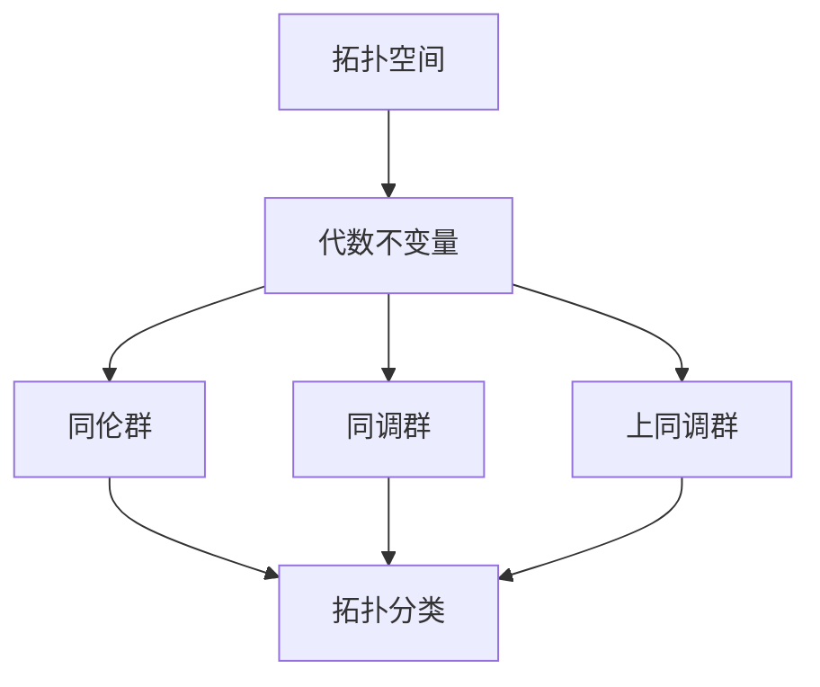

# 04-代数拓扑

## 目录

- [1. 概述](#1-概述)
- [2. 同伦论](#2-同伦论)
  - [2.1 同伦概念](#21-同伦概念)
  - [2.2 同伦等价](#22-同伦等价)
  - [2.3 同伦群](#23-同伦群)
- [3. 基本群](#3-基本群)
  - [3.1 基本群定义](#31-基本群定义)
  - [3.2 基本群计算](#32-基本群计算)
  - [3.3 覆盖空间](#33-覆盖空间)
- [4. 同调论](#4-同调论)
  - [4.1 奇异同调](#41-奇异同调)
  - [4.2 胞腔同调](#42-胞腔同调)
  - [4.3 同调群性质](#43-同调群性质)
- [5. 上同调论](#5-上同调论)
- [6. 纤维丛](#6-纤维丛)
- [7. 应用与扩展](#7-应用与扩展)
- [8. 批判性分析](#8-批判性分析)

## 1. 概述

### 1.1 代数拓扑的起源

代数拓扑将拓扑问题转化为代数问题，通过代数不变量来研究拓扑空间的性质。



### 1.2 核心思想

代数拓扑的核心思想是：

- 将拓扑问题代数化
- 寻找拓扑不变量
- 通过代数方法解决拓扑问题

## 2. 同伦论

### 2.1 同伦概念

#### 2.1.1 同伦定义

**定义**：两个连续映射 $f, g: X \to Y$ 同伦，如果存在连续映射 $H: X \times [0,1] \to Y$，使得：

- $H(x,0) = f(x)$
- $H(x,1) = g(x)$

记作 $f \simeq g$。

#### 2.1.2 同伦关系

同伦关系是等价关系：

- 自反性：$f \simeq f$
- 对称性：$f \simeq g \Rightarrow g \simeq f$
- 传递性：$f \simeq g, g \simeq h \Rightarrow f \simeq h$

```rust
// 同伦映射实现
use std::collections::HashMap;

#[derive(Debug, Clone)]
struct Homotopy<X, Y> {
    map: Box<dyn Fn(&X, f64) -> Y>,
}

impl<X, Y> Homotopy<X, Y> {
    fn new<F>(f: F) -> Self 
    where F: Fn(&X, f64) -> Y + 'static {
        Homotopy {
            map: Box::new(f),
        }
    }
    
    fn evaluate(&self, x: &X, t: f64) -> Y {
        (self.map)(x, t)
    }
    
    fn is_homotopy_between<F, G>(&self, f: F, g: G) -> bool 
    where F: Fn(&X) -> Y + 'static,
          G: Fn(&X) -> Y + 'static {
        // 检查同伦条件
        for x in self.get_domain() {
            if self.evaluate(x, 0.0) != f(x) || self.evaluate(x, 1.0) != g(x) {
                return false;
            }
        }
        true
    }
}

// 同伦等价
trait HomotopyEquivalent<Y> {
    fn homotopy_equivalent(&self, other: &Y) -> bool;
    fn homotopy_inverse(&self) -> Option<Box<dyn Fn(&Y) -> Self>>;
}
```

### 2.2 同伦等价

#### 2.2.1 同伦等价定义

**定义**：拓扑空间 $X$ 和 $Y$ 同伦等价，如果存在连续映射 $f: X \to Y$ 和 $g: Y \to X$，使得：

- $g \circ f \simeq \text{id}_X$
- $f \circ g \simeq \text{id}_Y$

#### 2.2.2 同伦等价性质

- 保持同伦群
- 保持同调群
- 保持上同调群

### 2.3 同伦群

#### 2.3.1 同伦群定义

**定义**：$n$ 维同伦群 $\pi_n(X, x_0)$ 是 $n$ 维球面到 $X$ 的映射的同伦类群。

#### 2.3.2 基本群

基本群 $\pi_1(X, x_0)$ 是 $1$ 维同伦群，描述空间中的"洞"。

```haskell
-- 同伦群
class HomotopyGroup g where
    dimension :: g -> Int
    basePoint :: g -> Point
    elements :: g -> [Loop]
    composition :: g -> Loop -> Loop -> Loop

-- 基本群
data FundamentalGroup = FundamentalGroup {
    space :: TopologicalSpace,
    basePoint :: Point,
    loops :: [Loop]
}

instance HomotopyGroup FundamentalGroup where
    dimension _ = 1
    basePoint (FundamentalGroup _ bp _) = bp
    elements (FundamentalGroup _ _ loops) = loops
    composition _ loop1 loop2 = composeLoops loop1 loop2

-- 环路
data Loop = Loop {
    path :: [Point],
    basePoint :: Point
}

composeLoops :: Loop -> Loop -> Loop
composeLoops (Loop p1 bp) (Loop p2 _) = 
    Loop (p1 ++ p2) bp

-- 同伦类
data HomotopyClass = HomotopyClass {
    representative :: Loop,
    homotopicLoops :: [Loop]
}

instance Eq HomotopyClass where
    (HomotopyClass l1 _) == (HomotopyClass l2 _) = 
        areHomotopic l1 l2
```

## 3. 基本群

### 3.1 基本群定义

#### 3.1.1 环路定义

**定义**：环路是连续映射 $\alpha: [0,1] \to X$，满足 $\alpha(0) = \alpha(1) = x_0$。

#### 3.1.2 基本群构造

基本群 $\pi_1(X, x_0)$ 的元素是环路的同伦类，群运算为环路复合。

### 3.2 基本群计算

#### 3.2.1 常见空间的基本群

- **圆**：$\pi_1(S^1) \cong \mathbb{Z}$
- **球面**：$\pi_1(S^n) = 0$ （$n > 1$）
- **环面**：$\pi_1(T^2) \cong \mathbb{Z} \times \mathbb{Z}$
- **射影平面**：$\pi_1(\mathbb{RP}^2) \cong \mathbb{Z}_2$

#### 3.2.2 基本群计算方法

- 万有覆盖空间
- 塞弗特-范坎彭定理
- 纤维化序列

```rust
// 基本群计算
impl<T: Eq + std::hash::Hash + Clone> TopologicalSpace<T> {
    fn fundamental_group(&self, base_point: &T) -> FundamentalGroup<T> {
        let loops = self.find_all_loops(base_point);
        let homotopy_classes = self.group_loops_by_homotopy(loops);
        
        FundamentalGroup {
            space: self.clone(),
            base_point: base_point.clone(),
            classes: homotopy_classes,
        }
    }
    
    fn find_all_loops(&self, base_point: &T) -> Vec<Loop<T>> {
        // 找到所有以base_point为基点的环路
        let mut loops = Vec::new();
        // 这里需要实现环路搜索算法
        loops
    }
    
    fn group_loops_by_homotopy(&self, loops: Vec<Loop<T>>) -> Vec<HomotopyClass<T>> {
        // 将环路按同伦类分组
        let mut classes = Vec::new();
        let mut used = HashSet::new();
        
        for loop_ in loops {
            if !used.contains(&loop_) {
                let mut class = HomotopyClass {
                    representative: loop_.clone(),
                    homotopic_loops: vec![loop_.clone()],
                };
                
                // 找到所有同伦的环路
                for other_loop in &loops {
                    if !used.contains(other_loop) && self.are_homotopic(&loop_, other_loop) {
                        class.homotopic_loops.push(other_loop.clone());
                        used.insert(other_loop.clone());
                    }
                }
                
                classes.push(class);
            }
        }
        
        classes
    }
    
    fn are_homotopic(&self, loop1: &Loop<T>, loop2: &Loop<T>) -> bool {
        // 检查两个环路是否同伦
        // 这里需要实现同伦检查算法
        false // 简化实现
    }
}
```

### 3.3 覆盖空间

#### 3.3.1 覆盖空间定义

**定义**：映射 $p: \tilde{X} \to X$ 是覆盖映射，如果对每个 $x \in X$，存在邻域 $U$，使得 $p^{-1}(U)$ 是 $\tilde{X}$ 中不相交开集的并集。

#### 3.3.2 万有覆盖空间

**定义**：万有覆盖空间是单连通的覆盖空间。

## 4. 同调论

### 4.1 奇异同调

#### 4.1.1 奇异单形

**定义**：$n$ 维奇异单形是连续映射 $\sigma: \Delta^n \to X$，其中 $\Delta^n$ 是标准 $n$ 单形。

#### 4.1.2 奇异链群

**定义**：$n$ 维奇异链群 $C_n(X)$ 是 $n$ 维奇异单形的自由阿贝尔群。

#### 4.1.3 边界算子

边界算子 $\partial_n: C_n(X) \to C_{n-1}(X)$ 定义为：

$$\partial_n(\sigma) = \sum_{i=0}^n (-1)^i \sigma \circ \delta_i$$

其中 $\delta_i$ 是第 $i$ 个面映射。

```haskell
-- 奇异同调
data SingularSimplex = SingularSimplex {
    dimension :: Int,
    map :: [Point] -> Point  -- 从标准单形到空间的映射
}

data SingularChain = SingularChain {
    coefficients :: [Int],
    simplices :: [SingularSimplex]
}

class SingularHomology h where
    chainGroup :: h -> Int -> SingularChainGroup
    boundaryOperator :: h -> Int -> SingularChain -> SingularChain
    homologyGroup :: h -> Int -> HomologyGroup

-- 边界算子
boundary :: SingularSimplex -> [SingularSimplex]
boundary (SingularSimplex n f) = 
    [SingularSimplex (n-1) (\points -> f (insertAt i 0 points)) | i <- [0..n]]
    where
        insertAt i x xs = take i xs ++ [x] ++ drop i xs

-- 同调群
data HomologyGroup = HomologyGroup {
    dimension :: Int,
    cycles :: [SingularChain],
    boundaries :: [SingularChain],
    generators :: [SingularChain]
}

instance Eq HomologyGroup where
    (HomologyGroup d1 c1 b1 _) == (HomologyGroup d2 c2 b2 _) = 
        d1 == d2 && c1 == c2 && b1 == b2
```

### 4.2 胞腔同调

#### 4.2.1 胞腔复形

**定义**：胞腔复形是拓扑空间的一种特殊分解，由胞腔（开球）组成。

#### 4.2.2 胞腔链群

胞腔链群 $C_n^{CW}(X)$ 由 $n$ 维胞腔生成。

#### 4.2.3 胞腔边界算子

胞腔边界算子通过附着映射定义。

### 4.3 同调群性质

#### 4.3.1 基本性质

- $H_0(X) \cong \mathbb{Z}^c$，其中 $c$ 是连通分支数
- $H_n(X) = 0$ 对 $n < 0$
- $H_n(X \sqcup Y) \cong H_n(X) \oplus H_n(Y)$

#### 4.3.2 常见空间的同调群

- **球面**：$H_k(S^n) = \begin{cases} \mathbb{Z} & k = 0, n \\ 0 & \text{其他} \end{cases}$
- **环面**：$H_k(T^2) = \begin{cases} \mathbb{Z} & k = 0, 2 \\ \mathbb{Z} \oplus \mathbb{Z} & k = 1 \\ 0 & \text{其他} \end{cases}$
- **射影平面**：$H_k(\mathbb{RP}^2) = \begin{cases} \mathbb{Z} & k = 0 \\ \mathbb{Z}_2 & k = 1 \\ 0 & \text{其他} \end{cases}$

```rust
// 同调群计算
impl<T: Eq + std::hash::Hash + Clone> TopologicalSpace<T> {
    fn homology_group(&self, dimension: usize) -> HomologyGroup<T> {
        let chain_group = self.chain_group(dimension);
        let boundary_group = self.boundary_group(dimension);
        let cycle_group = self.cycle_group(dimension);
        
        // 计算同调群 H_n = Z_n / B_n
        let quotient_group = self.quotient_group(&cycle_group, &boundary_group);
        
        HomologyGroup {
            dimension,
            generators: quotient_group.generators,
            rank: quotient_group.rank,
            torsion: quotient_group.torsion,
        }
    }
    
    fn chain_group(&self, dimension: usize) -> ChainGroup<T> {
        // 生成指定维数的链群
        let simplices = self.generate_simplices(dimension);
        ChainGroup {
            dimension,
            simplices,
            coefficients: Vec::new(),
        }
    }
    
    fn boundary_group(&self, dimension: usize) -> ChainGroup<T> {
        // 计算边界群
        let chains = self.chain_group(dimension + 1);
        let boundaries = chains.simplices.iter()
            .map(|simplex| self.boundary(simplex))
            .collect();
        
        ChainGroup {
            dimension,
            simplices: boundaries,
            coefficients: Vec::new(),
        }
    }
    
    fn cycle_group(&self, dimension: usize) -> ChainGroup<T> {
        // 计算循环群（边界为0的链）
        let chains = self.chain_group(dimension);
        let cycles = chains.simplices.iter()
            .filter(|chain| self.boundary(chain).is_zero())
            .cloned()
            .collect();
        
        ChainGroup {
            dimension,
            simplices: cycles,
            coefficients: Vec::new(),
        }
    }
}
```

## 5. 上同调论

### 5.1 上同调群定义

#### 5.1.1 上链群

**定义**：$n$ 维上链群 $C^n(X; G)$ 是 $C_n(X)$ 到阿贝尔群 $G$ 的同态群。

#### 5.1.2 上边界算子

上边界算子 $\delta^n: C^n(X; G) \to C^{n+1}(X; G)$ 定义为：

$$(\delta^n \phi)(\sigma) = \phi(\partial_{n+1} \sigma)$$

### 5.2 上同调群性质

#### 5.2.1 基本性质

- $H^0(X; G) \cong \text{Hom}(H_0(X), G)$
- $H^n(X; G) = 0$ 对 $n < 0$
- 上同调群有自然的环结构

#### 5.2.2 上同调环

上同调群 $H^*(X; R)$ 在系数环 $R$ 上有自然的环结构。

## 6. 纤维丛

### 6.1 纤维丛定义

#### 6.1.1 局部平凡化

**定义**：纤维丛 $(E, B, F, \pi)$ 由以下组成：

- 全空间 $E$
- 底空间 $B$
- 纤维 $F$
- 投影映射 $\pi: E \to B$

满足局部平凡化条件。

#### 6.1.2 结构群

纤维丛的结构群 $G$ 是纤维的自同构群。

### 6.2 纤维丛分类

#### 6.2.1 主丛

主丛的纤维是群 $G$，结构群也是 $G$。

#### 6.2.2 向量丛

向量丛的纤维是向量空间。

#### 6.2.3 覆盖空间

覆盖空间是离散纤维的纤维丛。

```haskell
-- 纤维丛
class FiberBundle b where
    totalSpace :: b -> TopologicalSpace
    baseSpace :: b -> TopologicalSpace
    fiber :: b -> TopologicalSpace
    projection :: b -> (Point -> Point)
    localTrivialization :: b -> [LocalTrivialization]

data LocalTrivialization = LocalTrivialization {
    openSet :: OpenSet,
    homeomorphism :: (Point, Point) -> Point  -- B × F -> E
}

-- 主丛
class PrincipalBundle b where
    group :: b -> Group
    rightAction :: b -> (Point -> GroupElement -> Point)

-- 向量丛
class VectorBundle b where
    vectorSpace :: b -> VectorSpace
    fiberDimension :: b -> Int
    transitionFunctions :: b -> [Matrix]
```

## 7. 应用与扩展

### 7.1 数学应用

#### 7.1.1 流形分类

- 低维流形分类
- 微分结构分类
- 同伦型分类

#### 7.1.2 纽结理论

- 纽结不变量
- 纽结多项式
- 纽结分类

### 7.2 物理应用

#### 7.2.1 量子场论

- 规范场论
- 纤维丛理论
- 拓扑场论

#### 7.2.2 弦论

- 卡拉比-丘流形
- 镜像对称
- 拓扑弦论

### 7.3 计算机科学应用

#### 7.3.1 拓扑数据分析

- 持久同调
- 流形学习
- 数据可视化

#### 7.3.2 机器学习

- 拓扑特征提取
- 神经网络拓扑
- 几何深度学习

## 8. 批判性分析

### 8.1 哲学意义

#### 8.1.1 代数化方法

代数拓扑的代数化方法：

- **优点**：将几何问题转化为代数问题
- **局限**：可能丢失几何直觉
- **发展**：几何化方法的发展

#### 8.1.2 不变量理论

代数不变量理论：

- **意义**：提供拓扑分类工具
- **局限**：不完全性
- **发展**：更精细的不变量

### 8.2 方法论反思

#### 8.2.1 抽象化过程

代数拓扑的抽象化过程：

- 从几何到代数
- 从具体到抽象
- 从直观到形式

#### 8.2.2 计算复杂性

代数拓扑的计算问题：

- **困难**：同调群计算复杂
- **发展**：算法改进
- **应用**：计算机辅助计算

### 8.3 教育意义

#### 8.3.1 数学教育

代数拓扑对数学教育的启示：

- 培养抽象思维能力
- 理解数学的统一性
- 发展代数几何直觉

#### 8.3.2 科学教育

代数拓扑对科学教育的启示：

- 数学在科学中的作用
- 抽象思维的重要性
- 跨学科联系的价值

### 8.4 现代发展

#### 8.4.1 高阶同伦论

现代高阶同伦论的发展：

- 稳定同伦论
- 谱序列
- 模型范畴

#### 8.4.2 几何拓扑

现代几何拓扑的发展：

- 低维拓扑
- 几何群论
- 几何分析

#### 8.4.3 代数几何

现代代数几何与代数拓扑的融合：

- 概形上同调
- 代数K理论
- 几何Langlands纲领

### 8.5 未来展望

#### 8.5.1 理论发展

- 几何Langlands纲领
- 镜像对称
- 几何量子化

#### 8.5.2 应用前景

- 人工智能中的拓扑方法
- 量子计算中的拓扑结构
- 生物信息学中的拓扑模型

---

**参考文献**:

1. Hatcher, A. (2002). *Algebraic Topology*. Cambridge University Press.
2. Spanier, E. H. (1966). *Algebraic Topology*. McGraw-Hill.
3. May, J. P. (1999). *A Concise Course in Algebraic Topology*. University of Chicago Press.
4. Bott, R., & Tu, L. W. (1982). *Differential Forms in Algebraic Topology*. Springer.
5. Milnor, J. W., & Stasheff, J. D. (1974). *Characteristic Classes*. Princeton University Press.

---

**相关链接**:

- [拓扑学基础](./03-拓扑学基础.md)
- [欧几里得几何基础](./01-欧几里得几何基础.md)
- [非欧几何基础](./02-非欧几何基础.md)
- [数学哲学基础](../01-哲学与元数学基础/01-数学哲学基础.md)
