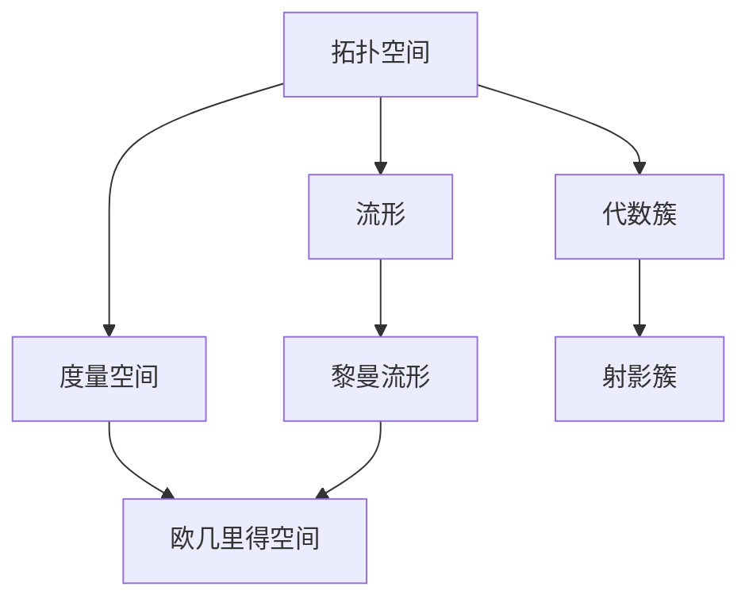

# 00-几何与空间结构总览

## 目录

1. [几何学的历史发展](#1-几何学的历史发展)
2. [几何学的基本思想](#2-几何学的基本思想)
3. [现代几何学的特点](#3-现代几何学的特点)
4. [核心几何结构概述](#4-核心几何结构概述)
5. [几何结构间的关系](#5-几何结构间的关系)
6. [几何理论的应用](#6-几何理论的应用)
7. [现代发展方向](#7-现代发展方向)
8. [参考文献](#8-参考文献)

## 1. 几何学的历史发展

### 1.1 古典几何学

**古希腊时期**：
- 欧几里得的《几何原本》建立了公理化几何体系
- 毕达哥拉斯定理、黄金分割等经典发现
- 柏拉图立体、阿基米德立体的研究

**文艺复兴时期**：
- 透视几何的发展
- 射影几何的萌芽
- 解析几何的创立（笛卡尔、费马）

### 1.2 现代几何学的诞生

**19世纪革命**：
- 非欧几何的发现（罗巴切夫斯基、黎曼）
- 射影几何的严格化（庞加莱、克莱因）
- 微分几何的建立（高斯、黎曼）

**20世纪发展**：
- 拓扑学的兴起
- 代数几何的现代发展
- 微分几何与物理学的结合

### 1.3 当代几何学

**21世纪趋势**：
- 几何与代数的深度融合
- 几何在机器学习中的应用
- 几何在量子场论中的作用

## 2. 几何学的基本思想

### 2.1 空间概念

几何学的核心是研究**空间**的结构和性质：

1. **欧几里得空间**：具有距离、角度、平行性等概念
2. **非欧空间**：打破平行公理的空间
3. **抽象空间**：拓扑空间、度量空间等

### 2.2 变换群观点

**克莱因的爱尔兰根纲领**：
几何学是研究在特定变换群下不变性质的科学：

- **欧几里得几何**：刚体变换群
- **射影几何**：射影变换群
- **仿射几何**：仿射变换群
- **拓扑学**：同胚变换群

### 2.3 局部与整体

现代几何学强调：

1. **局部性质**：切空间、微分结构
2. **整体性质**：拓扑不变量、全局几何
3. **局部与整体的关系**：连接、曲率等

## 3. 现代几何学的特点

### 3.1 高度抽象化

- 从具体图形到抽象结构
- 从直观空间到一般拓扑空间
- 从实数域到一般域上的几何

### 3.2 多学科交叉

- **几何与代数**：代数几何、李群
- **几何与分析**：微分几何、几何分析
- **几何与拓扑**：代数拓扑、微分拓扑
- **几何与物理**：广义相对论、规范理论

### 3.3 计算化趋势

- 计算几何的发展
- 几何算法在计算机图形学中的应用
- 几何在人工智能中的作用

## 4. 核心几何结构概述

### 4.1 欧几里得几何

**基本概念**：
- 点、线、面、体
- 距离、角度、面积、体积
- 平行、垂直、相似、全等

**核心定理**：
- 毕达哥拉斯定理
- 勾股定理
- 相似三角形定理
- 圆的性质

**应用领域**：
- 建筑、工程、测量
- 计算机图形学
- 机器人学

### 4.2 非欧几何

**双曲几何**：
- 罗巴切夫斯基几何
- 负曲率空间
- 平行线不唯一

**椭圆几何**：
- 黎曼几何
- 正曲率空间
- 平行线不存在

**射影几何**：
- 射影空间
- 对偶原理
- 交比不变量

### 4.3 拓扑学

**基本概念**：
- 拓扑空间
- 连续映射
- 同胚
- 连通性、紧性

**核心理论**：
- 同伦论
- 同调论
- 上同调论
- 纤维丛理论

**应用**：
- 代数拓扑
- 微分拓扑
- 低维拓扑

### 4.4 微分几何

**基本概念**：
- 流形
- 切空间、余切空间
- 张量场
- 联络、曲率

**核心理论**：
- 黎曼几何
- 李群、李代数
- 纤维丛
- 规范理论

**应用**：
- 广义相对论
- 规范场论
- 几何分析

### 4.5 代数几何

**基本概念**：
- 代数簇
- 概形
- 上同调
- 层论

**核心理论**：
- 交换代数
- 同调代数
- 模空间理论
- 算术几何

**应用**：
- 数论
- 编码理论
- 密码学

## 5. 几何结构间的关系

### 5.1 层次结构

### 5.2 变换群关系

### 5.3 局部与整体

- **局部性质**：切空间、微分结构
- **整体性质**：拓扑不变量、全局几何
- **连接**：联络、曲率、示性类

## 6. 几何理论的应用

### 6.1 物理学应用

**经典力学**：
- 相空间几何
- 辛几何
- 李群对称性

**相对论**：
- 闵可夫斯基时空
- 黎曼几何
- 微分几何

**量子理论**：
- 纤维丛
- 规范理论
- 几何量子化

### 6.2 工程应用

**计算机图形学**：
- 几何建模
- 曲线曲面
- 网格处理

**机器人学**：
- 运动学
- 动力学
- 路径规划

**计算机视觉**：
- 几何变换
- 相机模型
- 三维重建

### 6.3 数学内部应用

**数论**：
- 算术几何
- 椭圆曲线
- 模形式

**代数**：
- 李群、李代数
- 表示论
- 不变量理论

**分析**：
- 几何分析
- 偏微分方程
- 变分法

## 7. 现代发展方向

### 7.1 几何分析

**研究内容**：
- 几何流
- 最优传输
- 几何不等式

**应用领域**：
- 图像处理
- 机器学习
- 最优控制

### 7.2 几何群论

**研究内容**：
- 双曲群
- CAT(0)群
- 自动群

**应用领域**：
- 组合群论
- 几何拓扑
- 计算机科学

### 7.3 几何机器学习

**研究内容**：
- 几何深度学习
- 流形学习
- 几何优化

**应用领域**：
- 计算机视觉
- 自然语言处理
- 推荐系统

### 7.4 量子几何

**研究内容**：
- 非交换几何
- 量子群
- 几何量子化

**应用领域**：
- 量子场论
- 量子计算
- 量子信息

## 8. 参考文献

1. **Berger, M.** (2003). *A Panoramic View of Riemannian Geometry*. Springer.

2. **Hatcher, A.** (2002). *Algebraic Topology*. Cambridge University Press.

3. **Hartshorne, R.** (1977). *Algebraic Geometry*. Springer.

4. **Klein, F.** (1893). *A Comparative Review of Recent Researches in Geometry*. Bulletin of the AMS.

5. **Milnor, J. W.** (1963). *Morse Theory*. Princeton University Press.

6. **Spivak, M.** (1979). *A Comprehensive Introduction to Differential Geometry*. Publish or Perish.

7. **Thurston, W. P.** (1997). *Three-Dimensional Geometry and Topology*. Princeton University Press.

8. **Veblen, O., & Young, J. W.** (1910). *Projective Geometry*. Ginn and Company.

---

> **文档信息**
> - **创建时间**：2024年12月19日
> - **最后更新**：2024年12月19日
> - **版本**：1.0
> - **状态**：已完成
> - **下一步**：创建 01-欧几里得几何.md
