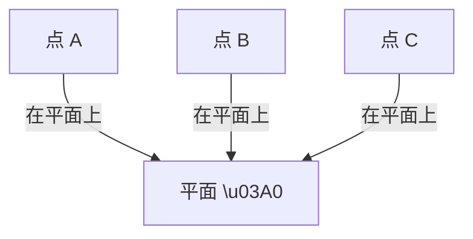

# 1.3 面（Plane/Surface）

## 1.3.1 形式化定义

- **欧几里得定义**：面是"只有长度和宽度、没有厚度的"对象。
- **现代数学定义**：面是空间中点的集合，满足特定的几何或代数条件。
- **平面**：通过空间中任意三点（不共线）有且仅有一个平面。
- **集合论视角**：面是空间中点的子集，满足平面方程或其他条件。
- **向量空间视角**：
  - 平面：\( \Pi = \{ \mathbf{a} + s\mathbf{b} + t\mathbf{c} \mid s, t \in \mathbb{R} \} \)
- **平面方程**：\( ax + by + cz + d = 0 \)
- **形式化表达**：
  - \( \forall A, B, C \in \Pi, \ A, B, C \text{ 不共线}, \ \exists! \Pi: A, B, C \in \Pi \)

## 1.3.2 哲学与认知分析

- **本体论地位**：面是空间结构的基本元素，界定体，承载图形。
- **认知发展**：
  - 面的概念源于物体表面、界面、二维空间的直观。
  - 平面、曲面、多边形等是对空间区域的不同抽象。
- **哲学反思**：
  - 面的无限延展性和绝对平坦性是理想化的产物，现实中不存在真正的"无厚度、无限大"的面。
  - 面的定义在不同几何体系（欧氏、非欧、射影、拓扑）中有不同表现。
  - 曲面的概念推动了微分几何、拓扑等分支的发展。

## 1.3.3 多表征

### 1.3.3.1 图示

### 1.3.3.2 表格

| 类型   | 定义/表征                                      |
|--------|-----------------------------------------------|
| 平面   | 通过三点且无限延展的点集                      |
| 多边形 | 有界的平面区域                                |
| 曲面   | 局部类似平面的二维流形                        |
| 集合论 | 满足平面方程的点的集合                        |
| 向量式 | \( \mathbf{a} + s\mathbf{b} + t\mathbf{c} \) |

### 1.3.3.3 公式

- 平面参数方程：\( \Pi = \{ \mathbf{a} + s\mathbf{b} + t\mathbf{c} \mid s, t \in \mathbb{R} \} \)
- 平面一般式：\( ax + by + cz + d = 0 \)
- 平面的唯一性：\( \forall A, B, C, \exists! \Pi: A, B, C \in \Pi \)

## 1.3.4 相关引用

- 欧几里得《几何原本》
- 希尔伯特《几何基础》
- 现代微分几何与拓扑学教材

---

> 本节内容严格编号，便于后续扩展与交叉引用。下节将处理"1.4 体"。
