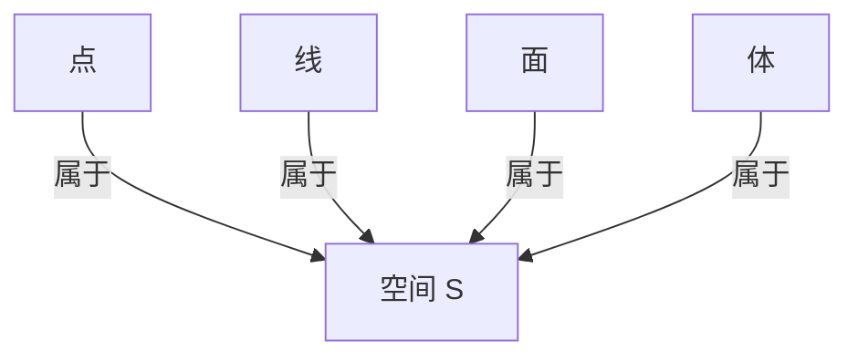

# 1.5 空间（Space）

## 1.5.1 形式化定义

- **欧几里得空间**：由点、线、面、体等元素组成的三维空间，满足欧氏公理体系。
- **现代数学定义**：空间是点的集合，配备特定结构（如度量、拓扑、向量结构等）。
- **度量空间**：\( (S, d) \)，其中 \( d: S \times S \to \mathbb{R}^+ \) 满足距离公理。
- **拓扑空间**：\( (X, \mathcal{T}) \)，\( \mathcal{T} \) 为满足拓扑公理的开集族。
- **向量空间**：\( V \) 是域上的线性空间。
- **n维空间**：\( \mathbb{R}^n \) 表示n维欧氏空间。
- **形式化表达**：
  - \( \forall x, y, z \in S, \ d(x, y) = 0 \iff x = y \)
  - \( d(x, y) = d(y, x) \)
  - \( d(x, z) \leq d(x, y) + d(y, z) \)

## 1.5.2 哲学与认知分析

- **本体论地位**：空间是几何学的根本舞台，承载一切几何对象和关系。
- **认知发展**：
  - 空间概念源于人类对环境的感知、运动和定位。
  - 数学空间是对物理空间的抽象和推广。
- **哲学反思**：
  - 空间的本质是绝对的还是相对的？（牛顿vs.莱布尼茨）
  - 空间的维数、连续性、可度量性等问题推动了现代数学的发展。
  - 不同结构的空间（欧氏、非欧、拓扑、度量、仿射、射影等）反映了数学对空间本质的多元理解。

## 1.5.3 多表征

### 1.5.3.1 图示

### 1.5.3.2 表格

| 类型       | 定义/表征                                      |
|------------|-----------------------------------------------|
| 欧氏空间   | 满足欧氏公理的三维空间                        |
| n维空间    | \( \mathbb{R}^n \)                           |
| 度量空间   | 配备距离函数的点集                            |
| 拓扑空间   | 配备开集结构的点集                            |
| 向量空间   | 配备加法和数乘的线性空间                      |
| 仿射/射影空间 | 具有仿射/射影结构的空间                    |

### 1.5.3.3 公式

- n维欧氏空间：\( \mathbb{R}^n = \{ (x_1, x_2, ..., x_n) \mid x_i \in \mathbb{R} \} \)
- 度量空间公理：
  - \( d(x, y) = 0 \iff x = y \)
  - \( d(x, y) = d(y, x) \)
  - \( d(x, z) \leq d(x, y) + d(y, z) \)
- 拓扑空间定义：\( (X, \mathcal{T}) \)

## 1.5.4 相关引用

- 欧几里得《几何原本》
- 希尔伯特《几何基础》
- 现代拓扑学、度量空间、线性代数教材

---

> 本节内容严格编号，便于后续扩展与交叉引用。下节将进入"2. 公理化与形式化"。
