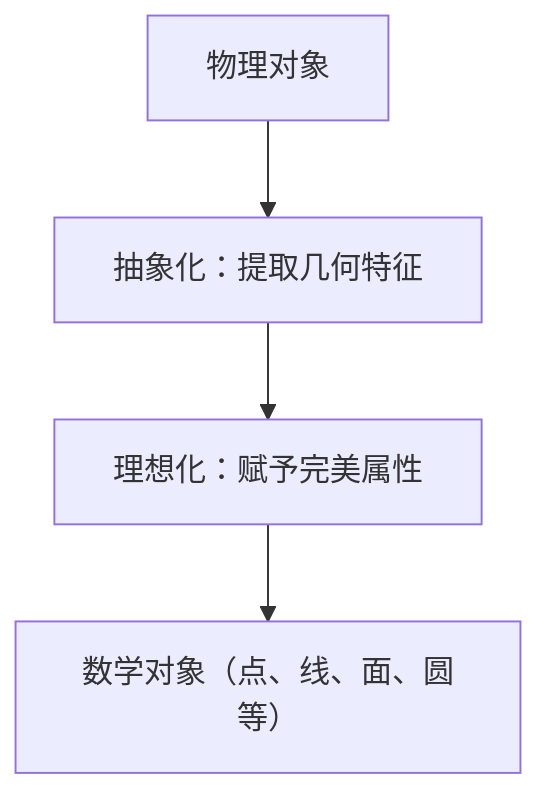

# 2.1 抽象化与理想化（Abstraction & Idealization）

## 2.1.1 概念定义

- **抽象化（Abstraction）**：
  - 从具体物理对象中剥离非本质属性，提取出共同的、核心的几何特征。
  - 例如，将各种物体的边界抽象为"线"，将物体的角落抽象为"点"。
- **理想化（Idealization）**：
  - 在抽象基础上，赋予几何对象完美的、理想的性质。
  - 例如，几何中的"直线"无限延展且无宽度，"圆"所有点到圆心距离完全相等。

## 2.1.2 哲学与认知分析

- **抽象化的意义**：
  - 使数学研究摆脱物理世界的复杂性，专注于空间结构的本质。
  - 促进概念的普适性和理论的推广。
- **理想化的作用**：
  - 提供精确、可操作的理论模型，便于逻辑推理和证明。
  - 理想化对象在现实中不存在，但为理论分析提供了基础。
- **认知发展**：
  - 儿童通过感知具体物体逐步形成点、线、面等抽象概念。
  - 数学学习中，抽象化和理想化能力的提升是理解高阶几何的关键。
- **哲学反思**：
  - 数学对象的"存在"是现实的还是思维的？
  - 理想化是否会导致理论与现实的脱节？

## 2.1.3 多表征

### 2.1.3.1 图示

### 2.1.3.2 表格

| 阶段     | 说明与举例                                   |
|----------|---------------------------------------------|
| 物理对象 | 具体物体（如绳子、球、桌面、地板）           |
| 抽象化   | 提取空间特征：线、面、点                     |
| 理想化   | 赋予无限延展、无厚度、完美对称等性质         |
| 数学对象 | 直线、圆、平面、点等理想化几何对象           |

### 2.1.3.3 案例

- **抽象化案例**：
  - 从桌子的边缘抽象出"线"，从桌角抽象出"点"。
- **理想化案例**：
  - 现实中的圆桌边缘不可能绝对圆滑，但数学中的"圆"是所有点到圆心距离完全相等的集合。

## 2.1.4 相关引用

- 欧几里得《几何原本》
- 希尔伯特《几何基础》
- 现代数学哲学、认知科学教材

---

> 本节内容严格编号，便于后续扩展与交叉引用。下节将处理"2.2 公理体系"。
