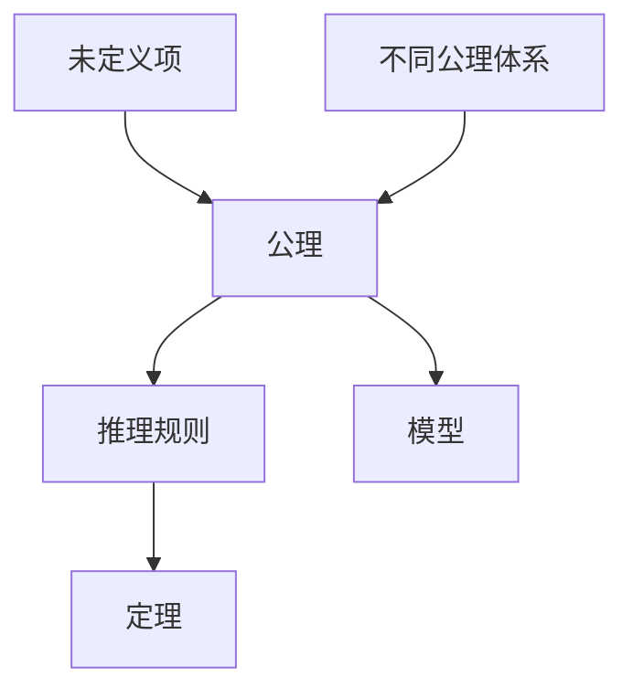

# 2.2 公理体系（Axiomatic Systems）

## 2.2.1 概念定义

- **公理体系**：由一组被视为无需证明的基本命题（公理）和推理规则组成，通过逻辑推演建立整个几何理论。
- **未定义项**：如点、线、面等，作为公理体系的基本对象，其意义通过公理间的关系间接刻画。
- **目的**：保证理论的严密性、一致性和可推广性。

## 2.2.2 主要公理体系

### 2.2.2.1 欧几里得公理体系

- 《几何原本》提出五条公设和五条公理，构建了经典欧氏几何。
- 代表性公设：
  - 任意两点可作一条直线。
  - 直线可无限延长。
  - 过直线外一点有且仅有一条平行线（平行公设）。

### 2.2.2.2 希尔伯特公理体系

- 19世纪末，希尔伯特提出更严密的公理体系，分为五组：结合公理、顺序公理、合同公理、平行公理、连续公理。
- 强调未定义项、逻辑独立性和系统完备性。

### 2.2.2.3 Birkhoff公理体系

- 以实数和度量为基础，仅用四条公理建立欧氏几何。
- 更直接联系解析几何，但对实数系统的依赖更强。

### 2.2.2.4 其他体系

- 非欧几何（双曲、椭圆）、射影几何、仿射几何等，各有独立公理体系。

## 2.2.3 哲学与批判分析

- **公理的选择与自明性**：
  - 公理并非绝对真理，而是理论构建的出发点。
  - "自明性"具有历史和文化背景。
- **独立性与完备性**：
  - 公理应相互独立，理论应能推导出所有目标命题。
- **相容性与模型**：
  - 公理体系的无矛盾性可通过构造模型来验证。
- **多样性与相对性**：
  - 不同公理体系对应不同几何世界，几何学不存在唯一"真理"。
- **哥德尔不完备性定理**：
  - 任何足够强的公理系统都存在无法判定的命题。

## 2.2.4 多表征

### 2.2.4.1 结构图

### 2.2.4.2 表格

| 公理体系   | 代表人物   | 基本特征                     | 典型公理/公设                  |
|------------|------------|------------------------------|---------------------------------|
| 欧几里得   | 欧几里得   | 直观、几何作图、五条公设     | 任意两点可作直线、平行公设等    |
| 希尔伯特   | 希尔伯特   | 严密、分组、未定义项         | 结合、顺序、合同、平行、连续    |
| Birkhoff   | Birkhoff   | 实数度量、简洁、四条公理     | 距离、角度、度量相关            |
| 非欧几何   | Lobachevsky等 | 否定欧氏第五公设           | 双曲、椭圆等非欧公理            |

## 2.2.5 相关引用

- 欧几里得《几何原本》
- 希尔伯特《几何基础》
- Birkhoff《几何的公理基础》
- 现代数学基础、逻辑学教材

---

> 本节内容严格编号，便于后续扩展与交叉引用。下节将处理"2.3 形式化证明"。
