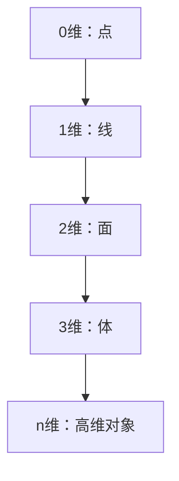

# 3.1 维度分类（Classification by Dimension）

## 3.1.1 概念定义

- **维度（Dimension）**：描述空间中独立方向或自由度的数量，是区分几何对象类型的基本属性。
- **n维空间**：包含n个独立方向的空间，常用\( \mathbb{R}^n \)表示。

## 3.1.2 各维度几何对象举例

| 维度 | 典型对象         | 形式化描述                      | 现实/抽象举例         |
|------|------------------|---------------------------------|----------------------|
| 0    | 点               | \( P \in \mathbb{R}^0 \)       | 空间中的位置标记      |
| 1    | 线、线段、射线   | \( L \subset \mathbb{R}^1 \)   | 绳子、直线、边界      |
| 2    | 面、多边形、圆   | \( S \subset \mathbb{R}^2 \)   | 桌面、纸张、圆盘      |
| 3    | 体、多面体、球体 | \( V \subset \mathbb{R}^3 \)   | 立方体、球、房间      |
| n    | n维超立方体等    | \( H \subset \mathbb{R}^n \)   | 超立方体、抽象空间    |

## 3.1.3 多表征

### 3.1.3.1 结构图

### 3.1.3.2 公式

- n维欧氏空间：\( \mathbb{R}^n = \{ (x_1, x_2, ..., x_n) \mid x_i \in \mathbb{R} \} \)
- 维度定义：\( \dim(V) = n \) 表示V是n维空间

## 3.1.4 哲学与认知分析

- **维度的本质**：
  - 维度反映了空间结构的复杂性和自由度。
  - 高维空间虽难以直观想象，但在数学、物理、数据科学等领域有广泛应用。
- **认知发展**：
  - 儿童首先理解0维和1维对象，逐步发展到2维、3维，抽象思维能力提升后可理解高维。
- **哲学反思**：
  - 维度的选择与定义依赖于理论背景和研究目的。
  - 高维空间的"存在"是数学的抽象产物，现实世界是否存在高于三维的空间仍是哲学和科学的前沿问题。

## 3.1.5 相关引用

- 欧几里得《几何原本》
- 希尔伯特《几何基础》
- 现代线性代数、拓扑学、物理学教材

---

> 本节内容严格编号，便于后续扩展与交叉引用。下节将处理"3.2 性质分类"。
