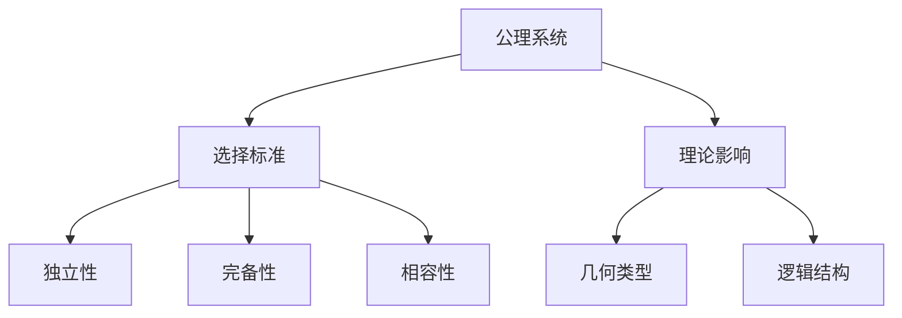

# 5.2 公理系统的选择与反思（Axiomatic System: Choice and Reflection）

## 5.2.1 概念定义

- **公理系统**：一组被视为无需证明的基本命题，是理论体系的出发点。
- **选择与反思**：公理的选择影响理论的结构、适用范围和解释力。

## 5.2.2 公理系统选择的标准与影响

| 标准       | 说明与举例                                 |
|------------|-------------------------------------------|
| 自明性     | 公理应尽量直观、易于接受                   |
| 独立性     | 各公理间无冗余，互不推出                   |
| 完备性     | 能推出理论体系内所有目标命题               |
| 相容性     | 不导致矛盾，可在模型中实现                 |
| 简洁性     | 公理数量少，表达简明                       |

## 5.2.3 典型案例

| 公理体系   | 选择与反思                                 |
|------------|-------------------------------------------|
| 欧氏几何   | 平行公设的独立性导致非欧几何的诞生         |
| 希尔伯特体系 | 强调未定义项、分组、逻辑独立与完备性     |
| Birkhoff体系 | 以度量和实数为基础，简化公理数量         |
| 非欧几何   | 否定欧氏第五公设，拓展几何世界             |

## 5.2.4 多表征

### 5.2.4.1 结构图

### 5.2.4.2 举例

- **欧氏与非欧几何**：
  - 欧氏几何的平行公设可被替换，产生双曲、椭圆等非欧几何。
- **希尔伯特体系**：
  - 通过分组和未定义项，提升理论严密性。

## 5.2.5 哲学与认知分析

- **理论多样性**：
  - 不同公理系统对应不同的几何世界，反映了数学的多样性。
- **认知发展**：
  - 学习者通过比较不同体系，理解公理选择对理论的影响。
- **哲学反思**：
  - 公理的"自明性"具有历史和文化背景，理论选择体现了人类理性与创造力。

## 5.2.6 相关引用

- 欧几里得《几何原本》
- 希尔伯特《几何基础》
- 现代数学基础、数学哲学教材

---

> 本节内容严格编号，便于后续扩展与交叉引用。下节将处理"5.3 认知与表征"。
