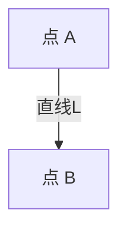

# 1.2 线（Line）

## 1.2.1 形式化定义

- **欧几里得定义**：线是"只有长度、没有宽度的"对象。
- **现代数学定义**：线是点的集合，满足特定的几何或代数条件。
- **直线**：通过任意两点有且仅有一条直线。
- **线段**：有起点和终点的直线部分。
- **射线**：有起点、无终点的直线部分。
- **集合论视角**：线是空间中点的子集，满足特定关系。
- **向量空间视角**：
  - 直线：\( L = \{ \mathbf{a} + t\mathbf{b} \mid t \in \mathbb{R} \} \)
  - 线段：\( S = \{ (1-\lambda)\mathbf{a} + \lambda\mathbf{b} \mid 0 \leq \lambda \leq 1 \} \)
- **形式化表达**：
  - \( \forall A, B \in L, \ A \neq B, \ \exists! L: A, B \in L \)

## 1.2.2 哲学与认知分析

- **本体论地位**：线是空间结构的基本元素，连接点，界定面。
- **认知发展**：
  - 线的概念源于物体运动轨迹、边界、连接关系。
  - 直线、曲线、线段等是对空间关系的不同抽象。
- **哲学反思**：
  - 线的无限延展性是理想化的产物，现实中不存在真正的"无宽度、无限长"的线。
  - 线的定义在不同几何体系（欧氏、非欧、射影、拓扑）中有不同表现。
  - 线的连续性与空间的连续性密切相关。

## 1.2.3 多表征

### 1.2.3.1 图示

### 1.2.3.2 表格

| 类型   | 定义/表征                                      |
|--------|-----------------------------------------------|
| 直线   | 通过两点且无限延展的点集                      |
| 线段   | 有起点和终点的直线部分                        |
| 射线   | 有起点、无终点的直线部分                      |
| 曲线   | 点的连续变化轨迹                              |
| 集合论 | 满足特定关系的点的集合                        |
| 向量式 | \( \mathbf{a} + t\mathbf{b} \) 或线段插值表达 |

### 1.2.3.3 公式

- 直线参数方程：\( L = \{ \mathbf{a} + t\mathbf{b} \mid t \in \mathbb{R} \} \)
- 线段参数方程：\( S = \{ (1-\lambda)\mathbf{a} + \lambda\mathbf{b} \mid 0 \leq \lambda \leq 1 \} \)
- 直线一般式：\( ax + by + c = 0 \)
- 直线的唯一性：\( \forall A, B, \exists! L: A, B \in L \)

## 1.2.4 相关引用

- 欧几里得《几何原本》
- 希尔伯特《几何基础》
- 现代线性代数与解析几何教材

---

> 本节内容严格编号，便于后续扩展与交叉引用。下节将处理"1.3 面"。
