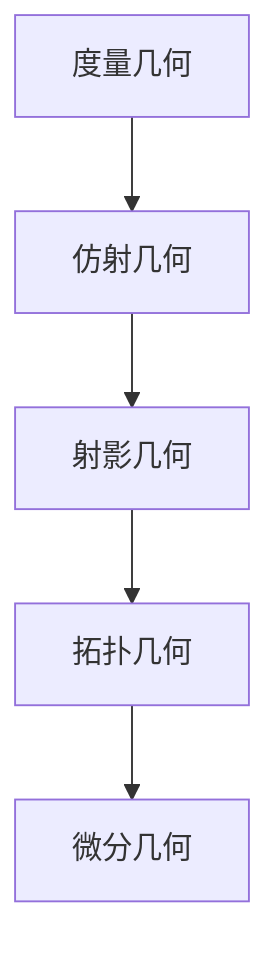

# 3.2 性质分类（Classification by Properties）

## 3.2.1 概念定义

- **性质分类**：根据几何对象在不同变换下保持不变的性质，将几何学划分为不同分支。
- **克莱因的爱尔兰根纲领**：以变换群和不变量为核心，系统分类几何性质。

## 3.2.2 主要性质分类

| 分支         | 变换类型         | 主要不变量           | 典型内容/举例           |
|--------------|------------------|----------------------|------------------------|
| 度量几何     | 刚性运动         | 距离、角度、面积     | 欧氏几何、三角形全等   |
| 仿射几何     | 仿射变换         | 平行性、比值         | 平行四边形、重心       |
| 射影几何     | 射影变换         | 交点、对偶、共线性   | 透视、消失点           |
| 拓扑几何     | 连续变换         | 连通性、孔洞数       | 橡皮圈、莫比乌斯带     |
| 微分几何     | 光滑变换         | 曲率、切空间         | 曲线、曲面、流形       |

## 3.2.3 多表征

### 3.2.3.1 结构图

### 3.2.3.2 举例

- **度量几何**：
  - 勾股定理、三角形全等、圆的半径恒定
- **仿射几何**：
  - 平行四边形的对边平行且等长，三角形重心分割比
- **射影几何**：
  - 透视画法中的消失点，三点共线性
- **拓扑几何**：
  - 圆和正方形在拓扑意义下等价，莫比乌斯带只有一个面
- **微分几何**：
  - 曲线的曲率，球面与平面的高斯曲率不同

## 3.2.4 哲学与认知分析

- **本质追问**：
  - 不同分支关注的"本质"不同，反映了数学对空间性质的多层次理解。
- **认知发展**：
  - 学习者从度量直观出发，逐步理解更抽象的仿射、射影、拓扑和微分性质。
- **哲学反思**：
  - "不变量"概念体现了数学对结构与变换的统一追求。
  - 性质分类推动了几何学的理论深化和应用拓展。

## 3.2.5 相关引用

- 克莱因《爱尔兰根纲领》
- 现代几何学、拓扑学、微分几何教材

---

> 本节内容严格编号，便于后续扩展与交叉引用。下节将处理"3.3 构造层次"。
