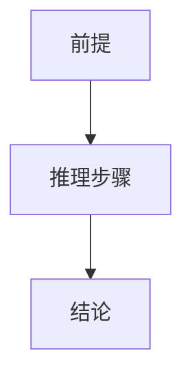

# 4.2 证明方法（Proof Techniques）

## 4.2.1 概念定义

- **证明方法**：在公理体系和逻辑规则下，展示命题成立的系统性推理方式。
- **目标**：确保结论的可靠性和推理的严密性。

## 4.2.2 主要证明方法

| 方法         | 说明与举例                                 |
|--------------|-------------------------------------------|
| 直接证明     | 从前提出发，逐步推导结论                   |
| 反证法       | 假设结论不成立，推导矛盾                   |
| 构造法       | 构造满足条件的对象                         |
| 归纳法       | 递归结构、自然数相关命题                   |
| 分类讨论法   | 分情况证明                                 |

## 4.2.3 多表征

### 4.2.3.1 结构图

### 4.2.3.2 举例

- **直接证明**：
  - 证明三角形内角和定理，逐步推导每一步。
- **反证法**：
  - 证明√2为无理数，假设其为有理数，推导矛盾。
- **构造法**：
  - 构造尺规作图，证明某对象存在。
- **归纳法**：
  - 证明与自然数相关的命题，如多边形内角和公式。
- **分类讨论法**：
  - 证明命题在所有互斥情形下均成立。

## 4.2.4 哲学与认知分析

- **方法多样性**：
  - 不同命题适用不同证明方法，反映了数学思维的灵活性。
- **认知发展**：
  - 学习者通过掌握多种证明方法，提升逻辑推理和创新能力。
- **哲学反思**：
  - 证明方法的选择影响理论的表达和理解。

## 4.2.5 相关引用

- 欧几里得《几何原本》
- 现代数学基础、数学教育学教材

---

> 本节内容严格编号，便于后续扩展与交叉引用。下节将处理"4.3 形式化与非形式化"。
