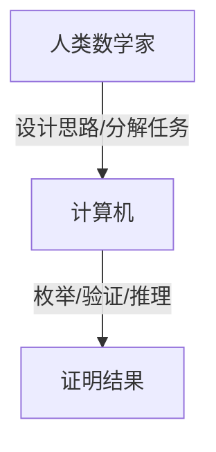

# 4.4 计算机辅助证明（Computer-Assisted Proofs）

## 4.4.1 概念定义

- **计算机辅助证明**：利用计算机程序对数学命题进行验证、推理和证明，尤其适用于复杂、庞大的证明任务。
- **意义**：提升证明的可靠性、处理人力难以完成的复杂性。

## 4.4.2 典型案例

| 案例         | 说明与意义                                 |
|--------------|-------------------------------------------|
| 四色定理     | 1976年首次用计算机辅助完成，验证大量情况   |
| 开普勒猜想   | 球体最密堆积问题，依赖计算机枚举与验证     |
| 其他         | 复杂组合、图论、代数等领域的自动化证明     |

## 4.4.3 主要工具与方法

| 工具/方法    | 说明与应用                                 |
|--------------|-------------------------------------------|
| 证明助手     | Coq、Lean、Isabelle、HOL Light等           |
| 自动定理证明 | 计算机自动搜索证明路径                     |
| 枚举与验证   | 对大量情况进行穷举和检验                   |

## 4.4.4 多表征

### 4.4.4.1 结构图

### 4.4.4.2 举例

- **四色定理**：
  - 问题：任意地图可用不超过四种颜色使相邻区域不同色。
  - 方法：计算机枚举所有可能配置，自动验证。
- **开普勒猜想**：
  - 问题：三维空间中球体最密堆积方式。
  - 方法：计算机辅助复杂不等式验证和枚举。

## 4.4.5 哲学与认知分析

- **证明本质的讨论**：
  - 计算机辅助证明引发了"什么是数学证明"的哲学思考。
  - 证明的可验证性与可理解性之间的张力。
- **认知发展**：
  - 计算机工具扩展了人类证明能力，但也对理解和信任提出新挑战。

## 4.4.6 相关引用

- 四色定理、开普勒猜想相关论文
- 计算机辅助证明、自动定理证明教材
- 现代数理逻辑、数学哲学文献

---

> 本节内容严格编号，便于后续扩展与交叉引用。下节将进入"5. 哲学与批判性分析"。
